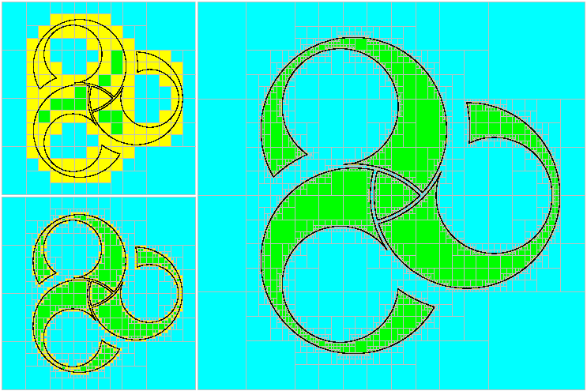

.. _sec-faq:

###############################
FAQ: Frequently Asked Questions
###############################

.. contents:: 

------------------------------------------------------------------

General questions related to intervals and constraint propagations
==================================================================

How this constraint propagation approach compares with Kalman/particle filters?
-------------------------------------------------------------------------------

The interval approach eliminates quickly inconsistent parts of the space of feasible solutions, whereas particle filters will be attracted by states that are consistent with the data.
As a consequence, particle methods and interval approaches have two different views of the state estimation problem.
They are complementary and could be combined.

.. rubric:: In which cases constraint propagation (CP) approaches are competitive?

The comparison with Kalman or Particle Filters is mainly related to the problem we are dealing with: non-linearities, amount of data to consider, baud rate of communications between robots, *etc.* When the system is **non-linear**, when the **initial state is not known**, or when one have to rely on **very few observations**, the CP/interval approach appears to be more competitive. It also provides an excellent way to **make proofs**.

For linear systems with known initial conditions, or when the linearization makes sense, the Kalman filter will surely be the best method for state estimation.
:ref:`sec-tuto-02` is a typical problem where the Kalman approach is not adapted, and where we see that the interval approach can be compared and combined with a particle approach.

.. rubric:: The best of each world

Particle filter (PF) and interval / Constraint Propagation (CP) approaches can be combined. A set-membership approach (CP coupled with intervals) provides sets as results. Therefore, one can spread particles inside these sets. This allows particle approaches to better converge. At the end, one can state: *we ensure that the solution is inside this set (defined by bounds with CP/intervals); in addition, inside this set, it is more likely around this vector (estimation from the particle filter)*.

When making the union :math:`\sqcup` of two intervals, will some solution outside of the original scopes be also included?
--------------------------------------------------------------------------------------------------------------------------

Suppose that you want to compute the interval hull of two intervals :math:`[-2,4]` and :math:`[6,7]`:

.. math::

  [-2,4]\sqcup[6,7]=[-2,7]

Other values that are neither in :math:`[-2,4]` nor :math:`[6,7]`, such as :math:`5`, will be included too.
This is what we call **pessimism**. Computations with intervals are simple, reliable and we can easily deal with non-linear problems with it, but sometimes the solution set contains unwanted solutions. This is the case with this *squared union* :math:`\sqcup` that wraps two subsets into one interval.

There are however methods to deal with pessimism, by bisecting the space into subsets that represent more optimally the actual solution.

For instance, in the following 2d example, we want to represent the black symbol. Using one box is not optimal for the representation. Instead, we can bisect it. The more we bisect, the better will be the approximation.

  Subpavings computed by a SIVIA algorithm in various accuracy levels. The boundary :math:`\partial\mathbb{X}` of the true solution set is plotted by a black line. Inner and outer sets are respectively drawn by green and both yellow and green boxes. The part proven to not contain solutions is represented in blue. This approach enables the estimation of sets of any shape such as this triskelion.

How to define a set from a measurement?
---------------------------------------

When dealing with real situations, speaking about guaranteed approaches is all based on inputs of our algorithms: the data-sets. The transition from theoretical computations to real values is a significant matter and has to be done rigorously in order to ensure further guaranteed outcomes.
In practice, a measurement error is often modeled by a Gaussian distribution which has an infinite support. Therefore, setting bounds around this measurement already constitutes a theoretical risk of loosing the actual value. A choice has to be made at this step, considering such risk. After that, however, any algorithm standing on interval methods is ensured to not increase this risk.

The following figure presents the interval evaluation of a measurement :math:`\mu` assumed to follow a Gaussian distribution, so that we consider the real value enclosed within the interval :math:`[x]`, centered on :math:`\mu`, with a 95% confidence rate. Datasheets usually give sensors specifications such as the standard deviation :math:`\sigma`. The bounded value :math:`[x]` can then be inflated according to this dispersion value.

.. figure:: img/interval_gaussian.png
  :width: 600px

  An interval :math:`[x]=[x^-,x^+]` computed from a Gaussian distribution to guarantee a 95% confidence rate over a measurement :math:`\mu`: :math:`[x] = [\mu-2\sigma,\mu+2\sigma]`.

------------------------------------------------------------------

*Next questions are related to the use of the API.*

Ask for help
============

How to access the documentation of the functions?
-------------------------------------------------

You have three supports:

* :ref:`the manual webpages <sec-toctree>`
* :ref:`the technical documentation of the C++ API <sec-api>`
* use the help in Python with the ``help()`` command, for instance: ``help(Tube.bisect)``

------------------------------------------------------------------

Basic operations (arithmetic)
=============================

The vector arguments are not supported for :math:`\cos`, :math:`\exp`, :math:`\sin`, *etc*.
-------------------------------------------------------------------------------------------

Example of error (using Python):

.. code::

  TypeError: cos(): incompatible function arguments. The following argument types are supported:
      1. (arg0: float) -> float
      2. (arg0: codac::Interval) -> codac::Interval
      3. (arg0: codac::Tube) -> codac::Tube
      4. (arg0: codac::Trajectory) -> codac::Trajectory

.. from codac import *
.. import math
.. 
.. x = IntervalVector(2)
.. print(cos(x))

The computation of ``cos``, ``sqrt``, ``sqr``, *etc.* are allowed only on scalar values. They are not available for vector objects such as ``IntervalVector``, ``TrajectoryVector``, ``TubeVector``.

------------------------------------------------------------------

Domains (intervals, boxes, tubes)
=================================

How to concatenate two ``IntervalVectors``?
-------------------------------------------

Use the ``cart_prod()`` method:

.. tabs::
  
  .. code-tab:: py

    a = IntervalVector([[0,1],[2,3]])
    b = IntervalVector([[4,5],[6,7]])
    c = cart_prod(a,b)
    # c: ([0, 1] ; [2, 3] ; [4, 5] ; [6, 7])

  .. code-tab:: c++

    IntervalVector a({{0,1},{2,3}});
    IntervalVector b({{4,5},{6,7}});
    IntervalVector c = cart_prod(a,b);
    // c: ([0, 1] ; [2, 3] ; [4, 5] ; [6, 7])

------------------------------------------------------------------

Contractors
===========

I don't have accurate results with my own :math:`\mathcal{C}_{\textrm{dist}}` contractor
----------------------------------------------------------------------------------------

You may prefer to build your own :math:`\mathcal{C}_{\textrm{dist}}` contractor from a ``Function`` object, instead of using :ref:`the contractor already defined in the library<sec-manual-ctcdist>`.
However, note that the following two distance equations are mathematically equivalent but will not lead to same outputs:

.. math::

  \sqrt{(x_1-b_1)^2+(x_2-b_2)^2}=d

  \sqrt{(x_1-b_1)\cdot(x_1-b_1)+(x_2-b_2)\cdot(x_2-b_2)}=d

Indeed, with:

.. tabs::
  
  .. code-tab:: py

    f_dist = Function("x[2]", "b[2]", "d",
                      "sqrt((x[0]-b[0])*(x[0]-b[0])+(x[1]-b[1])*(x[1]-b[1])) - d")
    ctc_dist = CtcFunction(f_dist, Interval(0))

  .. code-tab:: c++

    Function f_dist("x[2]", "b[2]", "d",
                    "sqrt((x[0]-b[0])*(x[0]-b[0])+(x[1]-b[1])*(x[1]-b[1])) - d");
    CtcFunction ctc_dist(f_dist, Interval(0));

You will obtain less efficient results than by defining:

.. tabs::
  
  .. code-tab:: py

    f_dist = Function("x[2]", "b[2]", "d",
                      "sqrt((x[0]-b[0])^2+(x[1]-b[1])^2) - d")
    ctc_dist = CtcFunction(f_dist, Interval(0))

  .. code-tab:: c++

    Function f_dist("x[2]", "b[2]", "d",
                    "sqrt((x[0]-b[0])^2+(x[1]-b[1])^2) - d");
    CtcFunction ctc_dist(f_dist, Interval(0));

In both cases the contraction will be correct (no feasible solution will be lost), but the first one will be less accurate.

This is due to **the dependency problem** in interval analysis. 
For instance, the multiplication of two intervals :math:`[a]\cdot[a]` is less accurate than its equivalent :math:`[a]^2`.
Indeed, from the following example with values, we realize that :math:`[-2,2]\cdot[-2,2]=[-4,4]` whereas :math:`[-2,2]^2=[0,4]`. 
For this reason, it is often important to use appropriate symbols when expressing a function, in order to avoid as much as possible this dependency effect.

How many times should a contractor be called?
---------------------------------------------

A contractor is an operator that *contracts* (reduces) a domain (a box, for instance), according to some constraint.
When it is used together with other contractors, there may be interactions between the contractors: a contraction from one contractor may *activate* another one. It becomes necessary to call all the contractors several times in order to converge to the best contraction of the domains.

This number of contracting iterations cannot be known in advance. It depends on the contractors at stake, their efficiency and their sequencing.
One can implement a loop of contractions in order to process the contractors as long as their is a contraction on one of the domains. The iteration stops when a fixed point has been reached: when nothing can be contracted anymore.

Because a computer computes with floating point numbers, the fixed point will be reached in a finite number of steps.
In practice, we may stop the iteration as soon as the contractions are not significant anymore.
Anyway, even if the algorithm stops before reaching the fixed point, the actual solution will always be enclosed in the domains.

Since the new version of the library, the user does not have to implement his contracting loops and to manage fixed points. He can directly use :ref:`Contractor Networks<sec-manual-solver>` that will manage the propagation process automatically. This simplifies the use of contractors.

------------------------------------------------------------------

Contractor Networks (solving problems)
======================================

How to initialize the domains of a CN
-------------------------------------

If you do not have prior values for the domains (*i.e.* pre-defined sets), then the best is to set them as infinite domains (with infinite bounds). For intervals: :math:`[-\infty,\infty]`.

If the problem is defined with a sufficient set of constraints, then the CN will solve the problem for us automatically. 

I have an empty set result
--------------------------

If the CN contracts the domains to empty sets, then it has two reasons:

* your domains are ill-defined, for instance the lower bound is higher than the upper bound: :math:`[12,3]=\varnothing`.
* the problem has no solution according to the constraints at stake: there exists no vector (or trajectory) that complies with all the related constraints.

I am confused about how to apply a *static* contractor to a tube
----------------------------------------------------------------

A *static* contractor does not depend on time and only involves static domains such as intervals and boxes.
When one wants to apply a static contractor on a tube, the goal is to apply it for each time :math:`t` in :math:`[t_0,t_f]`.

Consider for instance a robot (the position of which is enclosed in :math:`[\mathbf{x}](\cdot)`) moving around a landmark represented by the box :math:`[\mathbf{b}]`. The evolution of the distances between the robot and the landmark is enclosed in a tube :math:`[y](\cdot)`.

Using the static :math:`\mathcal{C}_{\textrm{dist}}` contractor for the distance constraint, we would naturally come to the following infinite sequence:

.. code::

  Cdist([x](t0),[b],[y](t0))
  Cdist([x](t1),[b],[y](t1))
  ...
  Cdist([x](tf),[b],[y](tf))

| ... continuously and for any time :math:`t` in :math:`[t_0,t_f]`.
| Since :math:`[\mathbf{b}]` is not a tube, its value is repeated for each contractor.

A :ref:`CN<sec-manual-solver>` can manage the static constraint for any time in an efficient way. This can be implemented in one line only:

.. tabs::

  .. code-tab:: py

    cn.add(ctc.dist, [x,b,y])
  
  .. code-tab:: c++

    cn.add(ctc.dist, {x,b,y});

Assertion ``y.size() == z.size()`` failed
-----------------------------------------

This means that the contractor requires the domains ``y`` and ``z`` to be of same dimension.

The error may be raised with the :math:`\mathcal{C}_{\textrm{eval}}` contractor, when the tube to evaluate is not of the same dimension as the evaluation box or its derivative tube. 

------------------------------------------------------------------

VIBes related questions (graphics)
==================================

My program does not display anything
------------------------------------

Do not forget to launch :ref:`the VIBes Viewer<sec-manual-vibes>`.

My program crashes
------------------

Do not forget to initialize :ref:`the VIBes Viewer<sec-manual-vibes>` before any graphical functions:

.. tabs::

  .. code-tab:: py

    beginDrawing()

    # ...

    endDrawing()

  .. code-tab:: c++

    vibes::beginDrawing();

    // ...

    vibes::endDrawing();

------------------------------------------------------------------

Python related questions
========================

How can I get the last Python version of Codac?
-----------------------------------------------

.. code-block:: bash
  
  pip3 install codac --upgrade

ValueError: unable to convert the ``py::object`` into a valid ``codac::Domain``
-------------------------------------------------------------------------------

In Python, if you are defining a box with:

.. code:: py

  yi = ([-0.84, -0.83], [-0.76, -0.75])

| You are not creating an ``IntervalVector``, but a list of ``Interval`` objects.
| The CN needs an ``IntervalVector`` to run:

.. code:: py

  yi = IntervalVector([[-0.84, -0.83], [-0.76, -0.75]])

.. The trajectory/tube arguments are not supported for :math:`\cos`, :math:`\exp`, :math:`\sin`, *etc*.
.. ----------------------------------------------------------------------------------------------------
.. 
.. Example of error (using Python):
.. 
.. .. code::
.. 
..   TypeError: cos(): incompatible function arguments. The following argument types are supported:
..       1. (arg0: pyibex.pyibex.Interval) -> pyibex.pyibex.Interval
..   Invoked with: TubeVector 
.. 
.. .. from codac import *
.. .. from pyibex import *
.. .. import math
.. .. 
.. .. x = TubeVector(Interval(0,10),0.01,2)
.. 
.. 
.. You probably imported the ``codac`` module before the ``pyibex`` module. Here is the correct import order:
.. 
.. .. code:: py
.. 
..   from pyibex import *
..   from codac import *

TypeError: must be real number, not codac.tube.Trajectory
-------------------------------------------------------------

The problem may appear when you import the ``math`` module after the ``codac``.
The following import order works:

.. code:: py

  from math import *
  from codac import *

------------------------------------------------------------------

C++ related questions
=====================

Should not the ``contract`` method have a return value and not be ``void``?
---------------------------------------------------------------------------

*Then, how do we return the value of the contraction performed?*

In C++, it is different than in Python (due to the spirit of the language). The update is done by *reference* which means that the argument given to the ``contract()`` method will be updated. No need to return a value in this case.

Note that we know that it is a "return value by reference" because of the ``&`` in the function definition. For instance: ``void contract(IntervalVector& a)``.
One have to update the ``a`` inside the function in order to return the contracted set.

No matching function for call to ``VIBesFigMap::add_trajectory...``
-------------------------------------------------------------------

.. code:: 

  error: no matching function for call to ‘codac::VIBesFigMap::add_trajectory(codac::TrajectoryVector&, const char [3], int, int)’

The function needs a pointer to the trajectory.

Error of ``unresolved overloaded function type`` with ``cout``
--------------------------------------------------------------

If you try to display the result of an operation on intervals, for instance, ``x|y``, you may obtain this type of error:

.. code:: 
  
  no match for ‘operator<<’ (operand types are ‘Interval’ and ‘<unresolved overloaded function type>’)

This can be solved using parentheses: 

.. code:: c++

  cout << (x|y) << endl;
  // Instead of: cout << x|y << endl;