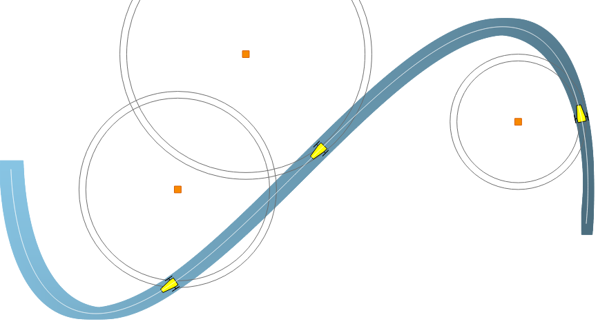

.. _home-page:

.. codac documentation master file

..  # with overline, for parts
..  * with overline, for chapters
..  =, for sections
..  -, for subsections
..  ^, for subsubsections
..  ", for paragraphs

##########################################
Codac: constraint-programming for robotics
##########################################

Codac (Catalog Of Domains And Contractors) is a C++/Python library providing tools for **constraint programming** over reals, trajectories and sets. It has many applications in **state estimation** or **robot localization**.

| **What is constraint programming?**
| In this paradigm, users concentrate on the properties of a solution to be found (*e.g.* the pose of a robot, the location of a landmark) by stating **constraints on the variables**. Then, a solver performs *constraint propagation* on the variables and provides a reliable set of **feasible solutions** corresponding to the problem. In this approach, the user concentrates on *what* is the problem instead of *how* to solve it, thus leaving the computer dealing with the *how*.

.. The strength of this declarative paradigm lies in its **simpleness**, as it allows one to describe a complex problem without requiring the knowledge of resolution tools coming with specific parameters to choose.

| **What about mobile robotics?**
| In the field of robotics, complex problems such as **non-linear state estimation**, **parameter estimation**, **delays**, **SLAM** or **kidnapped robot problems** can be solved in a very few steps by using constraint programming. Even though the Codac library is not meant to target only robotics problems, the design of its interface has been largely influenced by the needs of the above class of applications. Codac provides solutions to deal with these problems, that are usually hardly solvable by conventional methods such as particle approaches or Kalman filters. 

In a nutshell, Codac is a **constraint programming framework** providing tools to easily solve a wide range of problems.

.. contents:: Contents of this page

.. rubric:: Keywords

.. hlist::
  :columns: 3

  * constraint-programming
  * mobile robotics
  * interval-analysis
  * dynamical-systems
  * tubes
  * localization
  * state-estimation
  * SLAM
  * solver

.. It is available in C++ and Python.

.. Codac is a C++ library providing tools for computations over sets of trajectories.
.. It has been designed to deal with **dynamical systems** defined by **non-linear differential equations** and involving constraints such as trajectory evaluations, time uncertainties or **delays**.
.. These constraints are commonly encountered in mobile robotics: Codac provides solutions to deal with problems that are usually hardly solvable by conventional methods such as particle approaches or Kalman filters.

.. The building blocks of this library are *tubes*, that represent domains for **trajectory** variables (*e.g.* signals evolving with time). When a trajectory :math:`x(\cdot)` comes with uncertainties (due to numerical approximations or errors coming from sensors), a reliable enclosure of it can be made thanks to a tube :math:`[x](\cdot)`.

.. A tube is defined as an interval of two trajectories. Its bounds delineate the **uncertainties** of a dynamical system, thus defining a solution set.
.. Then, any operation related to :math:`x(\cdot)` will be made on its reliable enclosure :math:`[x](\cdot)`, which allows **guaranteed outputs**. These computations stand on interval analysis, a well suited tool that reliably propagates uncertainties.

.. **Mobile robotics** has been the initial motivation of this project: the mathematical tools provided in Codac come together with robotic applications.

.. Computations stands on the `IBEX library <http://www.ibex-lib.org/>`_ that provides reliable tools for static systems.

Getting started: 2 minutes to Codac
===================================

We only have to define **domains** for our variables and a set of **contractors** to implement our constraints.
The core of Codac stands on a **Contractor Network** representing a solver. 

In a few steps, a problem is solved by

1. Defining the initial domains (boxes, tubes) of our variables (vectors, trajectories)
2. Take contractors from a catalog of already existing operators, provided in the library
3. Add the contractors and domains to a Contractor Network
4. Let the Contractor Network solve the problem 
5. Obtain a reliable set of feasible variables

| **For instance.**
| Let us consider the robotic problem of localization with range-only measurements. A robot is described by the state vector :math:`\mathbf{x}=\{x_1,x_2,\psi,\vartheta\}^\intercal` depicting its position, its heading and its speed. It evolves between three landmarks :math:`\mathbf{b}_1`, :math:`\mathbf{b}_2`, :math:`\mathbf{b}_3` and measures distances :math:`y_i` from these points.

The problem is defined by classical state equations:

.. math::

  \left\{ \begin{array}{l}
    \dot{\mathbf{x}}(t)=\mathbf{f}\big(\mathbf{x}(t),\mathbf{u}(t)\big)\\
    y_i=g\big(\mathbf{x}(t_i),\mathbf{b}_i\big)
  \end{array}\right.

where :math:`\mathbf{u}(t)` is the input of the system, known with some uncertainties. :math:`\mathbf{f}` and :math:`g` are non-linear functions.

| **First step.**
| Defining domains for our variables.

We have three variables evolving with time: the trajectories :math:`\mathbf{x}(t)`, :math:`\mathbf{v}(t)=\dot{\mathbf{x}}(t)`, :math:`\mathbf{u}(t)`. We define three tubes to enclose them:

.. tabs::

  .. code-tab:: py

    dt = 0.01                                         # timestep for tubes accuracy
    tdomain = Interval(0, 3)                          # temporal limits [t_0,t_f]=[0,3]

    x = TubeVector(tdomain, dt, 4)                    # 4d tube for state vectors
    v = TubeVector(tdomain, dt, 4)                    # 4d tube for derivatives of the states
    u = TubeVector(tdomain, dt, 2)                    # 2d tube for inputs of the system

  .. code-tab:: c++

    float dt = 0.01;                                  // timestep for tubes accuracy
    Interval tdomain(0, 3);                           // temporal limits [t_0,t_f]=[0,3]

    TubeVector x(tdomain, dt, 4);                     // 4d tube for state vectors
    TubeVector v(tdomain, dt, 4);                     // 4d tube for derivatives of the states
    TubeVector u(tdomain, dt, 2);                     // 2d tube for inputs of the system

We assume that we have measurements on the headings :math:`\psi(t)` and the speeds :math:`\vartheta(t)`, with some bounded uncertainties defined by intervals :math:`[e_\psi]=[-0.01,0.01]`, :math:`[e_\vartheta]=[-0.01,0.01]`:

.. tabs::

  .. code-tab:: py

    x[2] = Tube(measured_psi, dt).inflate(0.01)       # measured_psi is a set of measurements
    x[3] = Tube(measured_speed, dt).inflate(0.01)

  .. code-tab:: c++

    x[2] = Tube(measured_psi, dt).inflate(0.01);      // measured_psi is a set of measurements
    x[3] = Tube(measured_speed, dt).inflate(0.01);

Finally, we define the domains for the three range-only observations :math:`(t_i,y_i)` and the position of the landmarks. The distances :math:`y_i` are bounded by the interval :math:`[e_y]=[-0.1,0.1]`.

.. tabs::

  .. code-tab:: py

    e_y = Interval(-0.1,0.1)
    y = [Interval(1.9+e_y), Interval(3.6+e_y), \      # set of range-only observations
         Interval(2.8+e_y)]
    b = [[8,3],[0,5],[-2,1]]                          # positions of the three 2d landmarks
    t = [0.3, 1.5, 2.0]                               # times of measurements

  .. code-tab:: c++

    Interval e_y(-0.1,0.1);
    vector<Interval> y = {1.9+e_y, 3.6+e_y, 2.8+e_y}; // set of range-only observations
    vector<Vector>   b = {{8,3}, {0,5}, {-2,1}};      // positions of the three 2d landmarks
    vector<double>   t = {0.3, 1.5, 2.0};             // times of measurements

| **Second step.**
| Defining contractors to deal with the state equations.

The distance function :math:`g(\mathbf{x},\mathbf{b})` between the robot and a landmark corresponds to the ``CtcDist`` contractor provided in the library. The evolution function :math:`\mathbf{f}(\mathbf{x},\mathbf{u})=\big(x_4\cos(x_3),x_4\sin(x_3),u_1,u_2\big)` can be handled by a custom-built contractor:

.. tabs::

  .. code-tab:: py

    ctc_f = CtcFunction(
      Function("v[4]", "x[4]", "u[2]",
               "(v[0]-x[3]*cos(x[2]) ; v[1]-x[3]*sin(x[2]) ; v[2]-u[0] ; v[3]-u[1])"))

  .. code-tab:: c++

    CtcFunction ctc_f(
      Function("v[4]", "x[4]", "u[2]",
               "(v[0]-x[3]*cos(x[2]) ; v[1]-x[3]*sin(x[2]) ; v[2]-u[0] ; v[3]-u[1])"));

| **Third step.**
| Adding the contractors to a network, together with there related domains, is as easy as:

.. tabs::

  .. code-tab:: py

    cn = ContractorNetwork()   # creating a network

    cn.add(ctc_f, [v, x, u])   # adding the f constraint

    for i in range (0,len(y)): # we add the observ. constraint for each range-only measurement

      p = cn.create_interm_var(IntervalVector(4)) # intermed. variable (state at t_i)

      # Distance constraint: relation between the state at t_i and the ith beacon position
      cn.add(ctc.dist, [cn.subvector(p,0,1), b[i], y[i]])

      # Eval constraint: relation between the state at t_i and all the states over [t_0,t_f]
      cn.add(ctc.eval, [t[i], p, x, v])

  .. code-tab:: c++

    ContractorNetwork cn;        // creating a network
    cn.add(ctc_f, {v, x, u});    // adding the f constraint

    for(int i = 0 ; i < 3 ; i++) // we add the observ. constraint for each range-only measurement
    {
      IntervalVector& p = cn.create_interm_var(IntervalVector(4)); // intermed. variable (state at t_i)

      // Distance constraint: relation between the state at t_i and the ith beacon position
      cn.add(ctc::dist, {cn.subvector(p,0,1), b[i], y[i]});
      
      // Eval constraint: relation between the state at t_i and all the states over [t_0,t_f]
      cn.add(ctc::eval, {t[i], p, x, v});
    }

| **Fourth step.**
| Solving the problem.

.. tabs::

  .. code-tab:: py

    cn.contract()

  .. code-tab:: c++

    cn.contract();

| **Fifth step.**
| Obtain a reliable set of feasible positions: a tube, depicted in blue. The three yellow robots illustrate the three instants of observation. The white line is the unknown truth.

| *You just solved a non-linear state-estimation without knowledge about initial condition.*
| See the full example on Github: `in C++ <https://github.com/codac-team/codac/blob/master/examples/tuto/01_getting_started/01_getting_started.cpp>`_ or `in Python <https://github.com/codac-team/codac/blob/master/examples/tuto/01_getting_started/01_getting_started.py>`_.

In the tutorial and in the examples folder of this library, you will find more advanced problems such as Simultaneous Localization And Mapping (SLAM), data association problems or delayed systems.

User manual
===========

*Want to use Codac?* The first thing to do is to install the library, or try it online:

.. toctree::
  :maxdepth: 1
 
  /install/02-py-project-online
  /install/01-installation
  /install/02-start-py-project
  /install/03-start-cpp-project

Then you have two options: read the details about the features of Codac (domains, tubes, contractors, slices, and so on) or jump to the standalone tutorial about how to :ref:`use Codac for mobile robotics <sec-mainpage-tuto>`, with telling examples.

.. sidebar:: Dependencies
  
  .. rubric:: IBEX

  .. Figure:: img/logo_ibex.jpg
    :align: center

  | Note that Codac stands on the `IBEX library <http://www.ibex-lib.org/>`_ for interval analysis computations and static contractors on boxes.
  | `Read the IBEX documentation. <http://www.ibex-lib.org/doc/>`_

..  .. rubric:: pyIbex
..
..  .. Figure:: img/logo_pyibex.jpg
..    :align: center
..
..  | The Python API of Codac is available thanks to the `pyIbex library <http://benensta.github.io/pyIbex/>`_ providing Python access to the IBEX library.
..  | `Read the pyIbex documentation. <http://benensta.github.io/pyIbex/sphinx/index.html>`_

.. toctree:: 
  :maxdepth: 2

  /manual/01-introduction/index
  /manual/02-variables/index
  /manual/03-domains/index
  /manual/10-functions/index
  /manual/04-static-contractors/index
  /manual/05-dynamic-contractors/index
  /manual/06-contractor-network/index
  /manual/07-graphics/index

.. toctree:: 
  :maxdepth: 1

  /faq
  /dev/changelog
  /dev/api_technical_doc
  /dev/info_dev
  
..  /manual/08-going-further/index
..  /manual/09-extensions/index

.. _sec-mainpage-tuto:

.. sidebar:: International tutorial

  .. Figure:: tutorial/img/logos/logo_icra_2020.png
    :align: center

  .. Figure:: tutorial/img/logos/logo_iros_2020.png
    :align: center

  This tutorial has been proposed in the `IROS 2020 Conference <https://www.iros2020.org/3program/Tutorials.html>`_ and the `ICRA 2020 Conference <https://www.icra2020.org/program/workshops-and-tutorials>`_.

Tutorial for mobile robotics
============================

The :ref:`following tutorial <sec-tuto-main-page>` is standalone and tells about how to use Codac for mobile robotic applications, with telling examples:

.. toctree::
  :maxdepth: 1
  :titlesonly:

  Main page </tutorial/index>
  Introduction </tutorial/00-getting-started/index>

  A. Intervals and contractors </tutorial/01-basics/index>
  B. Static range-only localization </tutorial/02-static-rangeonly/index>

  C. Static range-bearing loc. </tutorial/03-static-rangebearing/index>
  D. Building our own contractor </tutorial/04-own-contractor/index>

  E. Hello tubes </tutorial/05-tubes/index>
  F. Localization with asynchronous measurements </tutorial/06-dyn-rangeonly/index>

  G. Localization with data association </tutorial/07-data-association/index>
  H. Range-only SLAM </tutorial/08-rangeonly-slam/index>

License and support
===================

This software is under `GNU Lesser General Public License <https://www.gnu.org/copyleft/lgpl.html>`_.

For recent improvements and activities, see the `Codac Github repository <https://github.com/codac-team/codac>`_.
You can post bug reports and feature requests on the `Issues page <https://github.com/codac-team/codac/issues>`_.

Contributors
============

.. hlist::
  :columns: 4

  * `Simon Rohou <http://simon-rohou.fr/research/>`_
  * `Benoît Desrochers <http://www.ensta-bretagne.fr/desrochers>`_
  * `Luc Jaulin <https://www.ensta-bretagne.fr/jaulin/>`_
  * `Gilles Chabert <https://web.imt-atlantique.fr/x-info/gchabe08/>`_
  * Auguste Bourgois
  * `Julien Damers <http://julien-damers.fr/>`_
  * `Fabrice Le Bars <https://www.ensta-bretagne.fr/lebars/>`_
  * `Raphael Voges <https://raphael-voges.de/>`_
  * Quentin Brateau
  * `Thomas Le Mézo <https://www.ensta-bretagne.fr/lemezo/>`_
  * `Cyril Bouvier <http://www.lirmm.fr/~bouvier/index.en.html>`_
  * `Bertrand Neveu <http://imagine.enpc.fr/~neveub/>`_
  * `Peter Franek <http://www.cs.cas.cz/~franek/>`_
  * `Gilles Trombettoni <https://www.lirmm.fr/~trombetton/>`_
  * Verlein Radwan
  * `Mohamed Saad Ibn Seddik <https://msis.github.io/>`_

Main related publications
=========================

.. |lie-title| replace:: Lie symmetries applied to interval integration
.. _lie-title: https://julien-damers.fr/publis/lie_groups_applied_to_guaranteed_integration.pdf
.. |lie-authors| replace:: Damers, Jaulin, Rohou
.. |lie-journal| replace:: Automatica
.. |lie-year| replace:: 2022

.. |polar-title| replace:: A Minimal contractor for the Polar equation
.. _polar-title: https://www.ensta-bretagne.fr/jaulin/paper_polar.pdf
.. |polar-authors| replace:: Desrochers, Jaulin
.. |polar-journal| replace:: Engineering Applications of Artificial Intelligence
.. |polar-year| replace:: 2016

.. |datasso-title| replace:: Set-membership state estimation by solving data association
.. _datasso-title: http://simon-rohou.fr/research/datasso/datasso_paper.pdf
.. |datasso-authors| replace:: Rohou, Desrochers, Jaulin
.. |datasso-journal| replace:: ICRA Conference
.. |datasso-year| replace:: 2020

.. |robloc-title| replace:: Reliable robot localization: a constraint-programming approach...
.. _robloc-title: http://simon-rohou.fr/research/robloc/robloc_toc.pdf
.. |robloc-authors| replace:: Rohou, Jaulin, Mihaylova, Le Bars, Veres
.. |robloc-journal| replace:: ISTE Ltd, Wiley
.. |robloc-year| replace:: 2019

.. |loopproof-title| replace:: Proving the existence of loops in robot trajectories
.. _loopproof-title: http://simon-rohou.fr/research/loopproof/loopproof_paper.pdf
.. |loopproof-authors| replace:: Rohou, Franek, Aubry, Jaulin
.. |loopproof-journal| replace:: International Journal of Robotics Research
.. |loopproof-year| replace:: 2018

.. |tubeval-title| replace:: Reliable non-linear state estimation involving time uncertainties
.. _tubeval-title: http://simon-rohou.fr/research/tubeval/tubeval_paper.pdf
.. |tubeval-authors| replace:: Rohou, Jaulin, Mihaylova, Le Bars, Veres
.. |tubeval-journal| replace:: Automatica
.. |tubeval-year| replace:: 2018

.. |tubint-title| replace:: Guaranteed computation of robot trajectories
.. _tubint-title: http://simon-rohou.fr/research/tubint/tubint_paper.pdf
.. |tubint-authors| replace:: Rohou, Jaulin, Mihaylova, Le Bars, Veres
.. |tubint-journal| replace:: Robotics and Autonomous Systems
.. |tubint-year| replace:: 2017

.. |loopdetect-title| replace:: Loop detection of mobile robots using interval analysis
.. _loopdetect-title: https://www.ensta-bretagne.fr/jaulin/paper_loop.pdf
.. |loopdetect-authors| replace:: Aubry, Desmare, Jaulin
.. |loopdetect-journal| replace:: Automatica
.. |loopdetect-year| replace:: 2013

.. |voges-phd-title| replace:: Bounded-error visual-LiDAR odometry on mobile robots...
.. _voges-phd-title: https://www.repo.uni-hannover.de/bitstream/handle/123456789/9990/publication_thesis_voges.pdf
.. |voges-phd-authors| replace:: Voges
.. |voges-phd-journal| replace:: PhD thesis
.. |voges-phd-year| replace:: 2020

.. |bourgois-phd-title| replace:: Safe and collaborative autonomous underwater docking
.. _bourgois-phd-title: https://www.ensta-bretagne.fr/jaulin/thesis_auguste.pdf
.. |bourgois-phd-authors| replace:: Bourgois
.. |bourgois-phd-journal| replace:: PhD thesis
.. |bourgois-phd-year| replace:: 2021

.. |desrochers-phd-title| replace:: Simultaneous Localization and Mapping in Unstructured Environments
.. _desrochers-phd-title: https://hal.archives-ouvertes.fr/tel-01850567/document
.. |desrochers-phd-authors| replace:: Desrochers
.. |desrochers-phd-journal| replace:: PhD thesis
.. |desrochers-phd-year| replace:: 2018

.. |damers-phd-title| replace:: Lie Groups applied to localisation of mobile robots
.. _damers-phd-title: https://julien-damers.fr/phd/complete.pdf
.. |damers-phd-authors| replace:: Damers
.. |damers-phd-journal| replace:: PhD thesis
.. |damers-phd-year| replace:: 2022

.. csv-table::
  :header: "Year", "Title (download paper)", "Authors", "Journal"
  
  |lie-year|,            |lie-title|_,            |lie-authors|,            |lie-journal|
  |damers-phd-year|,     |damers-phd-title|_,     |damers-phd-authors|,     |damers-phd-journal|
  |bourgois-phd-year|,   |bourgois-phd-title|_,   |bourgois-phd-authors|,   |bourgois-phd-journal|
  |datasso-year|,        |datasso-title|_,        |datasso-authors|,        |datasso-journal|
  |voges-phd-year|,      |voges-phd-title|_,      |voges-phd-authors|,      |voges-phd-journal|
  |robloc-year|,         |robloc-title|_,         |robloc-authors|,         |robloc-journal|
  |desrochers-phd-year|, |desrochers-phd-title|_, |desrochers-phd-authors|, |desrochers-phd-journal|
  |loopproof-year|,      |loopproof-title|_,      |loopproof-authors|,      |loopproof-journal|
  |tubeval-year|,        |tubeval-title|_,        |tubeval-authors|,        |tubeval-journal|
  |tubint-year|,         |tubint-title|_,         |tubint-authors|,         |tubint-journal|
  |polar-year|,          |polar-title|_,          |polar-authors|,          |polar-journal|
  |loopdetect-year|,     |loopdetect-title|_,     |loopdetect-authors|,     |loopdetect-journal|
  

How to cite this project?
=========================

We suggest the following BibTeX template to cite Codac in scientific discourse:

.. code-block:: none

 @misc{codac,
    author = {Rohou, Simon and Desrochers, Benoit and others},
    year = {2022},
    note = {http://codac.io},
    title = {The {Codac} library -- {C}onstraint-programming for robotics}
 }