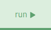

.. _sec-py-project-online:

############################
Use Tubex online with Python 
############################

| You can try Tubex without installing it. 
| This will be done with the Repl.it platform, that allows to write code from a browser.

.. |add_button| image:: img/replit_1.png
                      :height: 30px

.. |add_button_2| image:: img/replit_8.png
                      :height: 30px

.. |import_button| image:: img/replit_9.png
                      :height: 30px

#. | First, go to the `https://repl.it <https://repl.it>`_ page.
   | 

#. | Click on the blue icon |add_button| or |add_button_2| in the top right of the page.
   |

#. | Select the tab |github_button| in the new window.
   |

#. Past ``SimonRohou/tubex-replit`` in the text bar and click on |import_button|.

    .. image:: img/replit_2.png
      :width: 400px

#. | Now the necessary files are loaded in your online project. 

    .. image:: img/replit_3.png
      :width: 300px

#. Click on the :file:`main.py` in the files list on the left.

    .. image:: img/replit_4.png

#. | Finally, click on the |run_button| button at the top of the page.
   |

#. | This will load a simple HelloWorld script that will create and display a tube.
   | That's it!

    .. image:: img/replit_6.png
      :width: 300px