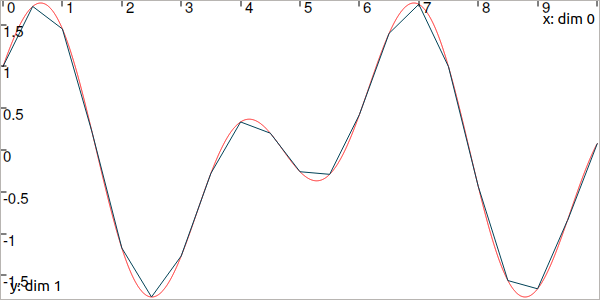
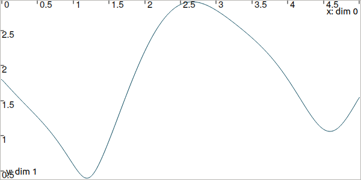
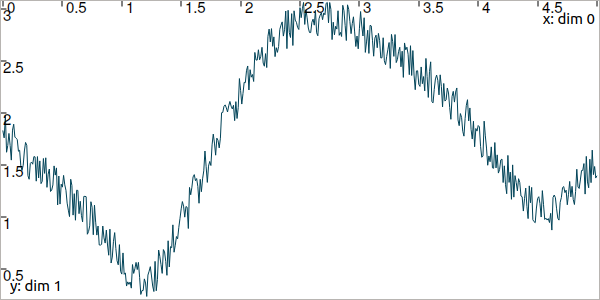

.. _sec-manual-vardyn:

**********************
Trajectories (signals)
**********************

A trajectory :math:`x(\cdot):[t_0,t_f]\to\mathbb{R}` is a set of real values defined over some temporal domain :math:`[t_0,t_f]`, called *t*-domain.
They are aimed at **representing temporal evolutions**.

.. contents::

There are two ways to define a trajectory:

* with some analytic formula, by using a ``TFunction`` object ;
* from a map of values.

Defining a trajectory from an analytic function
-----------------------------------------------

It must be emphasized that the mathematical functions mentioned here are not related to programming functions in C++ or Python.

A simple temporal function [#f1]_ can be defined and used for building a trajectory:

.. tabs::

  .. code-tab:: py

    tdomain = Interval(0,10)                               # temporal domain: [t_0,t_f]
    x = Trajectory(tdomain, TFunction("cos(t)+sin(2*t)"))  # defining x(·) as: t ↦ cos(t)+sin(2t)

  .. code-tab:: c++

    Interval tdomain(0.,10.);                            // temporal domain: [t_0,t_f]
    Trajectory x(tdomain, TFunction("cos(t)+sin(2*t)")); // defining x(·) as: t ↦ cos(t)+sin(2t)

Usual functions such as :math:`\cos`, :math:`\log`, *etc.* can be used to define a ``TFunction`` object. The convention used for these definitions is the one of IBEX (`read more <http://www.ibex-lib.org/doc/function.html>`_). Note that the system variable :math:`t` is a predefined variable of ``TFunction`` objects, that does not appear in IBEX's objects.

The evaluation of a trajectory at some time :math:`t`, for instance :math:`z=x(t)`, is performed with parentheses:

.. tabs::

  .. code-tab:: py

    z = x(math.pi)                               # z = cos(π)+sin(2π) = -1

  .. code-tab:: c++

    double z = x(M_PI);                          // z = cos(π)+sin(2π) = -1

In this code, :math:`x(\cdot)` is implemented from the expression :math:`t\mapsto\cos(t)+\sin(2t)`, and no numerical approximation is performed: the formula is embedded in the object and the representation is accurate.
However, the evaluation of the trajectory may lead to numerical errors related to the approximation of real numbers by floating-point values.
For instance, if we change the decimal precision in order to format floating-point values, and then print the value of ``z``, we can see that the result is not exactly :math:`-1`:

.. tabs::

  .. code-tab:: py

    from decimal import *

    z = x(math.pi)                               # z = cos(π)+sin(2π) = -1
    print(Decimal(z))
    // Output:
    // -1.0000000000000006661338147750939242541790008544921875

  .. code-tab:: c++

    #include <iomanip>                           // for std::setprecision()

    double z = x(M_PI);                          // z = cos(π)+sin(2π) = -1
    cout << setprecision(10) << z << endl;
    // Output:
    // -1.0000000000000006661338147750939242541790008544921875

| This is not only due to the approximation made on :math:`\pi`, that could be reliably handled by some :math:`[\pi]`.
| A reliable evaluation of :math:`x(\cdot)` can be done by specifying :math:`t` as a degenerate interval :math:`[t]`. This produces an interval evaluation that is reliable: the output is also an interval that is guaranteed to contain the actual value despite floating-point uncertainties:

.. tabs::

  .. code-tab:: py

    z = x(Interval.PI)                           # z = cos(π)+sin(2π) = -1
    print(z)
    // Output:
    // [-1.000000000000002, -0.9999999999999991]

  .. code-tab:: c++

    Interval z = x(Interval::PI);              // z = cos(π)+sin(2π) = -1
    cout << setprecision(10) << z << endl;
    // Output:
    // [-1.000000000000002, -0.9999999999999991]

This also works for large temporal evaluations as long as :math:`[t]\subseteq[t_0,t_f]`.  

Defining a trajectory from a map of values
------------------------------------------

Another way to build :math:`x(\cdot)` is to implement it as a map of discrete values. :math:`x(\cdot)` is supposed to be continuous and so linear interpolation is performed between each value of the map.
These trajectories are useful in case of actual data coming from sensors or numerical models. The following example provides a comparison between the two kinds of trajectory definitions:

.. tabs::

  .. code-tab:: py

    # Trajectory from a formula
    x = Trajectory(Interval(0,10), TFunction("cos(t)+sin(2*t)"))

    # Trajectory from a map of values
    values = {}
    for t in np.arange(0., 10., 0.5):
      values[t] = np.cos(t)+np.sin(2*t)
    y = Trajectory(values)

  .. code-tab:: c++

    // Trajectory from a formula
    Trajectory x(Interval(0.,10.), TFunction("cos(t)+sin(2*t)"));
    
    // Trajectory from a map of values
    map<double,double> values;
    for(double t = 0. ; t <= 10. ; t+=0.5)
      values[t] = cos(t)+sin(2*t);
    Trajectory y(values);

..    // Graphics (will be detailed later on)
..    fig.add_trajectory(&x_f, "x_f", "red");
..    fig.add_trajectory(&x_m, "x_m", "blue");

..    beginDrawing()
..    fig = VIBesFigTube("fig")
..    fig.add_trajectory(x, "x", "red");
..    fig.add_trajectory(y, "y", "blue");
..    fig.show()
..    endDrawing()

  
  In red, the trajectory defined from the analytical function. In blue, a trajectory made of 21 points with linear interpolation.

Note that when building a trajectory from a map, there is no need to specify the *t*-domain; it will be evaluated as the envelope of the keys of the map.

It is also possible to define a trajectory from an analytical function while representing it with a map of values. This can be necessary for various operations on trajectories that are not available for analytical definitions, such as arithmetic operations.

.. tabs::

  .. code-tab:: py

    # Analytical definition but sampling representation with dt=0.5:
    y_1 = Trajectory(Interval(0,10), TFunction("cos(t)+sin(2*t)"), 0.5)

    # Same as before, in two steps. y_1 == y_2
    y_2 = Trajectory(Interval(0,10), TFunction("cos(t)+sin(2*t)"))
    y_2.sample(0.5)

  .. code-tab:: c++

    // Analytical definition but sampling representation with dt=0.5:
    Trajectory y_1(Interval(0.,10.), TFunction("cos(t)+sin(2*t)"), 0.5);

    // Same as before, in two steps. y_1 == y_2
    Trajectory y_2(Interval(0.,10.), TFunction("cos(t)+sin(2*t)"));
    y_2.sample(0.5);

The ``TFunction`` object is only used for the initialization. The resulting trajectory is only defined as a map of values.

Operations on trajectories
--------------------------

Once created, several evaluations of the trajectory can be made. For instance:

.. tabs::

  .. code-tab:: py

    x.tdomain())       # temporal domain, returns [0, 10]
    x.codomain())      # envelope of values, returns [-2,2]
    x(6.))             # evaluation of x(·) at 6, returns 0.42..
    x(Interval(5,6)))  # evaluation of x(·) over [5,6], returns [-0.72..,0.42..]

  .. code-tab:: c++

    x.tdomain()        // temporal domain, returns [0, 10]
    x.codomain()       // envelope of values, returns [-2,2]
    x(6.)              // evaluation of x(·) at 6, returns 0.42..
    x(Interval(5.,6.)) // evaluation of x(·) over [5,6], returns [-0.72..,0.42..]

Note that the items defining the trajectory (the map of values, or the function) are accessible from the object:

.. tabs::

  .. code-tab:: py

    f = x.tfunction()                          # x(·) was defined from a formula
    m = y.sampled_map()                        # y(·) was defined as a map of values

  .. code-tab:: c++

    TFunction *f = x.tfunction();              // x(·) was defined from a formula
    map<double,double> m = y.sampled_map();    // y(·) was defined as a map of values

Other methods exist such as:

.. tabs::

  .. code-tab:: py

    # Approximation of primitives:
    y_prim = y.primitive()                     # when defined from a map of values
    x_prim = x.primitive(0, 0.01)              # when defined from a function,
                                               # params are (x0,dt)
    # Differentiations:
    y_diff = y.diff()                          # finite differences on y(·)
    x_diff = x.diff()                          # exact differentiation of x(·)

  .. code-tab:: c++

    // Approximation of primitives:
    Trajectory y_prim = y.primitive();         // when defined from a map of values
    Trajectory x_prim = x.primitive(0., 0.01); // when defined from a function,
                                               // params are (x0,dt)
    // Differentiations:
    Trajectory y_diff = y.diff();              // finite differences on y(·)
    Trajectory x_diff = x.diff();              // exact differentiation of x(·)

Note that the result of these methods is inaccurate on trajectories defined from a map. For trajectories built on analytic functions, the exact differentiation is performed and returned in the form of a trajectory defined by a ``TFunction`` too.

Finally, to add a point to a mapped trajectory, the following function can be used:

.. tabs::

  .. code-tab:: py

    y.set(1, 4)                                # add the value y(4)=1

  .. code-tab:: c++

    y.set(1., 4.);                             // add the value y(4)=1

Other features and details can be found in the technical datasheet of the ``Trajectory`` class.

We summarize in the following table the operations supported for each kind of trajectory definition.

=================================  ================  ==================
Operations                         Analytical def.   Map of values def.
=================================  ================  ==================
``codomain()``                     ✓                 ✓
evaluations                        ✓                 ✓
``first_value()``                  ✓                 ✓
``last_value()``                   ✓                 ✓
``set()``                                            ✓
``truncate_tdomain()``             ✓                 ✓
``shift_tdomain()``                ✓                 ✓
``sample()``                       ✓                 ✓
``make_continuous()``                                ✓
``primitive()``                    ✓                 ✓
``diff()``                         ✓                 ✓
arithmetics (:math:`+,-,\cdot,/`)                    ✓
=================================  ================  ==================

.. _sec-manual-vardyn-trajectoryvector:

The vector case
---------------

The extension to the vector case is the class ``TrajectoryVector``, allowing to create trajectories :math:`\mathbf{x}(\cdot):\mathbb{R}\to\mathbb{R}^n`.
The use of the features presented above remain the same.

.. tabs::

  .. code-tab:: py

    # Trajectory from a formula; the function's output is two-dimensional
    x = TrajectoryVector(Interval(0,10), TFunction("(cos(t);sin(t))"))

    # Trajectory from a map of values
    y = TrajectoryVector(2)
    for t in np.arange(0., 10., 0.6):
      y.set([np.cos(t),np.sin(t)], t)

  .. code-tab:: c++

    // Trajectory from a formula; the function's output is two-dimensional
    TrajectoryVector x(Interval(0.,10.), TFunction("(cos(t);sin(t))"));

    // Another example of discretized trajectory
    TrajectoryVector y(2);
    for(double t = 0. ; t <= 10. ; t+=0.6)
      y.set({cos(t),sin(t)}, t);

..    // ...
..
..    // From a formula
..    fig.add_trajectory(&y[0], "y_0", "gray"); // first component
..    fig.add_trajectory(&y[1], "y_1", "gray"); // second component
..
..    // From discrete values
..    fig.add_trajectory(&x[0], "x_0", "red");  // first component
..    fig.add_trajectory(&x[1], "x_1", "blue"); // second component

.. figure:: img/trajvectors.png

  In red and blue, the ``TrajectoryVector`` defined from the analytical function. In gray, the sampled one.

Note that each component of a vector object (``IntervalVector``, ``TrajectoryVector``, ``TubeVector``) is available by reference:

.. tabs::
  
  .. code-tab:: py

    x[1] = Trajectory(tdomain, TFunction("exp(t)"))
    print(x[1])

  .. code-tab:: c++

    x[1] = Trajectory(tdomain, TFunction("exp(t)"));
    cout << x[1] << endl;

.. _sec-manual-vardyn-lissajous:

Arithmetic on trajectories
--------------------------

In the same manner as for vectors, basic operations (:math:`+,-,\cdot,/`) can be used on trajectories, together with usual mathematic functions: :math:`\cos`, :math:`\log`, *etc*.
An example will explain it better.

Let us consider a robot following a Lissajous curve from :math:`t_0=0` to :math:`t_f=5`:

.. tabs::

  .. code-tab:: py

    tdomain = Interval(0,5)
    x = TrajectoryVector(tdomain, TFunction("(2*cos(t) ; sin(2*t))"), 0.01)

  .. code-tab:: c++

    Interval tdomain(0.,5.);
    TrajectoryVector x(tdomain, TFunction("(2*cos(t) ; sin(2*t))"), 0.01);

.. figure:: img/lissajous.png

  Top view. The yellow robot follows a Lissajous curve forming an :math:`\infty` symbol.

It continuously measures its distance to a landmark located at :math:`(0.5,1)`.
We compute the *trajectory* of distances by:

.. tabs::

  .. code-tab:: py

    b = (0.5,1) # landmark's position
    dist = sqrt(sqr(x[0]-b[0])+sqr(x[1]-b[1])) # simple operations between traj.

  .. code-tab:: c++

    Vector b({0.5,1.}); // landmark's position
    Trajectory dist = sqrt(sqr(x[0]-b[0])+sqr(x[1]-b[1])); // simple operations between traj.

  Result of simulated range measurements: the ``dist`` trajectory object.

Random trajectories
-------------------

As one can see, trajectories can be used to represent data. When it comes to consider some added noise, the ``RandTrajectory`` class may be useful.

.. tabs::
  
  .. code-tab:: py

    # Random values in [-0.2,0.2] at each dt=0.01
    n = RandTrajectory(tdomain, 0.01, Interval(-0.2,0.2))

    dist += n # added noise (sum of trajectories)

  .. code-tab:: c++

    // Random values in [-0.2,0.2] at each dt=0.01
    RandTrajectory n(tdomain, 0.01, Interval(-0.2,0.2));

    dist += n; // added noise (sum of trajectories)

  Result of simulated range measurements with noise.

..    Interval tdomain(0.,5.);
..    Vector b({0.5,1.});
..    TrajectoryVector x(tdomain, TFunction("(2*cos(t) ; sin(2*t))"), 0.01);
..    Trajectory dist = sqrt(sqr(x[0]-b[0])+sqr(x[1]-b[1]));
..
..    vibes::beginDrawing();
..
..    VIBesFigMap fig_map("Map");
..    fig_map.set_properties(1450, 50, 600, 300);
..    fig_map.add_trajectory(&x, "x*", 0, 1);
..    fig_map.add_beacon(Beacon(b), 0.1);
..    fig_map.show(0.25);
..    fig_map.axis_limits(-2.5,2.5,-0.1,0.1, true);
..    fig_map.show(0.25);
..    
..    // Random values in [-0.1,0.1] at each dt=0.2
..    RandTrajectory n(tdomain, 0.01, Interval(-0.2,0.2));
..    dist += n; // added noise (sum of trajectories)
..
..    VIBesFigTube fig_x("Noised trajectory");
..    fig_x.set_properties(100, 100, 600, 300);
..    fig_x.add_trajectory(&dist, "x");
..    fig_x.show();
..
..    vibes::endDrawing();

------------------------------------------------------

Next pages will present several methods to use *tubes* that are envelopes of trajectories: a reliable way to handle uncertainties over time.

.. rubric:: Footnotes
.. [#f1] In Tubex, a ``tubex::TFunction`` is the extension of IBEX's ``ibex::Function`` objects, for the dynamical case (see more `about IBEX's functions <http://www.ibex-lib.org/doc/function.html>`_).

.. admonition:: Technical documentation

  See the C++ API documentation of this class:

  * `Trajectory <../../../api/html/classtubex_1_1_trajectory.html>`_
  * `TrajectoryVector <../../../api/html/classtubex_1_1_trajectory_vector.html>`_