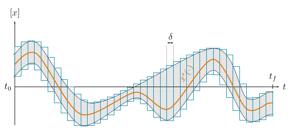
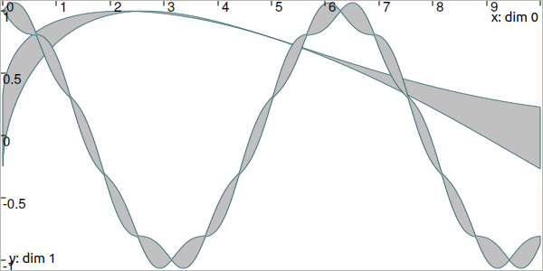
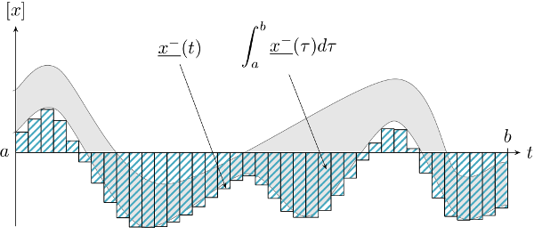
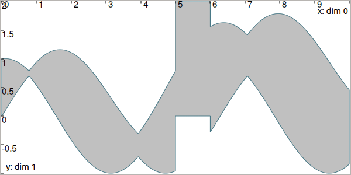

.. _sec-manual-tubes:

***************************
Tubes: sets of trajectories
***************************

We now focus on *dynamical* items that are evolving with time.
The trajectories :math:`x(\cdot)` and vector of trajectories :math:`\mathbf{x}(\cdot)`, presented :ref:`in the previous pages <sec-manual-vardyn>`, have also their interval counterpart: **tubes**. This page provides the main uses of these sets. They will be involved afterwards for solving problems related to differential equations.

.. contents::

Definition
----------

A tube is defined over a temporal *t*-domain :math:`[t_0,t_f]` as an envelope of trajectories that are defined over the same *t*-domain. We speak about an *envelope* as it may exist trajectories enclosed in the tube that are not solutions of our problem.

In this library, a tube :math:`[x](\cdot):[t_0,t_f]\rightarrow\mathbb{IR}` is an interval of two trajectories :math:`[\underline{x}(\cdot),\overline{x}(\cdot)]` such that :math:`\forall t\in[t_0,t_f]`, :math:`\underline{x}(t)\leqslant\overline{x}(t)`. We also consider empty tubes that depict an absence of solutions, denoted :math:`\varnothing(\cdot)`.
A trajectory :math:`x(\cdot)` belongs to the tube :math:`\left[x\right](\cdot)` if :math:`\forall t\in[t_0,t_f], x\left(t\right)\in\left[x\right]\left(t\right)`. 

.. figure:: img/tube_def.png

  Illustration a one-dimensional tube enclosing a trajectory :math:`x^*(\cdot)` plotted in orange. The figure shows two interval evaluations: :math:`[x]([t_1])` and :math:`[x](t_2)`.

.. note::

  **Important:** we assume that all the tubes and/or the trajectories involved in a given resolution process share the same *t*-domain :math:`[t_0,t_f]`.

Slices
------

| In Tubex, tubes are implemented as lists of slices.
| More precisely, a tube :math:`[x](\cdot)` with a sampling time :math:`\delta>0` is implemented as a box-valued function which is constant for all :math:`t` inside intervals :math:`[k\delta,k\delta+\delta]`, :math:`k\in\mathbb{N}`.

The box :math:`[k\delta,k\delta+\delta]\times\left[x\right]\left(t_{k}\right)`, with :math:`t_{k}\in[k\delta,k\delta+\delta]`, is called the :math:`k`-th slice of the tube :math:`[x](\cdot)` and is denoted by :math:`[\![x]\!]^{(k)}`.

  A tube :math:`[x](\cdot)` represented by a set of :math:`\delta`-width slices. This implementation can be used to enclose signals such as :math:`x^*(\cdot)`.

.. versionadded:: 2.0
   Custom discretization of tubes is now at hand, they can be made of slices that are not all defined with the same sampling time :math:`\delta`.

This implementation takes rigorously into account floating point precision when building a tube.
Further computations involving :math:`[x](\cdot)` will be implicitly based on its slices, thus keeping a reliable outer approximation of the solution set. 

Creating tubes
--------------

The vocabulary for tubes involves two notions:

* the **t-domain**, that represents the temporal domain :math:`[t_0,t_f]`
* the **codomain**, that represents the set of feasible values of the tube :math:`[x]([t_0,t_f])`

To create a ``Tube`` with a constant codomain:

.. tabs::

  .. code-tab:: py

    tdomain = Interval(0,10)

    # One-slice tubes:
    x1 = Tube(tdomain)                               # [0,10]→[-∞,∞]
    x2 = Tube(tdomain, Interval(0,2))                # [0,10]→[0,2]

    # 100-slices tubes:
    dt = 0.1 
    x3 = Tube(tdomain, dt, Interval(0,2))            # [0,10]→[0,2]
    x4 = Tube(tdomain, dt, Interval(0,oo))           # [0,10]→[0,∞]

  .. code-tab:: c++

    Interval tdomain(0,10);
    
    // One-slice tubes:
    Tube x1(tdomain);                                // [0,10]→[-∞,∞]
    Tube x2(tdomain, Interval(0,2));                 // [0,10]→[0,2]

    // 100-slices tubes:
    float dt = 0.1;
    Tube x3(tdomain, dt, Interval(0,2));             // [0,10]→[0,2]
    Tube x4(tdomain, dt, Interval(0,oo));            // [0,10]→[0,∞]

The ``dt`` variable defines the temporal width of the slices. Note that it is also possible to create slices of different width; this will be explained afterwards.

To create a copy of a tube with the same time discretization, use:

.. tabs::

  .. code-tab:: py

    x5 = Tube(x4)                    # identical tube (100 slices, [0,10]→[0,∞])
    x6 = Tube(x4, Interval(5))       # 100 slices, same timestep, but [0,10]→[5]

  .. code-tab:: c++

    Tube x5(x4);                     // identical tube (100 slices, [0,10]→[0,∞])
    Tube x6(x4, Interval(5.));       // 100 slices, same timestep, but [0,10]→[5]

As tubes are intervals of trajectories, a ``Tube`` can be defined from ``Trajectory`` objects:

.. tabs::

  .. code-tab:: py

    traj = TrajectoryVector(tdomain, TFunction("(sin(t) ; cos(t) ; cos(t)+t/10)"))

    x8 = Tube(traj[0], dt)           # 100 slices tube enclosing sin(t)
    x9 = Tube(traj[1], traj[2], dt)  # 100 slices tube defined as [cos(t),cos(t)+t/10]

  .. code-tab:: c++

    TrajectoryVector traj(tdomain, TFunction("(sin(t) ; cos(t) ; cos(t)+t/10)"));

    Tube x8(traj[0], dt);            // 100 slices tube enclosing sin(t)
    Tube x9(traj[1], traj[2], dt);   // 100 slices tube defined as [cos(t),cos(t)+t/10]

.. figure:: img/interval_trajs.png

  Result of tubes :math:`[x_8](t)=[\sin(t),\sin(t)]`, :math:`[x_9](t)=[\cos(t),\cos(t)+\frac{t}{10}]`, made of 100 slices.

.. #include <tubex.h>
.. 
.. using namespace std;
.. using namespace tubex;
.. 
.. int main()
.. {
..   float dt = 0.1;
..   Interval tdomain(0.,10.);
.. 
..   TrajectoryVector traj(tdomain, TFunction("(sin(t) ; cos(t) ; cos(t)+t/10)"));
..   Tube y(traj[0], dt);
..   Tube x(traj[1], traj[2], dt);
.. 
..   vibes::beginDrawing();
.. 
..   VIBesFigTube fig("Tube");
..   fig.set_properties(100, 100, 600, 300);
..   fig.add_tube(&x, "x", "#376D7C[lightGray]");
..   fig.add_tube(&y, "y", "#7C4837[lightGray]");
..   fig.add_trajectories(&traj, "trajs");
..   fig.show(true);
.. 
..   vibes::endDrawing();
.. }

It is also possible to create a tube from a thick function, where the uncertainty is explicitly set in the formula:

.. tabs::

  .. code-tab:: py

    dt = 0.01
    x10 = Tube(tdomain, dt, \
               TFunction("-abs(cos(t)+t/5)+(t/2)*[-0.1,0.1]"))

  .. code-tab:: c++

    dt = 0.01;
    Tube x10(tdomain, dt,
             TFunction("-abs(cos(t)+t/5)+(t/2)*[-0.1,0.1]"));

.. figure:: img/02_tube_fnc.png

  Result of tube :math:`[x_{10}](\cdot)` made of 1000 slices.

Finally, as tube is an envelope (union) of trajectories, the following operations are allowed:

.. tabs::

  .. code-tab:: py

    f = TFunction("(cos(t) ; cos(t)+t/10 ; sin(t)+t/10 ; sin(t))") # 4d temporal function
    traj = TrajectoryVector(tdomain, f) # 4d trajectory defined over [0,10]

    # 1d tube [x](·) defined as a union of the 4 trajectories
    x = Tube(traj[0], dt) | traj[1] | traj[2] | traj[3]

  .. code-tab:: c++

    TFunction f("(cos(t) ; cos(t)+t/10 ; sin(t)+t/10 ; sin(t))"); // 4d temporal function
    TrajectoryVector traj(tdomain, f); // 4d trajectory defined over [0,10]

    // 1d tube [x](·) defined as a union of the 4 trajectories
    Tube x = Tube(traj[0], dt) | traj[1] | traj[2] | traj[3];
    
Which produces:

.. figure:: img/02_union.png

.. _sec-manual-tubes-tubevector:

The vector case
---------------

| The extension to the vector case is the class ``TubeVector``, allowing to create tubes :math:`[\mathbf{x}](\cdot):[t_0,t_f]\to\mathbb{IR}^n`.
| The following example

.. tabs::

  .. code-tab:: py

    # TubeVector from a formula; the function's output is two-dimensional
    x = TubeVector(tdomain, dt, \
                   TFunction("(sin(sqrt(t)+((t-5)^2)*[-0.01,0.01]) ; \
                              cos(t)+sin(t/0.2)*[-0.1,0.1])"))

  .. code-tab:: c++

    // TubeVector from a formula; the function's output is two-dimensional
    TubeVector x(tdomain, dt,
                 TFunction("(sin(sqrt(t)+((t-5)^2)*[-0.01,0.01]) ; \
                            cos(t)+sin(t/0.2)*[-0.1,0.1])"));

produces (each dimension displayed on the same figure):

.. #include <tubex.h>
.. 
.. using namespace std;
.. using namespace tubex;
.. 
.. int main()
.. {
..   float dt = 0.01;
..   Interval tdomain(0.,10.);
.. 
..   // TubeVector as a union of trajectories
..   TrajectoryVector traj(tdomain, TFunction("(cos(t) ; cos(t)+t/10 ; sin(t)+t/10 ; sin(t))"));
..   Tube x = Tube(traj[0], dt) | traj[1] | traj[2] | traj[3];
.. 
..   // Inversion
..   vector<Interval> v_t;
..   x.invert(Interval(0.,0.2), v_t);
.. 
..   // Update
..   x.set(Interval(0.,2.), Interval(5.,6.)); // then x([5,6])=[0,2]
.. 
..   // TubeVector from a formula; the function's output is two-dimensional
..   TubeVector y(Interval(0.,10.), dt,
..                TFunction("(sin(sqrt(t)+((t-5)^2)*[-0.01,0.01]) ; \
..                           cos(t)+sin(t/0.2)*[-0.1,0.1])"));
.. 
..   vibes::beginDrawing();
.. 
..   VIBesFigTube fig("Tube");
..   fig.set_properties(100, 100, 600, 300);
..   fig.add_tube(&x, "x", "#376D7C[lightGray]");
..   fig.add_trajectories(&traj, "trajs");
.. 
..   for(auto& t : v_t)
..   {
..     IntervalVector tbox = {t,{0.,0.2}};
..     fig.draw_box(tbox, "red");     // boxes display
..   }
.. 
..   fig.show();
.. 
..   VIBesFigTube fig_vec("TubeVector");
..   fig_vec.set_properties(200, 200, 600, 300);
..   fig_vec.add_tubes(&y, "y", "#376D7C[lightGray]");
..   fig_vec.show();
.. 
..   vibes::endDrawing();
.. }

As for ``Vector`` and ``IntervalVector`` objects, a ``Tube`` component of a ``TubeVector`` is available by reference with ``[]``.
Vector operations are also at hand:

==============  =================================  =======================================
Return type     Code                               Meaning
==============  =================================  =======================================
``int``         ``x.size()``                       number of dimensions of the tube vector
--              ``x.resize(n)``                    adds or removes dimensions
``TubeVector``  ``x.subvector(start_id, end_id)``  extracts a subvector from ``x``
--              ``x.put(start_id, v)``             puts a subvector at ``start_id``
==============  =================================  =======================================

Evaluations
-----------

Once created, several evaluations of the tubes can be made, as for trajectories.

  .. rubric:: Accessing values with ``()``

  .. tabs::

    .. code-tab:: py

      x(6.)                            # evaluation of [x](·) at 6
      x(Interval(5,6))                 # evaluation of [x](·) over [5,6]
      x.codomain()                     # envelope of values

    .. code-tab:: c++

      x(6.)                            // evaluation of [x](·) at 6
      x(Interval(5.,6.))               // evaluation of [x](·) over [5,6]
      x.codomain()                     // envelope of values

  .. rubric:: Inversion of tubes

  The inversion of a tube :math:`[x](\cdot)`, denoted :math:`[x]^{-1}([y])`, is also at hand and returns the set :math:`[t]` enclosing the preimages of :math:`[y]`. The ``invert()`` method returns the union of these subsets, or the set of solutions within a vector of ``Interval`` objects. The following example returns the different subsets of the inversion :math:`[x]^{-1}([0,0.2])` projected in red in next figure:

  .. tabs::

    .. code-tab:: py

      v_t = []
      x.invert(Interval(0,0.2), v_t)   # inversion
      
      for t in v_t:
        tbox = IntervalVector([t,[0,0.2]])
        fig.draw_box(tbox, "red")      # boxes display

    .. code-tab:: c++

      vector<Interval> v_t;            // vector of preimages
      x.invert(Interval(0.,0.2), v_t); // inversion

      for(auto& t : v_t)
      {
        IntervalVector tbox = {t,{0.,0.2}};
        fig.draw_box(tbox, "red");     // boxes display
      }

  .. figure:: img/02_invert.png

Operations on sets
------------------

Set operations are available for ``Tube`` and ``TubeVector`` objects. In the following table, if :math:`[x](\cdot)` is a tube object, :math:`z(\cdot)` is a trajectory.

==================  ====================================  ======================================================================
Return type         Code                                  Meaning, :math:`\forall t\in[t_0,t_f]`
==================  ====================================  ======================================================================
``bool``            ``x==y``                              :math:`[x](t)=[y](t)`
``bool``            ``x!=y``                              :math:`[x](t)\neq [y](t)`
``bool``            ``x.is_empty()``                      :math:`[x](t)=\varnothing`
``bool``            ``x.is_subset(y)``                    :math:`[x](t)\subseteq [y](t)`
``bool``            ``x.is_strict_subset(y)``             :math:`[x](t)\subseteq [y](t)\wedge [x](t)\neq [y](t)`
``bool``            ``x.is_superset(y)``                  :math:`[x](t)\supseteq [y](t)`
``bool``            ``x.is_strict_superset(y)``           :math:`[x](t)\supseteq [y](t)\wedge [x](t)\neq [y](t)`
``BoolInterval``    ``x.contains(z)``                     :math:`z(t)\in [x](t)`
``bool``            ``x.overlaps(y)``                     :math:`[x](t)\cap [y](t)\neq\varnothing`
==================  ====================================  ======================================================================

  .. rubric:: The ``contains()`` method
    
  Testing if a tube :math:`[x](\cdot)` contains a solution :math:`z(\cdot)` may lead to uncertainties. Indeed, the reliable representation of a ``Trajectory`` may lead to some wrapping effect, and so this `contains` test may not be able to conclude. Therefore, the ``contains()`` method returns a ``BoolInterval`` value. Its values can be either ``YES``, ``NO`` or ``MAYBE``. The ``MAYBE`` case is rare but may appear due to the numerical representation of a trajectory. In practice, this may happen if the thin envelope of :math:`z(\cdot)` overlaps a boundary of the tube :math:`[x](\cdot)`.

In addition of these test functions, operations on sets are available:

====================================  =======================================================
Code                                  Meaning, :math:`\forall t\in[t_0,t_f]`
====================================  =======================================================
``x&y``                               :math:`[x](t)\cap [y](t)`
``x|y``                               :math:`[x](t)\sqcup[y](t)`
``x.set_empty()``                     :math:`[x](t)\leftarrow \varnothing`
``x=y``                               :math:`[x](t)\leftarrow [y](t)`
``x&=y``                              :math:`[x](t)\leftarrow ([x](t)\cap [y](t))`
``x|=y``                              :math:`[x](t)\leftarrow ([x](t)\sqcup[y](t))`
====================================  =======================================================

Finally, one can also access properties of the sets. First for ``Tube``:

====================  ==================  ====================================================================================
Return type           Code                Meaning
====================  ==================  ====================================================================================
``Trajectory``        ``x.diam()``        diameters of the tube as a trajectory,
                                          :math:`d(\cdot)=\overline{x}(\cdot)-\underline{x}(\cdot)`
``double``            ``x.max_diam()``    maximal diameter
``double``            ``x.volume()``      the volume (surface) of the tube
``Tube``              ``x.inflate(eps)``  a Tube with the same midtraj and radius increased by ``eps``
====================  ==================  ====================================================================================

Then for ``TubeVector``:

====================  ==================  ====================================================================================
Return type           Code                Meaning
====================  ==================  ====================================================================================
``TrajectoryVector``  ``x.diam()``        diameters of the tube as a trajectory,
                                          :math:`\mathbf{d}(\cdot)=\overline{\mathbf{x}}(\cdot)-\underline{\mathbf{x}}(\cdot)`
``Vector``            ``x.max_diam()``    maximal diameter
``Trajectory``        ``x.diag()``        approximated trajectory: list of diagonals of each slice
``double``            ``x.volume()``      the volume of the tube
``TubeVector``        ``x.inflate(eps)``  new tube: same midtraj, each dimension increased by ``eps``
====================  ==================  ====================================================================================

  .. rubric:: The ``diam()`` methods
    
  | These methods are used to evaluate the thickness of a ``Tube`` or a ``TubeVector``. They are mainly used for display purposes, for instance for displaying a tube with a color function depending on its thickness.
  | However, without derivative knowledge, and because the tube is made of boxed slices, the trajectory will be discontinuous and so the returned object will not reliably represent the actual diameters.

  .. rubric:: The ``diag()`` methods
    
  It holds the same of the ``diag()`` methods.

  .. todo::
    ``x.intersects(y)``, ``x.is_disjoint(y)``, ``x.is_unbounded()``, ``x.min_diam()``, ``x.is_flat()``.

Classical operations on sets are applicable on tubes.
We recall that the tubes and trajectories have to share the same *t*-domain for these operations.

.. tabs::
    
  .. code-tab:: py

    x4 = (x1 | x2) & x3

  .. code-tab:: c++

    Tube x4 = (x1 | x2) & x3;

The same for mathematical functions:

.. tabs::

  .. code-tab:: py

    x2 = abs(x1)
    x3 = cos(x1) + sqrt(x2 + pow(x1, Interval(2,3)))

  .. code-tab:: c++

    Tube x2 = abs(x1);
    Tube x3 = cos(x1) + sqrt(x2 + pow(x1, Interval(2,3)));

The following functions can be used:

=========================  ==================================================================
Code                       Meaning
=========================  ==================================================================
``sqr(x)``                 :math:`[x](\cdot)^2`
``sqrt(x)``                :math:`\sqrt{[x](\cdot)}`
``pow(x,n)``               :math:`[x](\cdot)^n`
``pow(x,y)``               :math:`[x](\cdot)^{[y]} = e^{[y]\log([x](\cdot))}`
``root(x,n)``              :math:`\sqrt[n]{[x](\cdot)}`
``exp(x)``                 :math:`\exp([x](\cdot))`
``log(x)``                 :math:`\log([x](\cdot))`
``cos(x)``                 :math:`\cos([x](\cdot))`
``sin(x)``                 :math:`\sin([x](\cdot))`
``tan(x)``                 :math:`\tan([x](\cdot))`
``acos(x)``                :math:`\textrm{acos}([x](\cdot))`
``asin(x)``                :math:`\textrm{asin}([x](\cdot))`
``atan(x)``                :math:`\textrm{atan}([x](\cdot))`
``atan2(y,x)``             | :math:`\textrm{atan2}([y](\cdot),[x](\cdot))`
                           | :math:`\textrm{atan2}([y],[x](\cdot))`
                           | :math:`\textrm{atan2}([y](\cdot),[x])`
=========================  ==================================================================

Integral computations
---------------------

Reliable integral computations are available on tubes.

.. figure:: img/tube_integ_inf.png
  
  Hatched part depicts the lower bound of :math:`\displaystyle\int_{a}^{b}[x](\tau)d\tau`.

The computation is *reliable* because it stands on the tube's slices. The result is an outer approximation of the integral of the tube represented by these slices:

  Outer approximation of the lower bound of :math:`\int_{a}^{b}[x](\tau)d\tau`.

Computation of the tube primitive :math:`[p](\cdot)=\int_{0}^{\cdot}[x](\tau)d\tau`:

.. tabs::

  .. code-tab:: py

    p = x.primitive()

  .. code-tab:: c++

    Tube p = x.primitive();
    
Computation of the interval-integral :math:`[s]=\int_{0}^{[t]}[x](\tau)d\tau`:

.. tabs::

  .. code-tab:: py

    t = Interval(...)
    s = x.integral(t)

  .. code-tab:: c++

    Interval t(...);
    Interval s = x.integral(t);

Computation of :math:`[s]=\int_{[t_1]}^{[t_2]}[x](\tau)d\tau`:

.. tabs::

  .. code-tab:: py

    t1 = Interval(...)
    t2 = Interval(...)
    s = x.integral(t1, t2)

  .. code-tab:: c++

    Interval t1(...), t2(...);
    Interval s = x.integral(t1, t2);

Also, a decomposition of the interval-integral of :math:`[x](\cdot)=[x^-(\cdot),x^+(\cdot)]` with :math:`[s^-]=\int_{[t_1]}^{[t_2]}x^-(\tau)d\tau` and :math:`[s^+]=\int_{[t_1]}^{[t_2]}x^+(\tau)d\tau` is computable by:

.. tabs::

  .. code-tab:: py

    t1 = Interval(...)
    t2 = Interval(...)
    s = x.partial_integral(t1, t2)
    # s[0] is [s^-]
    # s[1] is [s^+]

  .. code-tab:: c++

    Interval t1, t2;
    pair<Interval,Interval> s;
    s = x.partial_integral(t1, t2);
    // s.first is [s^-]
    // s.second is [s^+]

*Note:* :math:`[s]=[s^-]\sqcup[s^+]`.

Updating values
---------------

The ``set()`` methods allow various updates on tubes. For instance:

.. tabs::

  .. code-tab:: py

    x.set(Interval(0,2), Interval(5,6)) # then [x]([5,6])=[0,2]

  .. code-tab:: c++

    x.set(Interval(0.,2.), Interval(5.,6.)); // then [x]([5,6])=[0,2]
    
produces:

.. warning::
  
  Be careful when updating a tube without the use of **dedicated contractors**. Tube discretization has to be kept in mind whenever an update is performed for some input :math:`t`. For reliable operations, please see the :ref:`contractors section<sec-manual-contractors-dyn>`.

See also the following methods:

.. tabs::

  .. code-tab:: py

    x.set(Interval(0,oo))         # set a constant codomain for all t
    x.set(Interval(0), 4.)        # set a value at some t: [x](4)=[0]
    x.set_empty()                 # empty set for all t

  .. code-tab:: c++

    x.set(Interval(0,oo));        // set a constant codomain for all t
    x.set(Interval(0.), 4.);      // set a value at some t: [x](4)=[0]
    x.set_empty();                // empty set for all t

.. _sec-manual-tubes-sampling:

Sampling and *t*-domain
-----------------------

The following methods are related to *t*-domains and slices structure:

==============  ===========================================  ==============================================================
Return type     Code                                         Meaning
==============  ===========================================  ==============================================================
``Interval``    ``x.tdomain()``                              temporal domain :math:`[t_0,t_f]` (*t*-domain)
--              ``x.shift_tdomain(a)``                       shifts the *t*-domain to :math:`[t_0+a,t_f+a]`
``bool``        ``same_slicing(x, y)``                       tests if ``x`` and ``y`` have the same slicing **(static)**
--              ``x.sample(t)``                              samples the tube at :math:`t` (adds a slice)
--              ``x.sample(y)``                              samples ``x`` so that it shares the sampling of tube ``y``
--              ``x.remove_gate(t)``                         removes the sampling at :math:`t`, if it exists
==============  ===========================================  ==============================================================

  .. rubric:: The ``sample()`` methods
    
  Custom sampling of tubes is available. The ``sample(t)`` method allows to cut a slice defined over :math:`t` into two slices on each side of :math:`t`. If :math:`t` already separates two slices (if it corresponds to a *gate*), then nothing is changed.

  .. figure:: img/sampled_tube.png
    
    Example of custom slicing of a tube.

------------------------------------------------------

Next pages will present reliable operators to reduce the range of the presented domains (intervals, boxes, tubes) in a reliable way and according to the constraints defining a problem.

.. #include <tubex.h>
.. 
.. using namespace std;
.. using namespace tubex;
.. 
.. int main()
.. {
..   float dt = 0.2;
..   Interval tdomain(0.,10.);
.. 
..   TrajectoryVector traj(tdomain, TFunction("(cos(t) ; cos(t)+t/10)"));
..   Tube x(tdomain, Interval::EMPTY_SET);
.. 
..   double t = tdomain.lb();
..   while(t < tdomain.ub())
..   {
..     x.sample(t);
..     t += dt/10. + fabs(cos(t)/10.);
..   }
.. 
..   x |= traj[0]; x |= traj[1];
.. 
..   vibes::beginDrawing();
.. 
..   VIBesFigTube fig("Tube");
..   fig.set_properties(100, 100, 600, 300);
..   fig.add_tube(&x, "x", "#376D7C[lightGray]");
..   fig.add_trajectories(&traj, "trajs");
..   fig.show(true);
.. 
..   vibes::endDrawing();
.. }

.. admonition:: Technical documentation

  See the C++ API documentation of this class:

  * `Tube <../../../api/html/classtubex_1_1_tube.html>`_
  * `TubeVector <../../../api/html/classtubex_1_1_tube_vector.html>`_