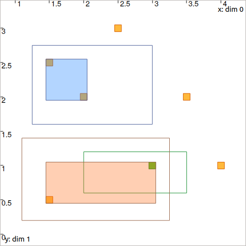

.. _sec-manual-ctcconstell:

********************************************
CtcConstell: :math:`\mathbf{x}\in\mathbb{M}`
********************************************

The *constellation contractor*, denoted by :math:`\mathcal{C}_\textrm{constell}`, is used to solve :ref:`the data association problem <sec-tuto-05>`.
Given a list of vectors :math:`\mathbf{m}_{1}`, :math:`\dots`, :math:`\mathbf{m}_{\ell}` forming a *constellation*, the contractor reduces a box :math:`[\mathbf{x}]` to perfectly wrap the vectors previously enclosed inside of it.

.. contents::

Context
-------

In robotics, when several landmarks :math:`\mathbf{m}_{1}`, :math:`\dots`, :math:`\mathbf{m}_{\ell}` exist, the observation data may not be *associated*: we do not know to which landmark a given measurement :math:`\mathbf{y}` refers. In other words it may be difficult, from the perception of a landmark, to find its identity only from the measurement data. However, data fusion can be done (for instance, by merging information coming from robot's evolution). From fusion, we can obtain that the perceived landmark belongs to a *reduced* set of landmarks :math:`[\mathbf{x}]`. The contractor presented here simply aims at reducing optimally this prior set :math:`[\mathbf{x}]` to finally perfectly wrap the vectors inside of it, thus allowing further contractions.

| See more in the related paper: **Set-membership state estimation by solving data association**.
| |datasso-pdf|_

Definition
----------

Let us consider a constellation of :math:`\ell` points :math:`\mathbb{M}=\{[\mathbf{m}_{1}],\dots,[\mathbf{m}_{\ell}]\}` of :math:`\mathbb{IR}^{d}` and a box :math:`\left[\mathbf{x}\right]\in\mathbb{IR}^d`. We want to compute the smallest box :math:`\mathcal{C}_\textrm{constell}\left(\left[\mathbf{x}\right]\right)` containing
:math:`\mathbb{M}\cap\left[\mathbf{x}\right]`, or equivalently:

.. math::

  \begin{equation}
  \mathcal{C}_\textrm{constell}\left(\left[\mathbf{x}\right]\right)=\bigsqcup_{j}\big(\left[\mathbf{x}\right]\cap[\mathbf{m}_{j}]\big),
  \end{equation}

where :math:`\bigsqcup`, called *squared union*, returns the smallest box enclosing the union of its arguments.

.. important::
    
  .. math::

    \mathbf{m}\in\mathbb{M}=\big\{[\mathbf{m}_1],\dots,[\mathbf{m}_\ell]\big\} \longrightarrow \mathcal{C}_{\textrm{constell}}\big([\mathbf{x}]\big)

  .. tabs::

    .. code-tab:: c++

      #include <tubex-rob.h>
      CtcConstell ctc_constell(v_b); // with v_b, the vector<IntervalVector> defining
                                     // the constellation of points

    .. code-tab:: py

      ctc_constell = CtcConstell(v_b) # with v_b, the vector defining
                                      # the constellation of points

Example
-------

Let us consider the following constellation:

.. figure:: img/CtcConstell_constell.png

  A given constellation of points :math:`\big\{[\mathbf{m}_1],\dots,[\mathbf{m}_\ell]\big\}`.

The :math:`\mathcal{C}_\textrm{constell}` can be instantiated with

.. tabs::

  .. code-tab:: c++

    #include <tubex-rob.h>

    // ...

    vector<IntervalVector> v_b; // vector defining the constellation of points
    v_b.push_back( // ...

    CtcConstell ctc_constell(v_b);

  .. code-tab:: py

    v_b = [...  // vector defining the constellation of points

    ctc_constell = CtcConstell(v_b)

Now, if we define three boxes:

.. tabs::

  .. code-tab:: c++

    vector<IntervalVector> v_x;
    v_x.push_back({{1.25,3},{1.6,2.75}});
    v_x.push_back({{2.,3.5},{0.6,1.2}});
    v_x.push_back({{1.1,3.25},{0.2,1.4}});

  .. code-tab:: py

    v_x = [IntervalVector([[1.25,3],[1.6,2.75]]), \
           IntervalVector([[2.,3.5],[0.6,1.2]]), \
           IntervalVector([[1.1,3.25],[0.2,1.4]])]

we can use the :math:`\mathcal{C}_\textrm{constell}` to contract them according to the constellation.

.. tabs::

  .. code-tab:: c++

    for(auto& x : v_x)
      ctc_constell.contract(x);

  .. code-tab:: py

    for x in v_x:
      ctc_constell.contract(x)

  Filled boxes are the :math:`[\mathbf{x}]` after contraction.

.. #include <tubex.h>
.. #include <tubex-rob.h>
.. 
.. using namespace std;
.. using namespace tubex;
.. using namespace ibex;
.. 
.. int main()
.. {
..   Tube xd(Interval(0.,1.), 0.1);
.. 
..   vector<IntervalVector> v_x;
..   v_x.push_back({{1.25,3},{1.6,2.75}});
..   v_x.push_back({{2.,3.5},{0.6,1.2}});
..   v_x.push_back({{1.1,3.25},{0.2,1.4}});
.. 
..   vector<IntervalVector> v_b;
..   v_b.push_back({{1.5},{2.5}});
..   v_b.push_back({{3.},{1.}});
..   v_b.push_back({{2.},{2.}});
..   v_b.push_back({{2.5},{3.}});
..   v_b.push_back({{3.5},{2.}});
..   v_b.push_back({{4.},{1.}});
..   v_b.push_back({{1.5},{0.5}});
.. 
..   for(auto& b : v_b)
..     b.inflate(0.05);
.. 
..   CtcConstell ctc_constell(v_b);
.. 
..   vibes::beginDrawing();
.. 
..   VIBesFigMap fig("Map");
..   fig.set_properties(50, 50, 500, 500);
.. 
..   for(const auto& b : v_b)
..     fig.add_beacon(Beacon(b));
.. 
..   fig.draw_box(v_x[0], "#475B96");
..   ctc_constell.contract(v_x[0]);
..   fig.draw_box(v_x[0], "#475B96[#1A80FF55]");
.. 
..   fig.draw_box(v_x[1], "#158E2F");
..   ctc_constell.contract(v_x[1]);
..   fig.draw_box(v_x[1], "#158E2F[#40C225DD]");
.. 
..   fig.draw_box(v_x[2], "#966447");
..   ctc_constell.contract(v_x[2]);
..   fig.draw_box(v_x[2], "#966447[#FF6E1A55]");
.. 
..   fig.show();
..   fig.axis_limits(fig.view_box(), true, 0.1);
.. 
..   vibes::endDrawing();
.. }

Related content
---------------

.. |datasso-pdf| replace:: **Download the paper**
.. _datasso-pdf: http://simon-rohou.fr/research/datasso/datasso_paper.pdf

.. admonition:: Related publication
  
  | **Set-membership state estimation by solving data association**
  | S. Rohou, B. Desrochers, L. Jaulin
  | *IEEE International Conference on Robotics and Automation (ICRA)*, 2020.
  | |datasso-pdf|_

.. admonition:: Technical documentation

  See the `C++ API documentation of this class <../../../api/html/classtubex_1_1_ctc_constell.html>`_.