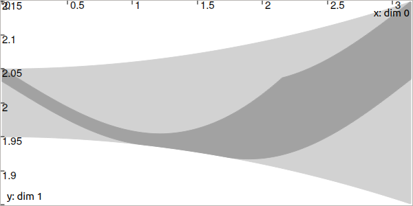
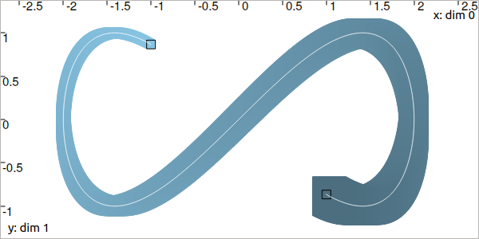

.. _sec-manual-ctcderiv:

*********************************
CtcDeriv: :math:`\dot{x}(t)=v(t)`
*********************************

:math:`\dot{x}(t)=v(t)` is the simplest differential constraint that binds a trajectory :math:`x(\cdot)` to its derivative :math:`v(\cdot)`. The related contractor :math:`\mathcal{C}_{\frac{d}{dt}}` allows contractions on the tube :math:`[x](\cdot)` to preserve only trajectories consistent with the derivatives enclosed in the tube :math:`[v](\cdot)`.

.. contents::

Definition
----------

.. important::
    
  .. math::

    \left.\begin{array}{r}\dot{x}(\cdot)=v(\cdot)\end{array}\right. \longrightarrow \mathcal{C}_{\frac{d}{dt}}\big([x](\cdot),[v](\cdot)\big)

  .. tabs::

    .. code-tab:: py

      ctc.deriv.contract(x,v)

    .. code-tab:: c++

      ctc::deriv.contract(x, v);

  .. rubric:: Prerequisite

  The tubes :math:`[x](\cdot)` and :math:`[v](\cdot)` must share:

  * the same slicing (same sampling of time)
  * the same *t*-domain :math:`[t_0,t_f]`
  * the same dimension in the vector case

Theoretical illustration
------------------------

Here is an example of a consistency state reached with :math:`\mathcal{C}_{\frac{d}{dt}}` over a set of trajectories and their feasible derivatives.

Let us consider two arbitrary tubes :math:`[x](\cdot)` and :math:`[v](\cdot)` and the constraint :math:`\dot{x}(t)=v(t)`.

.. tabs::

  .. code-tab:: py

    dt = 0.01
    tdomain = Interval(0., math.pi)

    v = Tube(tdomain, dt, TFunction("sin(t+3.14+(3.14/2))/5+[-0.05,0.05]+(3.14-t)*[-0.01,0.01]"))
    x = Tube(tdomain, dt, TFunction("[-0.05,0.05]+2+t*t*[-0.01,0.01]"))

  .. code-tab:: c++

    double dt = 0.01;
    Interval tdomain(0., M_PI);

    Tube v(tdomain, dt, TFunction("sin(t+3.14+(3.14/2))/5+[-0.05,0.05]+(3.14-t)*[-0.01,0.01]"));
    Tube x(tdomain, dt, TFunction("[-0.05,0.05]+2+t*t*[-0.01,0.01]"));

The following images depict the tubes. The dark gray parts are the obtained tubes after the contraction performed by:

.. tabs::

  .. code-tab:: py

    ctc_deriv = CtcDeriv()
    ctc_deriv.contract(x,v)
    # one could also directly use: ctc.deriv.contract(x,v)

  .. code-tab:: c++

    CtcDeriv ctc_deriv;
    ctc_deriv.contract(x, v);
    // one could also directly use: ctc::deriv.contract(x, v);

.. figure:: img/cderiv_v.png
  
  The tube :math:`[v](\cdot)`.

  The tube :math:`[x](\cdot)`. The light-gray part has been contracted with :math:`\mathcal{C}_{\frac{d}{dt}}`.

Only :math:`[x](\cdot)` is contracted (it can be theoretically proved that :math:`[v](\cdot)` cannot be contracted when :math:`[x](\cdot)` is not a degenerate tube). Note that all the feasible derivatives in :math:`[v](\cdot)` are negative over :math:`[0,1]` and so the contraction of :math:`[x](\cdot)` preserves decreasing trajectories over this part of the domain. Similarly, :math:`[v](\cdot)` is positive over :math:`[2,3]` which corresponds to increasing trajectories kept in :math:`[x](\cdot)` after contraction.

.. #include <tubex.h>
.. 
.. using namespace std;
.. using namespace tubex;
.. 
.. int main()
.. {
..   double dt = 0.01;
..   Interval tdomain(0., M_PI);
.. 
..   Tube v(tdomain, dt, TFunction("sin(t+3.14+(3.14/2))/5+[-0.05,0.05]+(3.14-t)*[-0.01,0.01]"));
..   Tube x(tdomain, dt, TFunction("[-0.05,0.05]+2+t*t*[-0.01,0.01]"));
.. 
..   vibes::beginDrawing();
.. 
..   VIBesFigTube fig_x("Tube x");
..   fig_x.set_properties(100, 100, 600, 300);
..   fig_x.add_tube(&x, "x");
..   fig_x.show();
.. 
..   VIBesFigTube fig_v("Tube v");
..   fig_v.set_properties(100, 500, 600, 300);
..   fig_v.add_tube(&v, "v");
..   fig_v.show();
.. 
..   ctc::deriv.contract(x, v);
..   fig_x.show();  
.. 
..   vibes::endDrawing();
.. 
..   return EXIT_SUCCESS;
.. }

.. _sec-manual-ctcderiv-localization:

Localization example
--------------------

Let us consider another example with 2d tubes. We come back to :ref:`the Lissajous example<sec-manual-vardyn-lissajous>` introduced to present the use of trajectories. 

We assume that we have no knowledge on :math:`[\mathbf{x}](\cdot)`, except that the feasible trajectories start from the initial box :math:`[\mathbf{x}_0]` at :math:`t_0` and :math:`[\mathbf{x}_f]` at :math:`t_f`, black painted in the following figure.

.. tabs::

  .. code-tab:: py

    dt = 0.01
    tdomain = Interval(0,math.pi).inflate(math.pi/3)

    # The unknown truth is given by:
    x_truth = TrajectoryVector(tdomain, TFunction("(2*cos(t) ; sin(2*t))"))

    # From the truth we build the initial and final conditions
    # with some uncertainties (inflate)
    x0 = IntervalVector(x_truth(tdomain.lb())).inflate(0.05)
    xf = IntervalVector(x_truth(tdomain.ub())).inflate(0.05)

    # No initial knowledge on [x](·)..
    x = TubeVector(tdomain, dt, 2) # 2d tube defined over [t_0,t_f] with dt sampling

    # ..except for initial and final conditions
    x.set(x0, tdomain.lb())
    x.set(xf, tdomain.ub())

  .. code-tab:: c++

    double dt = 0.01;
    Interval tdomain = Interval(0.,M_PI).inflate(M_PI/3.);

    // The unknown truth is given by:
    TrajectoryVector x_truth(tdomain, TFunction("(2*cos(t) ; sin(2*t))"));

    // From the truth we build the initial and final conditions
    IntervalVector x0 = x_truth(tdomain.lb());
    IntervalVector xf = x_truth(tdomain.ub());
    x0.inflate(0.05); xf.inflate(0.05); // with some uncertainties

    // No initial knowledge on [x](·)..
    TubeVector x(tdomain, dt, 2); // 2d tube defined over [t_0,t_f] with dt sampling
    
    // ..except for initial and final conditions
    x.set(x0, tdomain.lb());
    x.set(xf, tdomain.ub());

The feasible derivatives are enclosed in :math:`[\mathbf{v}](\cdot)` given by:

.. math::

  [\mathbf{v}](t) = \left(\begin{array}{c}-2\sin(t)\\2\cos(2t)\end{array}\right)+\left(\begin{array}{c} [-0.02,0.02]\\ [-0.02,0.02]\end{array}\right)

.. tabs::

  .. code-tab:: py

    # Derivative of [x](·)
    v = TubeVector(tdomain, dt, TFunction("(-2*sin(t) ; 2*cos(2*t))"))
    v.inflate(0.02)

  .. code-tab:: c++

    // Derivative of [x](·)
    TubeVector v(tdomain, dt, TFunction("(-2*sin(t) ; 2*cos(2*t))"));
    v.inflate(0.02);

We can smooth the 2d tube :math:`[\mathbf{x}](\cdot)` in order to keep the envelope of trajectories starting in :math:`[\mathbf{x}_0]` at :math:`t_0` and ending in :math:`[\mathbf{x}_f]` at :math:`t_f`. For this, we use the :math:`\mathcal{C}_{\frac{d}{dt}}`:

.. tabs::

  .. code-tab:: py

    ctc.deriv.contract(x, v)

  .. code-tab:: c++

    ctc::deriv.contract(x, v);

Which leads to:

.. figure:: img/cderiv_lissajous.png

.. #include <tubex.h>
.. #include <tubex-rob.h>
.. 
.. using namespace std;
.. using namespace tubex;
.. 
.. int main()
.. {
..   double dt = 0.01;
..   Interval tdomain = Interval(0.,M_PI).inflate(M_PI/3.);
.. 
..   TrajectoryVector x_truth(tdomain, TFunction("(2*cos(t) ; sin(2*t))"));
..   TubeVector v(tdomain, dt, TFunction("(-2*sin(t) ; 2*cos(2*t))"));
..   v.inflate(0.02);
..   TubeVector x(tdomain, dt, 2);
.. 
..   IntervalVector x0 = x_truth(tdomain.lb());
..   IntervalVector xf = x_truth(tdomain.ub());
.. 
..   x0.inflate(0.05); xf.inflate(0.05); // with some uncertainties
.. 
..   x.set(x0, tdomain.lb());
..   x.set(xf, tdomain.ub());
.. 
..   ctc::deriv.contract(x, v/*, TimePropag::BACKWARD*/);
.. 
..   vibes::beginDrawing();
.. 
..   VIBesFigMap fig_map("Map");
..   fig_map.set_properties(1450, 50, 600, 300);
..   fig_map.add_trajectory(&x_truth, "x*", 0, 1, "white");
..   fig_map.add_tube(&x, "x", 0, 1);
..   fig_map.draw_box(xf);
..   fig_map.draw_box(x0);
..   fig_map.smooth_tube_drawing(true);
.. 
..   fig_map.axis_limits(-0.1,0.1,-1.3,1.3, true);
..   fig_map.show(0.);
..   
..   vibes::endDrawing();
.. }

Note that the propagation happens in a temporal forward/backward way: from :math:`t_0` to :math:`t_f` as well as from :math:`t_f` to :math:`t_0`.
A third argument of the ``contract()`` method can be used to restrict the propagation way:

.. tabs::

  .. code-tab:: py

    ctc.deriv.contract(x, v, TimePropag.BACKWARD) # or TimePropag.FORWARD

  .. code-tab:: c++

    ctc::deriv.contract(x, v, TimePropag::BACKWARD); // or TimePropag::FORWARD

Which produces, for instance, backward contractions from :math:`[\mathbf{x}_f]` only (in light blue):

Related content
---------------

.. |tubint-pdf| replace:: **Download the paper**
.. _tubint-pdf: http://simon-rohou.fr/research/tubint/tubint_paper.pdf

.. admonition:: Related publication
  
  | **Guaranteed computation of robot trajectories**
  | S. Rohou, L. Jaulin, L. Mihaylova, F. Le Bars, S. M. Veres
  | *Robotics and Autonomous Systems*, 93:76--84, 2017.
  | |tubint-pdf|_

.. admonition:: Technical documentation

  See the `C++ API documentation of this class <../../../api/html/classtubex_1_1_ctc_deriv.html>`_.