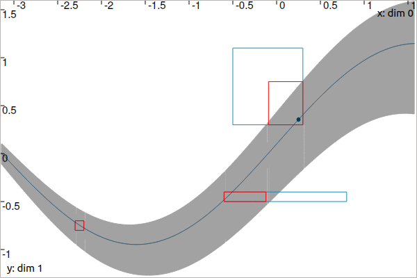

.. _sec-manual-ctceval:

***************************
CtcEval: :math:`y_i=x(t_i)`
***************************

:math:`y_i=x(t_i)` is a constraint that links a value :math:`y_i` to the evaluation of the trajectory :math:`x(\cdot)` at time :math:`t_i`. A dedicated contractor :math:`\mathcal{C}_{\textrm{eval}}` implements this constraint. One of its applications is the correction of the positions of a robot based on observations.

.. contents::

Definition
----------

.. important::
    
  .. math::

    \left.\begin{array}{r}y_i=x(t_i)\\\dot{x}(\cdot)=v(\cdot)\end{array}\right\} \longrightarrow \mathcal{C}_{\textrm{eval}}\big([t_i],[y_i],[x](\cdot),[v](\cdot)\big)

  .. tabs::

    .. code-tab:: py

      ctc.eval.contract(ti, yi, x, v)

    .. code-tab:: c++

      ctc::eval.contract(ti, yi, x, v);

  .. rubric:: Prerequisite

  The tubes :math:`[x](\cdot)` and :math:`[v](\cdot)` must share:

  * the same slicing (same sampling of time)
  * the same *t*-domain :math:`[t_0,t_f]`
  * the same dimension of :math:`[y_i]` in the vector case

1d theoretical presentation
---------------------------

The :math:`\mathcal{C}_{\textrm{eval}}` contractor aims at intersecting a tube :math:`[x](\cdot)` by the envelope of all trajectories compliant with the bounded observation :math:`[t_i]\times[y_i]`. In other words, :math:`[x](\cdot)` will be contracted by the tube of all :math:`x(\cdot)\in[x](\cdot)` going through the box :math:`[t_i]\times[y_i]`, as shown in :numref:`fig-ceval-x`. Some trajectories may partially cross the box at some point over :math:`[t_i]`: the contractor must take into account the feasible propagations during the intersection process. To this end, the knowledge of the derivative :math:`\dot{x}(\cdot)` is required to depict the evolution of :math:`x(\cdot)` over :math:`[t_i]`.

The contractor is proposed in the most generic way; the derivative :math:`\dot{x}(\cdot)` is also bounded within a tube denoted :math:`[v](\cdot)`, thus allowing the :math:`[x](\cdot)` contraction even if the derivative signal is uncertain.

.. _fig-ceval-x:

.. figure:: img/ceval_x.png
  
  Observation on a tube :math:`[x](\cdot)`. A given measurement :math:`\mathbf{m}\in\mathbb{R}^{2}`, pictured by a black dot, is known to belong to the blue box :math:`[t_i]\times[y_i]`. The sets are contracted by means of :math:`\mathcal{C}_{\textrm{eval}}`; the contracted part of the tube is depicted in light gray. Meanwhile, the bounded observation itself is contracted to :math:`[t_i']\times[y_i']` with :math:`[t_i']\subseteq[t_i]` and :math:`[z_i']\subseteq[z_i]`. This is illustrated by the red box. The dark line is an example of a compliant trajectory. The derivative :math:`\dot{x}(\cdot)`, not represented here, is also enclosed within a tube.

The code leading to the contraction presented in this figure is:

.. tabs::

  .. code-tab:: py

    dt = 0.01
    tdomain = Interval(-math.pi, math.pi/2)

    v = Tube(tdomain, dt, TFunction("cos(t)+[-0.1,0.1]")) # uncertain derivative (not displayed)
    x = v.primitive() + Interval(-0.1, 0.1) # x is the primitive of v

    # Bounded observation
    ti = Interval(-0.5,0.3)
    yi = Interval(0.3,1.1)

    # Contraction
    ctc_eval = CtcEval()
    ctc_eval.contract(ti, yi, x, v)
    # Note that we could use directly ctc.eval.contract(ti, yi, x, v)

  .. code-tab:: c++

    double dt = 0.01;
    Interval tdomain(-M_PI, M_PI/2.);

    Tube v(tdomain, dt, TFunction("cos(t)+[-0.1,0.1]")); // uncertain derivative (not displayed)
    Tube x = v.primitive() + Interval(-0.1, 0.1); // x is the primitive of v

    // Bounded observation
    Interval ti(-0.5,0.3);
    Interval yi(0.3,1.1);

    // Contraction
    CtcEval ctc_eval;
    ctc_eval.contract(ti, yi, x, v);
    // Note that we could use directly ctc::eval.contract(ti, yi, x, v)

.. rubric:: Restrict the temporal propagation (save computation time)

:math:`\mathcal{C}_{\textrm{eval}}` may contract the tube :math:`[x](\cdot)` and in this case, the contraction will be temporally propagated forward/backward in time from the :math:`[t_i]` *t*-domain. In :numref:`fig-ceval-x`, we can see that the contraction occurs over :math:`[-1.9,t_f]`. The ``.enable_time_propag(false)`` method can be used to limit the contraction to the :math:`[t_i]` *t*-domain only. This is useful when dealing with several observations :math:`[t_i]\times[z_i]` on the same tube: it becomes faster to first perform all the *local* contractions over each :math:`[t_i]` and then smooth the tube only once with, for instance, the :math:`\mathcal{C}_{\frac{d}{dt}}` contractor :ref:`presented before <sec-manual-ctcderiv>`.

For instance, we now consider three constraints on the tube:

.. tabs::

  .. code-tab:: py

    ti = [Interval(-0.5,0.3), Interval(-0.6,0.8), Interval(-2.3,-2.2)]
    yi = [Interval(0.3,1.1), Interval(-0.5,-0.4), Interval(-0.8,-0.7)]

  .. code-tab:: c++

    Interval ti[3], yi[3];
    ti[0] = Interval(-0.5,0.3); yi[0] = Interval(0.3,1.1);
    ti[1] = Interval(-0.6,0.8); yi[1] = Interval(-0.5,-0.4);
    ti[2] = Interval(-2.3,-2.2); yi[2] = Interval(-0.8,-0.7);

Then we use the contractor configured for the limited contraction:

.. tabs::

  .. code-tab:: py

    ctc_eval.enable_time_propag(False)

    for i in range (0,3):
      ctc_eval.contract(ti[i], yi[i], x, v)

    ctc.deriv.contract(x, v) # for smoothing the tube

    for i in range (0,3): # for contracting the [ti]×[yi] boxes
      ctc_eval.contract(ti[i], yi[i], x, v)

  .. code-tab:: c++

    ctc_eval.enable_time_propag(false);

    for(int i = 0 ; i < 3 ; i++)
      ctc_eval.contract(ti[i], yi[i], x, v);

    ctc::deriv.contract(x, v); // for smoothing the tube

    for(int i = 0 ; i < 3 ; i++) // for contracting the [ti]×[yi] boxes
      ctc_eval.contract(ti[i], yi[i], x, v);

The following animation presents the results before and after the :math:`\mathcal{C}_{\frac{d}{dt}}` contraction:

.. #include <tubex.h>
.. 
.. using namespace std;
.. using namespace tubex;
.. 
.. int main()
.. {
..   double dt = 0.01;
..   Interval tdomain(-M_PI, M_PI/2.);
.. 
..   Tube v(tdomain, dt, TFunction("cos(t)+[-0.1,0.1]"));
..   Tube x = v.primitive() + Interval(-0.1, 0.1);
.. 
..   Interval ti[3], yi[3];
..   ti[0] = Interval(-0.5,0.3); yi[0] = Interval(0.3,1.1);
..   ti[1] = Interval(-0.6,0.8); yi[1] = Interval(-0.5,-0.4);
..   ti[2] = Interval(-2.3,-2.2); yi[2] = Interval(-0.8,-0.7);
.. 
..   Trajectory x_truth(tdomain, TFunction("sin(t)+0.1+t*0.03"));
.. 
..   vibes::beginDrawing();
.. 
..   VIBesFigTube fig_x("x");
..   fig_x.set_properties(1450, 50, 600, 400);
..   fig_x.add_tube(&x, "x");
..   fig_x.add_trajectory(&x_truth, "x_truth", "#003E5F");
..   fig_x.show();
..   for(int i = 0 ; i < 3 ; i++)
..     fig_x.draw_box({ti[i],yi[i]}, "#148EB5");
.. 
..   CtcEval ctc_eval;
..   ctc_eval.enable_time_propag(false);
.. 
..   for(int i = 0 ; i < 3 ; i++)
..     ctc_eval.contract(ti[i], yi[i], x, v);
.. 
..   ctc::deriv.contract(x, v);
.. 
..   for(int i = 0 ; i < 3 ; i++)
..     ctc_eval.contract(ti[i], yi[i], x, v);
.. 
..   fig_x.draw_circle(0.25, x_truth(0.25), 0.02, "#003E5F[#003E5F]");
.. 
..   for(int i = 0 ; i < 3 ; i++)
..     fig_x.draw_box({ti[i],yi[i]}, "#FF0000");
..   fig_x.show();
.. 
..   //fig_x.axis_limits(ti[2].mid()-0.1, ti[2].mid()+0.1, -1.05, -0.45, true);
.. 
..   vibes::endDrawing();
.. }
.. 
.. // Command to generate the GIF image:
.. // convert -delay 150 -loop 0 ceval_multi*.png ceval_multi.gif

.. rubric:: Fixed point propagation

When dealing with several constraints on the same tube, a single application of :math:`\mathcal{C}_{\textrm{eval}}` for each :math:`[t_i]\times[y_i]` may not provide optimal results. Indeed, :math:`\mathcal{C}_{\textrm{eval}}` propagates an evaluation along the whole domain of :math:`[x](\cdot)` which may lead to new possible contractions. It is preferable to use an iterative method that applies all contractors indefinitely until they become ineffective on :math:`[x](\cdot)` and the :math:`[t_i]\times[y_i]`'s:

.. seealso::

  The :ref:`CN chapter <sec-manual-cn>` for constraint propagation.

2d localization example
-----------------------

.. rubric:: Contracting the tube

Let us come back to the Lissajous example :ref:`of the previous page <sec-manual-ctcderiv-localization>`.

Assume now that we have no knowledge on :math:`[\mathbf{x}](\cdot)`, except that the feasible trajectories go through the box :math:`[\mathbf{b}]=[-0.73,-0.69]\times[0.64,0.68]` at some time :math:`t\in[4.3,4.4]`.

The tube is contracted over :math:`[t_0,t_f]` with its uncertain derivative :math:`[\mathbf{v}](\cdot)` given by:

.. math::

  [\mathbf{v}](t) = \left(\begin{array}{c}-2\sin(t)\\2\cos(2t)\end{array}\right)+\left(\begin{array}{c} [-0.01,0.01]\\ [-0.01,0.01]\end{array}\right)

.. tabs::

  .. code-tab:: py

    dt = 0.01
    tdomain = Interval(0,5)
    # No initial knowledge on [x](·)
    x = TubeVector(tdomain, dt, 2) # initialization with [-∞,∞]×[-∞,∞]

    # New values for the temporal evaluation of [x](·)
    t = Interval(4.3,4.4)
    b = IntervalVector([[-0.73,-0.69],[0.64,0.68]])

    # Uncertain derivative of [x](·)
    v = TubeVector(tdomain, dt, TFunction("(-2*sin(t) ; 2*cos(2*t))"))
    v.inflate(0.01)

    # Contraction
    ctc_eval = CtcEval()
    ctc_eval.contract(t, b, x, v)
    # Note that in this case, no contraction is performed on [t] and [b]
    # Note also that we could use directly ctc.eval.contract(t, b, x, v)

  .. code-tab:: c++

    double dt = 0.01;
    Interval tdomain(0.,5.);
    // No initial knowledge on [x](·)
    TubeVector x(tdomain, dt, 2); // initialization with [-∞,∞]×[-∞,∞]

    // New values for the temporal evaluation of [x](·)
    Interval t(4.3,4.4);
    IntervalVector b({{-0.73,-0.69},{0.64,0.68}});

    // Uncertain derivative of [x](·)
    TubeVector v(tdomain, dt, TFunction("(-2*sin(t) ; 2*cos(2*t))"));
    v.inflate(0.01);

    // Contraction
    CtcEval ctc_eval;
    ctc_eval.contract(t, b, x, v);
    // Note that in this case, no contraction is performed on [t] and [b]
    // Note also that we could use directly ctc::eval.contract(t, b, x, v)

The obtained tube is blue painted on the figure, the contraction to keep the trajectories going through :math:`[\mathbf{b}]` (red box) over :math:`[t]=[4.3,4.4]` is propagated over the whole *t*-domain:

.. figure:: img/ceval_lissajous_tube.png

.. #include <tubex.h>
.. #include <tubex-rob.h>
.. 
.. using namespace std;
.. using namespace tubex;
.. 
.. int main()
.. {
..   double dt = 0.01;
..   Interval tdomain(0.,5.);
..   TrajectoryVector x_truth(tdomain, TFunction("(2*cos(t) ; sin(2*t))"));
.. 
..   TubeVector x(tdomain, dt, 2);
.. 
..   TubeVector v(tdomain, dt, TFunction("(-2*sin(t) ; 2*cos(2*t))"));
..   v.inflate(0.01);
.. 
..   vibes::beginDrawing();
.. 
..   VIBesFigMap fig_map("Map");
..   fig_map.set_properties(1450, 50, 600, 300);
..   fig_map.add_trajectory(&x_truth, "x*", 0, 1, "white");
..   fig_map.add_tube(&x, "x", 0, 1);
..   fig_map.smooth_tube_drawing(true);
.. 
..   Interval t(4.3,4.4);
..   IntervalVector b({{-0.73,-0.69},{0.64,0.68}});
.. 
..   fig_map.draw_box(b, "#076594");
..   ctc::eval.contract(t, b, x, v);
..   fig_map.draw_vehicle(t.mid(), &x_truth, 0.25);
..   fig_map.draw_box(b, "#D74400");
.. 
..   fig_map.axis_limits(-0.1,0.1,-1.3,1.3, true);
..   fig_map.show(0.);
.. 
..   vibes::endDrawing();
.. }

.. rubric:: Contracting the evaluation box

Assume now that we know the actual trajectory to be bounded within the tube:

.. math::

  [\mathbf{x}](t) = \left(\begin{array}{c}2\cos(t)\\\sin(2t)\end{array}\right)+\left(\begin{array}{c} [-0.05,0.05]\\ [-0.05,0.05]\end{array}\right)

.. tabs::

  .. code-tab:: py

    x = TubeVector(tdomain, dt, TFunction("(2*cos(t) ; sin(2*t))"))
    x.inflate(0.05)

  .. code-tab:: c++

    TubeVector x(tdomain, dt, TFunction("(2*cos(t) ; sin(2*t))"));
    x.inflate(0.05);

The tube is blue painted on the figure:

.. figure:: img/ceval_lissajous_box.png

The yellow robot depicts an unknown position :math:`\mathbf{x}` in the box :math:`[-1,0]\times[0.4,1.2]` at an unknown :math:`t\in[t_0,t_f]`.
The :math:`\mathcal{C}_{\textrm{eval}}` can be used to evaluate the position time and reduce the uncertainty on the possible positions.

.. tabs::

  .. code-tab:: py

    t = Interval(0,oo) # new initialization
    b = IntervalVector([[-1,0],[0.4,1.2]]) # (blue box on the figure)

    ctc_eval.contract(t, b, x)

    # [t] estimated to [4.15, 4.54]
    # [b] contracted to ([-1, -0.29] ; [0.4, 0.95])  (red on the figure)

  .. code-tab:: c++

    t = Interval(); // new initialization
    b = {{-1.,0.},{0.4,1.2}}; // (blue box on the figure)

    ctc_eval.contract(t, b, x);

    // [t] estimated to [4.15, 4.54]
    // [b] contracted to ([-1, -0.29] ; [0.4, 0.95])  (red on the figure)

.. #include <tubex.h>
.. #include <tubex-rob.h>
.. 
.. using namespace std;
.. using namespace tubex;
.. 
.. int main()
.. {
..   double dt = 0.01;
..   Interval tdomain(0.,5.);
..   TrajectoryVector x_truth(tdomain, TFunction("(2*cos(t) ; sin(2*t))"));
..   TubeVector x(x_truth, dt);
..   x.inflate(0.05);
.. 
..   vibes::beginDrawing();
.. 
..   VIBesFigMap fig_map("Map");
..   fig_map.set_properties(1450, 50, 600, 300);
..   fig_map.add_trajectory(&x_truth, "x*", 0, 1, "white");
..   fig_map.add_tube(&x, "x", 0, 1);
..   fig_map.smooth_tube_drawing(true);
.. 
..   Interval t;
..   IntervalVector b = {{-1.,0.},{0.4,1.2}};
..   fig_map.draw_box(b, "#076594");
..   ctc::eval.contract(t, b, x);
..   fig_map.draw_vehicle(t.mid(), &x_truth, 0.25);
..   fig_map.draw_box(b, "#D74400");
..
..   cout << t << b << endl;
.. 
..   fig_map.axis_limits(-0.1,0.1,-1.3,1.3, true);
..   fig_map.show(0.);
..   
..   vibes::endDrawing();
.. }

Related content
---------------

.. |tubeval-pdf| replace:: **Download the paper**
.. _tubeval-pdf: http://simon-rohou.fr/research/tubeval/tubeval_paper.pdf

.. admonition:: Related publication
  
  | **Reliable non-linear state estimation involving time uncertainties**
  | S. Rohou, L. Jaulin, L. Mihaylova, F. Le Bars, S. M. Veres
  | *Automatica*, 93:379--388, July 2018.
  | |tubeval-pdf|_

.. admonition:: Technical documentation

  See the `C++ API documentation of this class <../../../api/html/classtubex_1_1_ctc_eval.html>`_.