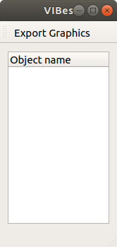
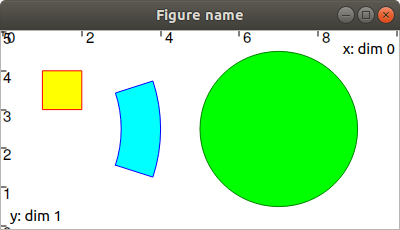
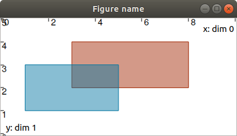

.. _sec-manual-vibes:

****************
The VIBes viewer
****************

The graphical classes provided in Tubex are based on `the VIBes viewer <https://enstabretagnerobotics.github.io/VIBES/>`_: a visualization system that aims at providing people working with intervals a way to display results (boxes, pavings), without worrying about GUI programming.
Some methods have been implemented in Tubex in order to extend VIBes' features to tubes purposes.

.. contents::

Installation
------------

For the installation of VIBes, please refer to the installation page of this library: :ref:`sec-installation-graphics`.

Launch VIBes
------------

VIBes is an independent program that has to be launched together with the executable of your project.

The first thing to do is launch VIBes. This will make appear the VIBes window, ready to display things (keep it open!):

  

| This window corresponds to the graphical **server**.
| The Python or C++ program you are developing is a **client**, able to communicate with the server from the API detailed in the following sections.

To start and end the communications with the server, one should include:

.. tabs::

  .. code-tab:: py

    beginDrawing()

    # ...

    endDrawing()

  .. code-tab:: c++

    vibes::beginDrawing();

    // ...

    vibes::endDrawing();

The VIBes API
-------------

The VIBes API is available for both C++ and Python:

* `C++ API <https://enstabretagnerobotics.github.io/VIBES/doxygen/cxx/>`_
* `Python API <https://enstabretagnerobotics.github.io/VIBES/sphinx/html/index.html>`_

Tubex provides custom classes to extend VIBes' features to appropriate drawings of tubes:

* ``VIBesFig``: parent class
* ``VIBesFigTube``: view for 1d tubes and/or trajectories
* ``VIBesFigTubeVector``: view for n-d tubes and/or trajectories
* ``VIBesFigMap``: 2d view of projected tubes and trajectories
* ``VIBesFigPaving``: 2d view of projected pavings

The ``VIBesFig`` class
----------------------

The interface of this class comes from the features of VIBes. However, the original VIBes API cannot be directly used on the ``VIBesFig`` objects.
Instead, one should use the following features:

.. rubric:: Create a ``VIBesFig`` object

The following:

.. tabs::

  .. code-tab:: py

    fig = VIBesFig("Figure name")
    fig.set_properties(100, 100, 400, 200)
    fig.axis_limits(IntervalVector([[0,10],[0,5]]))

  .. code-tab:: c++

    VIBesFig fig("Figure name");
    fig.set_properties(100, 100, 400, 200);
    fig.axis_limits(IntervalVector({{0.,10.},{0.,5.}}));

creates a figure with:

* name: *Figure name*
* size: :math:`400\times200`
* position of upper-left corner: :math:`(100,100)`
* view area sets to: :math:`[0,10]\times[0,5]`

.. rubric:: Drawing boxes

.. tabs::
    
  .. code-tab:: py

    x = IntervalVector([[1,2],[3,4]])
    fig.draw_box(x, "red[yellow]")

  .. code-tab:: c++

    IntervalVector x({{1,2},{3,4}});
    fig.draw_box(x, "red[yellow]");

.. rubric:: Drawing circles

.. tabs::
    
  .. code-tab:: py

    fig.draw_circle(7, 2.5, 2, "darkGreen[green]")

  .. code-tab:: c++

    fig.draw_circle(7, 2.5, 2., "darkGreen[green]");

.. rubric:: Drawing pies

.. tabs::
    
  .. code-tab:: py

    r = Interval(3,4)
    theta = Interval(-math.pi/10,math.pi/10)
    fig.draw_pie(0, 2.5, r, theta, "blue[cyan]")

  .. code-tab:: c++

    Interval r(3.,4.);
    Interval theta(-M_PI/10.,M_PI/10.);
    fig.draw_pie(0., 2.5, r, theta, "blue[cyan]");

The above commands produce:

.. vibes::beginDrawing();
.. 
.. VIBesFig fig("Figure name");
.. fig.set_properties(100, 100, 400, 200);
.. fig.axis_limits(IntervalVector({{0.,10.},{0.,5.}}));
.. 
.. IntervalVector x({{1,2},{3,4}});
.. fig.draw_box(x, "red[yellow]");
.. 
.. Interval r(3.,4.);
.. Interval theta(-M_PI/10.,M_PI/10.);
.. fig.draw_pie(0., 2.5, r, theta, "blue[cyan]");
.. 
.. fig.draw_circle(7, 2.5, 2., "darkGreen[green]");
..
.. fig.draw_box(IntervalVector({{3,8},{2,4}}), "#A02400[#A0240077]");
.. fig.draw_box(IntervalVector({{1,5},{1,3}}), "#0074A0[#0074A077]");
.. 
.. vibes::endDrawing();

Color conventions
-----------------

The color code use in VIBes is ``edge_color[fill_color]``.

The ``edge_color`` and ``fill_color`` may refer to predefined colors or to custom shades.
The default values are black edges and no filling.

Predefined colors are:

.. figure:: img/qt-colors.png

For custom colors, the HTML color code can be used. In the following example, the two last digits (``77``) add a *alpha* component to the colors for transparency. These last values may be chosen between ``00`` (transparency) and ``FF`` (opacity).

.. tabs::
      
  .. code-tab:: py

    fig.draw_box(IntervalVector([[3,8],[2,4]]), "#A02400[#A0240077]")
    fig.draw_box(IntervalVector([[1,5],[1,3]]), "#0074A0[#0074A077]")

  .. code-tab:: c++

    fig.draw_box(IntervalVector({{3,8},{2,4}}), "#A02400[#A0240077]");
    fig.draw_box(IntervalVector({{1,5},{1,3}}), "#0074A0[#0074A077]");

