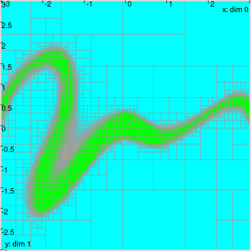
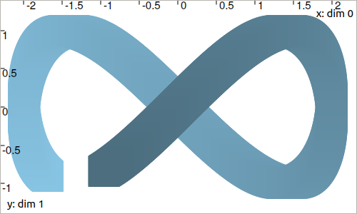
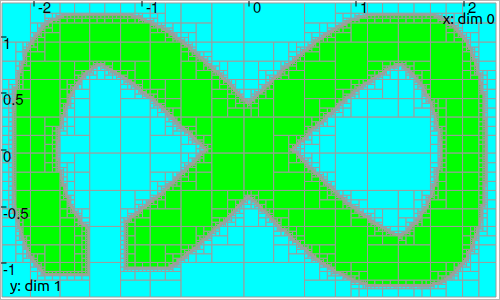

.. _sec-manual-pavings:

.. warning::
  
  This part of the documentation is deprecated. Several changes are currently performed on the library.
  A new stable version of Tubex will be released in the coming weeks.

*******
Pavings
*******

.. contents::

VIBesFigPaving
--------------

todo

.. tabs::

  .. code-tab:: py

    # todo

  .. code-tab:: c++

    VIBesFigPaving fig_pav("Paving", &p);
    fig_pav.show();

.. rubric:: Color maps

todo

SIVIAPaving
-----------

.. tabs::

  .. code-tab:: py

    # todo

  .. code-tab:: c++

    SIVIAPaving p({{-3.,3.},{-3.,3.}});
    p.compute(ibex::Function("x", "y", "x*cos(x-y)*sin(x)+y"),
              {{-0.35,0.35}},
              0.01);

TubePaving
----------

For some applications we are looking for a paving representation of a ``TubeVector``, with spatial projection instead of keeping temporal information.
The class ``TubePaving`` performs this projection. For instance:

.. tabs::

  .. code-tab:: py

    # todo

  .. code-tab:: c++

    // Creation of a tube
    Interval tdomain(-0.5, 2.*M_PI-1.);
    TubeVector x(tdomain, 0.01, Function("(2*sin(t)+[-0.2,0.2];sin(2*t)+[-0.2,0.2])"));

    // Creation of its projection as a paving
    IntervalVector initial_box(x.codomain());
    TubePaving pav(initial_box.inflate(0.1));
    pav.compute(0.01, x); // parameters: precision, tube

..  Interval tdomain(-0.5, 2.*M_PI-1.);
..  TubeVector x(tdomain, 0.01, Function("(2*sin(t)+[-0.2,0.2];sin(2*t)+[-0.2,0.2])"));
..
..  IntervalVector initial_box(x.codomain());
..  TubePaving pav(initial_box.inflate(0.1));
..  pav.compute(0.01, x);
..
..  vibes::beginDrawing();
..
..    VIBesFigMap fig_map("Map");
..    fig_map.set_properties(50, 50, 500, 300);
..    fig_map.add_tube(&x, "x", 0, 1);
..    fig_map.smooth_tube_drawing(true);
..    fig_map.show(0.);
..
..    VIBesFigPaving fig_pav("Tube paving", &pav);
..    fig_pav.set_properties(50, 400, 500, 300);
..    fig_pav.axis_limits(paving_box);
..    fig_pav.show();
..
..  vibes::endDrawing();