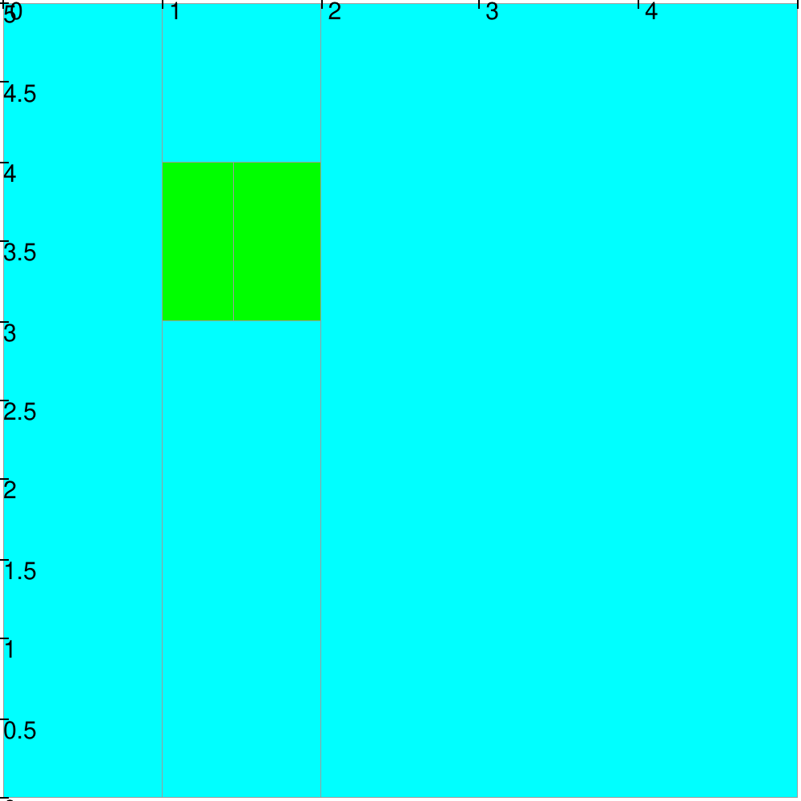

.. _sec-manual-sepbox:

********************************************************************
SepBox: :math:`\mathcal{S}_{box}`
********************************************************************

The :math:`\mathcal{S}_{box}` is separating inner and outer parts of a box around a support box of :math:`\mathbb{R}^n`.

.. contents::

Definition
----------

.. important::
    
    *definition incoming*

  .. tabs::

    .. code-tab:: py

      s = SepBox(b)
      s.separate(x_in, x_out)

    .. code-tab:: c++
      
      SepBox s(b);
      s.separate(x_in, x_out);

.. rubric:: Optimality

This separator is optimal as it is based on other separators optimality.

Example
-------

Let consider a support box :math:`[\mathbf{b}] = [1, 2]\times[3, 4]` for our separator.

.. tabs::

  .. code-tab:: py

    # Build the separator
    b = IntervalVector([[1, 2], [3, 4]])
    sep_box = SepBox(b)

    # Setup the initial box
    box = IntervalVector(2, [0, 5])

    # Graphics
    vibes.beginDrawing()
    vibes.newFigure("Set inversion")
    vibes.setFigureProperties({"x":100, "y":100, "width":500, "height":500})
    SIVIA(box, sep_box, 0.1, fig_name="Set inversion")
    vibes.endDrawing()

  .. code-tab:: c++

    // Build the separator
    IntervalVector b{{1, 2}, {3, 4}};
    SepBox sep_box(b);

    // Setup the initial box
    IntervalVector box(2, {0, 5});

    // Graphics
    vibes::beginDrawing();
    vibes::newFigure("Set inversion");
    vibes::setFigureProperties(vibesParams("x",100, "y",100, "width",500, "height",500));
    SIVIA(box, sep_box, 0.1, "Set inversion");
    vibes::endDrawing();

  SIVIA on a SepBox with a support box :math:`[\mathbf{b}] = [1, 2]\times[3, 4]`.