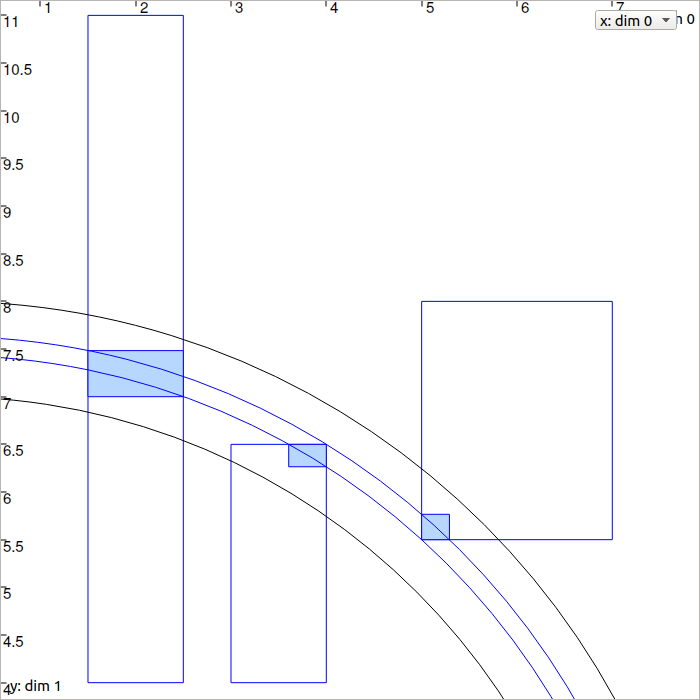

.. _sec-tuto-01:

Getting started with intervals and contractors
==============================================

Now that Tubex has been installed on your computer, we will get used to intervals, constraints and networks of contractors.
This will allow use to perform the state estimaton of a static robot between some landmarks in the next lesson.

.. contents:: Content of this lesson

Start a new project
-------------------

Start a new project as explained in :ref:`sec-start-py-project` or :ref:`sec-start-cpp-project` and verify that it is displaying a tube in a graphical view.

Interval arithmetic, :math:`[x]`
--------------------------------

Tubex is using C++/Python objects to represent intervals and boxes:

* ``Interval x(double lb, double ub)`` represents for instance the interval :math:`[x]` defined with its lower and upper bounds :math:`[x^{-},x^{+}]`. There exists predefined values for intervals. Here are some examples of ``Interval`` objects:

  .. tabs::

    .. code-tab:: c++

      Interval x;                                 // [-∞,∞] (default value)
      Interval x(0, 10);                          // [0,10]
      Interval x(1, POS_INFINITY);                // [1,∞]
      Interval x = Interval::all_reals();         // [-∞,∞]
      Interval x = Interval::neg_reals();         // [-∞,0]
      Interval x = Interval::empty_set();         // ∅
      // ...

    
    .. code-tab:: py

      x = Interval()                              # [-∞,∞] (default value)
      x = Interval(0, 10)                         # [0,10]
      x = Interval(1, oo)                         # [1,∞]
      x = Interval.ALL_REALS                      # [-∞,∞]
      x = Interval.NEG_REALS                      # [-∞,0]
      x = Interval.EMPTY_SET                      # ∅
      # ...

* | ``IntervalVector x(int n)`` is used for :math:`n`-d vectors of intervals, also called *boxes*.
  | For instance:

  .. tabs::

    .. code-tab:: c++

      IntervalVector x(2, Interval(-1,3));        // creates [x]=[-1,3]×[-1,3]=[-1,3]^2
      IntervalVector y{{3,4},{4,6}};              // creates [y]= [3,4]×[4,6]
      IntervalVector z(3, Interval::pos_reals()); // creates [z]=[0,∞]^3
      IntervalVector w(y);                        // creates a copy: [w]=[y]

      Vector v(3, 0.42);                          // one vector (0.42;0.42;0.42)
      IntervalVector iv(v);                       // creates one box that wraps v:
                                                  //   [0.42,0.42]×[0.42,0.42]×[0.42,0.42]
    
    .. code-tab:: py

      x = IntervalVector(2, [-1,3])               # creates [x]=[-1,3]×[-1,3]=[-1,3]^2
      y = IntervalVector([[3,4],[4,6]])           # creates [y]= [3,4]×[4,6]
      z = IntervalVector(3, Interval.POS_REALS)   # creates [z]=[0,∞]^3
      w = IntervalVector(y)                       # creates a copy: [w]=[y]

      v = (0.42,0.42,0.42)                        # one vector (0.42;0.42;0.42)
      iv = IntervalVector(v)                      # creates one box that wraps v:
                                                  #   [0.42,0.42]×[0.42,0.42]×[0.42,0.42]

  One can access vector components as we do for ``Vector`` objects:

  .. tabs::

    .. code-tab:: c++

      x[1] = Interval(0,10);                      // updates to [x]=[-1,3]×[0,10]
    
    .. code-tab:: py

      x[1] = Interval(0,10)                       # updates to [x]=[-1,3]×[0,10]

.. admonition:: Exercise

  1. In your new project, compute the following simple operations on intervals:
  
  * :math:`[-2,4]\cdot[1,3]`
  * :math:`[-2,4]\sqcup[6,7]`
  * :math:`\max([2,7],[1,9])`
  * :math:`\max(\varnothing,[1,2])`
  * :math:`[-1,3]/[0,\infty]`
  * :math:`([1,2]\cdot[-1,3]) + \max([1,3]\cap[6,7],[1,2])`

  Note that :math:`\sqcup` is the hull union, *i.e.*, :math:`[x]\sqcup[y] = [[x]\cup[y]]`.
  

  2. These simple operations on sets can be extended to elementary functions such as :math:`\cos`, :math:`\exp`, :math:`\tan`. Create a 2d box :math:`[\mathbf{y}]=[0,\pi]\times[-\pi/6,\pi/6]` and print the result of :math:`|[\mathbf{y}]|` with ``abs()``.

Functions, :math:`f([x])`
-------------------------

Custom functions can be defined and used on sets. For instance, to compute:

.. math::

  f(x)=x^2+2x-\exp(x),

a `Function` object can be created and evaluated over the set :math:`[x]`:

  .. tabs::

    .. code-tab:: c++

      Interval x(-2,2)
      Function f("x", "x^2+2*x-exp(x)")
      Interval y = f.eval(x)
    
    .. code-tab:: py

      x = Interval(-2,2)
      f = Function("x", "x^2+2*x-exp(x)")
      y = f.eval(x)

The first arguments of the function (only one in the above example) are its input variables. The last argument is the expression of the output. The result is the set of images of all defined inputs through the function: :math:`[f]([x])=[\{f(x)\mid x\in[x]\}]`.

.. admonition:: Exercise

  3. For our robotic applications, we often need to define the distance function :math:`g`:
  
  .. math::

    g(\mathbf{x},\mathbf{b})=\sqrt{\displaystyle(x_1-b_1)^2+(x_2-b_2)^2},

  where :math:`\mathbf{x}\in\mathbb{R}^2` would represent for instance the 2d position of a robot, and :math:`\mathbf{b}\in\mathbb{R}^2` the 2d location of some landmark. Create :math:`g` and compute the distance between the boxes :math:`[\mathbf{a}]=[0,0]^2` and :math:`[\mathbf{b}]=[3,4]^2`. Note that in the library, the ``eval()`` of functions only takes one argument: we have to concatenate the boxes :math:`[\mathbf{a}]` and :math:`[\mathbf{b}]` in one 4d interval-vector :math:`[\mathbf{c}]` and then compute :math:`g([\mathbf{c}])`.

Graphics
--------

The graphical tool VIBes has been created to Visualize Intervals and BoxES. It is compatible with simple objects such as ``Interval`` and ``IntervalVector``. Its features have been extended in the Tubex library with objects such as ``VIBesFigMap``.

.. admonition:: Exercise

  4. Create a view with:

    .. tabs::

      .. code-tab:: c++

        vibes::beginDrawing();
        VIBesFigMap fig("Map");
        fig.set_properties(50, 50, 400, 400); // position and size
        
        // ... draw objects here
        
        fig.show(); // display all items of the figure
        vibes::endDrawing();
      
      .. code-tab:: py

        beginDrawing()
        fig = VIBesFigMap("Map")
        fig.set_properties(50, 50, 400, 400) # position and size
        
        # ... draw objects here
        
        fig.show() # display all items of the figure
        endDrawing()

  5. Before the ``show()`` method, draw the boxes :math:`[\mathbf{a}]` and :math:`[\mathbf{b}]` with the ``fig.draw_box()`` method. Draw the computed interval range with the ``fig.draw_circle(x, y, rad)`` method. Is the result reliable, according to the sets :math:`[\mathbf{a}]` and :math:`[\mathbf{b}]`?

Contractors, :math:`\mathcal{C}([x])`
-------------------------------------

In the constraint programming approach, the method consists in defining contractors on sets in order to reduce them without losing any feasible solution. In Tubex, the contractors can also be defined with C++ objects. For this lesson, we will use the ``CtcFunction`` class to define a contractor according to a function :math:`f`. Note that the contractors aim at solving constraints in the form :math:`f(\mathbf{x})=0`. This contractor can be instantiated with a reference to the ``Function`` defining the constraint. For instance, the simple constraint :math:`(x+y=a)` is expressed as :math:`f(x,y,a)=x+y-a=0`, and can be implemented as a contractor :math:`\mathcal{C}_+` with:

.. tabs::

  .. code-tab:: c++

    CtcFunction ctc_add(Function("x", "y", "a", "x+y-a"));

  .. code-tab:: py

    ctc_add = CtcFunction(Function("x", "y", "a", "x+y-a"));

.. admonition:: Exercise

  6. Define a contractor :math:`\mathcal{C}_\textrm{dist}` related to the distance constraint between two 2d positions :math:`\mathbf{x}` and $\mathbf{b}`. We will use the distance function previously defined, but in the form :math:`f(\mathbf{x},\mathbf{b},d)=0`.

The contractor is then simply used in a *Contractor Network* (CN) that applies constraints on different variables for solving a problem. For instance, we can use the previously defined :math:`\mathcal{C}_+` as:

.. tabs::

  .. code-tab:: c++

    Interval x(0,1), y(-2,3), a(1,20);
    
    ContractorNetwork cn;
    cn.add(ctc_add, {x, y, a}); // Adding the C+ contractor to the network, 
                                // applied on three domains listed between braces
    cn.contract();
    
    // x=[0, 1], y=[0, 3], a=[1, 4]

  .. code-tab:: py

    x = Interval(0,1)
    y = (-2,3)
    a = (1,20)
    
    cn = ContractorNetwork()
    cn.add(ctc_add, [x, y, a]) # Adding the C+ contractor to the network, 
                               # applied on three domains listed between braces
    cn.contract()
    
    # x=[0, 1], y=[0, 3], a=[1, 4]

.. admonition:: Exercise

  | 7. Define a contractor network with the :math:`\mathcal{C}_\textrm{dist}` object and apply it on some boxes :math:`[\mathbf{b}^i]`.
  | Check the results with :math:`\mathcal{C}_\textrm{dist}([x_1],[x_2],[b^i_1],[b^i_2],[r])` and 
  
  * :math:`[r]=[7,8]`
  * :math:`[\mathbf{x}]=[0,0]^2`
  * :math:`[\mathbf{b}^1]=[1.5,2.5]\times[4,11]`
  * :math:`[\mathbf{b}^2]=[3,4]\times[4,6.5]`
  * :math:`[\mathbf{b}^3]=[5,7]\times[5.5,8]`

  Draw the :math:`[\mathbf{b}^i]` boxes and :math:`[r]` before and after the contractions, in order to assess the contracting effects.

  Tests of :math:`\mathcal{C}_\textrm{dist}`.