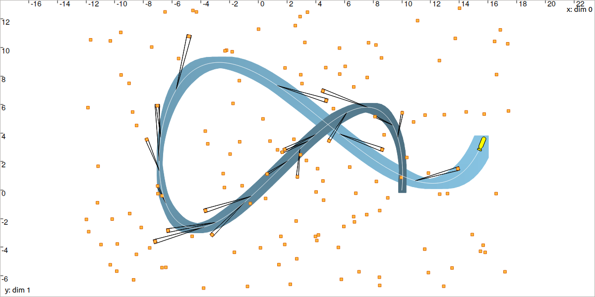

.. _sec-tuto-07:

Lesson G: Dynamic localization with data association
====================================================

In this lesson, we will extend the application of :ref:`sec-tuto-04`, where the robot was perceiving landmarks that all look alike. The data association problem (*i.e.* the identification of the landmarks) was treated in a static context, together with the estimation of the vector :math:`\mathbf{x}`. We will now make the robot move and see that a complex problem, hardly solvable with conventional methods, can be easily dealt with constraint programming and tubes.

.. contents:: Content of this lesson

Related paper
-------------

The application of localization with data association has been presented during the ICRA 2020 conference:

| **Set-membership state estimation by solving data association**
| Simon Rohou, Benoît Desrochers, Luc Jaulin, *ICRA 2020*
| `Download the paper <http://simon-rohou.fr/research/datasso/datasso_paper.pdf?PHPSESSID=88a679b3n54fh04kt3l5lnmvv6>`_

The following video provides an overview of the problem and how to solve it. The last part of the video presents an application on actual data, involving an Autonomous Underwater Vehicle (AUV). We will build the related solver in this lesson.

.. raw:: html

  

      <iframe src="https://www.youtube.com/embed/rkzouwuwo4I" frameborder="0" allowfullscreen style="position: absolute; top: 0; left: 0; width: 100%; height: 100%;"></iframe>
  

Formalism
---------

The equations of the problem are given by:

.. math::

  \left\{ \begin{array}{llc}
  \dot{\mathbf{x}}(t)=\mathbf{f}\big(\mathbf{x}(t),\mathbf{u}(t)\big) & &  \text{(evolution eq.)}\\
  \mathbf{g}\big(\mathbf{x}(t_{i}),\mathbf{y}^{i},\mathbf{m}^{i}\big)=\mathbf{0} & &  \text{(observation eq.)}\\
  \mathbf{m}^{i}\in\mathbb{M} & & \text{(data association)}\\
  \end{array}\right.

The two last equations have been explored in Lessons :ref:`C <sec-tuto-03>` and :ref:`D <sec-tuto-04>`. The first one involves a constraint related to a differential equation, that has been seen in Lesson :ref:`E <sec-tuto-05>`. We have all the necessary tools to make a solver for this complex problem.

Initialization
--------------

For the simulation, we will use the same functions as in :ref:`the previous lesson <sec-tuto-06-formalism>`, but the measurements will not be range-only data.

We recall that :math:`\mathbf{f}` is defined by

.. math::

  \mathbf{f}(\mathbf{x},\mathbf{u})=\left( \begin{array}{c}
    \vartheta\cos(\psi) \\
    \vartheta\sin(\psi) \\
    u_1 \\
    u_2
  \end{array}\right)=\dot{\mathbf{x}}.

Also, the actual (but unknown) state trajectory :math:`\mathbf{x}^*(\cdot)` is expressed by:

.. math::
  
  \mathbf{x}^*(t)=\left( \begin{array}{c}x^*_1\\x^*_2\\\psi^*\\\vartheta^*\end{array}\right)=
  \left( \begin{array}{l}
    10\cos(t)+t \\
    5\sin(2t)+t \\
    \textrm{atan2}\big((10\cos(2t)+1),(-10\sin(t)+1)\big) \\
    \sqrt{(-10\sin(t)+1)^2+(10\cos(2t)+1)^2}
  \end{array}\right)

The heading :math:`x_3(\cdot)` and the speed :math:`x_4(\cdot)` are continuously measured with some uncertainties bounded by :math:`[0.01,0.01]`, as in the previous lesson.

We do not have any knowledge about the initial position of the robot.

The robot evolves in an environment made of 150 landmarks that are all indistinguishable. The measurements to these landmarks consist in range-and-bearing data. The map is known beforehand, as in :ref:`sec-tuto-04`.

.. admonition:: Exercise

  | **G.1.** In a new file, create the ``Trajectory`` variable ``actual_x``, corresponding to the actual but unknown truth.
  | The simulation will run from :math:`t_0=0` to :math:`t_f=6`. We will set ``dt`` to :math:`0.05`.

  **G.2.** To generate random observations, we will use the following code:

  .. tabs::

    .. code-tab:: py

      # Creating random map of landmarks
      nb_landmarks = 150
      map_area = IntervalVector(actual_x.codomain().subvector(0,1)).inflate(2)
      v_map = DataLoader.generate_landmarks_boxes(map_area, nb_landmarks)

      # Generating observations obs=(t,range,bearing) of these landmarks
      max_nb_obs = 20
      visi_range = Interval(0,4) # [0m,75m]
      visi_angle = Interval(-math.pi/4,math.pi/4) # frontal sonar
      v_obs = DataLoader.generate_observations(actual_x, v_map, max_nb_obs, True, visi_range, visi_angle)

    .. code-tab:: c++

      // Creating random map of landmarks
      int nb_landmarks = 150;
      IntervalVector map_area(actual_x.codomain().subvector(0,1));
      map_area.inflate(2);
      vector<IntervalVector> v_map =
        DataLoader::generate_landmarks_boxes(map_area, nb_landmarks);

      // Generating observations obs=(t,range,bearing) of these landmarks
      int max_nb_obs = 20;
      Interval visi_range(0,4); // [0m,75m]
      Interval visi_angle(-M_PI/4,M_PI/4); // frontal sonar
      vector<IntervalVector> v_obs =
        DataLoader::generate_observations(actual_x, v_map, max_nb_obs,
                                          true, visi_range, visi_angle);

  | **G.3.** The variable ``v_obs`` contains the measurement boxes. Each measurement box has three dimensions: time :math:`t`, range :math:`y_1` and bearing :math:`y_2`. In the above code, these values are intervals with no uncertainty.
  | Inflate these intervals in order to ensure that the actual values :math:`\mathbf{y}^*` are bounded by:

  .. math::

    y_1^*\in y_1+[-0.1,0.1]\\
    y_2^*\in y_2+[-0.04,0.04]

  | **G.4.** Display the landmarks, the range-and-bearing measurements and the actual trajectory in a ``VIBesFigMap`` view. You can use the following function for displaying all the range-and-bearing observations along :math:`\mathbf{x}^*(\cdot)`:

  .. tabs::

    .. code-tab:: py

      fig_map.add_observations(v_obs, actual_x) # drawing obs
      for b in v_map:
        fig_map.add_beacon(b.inflate(0.1)) # drawing beacons

    .. code-tab:: c++

      fig_map.add_observations(v_obs, &actual_x); // drawing obs
      for(const auto& b : v_map)
        fig_map.add_beacon(b.mid(), 0.1); // drawing beacons

  You should obtain a result similar to this:

  .. figure:: img/datasso_obs.png

    Black pies depict the range-and-bearing measurements with uncertainties. Note that on this figure, landmarks boxes have been inflated for display purposes.

At this point of the lesson, the robot perceives some of the 150 landmarks. It is not able to know which landmarks have been seen, and it has no knowledge about its own trajectory or its initial position.

Decomposition
-------------

.. admonition:: Exercise

  **G.5.** In :ref:`Question <sec-tuto-06-decomposition>` **F.3**, we wrote a decomposition of the dynamic range-only problem into elementary constraints:

  - :math:`\mathbf{v}(\cdot)=\mathbf{f}\big(\mathbf{x}(\cdot),\mathbf{u}(\cdot)\big)`, where :math:`\mathbf{v}(\cdot)` is an intermediate trajectory variable
  - :math:`\dot{\mathbf{x}}(\cdot)=\mathbf{v}(\cdot)`
  - :math:`\mathbf{p}_i=\mathbf{x}(t_i)`, where :math:`\mathbf{p}_i` is an intermediate 2d vector variable
  - :math:`g(\mathbf{p}_i,\mathbf{m}_i,y_i)=0`, where function :math:`g` is the distance constraint

  Update this decomposition to fit with the current problem. The difference now is that we are dealing with range-and-bearing measurements :math:`\mathbf{y}_i` (two dimensions), as in :ref:`Lesson C <sec-tuto-03>`. You may also have a look at :download:`the solution <../03-static-rangebearing/src/solution_c1.pdf>` of Question **C.1**.

Resolution
----------

.. admonition:: Exercise

  **G.6.** Define the initial domains of the variables involved in the problem. Some of the domains are already set from the measurements :math:`[\mathbf{y}]`. Intermediate variables can be initialized as infinite sets.

  **G.7.** Create the contractors of the problem. Some of them are already defined and instantiated in the catalog of contractors of the library:

    * the :math:`\mathcal{C}_{\textrm{polar}}` contractor (:ref:`see more <sec-manual-ctcpolar>`)
    * the :math:`\mathcal{C}_{\textrm{constell}}` contractor (:ref:`see more <sec-manual-ctcconstell>`)
    * the :math:`\mathcal{C}_{\frac{d}{dt}}` contractor (:ref:`see more <sec-manual-ctcderiv>`)
    * the :math:`\mathcal{C}_{\textrm{eval}}` contractor (:ref:`see more <sec-manual-ctceval>`)

  You may also use the class ``CtcFunction`` to deal with the constraint involving :math:`\mathbf{f}` (:ref:`see more <sec-manual-ctcfunction>`).

  **G.8.** Build a new Contractor Network for solving the problem.

.. tip::

  The ``cn.contract()`` method runs the propagation of the contractions. You can set the optional boolean argument to *true* in order to activate the *verbose* mode:

  .. tabs::

    .. code-tab:: py

      cn.contract(True)

    .. code-tab:: cpp

      cn.contract(true);

  This will display information related to the number of contractors and domains involved in the Contractor Network, as well as the computation time of the resolution.
  In this application, we can obtain the following display:

  .. code:: bash

    Contractor network has 1683 contractors and 1573 domains
    Computing, 1683 contractors currently in stack

      computation time: 6.40176s

  The high number of domains and contractors is due to some automatic and hidden decompositions performed by the CN itself. We recall that tubes are implemented as sets of slices; in our case, because :math:`\delta` = ``dt`` = 0.05, the tubes are made of :math:`6/0.05=120` slices. Some constraints defined on tubes can be broken down to the slice level, which allows accurate propagations. This is automatically done by the library.

You should obtain a result similar to:

  
  Localization by solving data association: the state trajectory :math:`\mathbf{x}(\cdot)` (in white) has been estimated (in blue) together with the identification of the perceived landmarks.

.. tip::

  As we said, a tube is implemented as a list of slices. Drawing a tube in the ``VIBesFigMap`` consists in displaying the projection of its slices. This leads to boxes drawn with some overlapping. When the sampling :math:`\delta` of the tube is light (when it is made of few slices), then we obtain a jagged result. The following code allows a nicer result, with a polygonal drawing between the slices:

  .. tabs::

    .. code-tab:: py

      fig_map.smooth_tube_drawing(True)

    .. code-tab:: cpp

      fig_map.smooth_tube_drawing(true);

  The following animation highlights this feature:

  .. figure:: img/smoothing.gif

.. rubric:: Why is this problem of localization and data association difficult?

#. We do not know the **initial condition** of the system. Contrary to other approaches, this solver made of contractors does not require some initial vector :math:`\mathbf{x}_0` to start the estimation. Information is taken into account from anytime in :math:`[t_0,t_f]`.

#. The constraints are heterogeneous: some of them are said **continuous** (they act on continuous domains of values, for instance intervals). Other are **discrete** (for instance, the identity of landmarks, estimated among a discrete set of :math:`n` possible values). And finally, some constraints come from **differential equations** (for instance for depicting the robot evolution). In this solver, we show that any kind of constraint can be combined, without going into a complex resolution algorithm.

#. We do **not have to linearize**, and thus there is no approximation made here. This means that the equations are directly set in the solver, without transformation. Furthermore, the results are **reliable**: we can guarantee that the actual trajectory is inside the tube :math:`[\mathbf{x}](\cdot)`.

Now, we will end this tutorial with a last application: a range-only SLAM problem. In this example, the position of the landmarks will be estimated together with the localization of the robot. We will finally see how this can be processed for real-time applications.