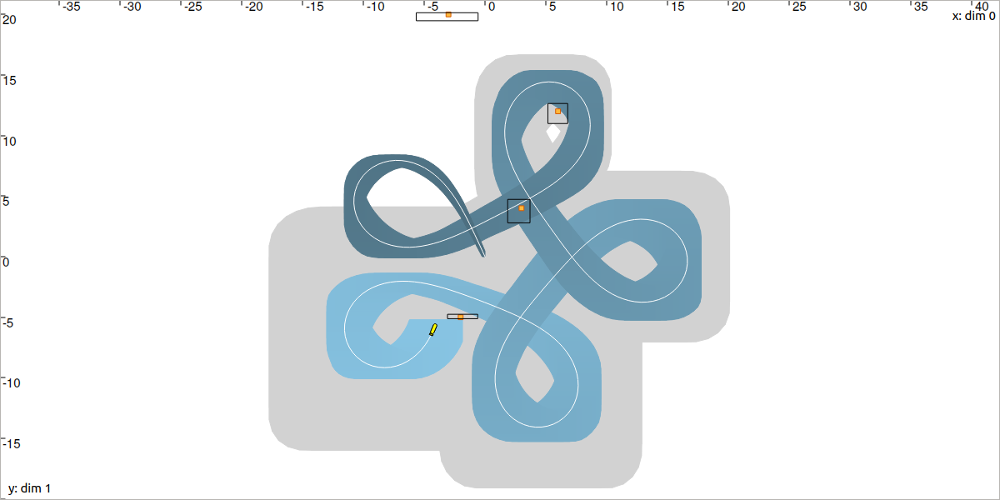
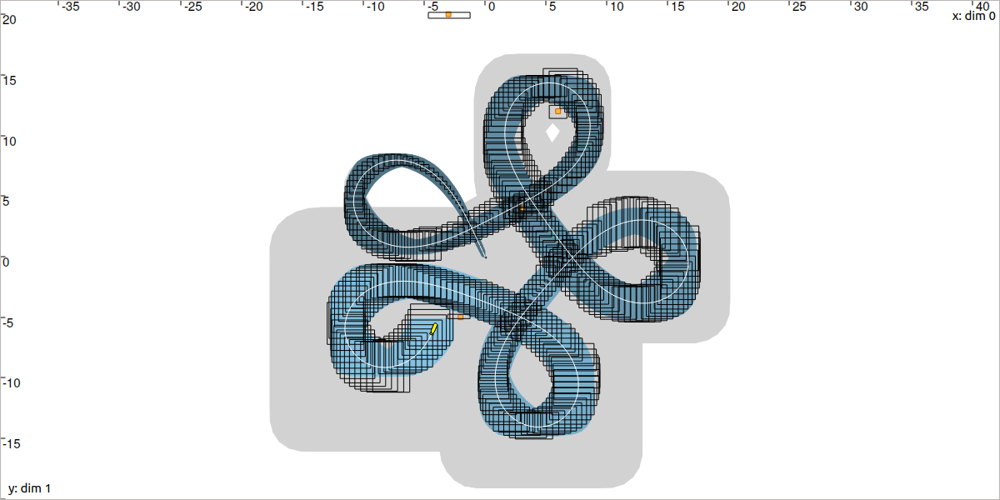

.. _sec-tuto-08:

Lesson H: Range-only SLAM
=========================

This lesson is a summary of all the lessons of this tutorial. We will apply the concepts of constraints and interval analysis on a concrete Simultaneous Localization and Mapping (SLAM) problem, and see how an online SLAM can be solved.

.. contents:: Content of this lesson

.. tip::

  This exercise comes from IAMOOC: another MOOC related to Interval Analysis with applications to parameter estimation and robot localization. It provides complementary concepts and may be of interest to you. https://www.ensta-bretagne.fr/jaulin/iamooc.html

  This lesson is an adaptation of the Exercise 11 of IAMOOC. The difference is that we will now consider a continuous-time state equation.

Robot motion
------------

Consider a robot moving in an unknown environment and described by the state :math:`\mathbf{x}=(x_1,x_2,x_3)^\intercal`, with :math:`x_1,x_2` its 2d position and :math:`x_3` its heading. The evolution of :math:`\mathbf{x}` over time is represented by the trajectory :math:`\mathbf{x}(\cdot):[t_0,t_f]\rightarrow\mathbb{R}^3`, with :math:`t_0=0` and :math:`t_f=15`.

The motion of the robot is described by the state equation :math:`\dot{\mathbf{x}}=\mathbf{f}(\mathbf{x},u)` with:

.. math::

  \mathbf{f}(\mathbf{x},u)=\left( \begin{array}{c}
    10\cos(x_3) \\
    10\sin(x_3) \\
    u + n_u
  \end{array}\right),

| where :math:`u` is the desired rotational speed (input of the system) and :math:`n_u` is a noise.
| The desired input :math:`u(t)` is chosen as:

.. math::

  u(t) = 3\sin^2(t)+\frac{t}{100}.

| Contrary to the previous lesson, we assume that we know the initial state :math:`\mathbf{x}_0=(0,0,2)^\intercal`. This is common in SLAM problems.
| We also assume that the heading is continuously measured from :math:`t_0` to :math:`t_f` (for instance by using a compass) with a small error:

.. math::

  x_3^m(t) = x_3^*(t) + n_{x_3}(t),

where :math:`x_3^*(t)` represents the actual but unknown heading of the robot.

At any time, we consider that the errors :math:`n_u(t)` and :math:`n_{x_3}(t)` are bounded by :math:`[-0.03,0.03]`.

Simulating the truth :math:`\mathbf{x}^*(\cdot)`
------------------------------------------------

The term *simulation* often refers to the integration of one dynamical system from a known initial condition. The system we are dealing with is :math:`\dot{\mathbf{x}}=\mathbf{f}(\mathbf{x},u)` and its initial condition is :math:`\mathbf{x}_0`. We will first compute the trajectory :math:`\mathbf{x}^*(\cdot)` solution of this system, without uncertainties, and call it the *truth*.

.. important::

  Of course, the computation of :math:`\mathbf{x}^*(\cdot)` will not be reliable: the result will depend on the integration timestep and the :math:`\delta` parameter used to represent the trajectory. We will only use the result for visualization. 

.. admonition:: Exercise

  **H.1.** Simulate the system. We will use :math:`\delta` = ``dt`` = :math:`0.05` for implementing the trajectories.

  The simulation can be done with a classical temporal loop and an Euler integration method. With Codac, we can also compute the system at the trajectory level (applying operators on entire trajectories), without temporal loop. For this, we will define the input of the system as a trajectory, and apply operations on it (from function :math:`\mathbf{f}`) and integrations.

  The following code computes :math:`\mathbf{x}^*(\cdot)`:

  .. tabs::

    .. code-tab:: py

      # ...

      # Initial pose x0=(0,0,2)
      x0 = (0,0,2)

      # System input
      u = Trajectory(tdomain, TFunction("3*(sin(t)^2)+t/100"), dt)

      # Actual trajectories (state + derivative)
      v_truth = TrajectoryVector(3)
      x_truth = TrajectoryVector(3)
      v_truth[2] = u
      x_truth[2] = v_truth[2].primitive() + x0[2]
      v_truth[0] = 10*cos(x_truth[2])
      v_truth[1] = 10*sin(x_truth[2])
      x_truth[0] = v_truth[0].primitive() + x0[0]
      x_truth[1] = v_truth[1].primitive() + x0[1]

    .. code-tab:: cpp

      // ...

      // Initial pose x0=(0,0,2)
      Vector x0({0,0,2});

      // System input
      Trajectory u(tdomain, TFunction("3*(sin(t)^2)+t/100"), dt);

      // Actual trajectories (state + derivative)
      TrajectoryVector v_truth(3);
      TrajectoryVector x_truth(3);
      v_truth[2] = u;
      x_truth[2] = v_truth[2].primitive() + x0[2];
      v_truth[0] = 10*cos(x_truth[2]);
      v_truth[1] = 10*sin(x_truth[2]);
      x_truth[0] = v_truth[0].primitive() + x0[0];
      x_truth[1] = v_truth[1].primitive() + x0[1];

  | Create a new project with this simulation.
  | Add a noise on :math:`u(\cdot)` as mentioned in the presentation of the problem, and display the result.

Deadreckoning
-------------

We will now enclose the trajectory :math:`\mathbf{x}^*(\cdot)` in a tube. For the moment, we do not take into account measurements from the environment. This is what we call *deadreckoning*: we estimate the positions of the robot only from proprioceptive data, coming from the input :math:`u(\cdot)` and heading measurements.

.. admonition:: Exercise

  **H.2.** As we did for the computation of :math:`\mathbf{x}^*(\cdot)`, estimate the feasible state trajectories in a tube, according to the uncertainties on :math:`u(\cdot)` and :math:`x_3(\cdot)`. We will assume that the initial state :math:`\mathbf{x}_0` is well known.

  The functions ``cos``, ``primitive()``, *etc*., can be used on tubes as we did for ``Trajectory`` objects. This will **propagate the uncertainties** during the computations.

  We will also use :math:`\delta` = ``dt`` = :math:`0.05` for the implementation of the tubes.

You should obtain a result similar to:

.. figure:: img/slam_deadrecko.png
  
  In a dead-reckoning situation, the drift cannot be avoided. This is revealed by the thickness of the blue tube, very large around :math:`t_f` where the robot is drawn.

Note that if you obtain a tube :math:`[\mathbf{x}](\cdot)` that encloses accurately the actual trajectory :math:`\mathbf{x}^*(\cdot)` without uncertainties, then you did not correctly propagate information from the input tube :math:`[u](\cdot)`.

.. tip::
  
  We could use a Contractor Network for this deadreckoning estimation, but the use of simple operators on tubes is also fine, because we do not have observations or complex constraints to consider. If fact, for deadreckoning, we are dealing with a *causal system* where information propagates in one direction from :math:`u(\cdot)` to :math:`\mathbf{x}(\cdot)`:

  .. figure:: img/causal_chain.png
    :width: 400px

  The use of a CN (or more generally, contractors) is relevant when we do not know how to propagate the information on sets (when the above graphic reveals loops) and when complex constraints have to be treated. This is typically the case when one has to consider observations on the sets, as we do in SLAM.
  

Perceiving landmarks and solving a SLAM
---------------------------------------

The environment is made of 4 landmarks. Their coordinates are given in the following table:

  =========  =============================
  :math:`j`  Landmark :math:`\mathbf{b}_j`
  =========  =============================
  :math:`0`  :math:`(6,12)^\intercal`
  :math:`1`  :math:`(-2,-5)^\intercal`
  :math:`2`  :math:`(-3,20)^\intercal`
  :math:`3`  :math:`(3,4)^\intercal`
  =========  =============================

Each :math:`t=2\delta`, the robot is able to measure the distance to one of these landmarks (taken randomly), with an accuracy of :math:`\pm0.03`. The robot does not know the landmarks coordinates (the M of SLAM is for Mapping), but it knows which landmark :math:`\mathbf{b}_j` is being observed (the landmarks are *identified*). 

We will use a constraint propagation approach to solve the problem. 

.. admonition:: Exercise

  **H.3.** First, define the variables of the problem.

  **H.4.** List the involved constraints and the potential decompositions to perform. This may introduce intermediate variables. Note that all the constraints describing this SLAM have been seen in the previous lessons.

  **H.5.** Define the initial domains of the variables:

  * domains for intermediate variables will be set to infinite sets. 
  * other domains may be initialized from measurements or to infinite sets when nothing is known, as it is the case for the position of the landmarks.

  **H.6.** Using a Contractor Network, improve the localization of the robot while simultaneously estimating the position of the landmarks by enclosing them into boxes.

You should obtain a result similar to:

  The gray tube depicts the deadreckoning result while the blue one is the result of SLAM, with environment observations. The landmarks have been localized in the black boxes.

(optional) Online SLAM
----------------------

These computations were made **offline**, assuming that all the data were collected before running the solver.

We could also use this approach **online** and make the solver run during the evolution of the robot. For this, we will use the ``.contract_during(ctc_dt)`` method instead of ``.contract()``. This way, we will let the solver contract as much as possible the domains **during a given amount of time** ``ctc_dt``. Remaining contractions will be done during the next call to ``.contract_during()``. This allows to spread over time the resolution.

Hence, for real-time SLAM, we can use the following temporal loop:

.. tabs::

  .. code-tab:: py

    import time # used for time.sleep

    dt = 0.05
    iteration_dt = 0.2 # elapsed animation time between each dt
    tdomain = Interval(0,15) # [t0,tf]

    # ...

    # Create tubes defined over [t0,tf]
    # Add already known constraints, such as motion equations

    t = tdomain.lb()
    prev_t_obs = t

    while t < tdomain.ub(): # run the simulation from t0 to tf

      if t-prev_t_obs > 2*dt: # new observation each 2*dt
      
        # Creating new observation to a random landmark
        ...

        # Adding related observation constraints to the network
        ...

        # Updated last iteration time
        prev_t_obs = t

      contraction_dt = cn.contract_during(iteration_dt)
      if iteration_dt>contraction_dt: # pause for the animation
        time.sleep(iteration_dt-contraction_dt) # iteration delay

      # Display the current slice [x](t)
      fig_map.draw_box(x(t).subvector(0,1))

      t+=dt

  .. code-tab:: cpp

    #include <unistd.h> // used for usleep
    // ...

    double dt = 0.05;
    double iteration_dt = 0.2; // elapsed animation time between each dt
    Interval tdomain(0,15); // [t0,tf]

    // ...

    // Create tubes defined over [t0,tf]
    // Add already known constraints, such as motion equations

    double prev_t_obs = tdomain.lb();
    for(double t = tdomain.lb() ; t < tdomain.ub() ; t+=dt)
    {
      if(t - prev_t_obs > 2*dt) // new observation each 2*dt
      {
        // Creating new observation to a random landmark
        ...

        // Adding related observation constraints to the network
        ...

        // Updated last iteration time
        prev_t_obs = t;
      }

      double contraction_dt = cn.contract_during(iteration_dt);
      usleep(max(0.,iteration_dt-contraction_dt)*1e6); // pause for the animation

      // Display the current slice [x](t)
      fig_map.draw_box(x(max(0.,ibex::previous_float(t))).subvector(0,1));
    }

.. admonition:: Exercise

  **H.7. (optional)** Transform the code of question **H.6** to make it work *online* with boxes :math:`[\mathbf{x}]` contracted in realtime.

You should obtain an animation that looks like this:

  One black box depicts the position set of the robot at the time of the simulation. Old boxes are kept on display. This figure depicts the animation at time :math:`t=t_f`.

On the above figure, we can notice that the contracted boxes :math:`[\mathbf{x}]` obtained during the online SLAM are sometimes larger than the blue tube computed offline as post-processing. The reasons are:

* at :math:`t`, the CN online may not have dealt with all the contractors: **some contractions remain to be done**. They will be processed afterwards, and the current box :math:`[\mathbf{x}](t)` does not enclose optimally the set of feasible positions;
* at :math:`t`, the online SLAM does not take benefit from future measurements, while the offline SLAM was able to propagate all information forward and **backward in time**.

End of the tutorial
-------------------

| The tutorial ends here!
| We do hope it provided you an interesting overview of what Constraint Programming methods can bring to mobile robotics. **We are looking forward your feedbacks!**

.. You can submit your answers for the questions of Lessons G and H to the `MOOC platform <https://mooc.ensta-bretagne.fr/course/view.php?id=7>`_ so that we can evaluate them for the diploma.