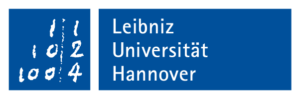

.. _sec-tuto-icra-2023:

#############################################
Tutorial: constraint programming for robotics
#############################################

.. |logo_contredo| image:: img/logos/logo_contredo.png
   :height: 50px
   :target: https://anr.fr/Project-ANR-16-CE33-0024
.. |logo_dga| image:: img/logos/logo_dga.png
   :height: 60px
   :target: https://www.defense.gouv.fr/dga
.. |logo_ensta| image:: img/logos/logo_ensta.png
   :height: 50px
   :target: https://www.ensta-bretagne.fr/fr

.. |logo_rts| image:: img/logos/logo_rts.png
   :height: 50px
   :target: https://www.rts.uni-hannover.de/
.. |logo_gdrmacs| image:: img/logos/logo_gdrmacs.png
   :height: 60px
   :target: https://gdr-macs.cnrs.fr/
.. |logo_gdrrob| image:: img/logos/logo_gdrrob.png
   :height: 60px
   :target: https://www.gdr-robotique.org/
.. |logo_intcomp| image:: img/logos/logo_intcomp.gif
   :height: 40px
   :target: https://interval.louisiana.edu/reliable-computing-journal/
.. |logo_labsticc| image:: img/logos/logo_labsticc.png
   :height: 50px
   :target: https://www.labsticc.fr/en/index/

.. |logo_youtube| image:: img/logos/logo_youtube.png
   :height: 25px
.. |logo_youtube_small| image:: img/logos/logo_youtube.png
   :height: 15px

.. .. centered:: Simon Rohou, Aaronkumar Ehambram
.. .. centered:: **May 29 2023 / June 2 2023**

.. sidebar:: International tutorial

  .. Figure:: img/logos/logo_icra_2023.png
    :align: center

  This tutorial is proposed in the `ICRA 2023 Conference <https://www.icra2023.org>`_ held in London.

.. About the tutorial
.. ------------------

This tutorial is about Constraint Programming (CP), Interval Analysis (IA) and their applications to mobile robotics.

| **Interval analysis** yields methods to compute intervals in place of real numbers, enclosing uncertainties in the mean time.
| **Constraint Programming** aims at solving a complex problem by defining it in terms of constraints coming from the equations or the measurements.
| Both concepts match perfectly for a large number of applications including Robotics, which is the subject of this tutorial.

.. proposed in the `IROS 2020 <https://www.iros2020.org/3program/Tutorials.html>`_ conference.

.. contents:: Contents of this page

.. Presentation of the tutorial for the IROS conference
.. ----------------------------------------------------
.. 
.. Raphael Voges (co-organizer) provides an overview of the tutorial in the following video:
.. 
.. .. raw:: html
.. 
..   

..       <iframe src="https://www.youtube.com/embed/1UoIQMJSHvU" frameborder="0" allowfullscreen style="position: absolute; top: 0; left: 0; width: 100%; height: 100%;"></iframe>
  

.. 
.. **Welcome message:**
.. 
.. .. tip::
.. 
..   Dear All,
.. 
..   The tutorial has started and we are pleased to see so many of you show interest in constraint programming (CP) and intervals for robotics!
.. 
..   Because the `IROS conference <https://www.iros2020.org/>`_ became virtual this year, we had to think about some online way to provide the content of the tutorial. We prefer to let you handle the concepts of CP and intervals through programming applications. As a consequence, we provide the full explanations on webpages with equations, programming examples and images, instead of videos. We hope that this format is the best to let you understand these concepts and how to use libraries to apply them, at your own speed.
.. 
..   The tutorial is split into 4 weeks and each week involves 2 lessons.
..   The 8 lessons consist of several questions that will take you step by step towards a comprehensive application of Simultaneous Localization And Mapping (SLAM).
..   We recommend that you answer the questions in one source file per week (Python or C++) and upload it on the MOOC platform by the end of each week. Each Monday, we will post the corrections of the questions of the previous week, in order to ease your progression.
.. 
..   You may have questions about
.. 
..   * the tutorial
..   * difficulties to follow the lessons
..   * C++/Python issues
..   * or interrogations related to constraint programming, interval analysis or robotic applications
.. 
..   We will be happy to discuss with you about it, and we propose three ways of communication:
.. 
..   * A forum available on the `MOOC platform <https://mooc.ensta-bretagne.fr/course/view.php?id=7>`_. You may find answers to your questions in previous topics
..   * A `Slack workspace <https://codac-tutorial.slack.com>`_ for fast interactive exchanges, do not hesitate to use it!
..   * Eventually, individual conversations with the organizers are possible. In this case, you can contact us by private message and we will schedule a slot for some Skype conversation
.. 
..   We do hope that this tutorial brings you a motivating introduction to intervals coupled with CP for robotics!
.. 
..   Let us start the first week with an introduction to the concepts of intervals and contractors (in :ref:`Lesson A <sec-tuto-01>`). These tools will be applied to a state estimation problem in :ref:`Lesson B <sec-tuto-02>` that requires a robot that is not yet moving to localize itself among three landmarks with range-only measurements. 
.. 
..   Good luck!

Constraint programming?
-----------------------

There are several ways to deal with **state estimation** in mobile robotics. The **constraint programming** approach consists in defining a problem as a set of rules and letting a solver perform the estimation. For mobile robotics, rules are constraints coming from state equations.

Efforts have been done to propose operators and **solvers** to apply these constraints. The goal of this tutorial is to learn how to use them and understand the efficiency of the approach on realistic robotic applications. We will see that some problems that are difficult to solve with conventional methods (Kalman filters, particle approaches) can be easily dealt with by constraint programming. This is for instance the case of poor observation measurements, time uncertainties, delays, or when the initial conditions of the system are not known.

The tutorial will stand on :ref:`the Codac library <home-page>`, that provides tools for computations over sets of reals and trajectories. It has been designed to deal with dynamical systems defined by non-linear differential equations and involving constraints such as trajectory evaluations, time uncertainties or delays. These computations stand on **interval analysis**, a well suited tool that reliably **propagates uncertainties**. 

Requirements
------------

Prerequisite for attending the tutorial are:

* basic knowledge of **Python or C++** (the exercises are available in both languages);
* although the tutorial is about state estimation, you do not need skills in Kalman or particle filters.

| Codac is fully supported on Linux systems (C++ and Python3) and Windows (Python3).
| We are currently working on making Codac available for macOS (any help is welcome!). Meanwhile, we propose :ref:`a Codac-online solution <sec-py-project-online>`: this will allow you to use Codac in Python without having to install the library on your machine.

.. Contact and registration
.. ------------------------
.. 
.. | **For registration, please fill in this questionnaire:**
.. | https://docs.google.com/forms/d/1nuZ6lxMJ8SmoUeDJzVIjiMUdD5PmX7h72v_N9NtvGq4
.. 
.. Once you are registered, the organizers will be able to send you a link to the `Slack workspace of the tutorial <https://codac-tutorial.slack.com>`_ (please note that this is not automatic, we will do our best to send you the link as soon as possible).
.. 
.. The tutorial involves three platforms:
.. 
.. * the `Codac website <http://simon-rohou.fr/research/codac>`_ (here you are!)
.. * the `MOOC platform <https://mooc.ensta-bretagne.fr/course/view.php?id=7>`_ where you can send your work and get the tutorial diploma
.. * the `Slack communication workspace (codac-tutorial.slack.com) <https://codac-tutorial.slack.com>`_ for fast interactive meetings
.. 
.. This tutorial is proposed to the participants of `the IROS conference <https://www.iros2020.org>`_. All the exercises are available on this Codac website. The registration to `the MOOC platform <https://mooc.ensta-bretagne.fr/course/view.php?id=7>`_ is not mandatory, except if you want to share with the organizers your progression and difficulties, and to obtain the diploma.
.. 
.. See `the video for registration on the MOOC platform <https://www.youtube.com/watch?v=E_aj7Mz_LWs>`_.
.. 
.. 
.. Diploma
.. -------
.. 
.. | To get the diploma, you need to send valid exercises to the organizers. A participant who gets a minimum total of 12 points will receive a diploma corresponding to this tutorial. This diploma can be used by students to obtain the corresponding credits for their PhD courses (equivalent to 40 hours of lessons), or to comply with any other requests from their home university.
.. | `Here is an example of the diploma you can obtain <http://simon-rohou.fr/research/codac/public/publipost_tubmooc_2020.pdf>`_.

.. Duration and meeting sessions
.. -----------------------------
.. 
.. The tutorial will be held **from 26th of October**. More information about dates and interactive sessions are coming soon.
.. 
.. Interactive sessions are possible (each Tuesday afternoon, preferably). Just let us know by private message (via `Slack <https://codac-tutorial.slack.com>`_ or the `MOOC platform <https://mooc.ensta-bretagne.fr/course/view.php?id=7>`_) if you need to communicate directly with us (discussions can be made via Slack or Skype, let us know your choice).

.. .. hlist::
..   :columns: 4
.. 
..   * 10th of June
..   * 17th of June
..   * 24th of June
..   * 1rst of July
..
.. **Interactive sessions (Wed. 17, June):** `select your slot with this form <https://docs.google.com/forms/d/e/1FAIpQLSc4n22iSrwlSMpqqiTc86WmJX1spjzcziHVXPRYfsIdyBU4Kg/.. viewform?usp=sf_link>`_

Content of the tutorial
-----------------------

A list of exercises is proposed with realistic robotic applications:

------------------------------------------------------

**Step 0:** (installation)

Before starting the tutorial, you can read some words about the concepts of Constraint Programming and Interval Analysis. This will give you a first glimpse of the philosophy of this tutorial.

.. toctree:: 
  :maxdepth: 1

  /tutorial/00-getting-started/index

To get ready, you need to install the Codac library on your computer.
Please follow the related page of the manual to see how to do it:

.. toctree:: 
  :maxdepth: 1

  /install/01-installation
  [video] For C++, we advice to use the Qt Creator IDE, see how to use it for Codac <https://www.youtube.com/watch?v=ElV6xVVKhSg>

Then, depending on your preference between C++ or Python, you can run some *Hello World!* program to be sure everything is working well so far:

.. toctree:: 
  :maxdepth: 1

  /install/02-start-py-project
  /install/03-start-cpp-project

.. note::
  
  .. Figure:: img/logos/logo_replit.png
    :align: right

  In case you encounter difficulties to install Codac on your computer, an alternative solution is to **try Codac online** with Repl.it. You will find more information on the following page:

  * :ref:`sec-py-project-online`
  * |logo_youtube| See `the video for using Codac online <https://www.youtube.com/watch?v=XTpJk4lIwgw>`_.

------------------------------------------------------

.. _sec-tuto-week1:

**Step 1:**

.. image:: img/tuto_01.png
   :align: right
   :width: 200px

.. * **Lesson A**: Getting started with intervals and contractors
.. * **Lesson B**: Static range-only localization

* :ref:`sec-tuto-01`
* :ref:`sec-tuto-02`

| During this first step, we will install the library and perform the **state estimation** of a static robot between some landmarks. For the moment, we will assume that the robot does not move and is only receiving **range-only data** from the landmarks.
| This will be an introduction to :ref:`intervals <sec-manual-intervals>`, :ref:`constraints <sec-manual-contractors>` and :ref:`networks of contractors <sec-manual-cn>`.

.. | **Exercise to finish:**
.. | -- the static range-only localization, to post on `the MOOC platform <https://mooc.ensta-bretagne.fr/course/view.php?id=7>`_.

------------------------------------------------------

.. _sec-tuto-week2:

**Step 2:**

.. image:: img/tuto_02.png
   :align: right
   :width: 200px

* :ref:`sec-tuto-03`
* :ref:`sec-tuto-04`

We will go a step further: now the landmarks are perceived with both **range and bearing data**. The resolution will involve new constraints, and a **decomposition** will be achieved.
In the second part, we will tackle the problem of **indistinguishable** landmarks. We still assume that we know their position, but the robot is not able to make the **association** between the map and the observations. The goal of this exercise is to develop **our own contractor** to solve this problem.

.. | **Exercise to finish:**
.. | -- the data association problem, to post on `the MOOC platform <https://mooc.ensta-bretagne.fr/course/view.php?id=7>`_.

------------------------------------------------------

.. _sec-tuto-week3:

**Step 3:**

.. image:: img/tuto_03.png
   :align: right
   :width: 200px

* :ref:`sec-tuto-05`
* :ref:`sec-tuto-06`

Now, we will make the robot move and see how we can handle **uncertainties on trajectories**. This will be done by solving the range-only problem of Lesson B, now in a dynamical context with **asynchronous measurements**. 

.. | **Exercise to finish:**
.. | -- the range-only localization, to post on `the MOOC platform <https://mooc.ensta-bretagne.fr/course/view.php?id=7>`_.

------------------------------------------------------

.. _sec-tuto-week4:

**Step 4:**

.. image:: img/tuto_04.png
   :align: right
   :width: 200px

* :ref:`sec-tuto-07`
* :ref:`sec-tuto-08`

| We will use the tubes to solve the problem `Set-membership state estimation by solving data association <https://ras.papercept.net/proceedings/ICRA20/1405.pdf>`_, that has been presented during the ICRA 2020 conference (see |logo_youtube_small| `the video presenting the paper <https://www.youtube.com/watch?v=rkzouwuwo4I>`_.
| We will end this tutorial with a **range-only SLAM** problem and see how Codac can be used for **online missions**.

.. | **Exercise to finish:**
.. | -- the data association and the range-only SLAM, to post on `the MOOC platform <https://mooc.ensta-bretagne.fr/course/view.php?id=7>`_.

The following video illustrates the result of Lesson H:

.. raw:: html

  

      <iframe src="https://www.youtube.com/embed/Dw6-OHuW0vo" frameborder="0" allowfullscreen style="position: absolute; top: 0; left: 0; width: 100%; height: 100%;"></iframe>
  

------------------------------------------------------

Organizers and technical support
--------------------------------

.. hlist::
  :columns: 1

  * `Simon Rohou <http://simon-rohou.fr/research/>`_
  * Aaronkumar Ehambram

.. For any question, do not hesitate to use the `MOOC platform of this tutorial <https://mooc.ensta-bretagne.fr/course/view.php?id=7>`_, so that other participants can reply or see posted answers.

.. We will also answer you on `the Slack communication platform (#tt1) <https://icra20.slack.com/app_redirect?channel=tt1>`_ for very short questions.

Organizations
-------------

.. centered:: |logo_ensta| |logo_labsticc| |logo_rts| |logo_hannover|
.. centered:: |logo_contredo| |logo_gdrmacs| |logo_gdrrob|
.. centered:: |logo_intcomp|  |logo_dga|

List of people who got the diploma related to this tutorial
-----------------------------------------------------------

ICRA 2020 conference:

.. hlist::
  :columns: 4

  * `Maria Luiza Costa Vianna <http://www.lix.polytechnique.fr/~costavianna/>`_
  * `Bernardo  Hummes Flores <https://www.inf.ufrgs.br/~bhflores/>`_
  * Mahmoud Hamandi
  * Julian Erskine
  * `Fatma Faruq <https://fatmaf.github.io/>`_
  * Ilseo Jeon
  * Nicolas Pecheux
  * Jahir Argote
  * Dahui Lin
  * Daravuth Koung
  * Songming Chen
  * Manvir Singh Lamba
  * Valentin Le Mesle
  * Guillaume Jeanneau
  * Haoming Zhang
  * Vitalii Pruks
  * Damien LaRocque
  * Younès Raoui
  * `Luke Sy <https://www.lukesy.net/>`_
  * Elie Khairallah
  * Julien Damers

IROS 2020 conference:

.. hlist::
  :columns: 4

  * `Abdelhak Bougouffa <https://abdelhakbougouffa.pro>`_
  * Ayman Beghdadi
  * Baptiste Hudyma
  * Camille Monière
  * `Charles Villard <https://silvanosky.me/>`_
  * Clément Demeslay
  * Cyrill Guillemot
  * Dimitrios Dimopoulos
  * `Djahid Rabehi <https://sites.google.com/view/djahidrabehi/>`_
  * Félix Quinton
  * Flavien Lebrun
  * Joaquin Rodriguez
  * Lev Smolentsev
  * Luca Melillo
  * `Paulo Gonçalves <https://pessoas.ipcb.pt/paulo.goncalves/www/doku.php?id=start>`_
  * Quentin Brateau
  * Rodrigo Bernardo
  * Yuehan Jiang