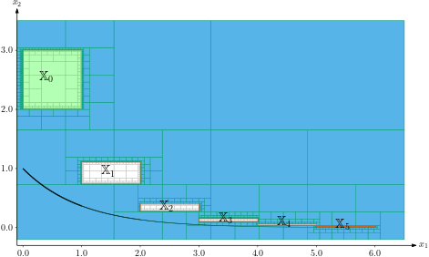
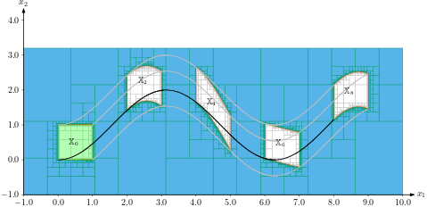
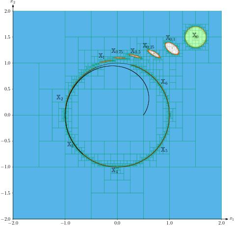
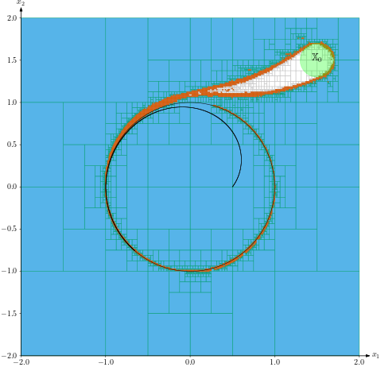
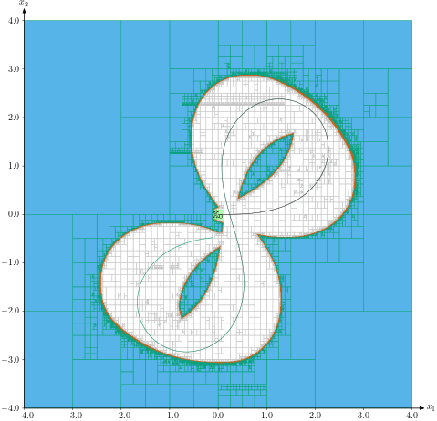

.. _sec-usecases-lie-symmetries:

.. |br| raw:: html

    

#########################################
Lie symmetries for guaranteed integration
#########################################

In the paper `Lie symmetries applied to interval integration <https://www.sciencedirect.com/science/article/pii/S0005109822003612>`_ (`download preprint <http://julien-damers.fr/publis/lie_groups_applied_to_guaranteed_integration.pdf>`_), a new approach has been proposed for improving significantly existing guaranteed integration methods for state equations under the form :math:`\dot{\mathbf{x}}=\mathbf{f}(\mathbf{x})`, with uncertain initial conditions, when symmetries can be found in the vector field of :math:`\mathbf{f}`.

First, a tube is computed for enclosing the solution of the differential equation assuming that the initial state is known. Then, using Lie symmetries, the tube is inflated in order to contain the uncertainty associated with the initial state. 

The method is shown to be efficient on examples coming from reachability analysis and robotics.

.. Some of them, provided in the paper, are listed below. For each example, the sets :math:`\mathbb{X}_t`, :math:`t\in\mathbb{T}` are characterized. The set :math:`\mathbb{T}` may be discrete, :math:`\mathbb{T}=\{t_1,t_2,\dots,t_m\}` or an interval :math:`\mathbb{T}=[0,t_{\max}]`.

Method
======

Given a box :math:`\left[\mathbf{x}_0\right]` containing the initial state :math:`\mathbf{x}_{0}`, the approach aims at characterizing the set of all feasible trajectories of the system.
More precisely, if :math:`\boldsymbol{\Phi}_{t}` is the flow associated to :math:`\mathbf{f}`, then the guaranteed integration consists in computing the sets :math:`\mathbb{X}_{t}=\boldsymbol{\Phi}_{-t}^{-1}([\mathbf{x}_{0}])`.

To get the set :math:`\mathbb{X}_{t_{i}}` of all feasible states at time :math:`t_{i}`, the following method is applied:

* *Step 1.* Define a reference :math:`\mathbf{a}(\cdot)` and enclose it in a thin tube :math:`[\mathbf{a}](\cdot)`. The initial vector :math:`\mathbf{a}_{0}` is exactly known. In order to generate a precise tube :math:`[\mathbf{a}](\cdot)` for :math:`\mathbf{a}(\cdot)`, one can use the :ref:`CAPD library <sec-extensions-ode>`, or the :ref:`CtcLohner algorithm <sec-manual-ctclohner>`.

* *Step 2.* Find a Lie group of symmetries :math:`G_{\mathbf{p}}` and give an expression for the transport function :math:`\mathbf{h}(\mathbf{x},\mathbf{a})`.

* *Step 3.* Solve the resulting :ref:`set inversion problem <sec-manual-separators>` related to :math:`\boldsymbol{\Phi}_{-t}^{-1}` with SIVIA.

This method is illustrated on four examples. For each of these, the set :math:`\underset{t\in\mathbb{T}}{\bigcup}\mathbb{X}_{t} = \underset{t\in\mathbb{T}}{\bigcup}\boldsymbol{\Phi}_{-t}^{-1}([\mathbf{x}_{0}])` is computed, where :math:`\boldsymbol{\Phi}_{t}(\mathbf{x})=\mathbf{g}{}_{\mathbf{h}\left(\mathbf{x},\mathbf{a}_{0}\right)}\circ\mathbf{a}(t)`, and where :math:`\mathbb{T}` is either 

* a discrete set :math:`\mathbb{T}=\{1,\dots,m\}`, which allows us to draw different non-overlapping sets :math:`\mathbb{X}_{t_{i}}` on the same picture; 

* an interval :math:`\mathbb{T}=[0,t_{\max}]`, in order to approximate forward reach sets.

Note that the unions of sets, as well as other set-theoretical operators such as the projection, can easily be done :ref:`using separator algebra <sec-manual-separators>`.

More details about this method can be found `in the related paper <https://www.sciencedirect.com/science/article/pii/S0005109822003612>`_ (`download preprint <http://julien-damers.fr/publis/lie_groups_applied_to_guaranteed_integration.pdf>`_) and in `Julien Damers's thesis <https://julien-damers.fr/phd/complete.pdf>`_.

Test-case 1
===========

We consider the system:

.. math::

  \mathbf{f}(\mathbf{x})=\left(\begin{array}{c}1\\-x_2\end{array}\right)

where the mirror-symmetry w.r.t the abscissa axis :math:`Ox_1` is a stabiliser for the system.

Results are provided below.

  Guaranteed integration of Test-case 1: computing the set :math:`\bigcup_{t\in\{1,2,3,4,5\}}\mathbb{X}_t`, based on the initial condition :math:`\mathbb{X}_0` in green. |br|
  `Try this example TC1-discrete on Repl.it <https://replit.com/@JulienDamers/Lie-symmetries-test-case-1-discrete>`_. 
  

.. figure:: img/lie_symmetries_tc1_continuous.png

  Guaranteed integration of Test-case 1: computing the set :math:`\bigcup_{t\in[0,5]}\mathbb{X}_t`, based on the initial condition :math:`\mathbb{X}_0` in green. |br|
  `Try this example TC1-continuous on Repl.it <https://replit.com/@JulienDamers/Lie-symmetries-test-case-1-continuous>`_. 
  

Test-case 2
===========

We consider the system:

.. math::

  \mathbf{f}(\mathbf{x})=\left(\begin{array}{c}1\\\sin(x_1)\end{array}\right)

where the translation symmetry along the :math:`Ox_2` axis is a stabiliser for the system. The translation of :math:`p_2 = \pm k2\pi` along :math:`Ox_1` is another stabiliser.

Results are provided below.

  Guaranteed integration of Test-case 2: computing the set :math:`\bigcup_{t\in\{2,4,6,8\}}\mathbb{X}_t`, based on the initial condition :math:`\mathbb{X}_0` in green. |br|
  `Try this example TC2-discrete on Repl.it <https://replit.com/@JulienDamers/Lie-symmetries-test-case-2-discrete>`_. 
  

.. figure:: img/lie_symmetries_tc2_continuous.png

  Guaranteed integration of Test-case 2: computing the set :math:`\bigcup_{t\in[0,8]}\mathbb{X}_t`, based on the initial condition :math:`\mathbb{X}_0` in green. |br|
  `Try this example TC2-continuous on Repl.it <https://replit.com/@JulienDamers/Lie-symmetries-test-case-2-continuous>`_. 

Test-case 3
===========

We consider the system:

.. math::

  \mathbf{f}(\mathbf{x})=\left(\begin{array}{c}-x_1^3-x_1x_2^2+x_1-x_2\\-x_2^3-x_1^2x_2+x_1+x_2\end{array}\right)

Results are provided below.

  Guaranteed integration of Test-case 3: computing the set :math:`\bigcup_{t\in\{0.1,\dots,6\}}\mathbb{X}_t`, based on the initial condition :math:`\mathbb{X}_0` in green. |br|
  `Try this example TC3-discrete on Repl.it <https://replit.com/@JulienDamers/Lie-symmetries-test-case-3-discrete>`_. 
  

  Guaranteed integration of Test-case 3: computing the set :math:`\bigcup_{t\in[0,6]}\mathbb{X}_t`, based on the initial condition :math:`\mathbb{X}_0` in green. |br|
  `Try this example TC3-continuous on Repl.it <https://replit.com/@JulienDamers/Lie-symmetries-test-case-3-continuous>`_. 

Test-case 4
===========

We consider the system of a Dubins car:

.. math::

  \mathbf{f}(\mathbf{x})=\left(\begin{array}{c}u_1\cdot\cos(x_3)\\u_1\cdot\sin(x_3)\\u_2\end{array}\right)

where :math:`u_1`, :math:`u_2` are time dependent inputs. To avoid the time dependency in :math:`\mathbf{u}`, we rewrite the system into

.. math::

  \mathbf{f}(\mathbf{x})=\left(\begin{array}{c}u_1(x_4)\cdot\cos(x_3)\\u_1(x_4)\cdot\sin(x_3)\\u_2(x_4)\\1\end{array}\right)

where :math:`x_4` is the clock variable. Two transformations exist: a translation symmetry related to :math:`(x_1,x_2)` and a rotation linked to :math:`x_3`.

Results are provided below.

.. figure:: img/lie_symmetries_tc4_discrete.png

  Guaranteed integration of Test-case 4: computing the set :math:`\underset{(x_{1},x_{2})}{\text{Proj}}\bigcup_{t\in\{1,\dots,14\}}\mathbb{X}_t`, based on the initial condition :math:`\mathbb{X}_0` projected in green. |br|
  `Try this example TC4-discrete on Repl.it <https://replit.com/@JulienDamers/Lie-symmetries-test-case-4-discrete>`_. 
  

  Guaranteed integration of Test-case 4: computing the set :math:`\underset{(x_{1},x_{2})}{\text{Proj}}\bigcup_{t\in[0,14]}\mathbb{X}_t`, based on the initial condition :math:`\mathbb{X}_0` projected in green. |br|
  `Try this example TC4-continuous on Repl.it <https://replit.com/@JulienDamers/Lie-symmetries-test-case-4-continuous>`_. 

Note
---------------

All the examples can be found in the 'examples' folder of the library in the directory
'lie-symmetries' in both Python and C++

Related content
---------------

.. |lie-pdf| replace:: **Download the preprint**
.. _lie-pdf: http://julien-damers.fr/publis/lie_groups_applied_to_guaranteed_integration.pdf

.. |thesis-pdf| replace:: **Download the thesis**
.. _thesis-pdf: https://julien-damers.fr/phd/complete.pdf

.. admonition:: Related publication
  
  | **Lie symmetries applied to interval integration**
  | J. Damers, L. Jaulin, S. Rohou
  | *Automatica*, 2022.
  | |lie-pdf|_

  | **Lie Groups applied to localisation of mobile robots**
  | J. Damers
  | *PhD Thesis*
  | |thesis-pdf|_