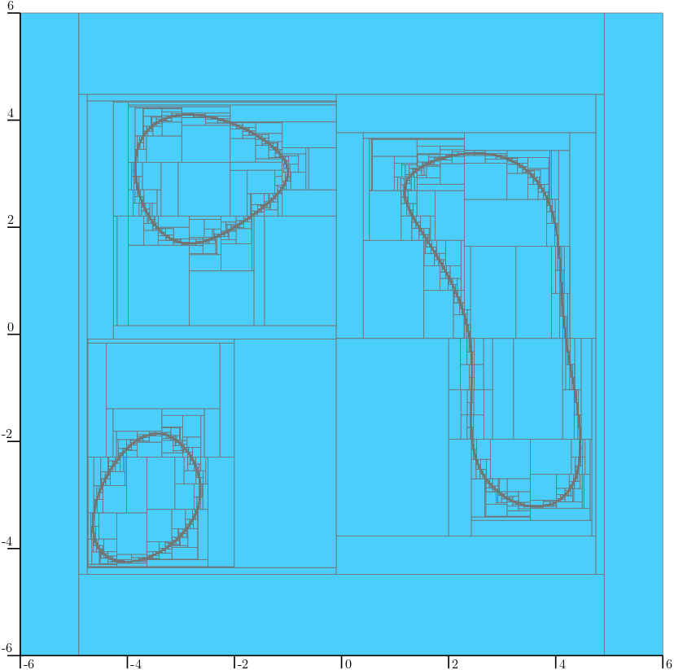
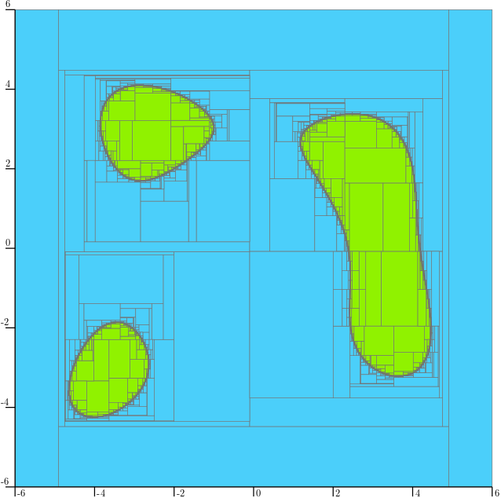
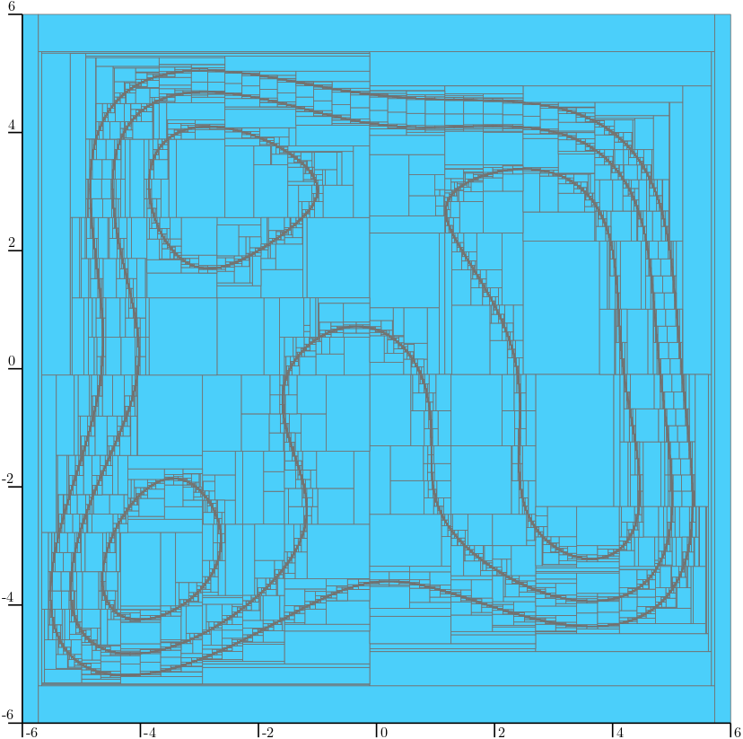

.. _sec-ctc-analytic-ctcinverse:

The CtcInverse contractor
=========================

  Main author: `Simon Rohou <https://www.simon-rohou.fr/research/>`_

Definition
----------

Consider a function :math:`\mathbf{f}:\mathbb{R}^n\to \mathbb{R}^p`. The ``CtcInverse`` contractor allows one to handle constraints of the form :math:`\mathbf{f}(\mathbf{x})\in\mathbb{Y}` by contracting input boxes :math:`[\mathbf{x}]\in\mathbb{IR}^n` while preserving all solutions consistent with the constraint set :math:`\mathbb{Y}`.

:math:`\mathbb{Y}` is a constraint set on the codomain of :math:`\mathbf{f}`. Note that contractors are typically used when :math:`\mathbb{Y}` is thin (*e.g.*, equality constraints). For thick sets (inequalities), separators are often preferable to obtain both outer and inner approximations, and faster computations.

In Codac, :math:`\mathbb{Y}` can be represented in two main ways:

.. important::

  **(i) Box representation**

  When :math:`\mathbb{Y}` is given as a box :math:`[\mathbf{y}]`, the constraint reads: :math:`\mathbf{f}(\mathbf{x}) \in [\mathbf{y}]`.

  **(ii) Contractor representation**

  More generally, :math:`\mathbb{Y}` may be any output set representable by a contractor
  :math:`\mathcal{C}_{\mathbb{Y}}`: :math:`\mathbf{f}(\mathbf{x}) \in \mathcal{C}_{\mathbb{Y}}`.

  In this case, :math:`\mathcal{C}_{\mathbb{Y}}` is any contractor acting on boxes in :math:`\mathbb{R}^p`.

In the current version of Codac (v2), ``CtcInverse`` is the successor of the v1 ``CtcFunction`` contractor (renamed for clarity). It is also closely related to the ``CtcFwdBwd`` of the `IBEX library <https://ibex-team.github.io/ibex-lib/contractor.html#forward-backward>`_.

Construction and basic usage
----------------------------

The typical workflow is:

1. Define analytic variables (scalar, vector, matrix) associated with the domain of the function.
2. Build an :class:`~codac2.AnalyticFunction`.
3. Instantiate ``CtcInverse`` with a codomain constraint (a box :math:`[\mathbf{y}]` or a contractor :math:`\mathcal{C}_{\mathbb{Y}}`).
4. Contract an input box :math:`[\mathbf{x}]` or pave the contractor in the domain space.

Dealing with equalities and inequalities
^^^^^^^^^^^^^^^^^^^^^^^^^^^^^^^^^^^^^^^^

Equalities are expressed with a degenerate interval (or box) in the codomain, *e.g.*:

- :math:`f(x)=0`  is encoded as  :math:`f(x)\in[0,0]`.

Inequalities are encoded by widening the codomain interval(s). For instance:

- :math:`f(x)\leqslant 0`  is encoded as  :math:`f(x)\in[-\infty,0]`.

In the case of inequalities, the use of the equivalent ``SepInverse`` separator should be preferred for efficiency reasons or in order to obtain an inner approximation.

Example
^^^^^^^

Consider for instance Himmelblau's function:

.. math::

  f(\mathbf{x}) = (x_1^2 + x_2 - 11)^2 + (x_1 + x_2^2 - 7)^2.

To represent the vectors :math:`\mathbf{x}\in\mathbb{R}^n` consistent with the constraint :math:`f(\mathbf{x})=50`, a ``CtcInverse`` contractor can be built as follows:

.. tabs::

  .. group-tab:: Python

    .. literalinclude:: src.py
      :language: py
      :start-after: [ctcinv-1-beg]
      :end-before: [ctcinv-1-end]
      :dedent: 4

  .. group-tab:: C++

    .. literalinclude:: src.cpp
      :language: c++
      :start-after: [ctcinv-1-beg]
      :end-before: [ctcinv-1-end]
      :dedent: 4

  .. group-tab:: Matlab

    .. literalinclude:: src.m
      :language: matlab
      :start-after: [ctcinv-1-beg]
      :end-before: [ctcinv-1-end]
      :dedent: 0

The contractor can be used as an operator to contract a 2d box :math:`[\mathbf{x}]`. It can also be involved in a paver in order to reveal the constraint:

.. tabs::

  .. group-tab:: Python

    .. literalinclude:: src.py
      :language: py
      :start-after: [ctcinv-2-beg]
      :end-before: [ctcinv-2-end]
      :dedent: 4

  .. group-tab:: C++

    .. literalinclude:: src.cpp
      :language: c++
      :start-after: [ctcinv-2-beg]
      :end-before: [ctcinv-2-end]
      :dedent: 4

  .. group-tab:: Matlab

    .. literalinclude:: src.m
      :language: matlab
      :start-after: [ctcinv-2-beg]
      :end-before: [ctcinv-2-end]
      :dedent: 0

Which produces the following output:

  Outer approximation of the solution set for :math:`f(\mathbf{x})\in[50,50]`. This paving result reveals three connected subsets approximated with outer boxes. Blue parts are guaranteed not to contain solutions.

We recall that for thick solution sets, one should prefer the use of the ``SepInverse`` separator in order to get both outer and inner approximations. For instance, the solution set associated with :math:`f(\mathbf{x})\leqslant 50` corresponds to:

.. tabs::

  .. group-tab:: Python

    .. literalinclude:: src.py
      :language: py
      :start-after: [ctcinv-3-beg]
      :end-before: [ctcinv-3-end]
      :dedent: 4

  .. group-tab:: C++

    .. literalinclude:: src.cpp
      :language: c++
      :start-after: [ctcinv-3-beg]
      :end-before: [ctcinv-3-end]
      :dedent: 4

  .. group-tab:: Matlab

    .. literalinclude:: src.m
      :language: matlab
      :start-after: [ctcinv-3-beg]
      :end-before: [ctcinv-3-end]
      :dedent: 0

  Inner and outer approximations of the solution set for :math:`f(\mathbf{x})\leqslant 50`, equivalent to :math:`f(\mathbf{x})\in[0,50]`, obtained by paving a separator ``SepInverse(f, [0,50])``. Green parts are boxes containing only vectors consistent with the constraint.

Finally, it is easy to consider disjunction of constraints by making a union of contractors. For instance, the solution set

.. math::
  :label: himmelblau_union

  \mathbb{X}=\left\{\mathbf{x}, \left(f(\mathbf{x}) = 50\right) \lor \left(f(\mathbf{x}) = 150\right) \lor \left(f(\mathbf{x}) = 250\right)\right\}

can be easily approximated by the following union of contractors:

.. tabs::

  .. group-tab:: Python

    .. literalinclude:: src.py
      :language: py
      :start-after: [ctcinv-4-beg]
      :end-before: [ctcinv-4-end]
      :dedent: 4

  .. group-tab:: C++

    .. literalinclude:: src.cpp
      :language: c++
      :start-after: [ctcinv-4-beg]
      :end-before: [ctcinv-4-end]
      :dedent: 4

  .. group-tab:: Matlab

    .. literalinclude:: src.m
      :language: matlab
      :start-after: [ctcinv-4-beg]
      :end-before: [ctcinv-4-end]
      :dedent: 0

  Outer approximation of the solution set :math:`\mathbb{X}` for :eq:`himmelblau_union`.

.. from codac import *
.. 
.. # Example of Himmelblau's function
.. a = 11; b = 7
.. x = VectorVar(2)
.. f = AnalyticFunction([x], sqr(sqr(x[0])+x[1]-a)+sqr(x[0]+sqr(x[1])-b))
.. 
.. c1 = CtcInverse(f, 50)
.. c2 = CtcInverse(f, 150)
.. c3 = CtcInverse(f, 250)
.. 
.. g = Figure2D("test", GraphicOutput.VIBES | GraphicOutput.IPE)
.. g.set_axes(axis(0,[-6,6]), axis(1,[-6,6]))
.. g.pave([[-6,6],[-6,6]], c1|c2|c3, 1e-2)

Possible usages of ``CtcInverse`` with respect to domain and codomain types
-----------------------------------------------------------------------------

:math:`\mathbf{f}:\mathbb{R}^n\to \mathbb{R}^p` is the most classical case, but Codac provides generic solutions to define a wide variety of expressions such as functions defined as :math:`\mathbf{f}:X\to Y`, where:

- :math:`X` denotes the domain of :math:`\mathbf{f}` with the following cases:

  * :math:`X=\mathbb{R}`: one scalar input ;
  * :math:`X=\mathbb{R}^n`: one :math:`n`-d vector input ;
  * :math:`X=\mathbb{R}^{n\times m}`: one :math:`n\times m` matrix input ;
  * :math:`X=\mathbb{R}\times\mathbb{R}^{n}\times\mathbb{R}`: several types of mixed inputs, with no restrictions on order or number.

- :math:`Y` denotes the codomain of :math:`\mathbf{f}`, that can be either :math:`\mathbb{R}`, :math:`\mathbb{R}^p` or :math:`\mathbb{R}^{p\times q}`.

.. role:: bg-ok
.. role:: bg-bok
.. role:: bg-noa
.. role:: bg-title
.. role:: vertical
.. role:: medskip

.. role:: raw-html(raw)
  :format: html

.. |okk| replace:: :bg-ok:`✓`
.. |bok| replace:: :bg-bok:`✓`
.. |noa| replace:: :bg-noa:`✗ (C++ only)`
.. |ms| replace:: :medskip:`-`

The following table lists the combinations implemented in Codac.
The :bg-ok:`✓` cases correspond to efficient contractions involving centered form expressions, while :bg-bok:`✓` refer to classical forward/backward propagations.
Note that since Codac's design is based on C++ template programming, the most generic use-cases of the ``CtcInverse`` are not available in Python or Matlab. 

.. tabs::

  .. group-tab:: Python

    .. table:: Possible usages of ``CtcInverse``
      :name: ctcinverse-table-py

      +-----------------------------------------------------+-------------------------------------------------------------------------------------------+
      |                                                     | Output :math:`Y`                                                                          |
      |                                                     +-------------------------+---------------------------+-------------------------------------+
      |                                                     | :math:`\mathbb{R}` |ms| | :math:`\mathbb{R}^n` |ms| | :math:`\mathbb{R}^{r\times c}` |ms| |
      +--------------------+--------------------------------+-------------------------+---------------------------+-------------------------------------+
      | Input(s) :math:`X` | :math:`\mathbb{R}`             | |noa|                   | |noa|                     | |noa|                               |
      |                    +--------------------------------+-------------------------+---------------------------+-------------------------------------+
      |                    | :math:`\mathbb{R}^n`           | |okk|                   | |okk|                     | |noa|                               |
      |                    +--------------------------------+-------------------------+---------------------------+-------------------------------------+
      |                    | :math:`\mathbb{R}^{r\times c}` | |noa|                   | |noa|                     | |noa|                               |
      |                    +--------------------------------+-------------------------+---------------------------+-------------------------------------+
      |                    | any mixed types                | |noa|                   | |noa|                     | |noa|                               |
      +--------------------+--------------------------------+-------------------------+---------------------------+-------------------------------------+

  .. group-tab:: C++

    .. table:: Possible usages of ``CtcInverse``
      :name: ctcinverse-table-cpp

      +-----------------------------------------------------+-------------------------------------------------------------------------------------------+
      |                                                     | Output :math:`Y`                                                                          |
      |                                                     +-------------------------+---------------------------+-------------------------------------+
      |                                                     | :math:`\mathbb{R}` |ms| | :math:`\mathbb{R}^n` |ms| | :math:`\mathbb{R}^{r\times c}` |ms| |
      +--------------------+--------------------------------+-------------------------+---------------------------+-------------------------------------+
      | Input(s) :math:`X` | :math:`\mathbb{R}`             | |bok|                   | |bok|                     | |bok|                               |
      |                    +--------------------------------+-------------------------+---------------------------+-------------------------------------+
      |                    | :math:`\mathbb{R}^n`           | |okk|                   | |okk|                     | |bok|                               |
      |                    +--------------------------------+-------------------------+---------------------------+-------------------------------------+
      |                    | :math:`\mathbb{R}^{r\times c}` | |bok|                   | |bok|                     | |bok|                               |
      |                    +--------------------------------+-------------------------+---------------------------+-------------------------------------+
      |                    | any mixed types                | |bok|                   | |bok|                     | |bok|                               |
      +--------------------+--------------------------------+-------------------------+---------------------------+-------------------------------------+

  .. group-tab:: Matlab

    .. table:: Possible usages of ``CtcInverse``
      :name: ctcinverse-table-matlab

      +-----------------------------------------------------+-------------------------------------------------------------------------------------------+
      |                                                     | Output :math:`Y`                                                                          |
      |                                                     +-------------------------+---------------------------+-------------------------------------+
      |                                                     | :math:`\mathbb{R}` |ms| | :math:`\mathbb{R}^n` |ms| | :math:`\mathbb{R}^{r\times c}` |ms| |
      +--------------------+--------------------------------+-------------------------+---------------------------+-------------------------------------+
      | Input(s) :math:`X` | :math:`\mathbb{R}`             | |noa|                   | |noa|                     | |noa|                               |
      |                    +--------------------------------+-------------------------+---------------------------+-------------------------------------+
      |                    | :math:`\mathbb{R}^n`           | |okk|                   | |okk|                     | |noa|                               |
      |                    +--------------------------------+-------------------------+---------------------------+-------------------------------------+
      |                    | :math:`\mathbb{R}^{r\times c}` | |noa|                   | |noa|                     | |noa|                               |
      |                    +--------------------------------+-------------------------+---------------------------+-------------------------------------+
      |                    | any mixed types                | |noa|                   | |noa|                     | |noa|                               |
      +--------------------+--------------------------------+-------------------------+---------------------------+-------------------------------------+

Not-in constraints: ``CtcInverseNotIn``
---------------------------------------

When the constraint is a complement constraint :math:`\mathbf{f}(\mathbf{x})\notin\mathbb{Y}`, Codac provides ``CtcInverseNotIn`` which internally builds a union of inverse contractors over the complementary parts of :math:`\mathbb{Y}`.

.. tabs::

  .. group-tab:: Python

    .. literalinclude:: src.py
      :language: py
      :start-after: [ctcinv-5-beg]
      :end-before: [ctcinv-5-end]
      :dedent: 4

  .. group-tab:: C++

    .. literalinclude:: src.cpp
      :language: c++
      :start-after: [ctcinv-5-beg]
      :end-before: [ctcinv-5-end]
      :dedent: 4

  .. group-tab:: Matlab

    .. literalinclude:: src.m
      :language: matlab
      :start-after: [ctcinv-5-beg]
      :end-before: [ctcinv-5-end]
      :dedent: 0

Miscellaneous
-------------

Access to the underlying function
^^^^^^^^^^^^^^^^^^^^^^^^^^^^^^^^^

The underlying analytic function can be accessed through ``.fnc()`` (useful for dimension checks or meta-programming).

.. tabs::

  .. group-tab:: Python

    .. literalinclude:: src.py
      :language: py
      :start-after: [ctcinv-6-beg]
      :end-before: [ctcinv-6-end]
      :dedent: 4

  .. group-tab:: C++

    .. literalinclude:: src.cpp
      :language: c++
      :start-after: [ctcinv-6-beg]
      :end-before: [ctcinv-6-end]
      :dedent: 4

  .. group-tab:: Matlab

    .. literalinclude:: src.m
      :language: matlab
      :start-after: [ctcinv-6-beg]
      :end-before: [ctcinv-6-end]
      :dedent: 0

Centered form option
^^^^^^^^^^^^^^^^^^^^

For some signatures (see :bg-ok:`✓` in the table), ``CtcInverse`` can leverage centered-form
expressions to improve contraction.
The constructor exposes:

- ``with_centered_form`` (default: ``true``): enable/disable centered-form based steps.

Disabling it can be useful to reduce computation cost when forward/backward propagation is
sufficient for your application, or for comparisons with the centered form.

.. admonition:: Technical documentation

  See the C++ API documentation:

  - ``CtcInverse``: `codac2_CtcInverse.h <../../../api/html/codac2___ctc_inverse_8h.html>`_
  - ``CtcInverseNotIn``: `codac2_CtcInverseNotIn.h <../../../api/html/codac2___ctc_inverse_not_in_8h.html>`_