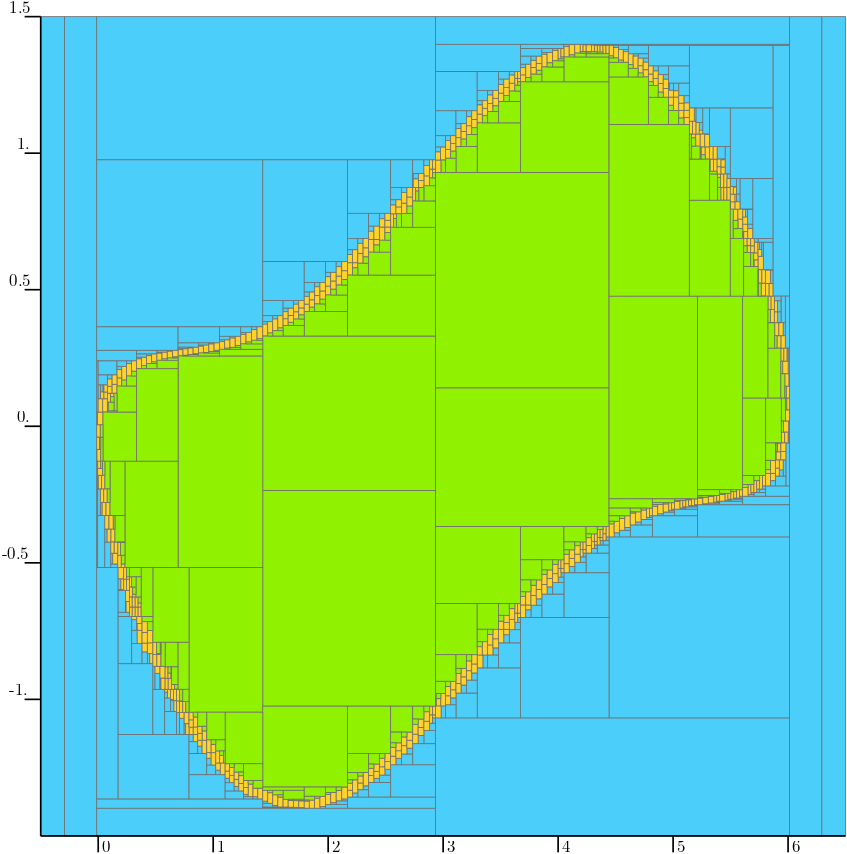

.. _sec-ctc-analytic-sepimage:

The SepImage separator
======================

  Main author: `Maël Godard <https://godardma.github.io>`_

Definition
----------

Consider a function :math:`\mathbf{f}:\mathbb{R}^n\to \mathbb{R}^p`. 
The ``SepImage`` separator allows one to handle constraints of the form :math:`\mathbf{y}\in\mathbf{f}(\mathbb{X})` 
by separating input boxes :math:`[\mathbf{y}]\in\mathbb{IR}^p`.

Construction and basic usage
----------------------------

The ``SepImage`` relies on a boundary approach to compute the image set. The boundary of the initial set needs to be 
covered by a :ref:`gnomonic atlas <subsec-functions-peibos-gnomonic-atlas>`. To compute the image of the boundary,
the initial box :math:`\left[-1,1\right]^m` can be subdivided up to a size :math:`\epsilon` and the image of each resulting box 
is computed. Note that if one chooses to take :math:`\epsilon=2`, only one computation will be done per chart of the atlas. 

Once this image of the boundary has been computed, the ``SepImage`` needs to a way to characterize if a point is inside or 
outside of the image set. To do so, it looks for an antecedent of the point in the initial set. An additionnal contractor on 
the initial set is then required.

The typical workflow is:

1. Define analytic variables (scalar, vector, matrix) associated with the domain of the function.
2. Build an :class:`~codac2.AnalyticFunction`.
3. Define a gnomonic atlas on the boundary of the initial set
4. Define a contractor on this same initial set
5. Instantiate ``SepImage`` with the atlas, the function, the resolution :math:`\epsilon` and the contractor.
6. Contract an input box :math:`[\mathbf{y}]` or pave the separator in the image space.

Example
-------

Consider that we want to construct a separator on the image of the unit circle by the function

.. math:: 
  \mathbf{f}(\mathbf{x})=
  \left(
  \begin{array}{c}
  3(x_{1}+1)\\
  x_{2}+ 0.5\sin (3 x_{1})
  \end{array}
  \right)

This function can be constructed in codac as follows

.. tabs::

  .. group-tab:: Python

    .. literalinclude:: src.py
      :language: py
      :start-after: [sepimage-1-beg]
      :end-before: [sepimage-1-end]
      :dedent: 4

  .. group-tab:: C++

    .. literalinclude:: src.cpp
      :language: c++
      :start-after: [sepimage-1-beg]
      :end-before: [sepimage-1-end]
      :dedent: 4

We then need a contractor for the unit disk, and gnomonic atlas for its boundary (the unit circle).
For the atlas, the image of :math:`\left[-1,1\right]` by the function

.. math:: 
  \psi_{0} =
  \left(
  \begin{array}{c}
  \cos\left(x\cdot\frac{\pi}{2}\right)\\
  \sin\left(x\cdot\frac{\pi}{2}\right)
  \end{array}
  \right)

is half of the unit cicle. The other half can be obtained with a rotation of :math:`\pi` rad. Such atlas 
is constucted in codac as  

.. tabs::

  .. group-tab:: Python

    .. literalinclude:: src.py
      :language: py
      :start-after: [sepimage-2-beg]
      :end-before: [sepimage-2-end]
      :dedent: 4

  .. group-tab:: C++

    .. literalinclude:: src.cpp
      :language: c++
      :start-after: [sepimage-2-beg]
      :end-before: [sepimage-2-end]
      :dedent: 4

In this example, the constraint on the initial set can be seen as a distance constraint. It can be treated as an inversion as follows :

.. tabs::

  .. group-tab:: Python

    .. literalinclude:: src.py
      :language: py
      :start-after: [sepimage-3-beg]
      :end-before: [sepimage-3-end]
      :dedent: 4

  .. group-tab:: C++

    .. literalinclude:: src.cpp
      :language: c++
      :start-after: [sepimage-3-beg]
      :end-before: [sepimage-3-end]
      :dedent: 4

The separator can then be constructed and used, for example with a paver to get both an inner and an outer approximation of the image set.
The resulting paving is showed in the next figure.

.. tabs::

  .. group-tab:: Python

    .. literalinclude:: src.py
      :language: py
      :start-after: [sepimage-4-beg]
      :end-before: [sepimage-4-end]
      :dedent: 4

  .. group-tab:: C++

    .. literalinclude:: src.cpp
      :language: c++
      :start-after: [sepimage-4-beg]
      :end-before: [sepimage-4-end]
      :dedent: 4

With a lower resolution, the performances of the separator improve as shown in the following figure.

.. tabs::

  .. group-tab:: Python

    .. literalinclude:: src.py
      :language: py
      :start-after: [sepimage-5-beg]
      :end-before: [sepimage-5-end]
      :dedent: 4

  .. group-tab:: C++

    .. literalinclude:: src.cpp
      :language: c++
      :start-after: [sepimage-5-beg]
      :end-before: [sepimage-5-end]
      :dedent: 4

.. figure:: ./sep_image_fine.png
  :width: 400px
  :align: center

A more complex example is available on the public github repository. It treats the topic of the explored area, 
which is a classical problem in robotics.

* `Python version <https://github.com/codac-team/codac/blob/codac2/examples/04_explored_area/main_peibos.py>`_
* `C++ version <https://github.com/codac-team/codac/blob/codac2/examples/04_explored_area/main_peibos.cpp>`_
