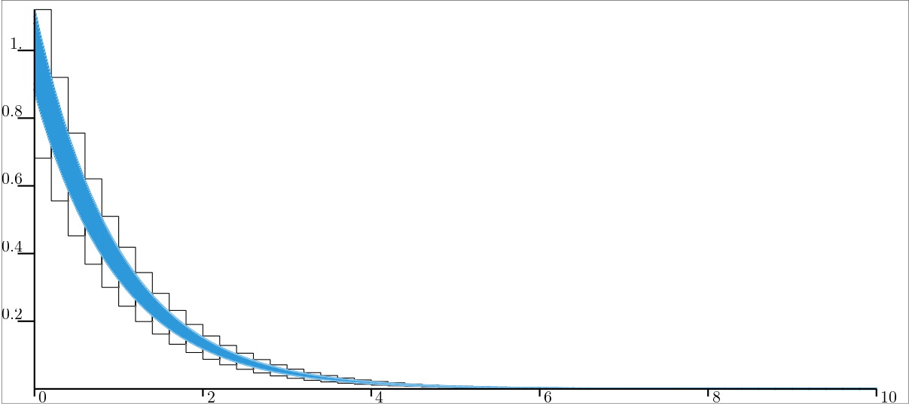

.. _sec-ctc-dynamic-ctclohner:

The CtcLohner contractor
=========================

  Main authors: Auguste Bourgois, `Maël Godard <https://godardma.github.io>`_ (porting to Codac2)

Definition
----------

The Lohner contractor uses Lohner's guaranteed integration algorithm to contract a tube according to a differential
equation. This algorithm performs two main steps:

- an estimation of a global enclosure of the system's trajectories over an integration step (*i.e.* the domain of a slice),
  which corresponds to the codomain of that slice;
- using this estimation and the input gate (or output gate in the backward mode), the corresponding output gate (or input gate
  in the backward mode) is then estimated;
- over a single slice, these steps can be iterated a few times to obtain tighter enclosures for both the gate and the codomain of the slice.

This contractor is supposed to yield better results than the Picard contractor, as long as the tubes are "thin enough".

.. important::
    
  .. math::

    \left.\begin{array}{r}\dot{\mathbf{x}}(t)=\mathbf{f}\big(\mathbf{x}(t)\big)\end{array}\right. \longrightarrow \mathcal{C}_{\textrm{Lohner}}\big([\mathbf{x}](\cdot)\big)

  .. tabs::

    .. code-tab:: py

      var = VectorVar(n) # n is the dimension of the system
      ctc_lohner = CtcLohner(AnalyticFunction([var], [expr1, expr2, ..., exprn]))
      x = ctc_lohner.contract(x)

    .. code-tab:: c++

      VectorVar var(n); // n is the dimension of the system
      CtcLohner ctc_lohner(AnalyticFunction({x}, {expr1, expr2, ..., exprn}););
      ctc_lohner.contract(x);

.. important::

    The contractor might throw a runtime error when it cannot find a global enclosure over a specific time step. This usually
    happens when the time step is too large, and may therefore be avoided by reducing the discretisation frequency of the tube.

    Note that this behaviour may be tackled using automatic step adjustment. However, such a feature is not yet implemented.

Simple example of use
---------------------

In the following example, we consider the two-dimensional system described by:

.. math::

  \left(\begin{array}{c}\dot{x}_1\\\dot{x}_2\end{array}\right) = \left(\begin{array}{c}-x_1\\-\sin({x}_2)\end{array}\right).

The Lohner contractor is used for obtaining a two-dimensional tube, considering an initial condition :math:`\mathbf{x}_0\in[0.9,1.1]\times[0.9,1.1]`. The contraction is tested on two tubes :math:`[\mathbf{a}](\cdot)` and :math:`[\mathbf{b}](\cdot)` of different resolutions (width of slices).

.. tabs::

  .. code-tab:: py

    x0 = IntervalVector([Interval(1,1),Interval(1,1)])  # the box [1,1]×[1,1]..
    x0.inflate(0.1)                                     # ..becomes [0.9,1.1]×[0.9,1.1]

    # 2d tubes:
    ta = create_tdomain([0.,10.0],0.2)  # low resolution
    a = SlicedTube_IntervalVector(ta, IntervalVector(2))
    a.set(x0,0.0) # setting initial value

    tb =create_tdomain([0.,10.0],0.01) # high resolution
    b = SlicedTube_IntervalVector(tb, IntervalVector(2))
    b.set(x0,0.0) # setting initial value

    # Defining Lohner contractor from f
    x = VectorVar(2)
    f = AnalyticFunction([x], [-x[0],-sin(x[1])])
    ctc_lohner = CtcLohner(f)

    # Contracting the tubes
    a = ctc_lohner.contract(a)
    b = ctc_lohner.contract(b)

    # Graphics
    fig1 = Figure2D("Lohner_1",GraphicOutput.VIBES|GraphicOutput.IPE)
    fig2 = Figure2D("Lohner_2",GraphicOutput.VIBES|GraphicOutput.IPE)

    fig1.plot_tube(a[0])
    fig1.plot_tube(b[0],StyleProperties([Color.blue(),Color.blue()]))

    fig2.plot_tube(a[1])
    fig2.plot_tube(b[1],StyleProperties([Color.blue(),Color.blue()]))

  .. code-tab:: c++

    IntervalVector x0({Interval(1,1),Interval(1,1)}); // the box [1,1]×[1,1]..
    x0.inflate(0.1);                                  // ..becomes [0.9,1.1]×[0.9,1.1]

    // 2d tubes:
    auto ta =create_tdomain({0.,10.0},0.2); // low resolution
    SlicedTube a(ta, IntervalVector(2));
    a.set(x0,0.0);  // setting initial value

    auto tb =create_tdomain({0.,10.0},0.01);  // high resolution
    SlicedTube b(tb, IntervalVector(2));
    b.set(x0,0.0);  // setting initial value

    // Defining Lohner contractor from f
    VectorVar x(2);
    AnalyticFunction f({x}, {-x[0],-sin(x[1])});
    CtcLohner ctc_lohner(f);

    // Contracting the tubes
    ctc_lohner.contract(a);
    ctc_lohner.contract(b);

    // Graphics
    Figure2D fig1 ("Lohner_1",GraphicOutput::VIBES|GraphicOutput::IPE);
    Figure2D fig2 ("Lohner_2",GraphicOutput::VIBES|GraphicOutput::IPE);

    fig1.plot_tube(a[0]);
    fig1.plot_tube(b[0],{Color::blue(),Color::blue()});

    fig2.plot_tube(a[1]);
    fig2.plot_tube(b[1],{Color::blue(),Color::blue()});

    fig1.set_window_properties({100,50},{1000,400});
    fig2.set_window_properties({100,500},{1000,400});

The above code yields the following result for :math:`[a_1](\cdot)` (in gray, large slices) and :math:`[b_1](\cdot)` (in blue, thin slices):

Related content
---------------

.. admonition:: Mathematical documentation

  See `Auguste Bourgois' thesis <https://webperso.ensta.fr/jaulin/thesis_auguste.pdf>`_. In particular, check Chapter 4.

.. admonition:: Technical documentation

  See the `C++ API documentation of this class <../../../extra_html/api/classcodac2_1_1_ctc_lohner.html>`_.

