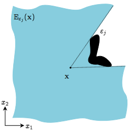
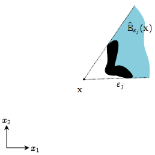
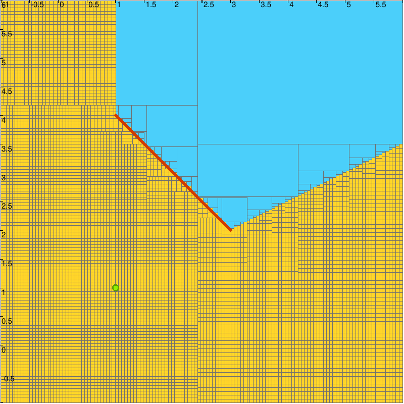
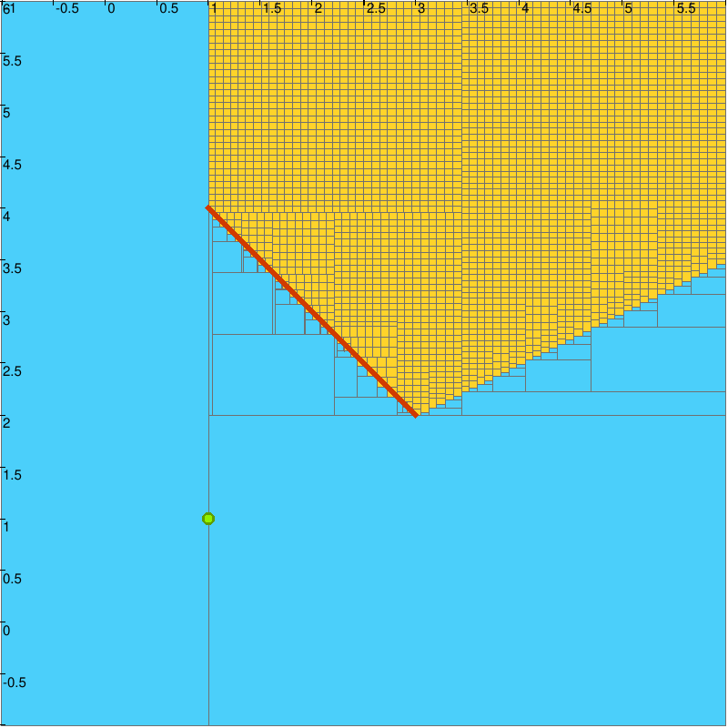
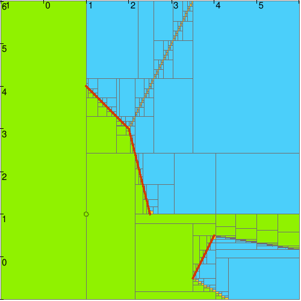
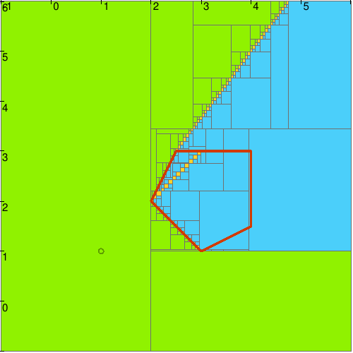

.. _sec-ctc-geom-ctcvisible:

The CtcVisible and CtcNoVisible contractors
===========================================

  Main authors: `Quentin Brateau <https://teusner.github.io/>`_ 

The visibility constraint characterizes the set of points :math:`\mathbf{x} \in \mathbb{R}^2` that are visible from an observation point :math:`\mathbf{a}` given an obstacle segment :math:`[\mathbf{e}_1\mathbf{e}_2]`. 

This constraint is based on the work of **Rémy Guyonneau** (see [Guyonneau2013]_). A point :math:`\mathbf{x}` is considered visible if the segment :math:`[\mathbf{a}\mathbf{x}]` does not intersect the obstacle segment :math:`[\mathbf{e}_1\mathbf{e}_2]`. This creates a "shadow cone" originating from :math:`\mathbf{a}`.

.. doxygenclass:: codac2::CtcVisible
  :project: codac

.. doxygenclass:: codac2::CtcNoVisible
  :project: codac

.. note::
    Current implementations assume a thin (degenerated) observation point :math:`\mathbf{a}`. Future versions will support visibility from **observation lines**, set defined by **convex polygons**, and from any **set** defined by a Separator.

Methods
-------

.. doxygenfunction:: codac2::CtcVisible::contract(IntervalVector&) const
  :project: codac

.. doxygenfunction:: codac2::CtcNoVisible::contract(IntervalVector&) const
  :project: codac

Example of use: Characterizing the set of visible and non-visible points from an observation point
--------------------------------------------------------------------------------------------------

In this example, we characterize the visible and hidden areas from an observer at the origin :math:`\mathbf{a}=(0,0)^\intercal` facing a wall represented by a segment from :math:`(2, -1)` to :math:`(2, 1)`.

.. tabs::

  .. group-tab:: Python

    .. literalinclude:: src.py
      :language: py
      :start-after: [ctcvisible-beg]
      :end-before: [ctcvisible-end]
      :dedent: 4

  .. group-tab:: C++

    .. literalinclude:: src.cpp
      :language: c++
      :start-after: [ctcvisible-beg]
      :end-before: [ctcvisible-end]
      :dedent: 4

.. tabs::

  .. group-tab:: Python

    .. literalinclude:: src.py
      :language: py
      :start-after: [ctcnovisible-beg]
      :end-before: [ctcnovisible-end]
      :dedent: 4

  .. group-tab:: C++

    .. literalinclude:: src.cpp
      :language: c++
      :start-after: [ctcnovisible-beg]
      :end-before: [ctcnovisible-end]
      :dedent: 4

  Characterization of the visibility area. The points that are not visible are out of the visibility region and belongs to the blue area. The uncertain region is represented in yellow.

  Characterization of the non-visibility area. The points that are visible are out of the non-visibility region and belongs to the blue area. The uncertain region is represented in yellow.

Separator on the Visibility Constraint
---------------------------------------

The visibility constraint can also be applied as a separator, which allows us to characterize the set of points that are visible or not visible from an observation point. This is particularly useful for applications such as path planning, where one needs to determine the regions that are accessible or hidden from a certain viewpoint.

.. tabs::

  .. group-tab:: Python

    .. literalinclude:: src.py
      :language: py
      :start-after: [sepvisible_list-begin]
      :end-before: [sepvisible_list-end]
      :dedent: 4

  .. group-tab:: C++

    .. literalinclude:: src.cpp
      :language: c++
      :start-after: [sepvisible_list-begin]
      :end-before: [sepvisible_list-end]
      :dedent: 4

  Characterization of the visibility area relative to a list of obstacle segments. The green area is visible from the observation point, while blue area is not visible. The uncertain region is represented in yellow.

.. tabs::

  .. group-tab:: Python

    .. literalinclude:: src.py
      :language: py
      :start-after: [sepvisible_polygon-begin]
      :end-before: [sepvisible_polygon-end]
      :dedent: 4

  .. group-tab:: C++

    .. literalinclude:: src.cpp
      :language: c++
      :start-after: [sepvisible_polygon-begin]
      :end-before: [sepvisible_polygon-end]
      :dedent: 4

  Characterization of the visibility area relative to a polygon obstacle. The green area is visible from the observation point, while blue area is not visible. The uncertain region is represented in yellow.

.. note::

  When implementing visibility over a union of segments, **fake boundaries** are appearing. These occur when the intersection of several visibility contractors creates "uncertain" regions that do not correspond to actual physical visibility limits. This is particularly visible on the two Figures that show a line of yellow boxes in the blue area. For a detailed discussion on handling these in interval analysis, see [Brateau2025]_.

Related content
---------------

.. |visibility-pdf| replace:: **Download the manuscript**
.. _visibility-pdf: https://theses.hal.science/tel-00961501/file/these_remy_guyonneau.pdf

.. |fake_boundaries-pdf| replace:: **Download the paper**
.. _fake_boundaries-pdf: https://cyber.bibl.u-szeged.hu/index.php/actcybern/article/view/4560

.. admonition:: References

  .. [Guyonneau2013] \ R. Guyonneau. *Modélisation et exploitation d'incertitudes pour la robotique mobile à l'aide de l'analyse par intervalles*. PhD Thesis, 2013. |visibility-pdf|_

  .. [Brateau2025] \ Q. Brateau, et al. *Considering Adjacent Sets for Computing the Visibility Region*. Acta Cybernetica, 2025. |fake_boundaries-pdf|_

.. admonition:: Technical documentation

  See the `C++ API documentation of CtcVisible <../../api/html/classcodac2_1_1_ctc_visible.html>`_.