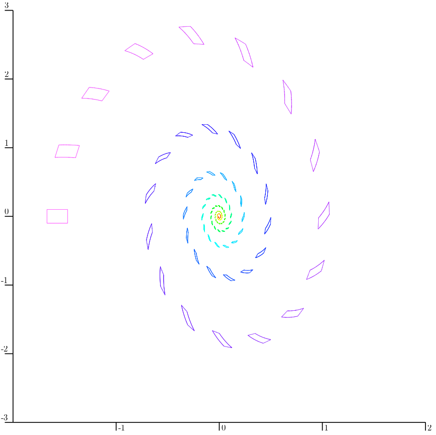
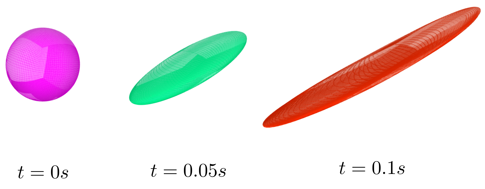

.. _sec-extensions-capd-peibos:

PEIBOS-CAPD
===========

  Main author: `Maël Godard <https://godardma.github.io>`_

The content from this page supports multi-threading, see :ref:`here <sec-tools-threading>` for details.

When compiling CODAC with the codac-capd extension (see :ref:`here <subsec-extensions-capd-capd-install>`), the CAPD version of the PEIBOS library is also compiled.

Let us consider an initial set :math:`\mathbb{X}_0 \subset \mathbb{R}^n` with its boundary :math:`\partial \mathbb{X}_0`. 
Considering a dynamical system :math:`\dot{\mathbf{x}}=\gamma(\mathbf{x})`, the PEIBOS tool allows to compute the reach set :math:`\mathbf{X}_t=\left\{ \mathbf{x}(t) \mid \mathbf{x} \in \partial \mathbb{X}_0 \right\}`.

Gnomonic atlas
--------------

To handle the boundary of the initial set :math:`\mathbb{X}_0`, the PEIBOS tool relies on a gnomonic atlas. See :ref:`subsec-functions-peibos-gnomonic-atals`.

Use
---

The computation of the reach set is decomposed into two separate functions.

PEIBOS
~~~~~~

The PEIBOS function takes at least six arguments :

- The CAPD IMap representing :math:`\gamma`.
- The final time for the integration of the ODE.
- A timestep to get intermediate states.
- The inverse chart for the gnomonic atlas (an analytic function).
- The list of symmetries for the gnomonic atlas. Note that each symmetry is represented as a hyperoctahedral symmetry, see :ref:`sec-actions-octasym`.
- A resolution :math:`\epsilon`. The initial box :math:`\left[-1,1\right]^m` will initiallly be splitted in boxes with a diameter smaller than :math:`\epsilon`.
- Eventually an offset vector can be specified if the initial set is not centered around the origin.
- Eventually a flag can be set to True to get the verbose.

For each of the small box :math:`\left[\mathbf{x}(0)\right]`, this function computes a box containing :math:`\bar{\mathbf{x}}(t)` and an interval matrix enclosing the Jacobian matrix :math:`D\mathbf{\left[x\right]}(t)`.

It returns a map where the keys are the time steps. For each time step, the value is a vector of tuple, where each tuple contains:

- A `PEIBOS_CAPD_Key` representing the symmetry and the initial box used (plus an eventual offset), i.e. :math:`\mathbf{x}(0)= \sigma(\psi_0(\mathbf{\text{box}})) + \text{offset}`
- A box enclosing :math:`\bar{\mathbf{x}}(t)`
- An interval matrix enclosing the Jacobian matrix :math:`D\mathbf{\left[x\right]}(t)`

Each tuple can then be used to build a Parallelepiped enclosing :math:`\mathbf{x}(t)` using the parallelepiped inclusion. This is done in the `reach_set` function.

The full signature of the function is :

.. doxygenfunction:: codac2::PEIBOS(const capd::IMap&, double, double, const AnalyticFunction<VectorType>&, const std::vector<OctaSym>&, double, const Vector&, bool);
  :project: codac

reach_set
~~~~~~~~~

The reach_set function takes only one argument : the map returned by the PEIBOS function.

It returns a map where the keys are the time steps. For each time step, the value is a vector of :ref:`subsec-zonotope-parallelepiped`. Their union is an outer approximation of :math:`\mathbf{X}_t`.

This function is then simply :

.. tabs::

  .. group-tab:: C++

    .. literalinclude:: src.cpp
      :language: c++
      :start-after: [peibos-capd-1-beg]
      :end-before: [peibos-capd-1-end]
      :dedent: 0

The `parallelepiped_inclusion` is the one described in `this article <https://www.sciencedirect.com/science/article/pii/S0888613X25002154?via%3Dihub>`_. 

.. tabs::

  .. group-tab:: C++

    .. literalinclude:: src.cpp
      :language: c++
      :start-after: [peibos-capd-2-beg]
      :end-before: [peibos-capd-2-end]
      :dedent: 0

Examples
--------

2D : Pendulum
~~~~~~~~~~~~~

Say that we want to integrate the state of the pendulum starting from the an initial box. It is defined by

.. math::
  \dot{x}=\gamma(x) = \begin{pmatrix}
         x_2 \\
         -5\cdot\sin (x_1) - 0.5\cdot x_2
         \end{pmatrix}

The corresponding code is:

.. tabs::
  
  .. group-tab:: C++

    .. literalinclude:: src.cpp
      :language: c++
      :start-after: [peibos-capd-3-beg]
      :end-before: [peibos-capd-3-end]
      :dedent: 4

The result is 

3D : Lorenz system
~~~~~~~~~~~~~~~~~~

Say that we want to integrate the state of the pendulum starting from the an initial sphere. It is defined by

.. math::
  \dot{x}=\gamma(x) = \begin{pmatrix}
         \sigma (x_2 - x_1) \\
         x_1 (\rho - x_3) - x_2 \\
         x_1 x_2 - \beta x_3
         \end{pmatrix}

The corresponding code is:

.. tabs::
  
  .. group-tab:: C++

    .. literalinclude:: src.cpp
      :language: c++
      :start-after: [peibos-capd-4-beg]
      :end-before: [peibos-capd-4-end]
      :dedent: 4

The result is 

Related work
------------

This method comes from `this article <https://www.sciencedirect.com/science/article/pii/S0888613X25002154?via%3Dihub>`_.