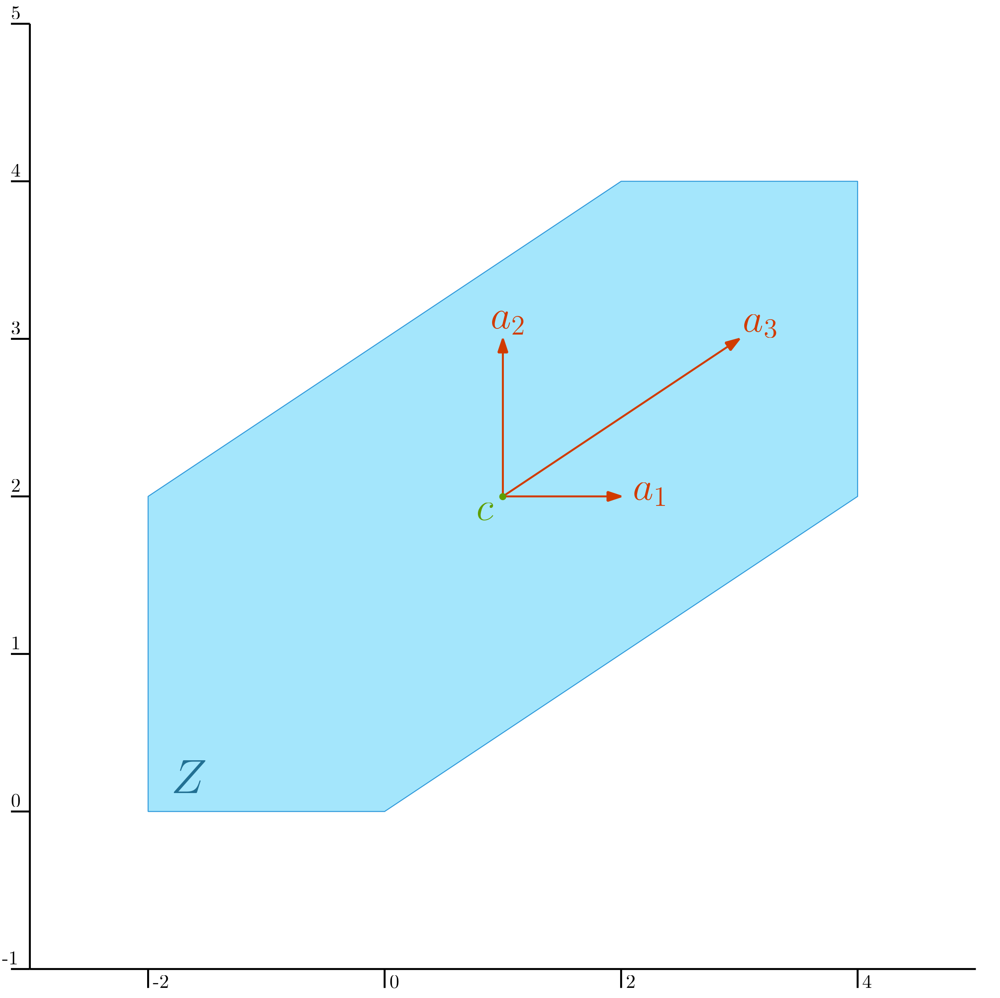

.. _sec-zonotope:

.. _subsec-zonotope-zonotope:

Zonotopes
=========

  Main author: `Maël Godard <https://godardma.github.io/>`_

The following classes represent zonotopes.

Zonotope
--------

A zonotope is a convex and symmetric polytope. 
It can be represented as the Minkowski sum of a finite number of line segments, which are called its generators.

In Codac, zonotopes are represented by the class :class:`Zonotope`. A zonotope is defined by its center and its generators.
The center is a :class:`Vector`, noted :math:`\mathbf{c}`, and the generators are stored in a :class:`Matrix`, noted :math:`\mathbf{A}`. 
Each column of the matrix corresponds to a generator.

The resulting zonotope is:

.. math::
  Z = \mathbf{c} + \mathbf{A} \cdot [-1,1]^m

Where :math:`m` is the number of generators (i.e., the number of columns of the matrix :math:`A`).

For example, let us consider the following zonotope in :math:`\mathbb{R}^2`:

.. math::
  Z = \left(\begin{array}{c} 1\\ 2\\ \end{array}\right) + \left(\begin{array}{ccc} 1 & 0 & 2 \\ 0 & 1 & 1 \end{array}\right) \cdot [-1,1]^3

It can be constructed in Codac as follows:

.. tabs::
  
  .. code-tab:: py

    c = Vector([1,2])
    A = Matrix([[1,0,2],[0,1,1]])

    Z = Zonotope(c, A)

  .. code-tab:: c++

    Vector c({1,2});
    Matrix A({{1,0,2},{0,1,1}});

    Zonotope Z(c, A);

  .. code-tab:: matlab

    c = Vector({1,2});
    A = Matrix({{1,0,2},{0,1,1}});

    Z = Zonotope(c,A);

The resulting zonotope is represented in the figure below:

Additional methods are provided to handle zonotopes.

- `box()`: gives the bounding box of the zonotope. Returns an :class:`IntervalVector`.
- `proj(v)`: Projects the zonotope on a given subspace, defined by the vector of indices `v` (:class:`std::vector\<Index\>`). Returns a :class:`Zonotope`.

.. _subsec-zonotope-parallelepiped:

Parallelepiped
--------------

A parallelepiped is a special case of zonotope, where the number of generators is equal or less than the dimension of the space.

It inherits from the `Zonotope` class, and thus has the same properties and methods. In addition, it defines the following methods:

- `vertices()`: gives the vertices of the parallelepiped. Returns a :class:`std::vector\<Vector\>`.
- `contains(v)`: checks if the point `v` is contained in the parallelepiped. Returns a :class:`BoolInterval`. **The matrix A must be invertible**
- `is_superset(x)`: checks if the parallelepiped is a superset of the :class:`IntervalVector` `x`. Returns a :class:`BoolInterval`. **The matrix A must be invertible**