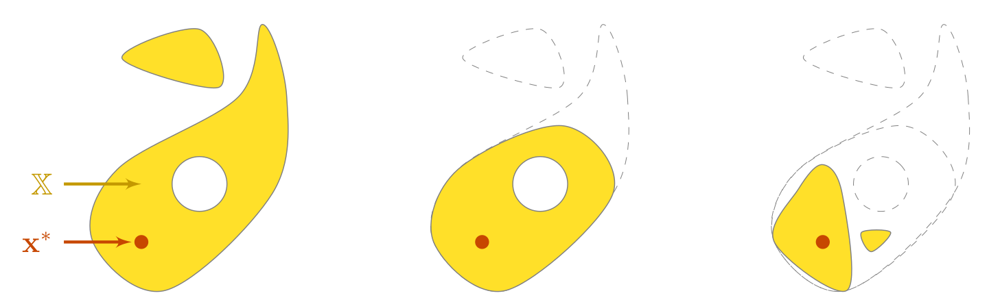
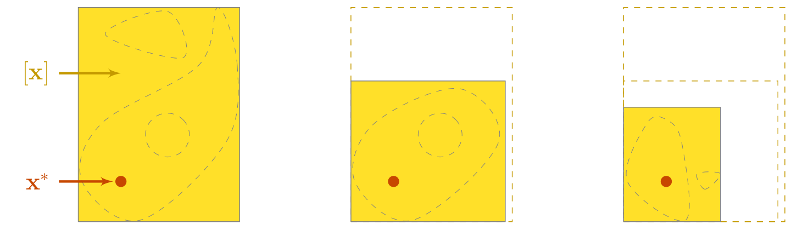

.. _sec-intro:

Introduction
============

Codac is designed to deal with static and dynamical systems that are usually encountered in robotics. 
It stands on constraint programming: a paradigm in which the properties of a solution to be found (*e.g.* the pose of a robot, the location of a landmark) are stated by constraints coming from the equations of the problem.

Then, a solver performs **constraint propagation** on the variables and provides a reliable set of feasible solutions corresponding to the considered problem. In this approach, the user concentrates on *what* is the problem instead of *how* to solve it, thus leaving the computer dealing with the *how*. The strength of this declarative paradigm lies in its simpleness, as it allows one to describe a complex problem without requiring the knowledge of resolution tools coming with specific parameters to choose.

The following figure presents a conceptual view of a constraint propagation.

  In this theoretical view, a domain :math:`\mathbb{X}` depicted in yellow is known to enclose a solution :math:`\mathbf{x}^*` pictured by a red dot and consistent with two constraints :math:`\mathcal{L}_1` and :math:`\mathcal{L}_2`. The estimation of :math:`\mathbf{x}^*` consists in reducing :math:`\mathbb{X}` while satisfying :math:`\mathcal{L}_1` and :math:`\mathcal{L}_2`. After the propagation process, the set of feasible solutions has been reduced by removing vectors that were not consistent with the constraints: we obtain a finer approximation of :math:`\mathbf{x}^*`.

.. When working with finite domains, a propagation technique can be used to simplify a problem. The process is run several times up to a fixed point reached when the domains cannot be reduced anymore. Interval analysis can be efficiently used for this purpose, taking advantage of interval arithmetic and its capacity to preserve any feasible solution.

Variables
---------

The unknown solutions of a system are reals :math:`x`, vectors :math:`\mathbf{x}`, or in the dynamic case: trajectories denoted by :math:`x(\cdot)`, or :math:`\mathbf{x}(\cdot)` in the vector case.

.. admonition:: Dot notation :math:`(\cdot)`

  Note that in the literature, the dot notation :math:`(\cdot)` may be used to represent the independent system variable (time).
  This notation may be chosen in order to clearly distinguish a whole trajectory :math:`\mathbf{x}(\cdot):\mathbb{R}\to\mathbb{R}^n` from a local evaluation: :math:`\mathbf{x}(t)\in\mathbb{R}^n`. Indeed, the time :math:`t` may also be a variable to be estimated.

In the constraint programming approach, the estimation of a variable consists in computing its reliable enclosure set, defined here as an interval of values.
The obtained set is said **reliable**: the resolution guarantees that no solution can be lost during the solving process, according to the equations defining the problem. In other words, a variable :math:`x` to be estimated will surely be enclosed in the resulting set :math:`[x]`.

Domains
-------

As depicted in the figure, a variable is known to be enclosed in some domain :math:`\mathbb{X}` on which we will apply constraints.
In Codac, the domains are represented by the following sets:

- for reals :math:`x`, domains are intervals :math:`[x]`;
- for vectors :math:`\mathbf{x}`, we define boxes :math:`[\mathbf{x}]`;
- for trajectories :math:`x(\cdot)`, we introduce tubes :math:`[x](\cdot)`.

Constraints
-----------

The approach consists in defining the problem as a set of constraints. They usually come from state equations, numerical models, or measurements.
In mobile robotics, we usually have to deal with:

- non-linear functions: :math:`x_3=\cos\big(x_1+\exp(x_2)\big)`
- differential equations: :math:`\dot{x}(\cdot)=f\big(x(\cdot),u(\cdot)\big)`
- temporal delays: :math:`x(t)=y(t-\tau)`
- time uncertainties: :math:`x(t)=y`, with :math:`t\in[t]`
- *etc.*

The aim of Codac is to easily deal with these constraints in order to eventually characterize sets of variables compliant with the defined rules.
Each constraint comes from equations or measurements. And each constraint will be applied by means of an operator called **contractor**.

Contractors
-----------

Contractors are operators designed to reduce domains without losing any solution consistent with the related constraint. In Codac, the contractors act on intervals, boxes and tubes.

  Implementation of the constraints :math:`\mathcal{L}_1` and :math:`\mathcal{L}_2` of the previous figure by means of respective contractors :math:`\mathcal{C}_1` and :math:`\mathcal{C}_2`. On this theoretical example, the domain :math:`\mathbb{X}` is now a subset of a box :math:`[\mathbf{x}]`, easily representable and contractible.

Codac already provides a catalog a contractors that one can use to deal with many applications. New contractors can also be designed and embedded in this framework without difficulty.

.. admonition:: Constraint programming *vs* probabilistic methods

  The approach does differ from probabilistic methods in regards of the nature of the estimated solution. Probabilistic methods compute punctual potential solutions – for instance a vector – while in set-membership ones, it is the **set of all feasible solutions** that is evaluated, and thus an infinity of potential solutions.

  Another main distinction lies in the way things are computed: with set-membership methods, estimations are not randomly performed. **Computations are deterministic**: given a set of parameters or inputs, algorithms will always output the same result.

.. _sec-intro-separators:

Separators
----------

A contractor answers one question: *which part of this box can be discarded, because it surely contains no solution?* It says nothing about the part it keeps, which may hold solutions, non-solutions, or both.

A **separator** answers the two symmetrical questions at once. Applied to a box :math:`[\mathbf{x}]`, a separator :math:`\mathcal{S}` associated with a set :math:`\mathbb{S}` returns a pair of boxes:

- an **inner** box, obtained by removing from :math:`[\mathbf{x}]` what is certainly *inside* :math:`\mathbb{S}`;
- an **outer** box, obtained by removing from :math:`[\mathbf{x}]` what is certainly *outside* :math:`\mathbb{S}`.

A separator is therefore the pair made of a contractor for :math:`\mathbb{S}` and a contractor for its complement :math:`\overline{\mathbb{S}}`, and what falls outside both boxes is the part of :math:`[\mathbf{x}]` that has been *proved* to belong to :math:`\mathbb{S}`. This is the essential gain over a contractor alone: besides eliminating, we can now certify.

In Codac, this is the ``Sep`` interface: its ``separate()`` method takes a box and returns a ``BoxPair``, whose ``inner`` and ``outer`` members are the two boxes described above. Most contractors of the catalog have a separator counterpart, ``CtcInverse`` and ``SepInverse`` for instance, and the two families are listed side by side in :ref:`sec-ctc`.

The practical consequence is visible on the two examples of the home page. The first one is solved with the contractor ``CtcInverse``: the blue boxes are guaranteed to be solution-free, and nothing is claimed about the rest. The second one is solved with the separator ``SepInverse``: the blue boxes are again guaranteed to have no solution, but *in addition* any vector taken in a green box is a solution of the inequality.

.. _sec-intro-pavings:

Pavings
-------

Contractors and separators reduce a box, but a single box is rarely a satisfactory description of a solution set: as soon as the set is not box-shaped, its interval enclosure is a coarse over-approximation — the *pessimism* mentioned below.

The way out is to **bisect**. A box that can no longer be contracted is cut in two, and each half is contracted in turn; the process is repeated until the remaining boxes are smaller than a precision :math:`\epsilon` given by the user. The resulting collection of non-overlapping boxes is called a **paving**, and the algorithm producing it is known as **SIVIA** (*Set Inversion Via Interval Analysis*).

The boxes of a paving are of three kinds:

- those proved to contain no solution;
- those proved to contain only solutions — which only a separator, or a direct inclusion test, can establish;
- those still undecided, which are the ones the bisection stops on when they become smaller than :math:`\epsilon`. They form the boundary of the solution set, and their total volume is the price paid for the guarantee.

In Codac, the paving of a box is obtained with a single call, ``pave(x0, c, eps)``, which accepts a contractor or a separator and returns a ``PavingOut`` or a ``PavingInOut`` accordingly. This is what both examples of the home page do. The function ``sivia(x0, f, y, eps)`` provides the same service directly from a function :math:`\mathbf{f}` and a target domain :math:`[\mathbf{y}]`, without an explicit contractor.

The choice of :math:`\epsilon` is the usual compromise: the finer it is, the thinner the undecided boundary, and the more boxes to compute.

Reliable outputs
----------------

One of the advantages of this set-membership approach is the reliable outputs that are obtained.
By *reliable*, we mean that all sources of uncertainties are taken into account, including:

- model parameter uncertainties
- measurement noise
- uncertainties related to time discretization
- linearization truncations
- approximation of real numbers by floating-point values

The outcomes are intervals and tubes that are guaranteed to contain the solutions of the system.
This is well suited for proof purposes as we always consider worst-case possibilities when delineating the boundaries of the solution sets.

The main drawback however, is that we may obtain large sets that may not be useful to characterize the solutions of the problem. We call this *pessimism*. This can be overcome by reformulating some constraints or by using bisections on sets.