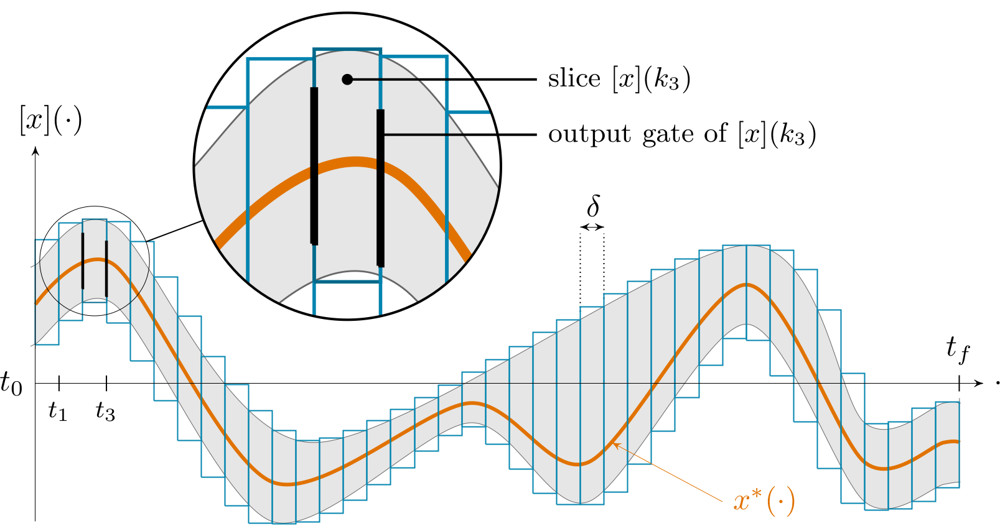

.. _sec-domains-tubes:

Tubes
=====

  Main author: `Simon Rohou <https://www.simon-rohou.fr/research/>`_

Introduction
------------

A tube is a set of trajectories. More precisely, if :math:`\mathcal{F}(\mathbb{R}\to\mathbb{R}^n)` denotes the set of trajectories with values in :math:`\mathbb{R}^n`, a tube :math:`\mathbb{X}(\cdot)` is a set-valued map

.. math::

   \mathbb{X}(\cdot): \mathbb{R} \to \mathcal{P}(\mathbb{R}^n)

such that

.. math::

   \mathbf{x}(\cdot)\in\mathbb{X}(\cdot)
   \;\Longleftrightarrow\;
   \forall t,\ \mathbf{x}(t)\in\mathbb{X}(t).

In other words, a tube encloses trajectories pointwise in time: for every time :math:`t`, the value :math:`\mathbf{x}(t)` must belong to the set :math:`\mathbb{X}(t)`. This definition is intentionally general. It does not encode additional temporal information such as continuity, monotonicity, or derivative constraints. Such properties may be handled separately, for instance by contractors or by combining several tubes.

This point of view naturally extends interval and box representations. In the most common cases, :math:`\mathbb{X}(t)` is an interval, a box, or a matrix of intervals, but in principle it may be any codomain type for which suitable set operations are available.

In Codac C++, this generality is reflected by the template ``SlicedTube<T>``. In principle, ``T`` can be any codomain type compatible with the sliced-tube algorithms.
The library naturally provides and primarily uses:

* ``SlicedTube<Interval>``,
* ``SlicedTube<IntervalVector>``,
* ``SlicedTube<IntervalMatrix>``.

These are the most common tube types in practice. In Python and Matlab, only these standard sliced-tube classes are currently exposed through the bindings.
In C++, instantiations such as ``SlicedTube<ConvexPolygon>`` are allowed, provided the required tube operations are available for that domain.

This chapter documents the *sliced tube* implementation currently available in Codac. In this implementation, a tube is represented over an explicit temporal partition stored in a :class:`~codac.TDomain`. Each temporal element is a :class:`~codac.TSlice`, and each application-level value over one temporal element is represented by a :class:`~codac.Slice`. The main user-facing object is therefore a :class:`~codac.SlicedTube`.

  
  An example of sliced tube :math:`[x](\cdot)`, as implemented in Codac. The tube is made as a list of interval or box slices. In practice, the sampling :math:`\delta` is not necessarily constant.

Compared with the previous Codac v1 implementation, these tubes are not only functions of time: they also have shared data structures built on a common temporal partition. Refining the time partition of one tube may therefore update the internal slice structure of all tubes attached to the same :class:`~codac.TDomain`. This design is central to the current implementation. It simplifies the user experience: a temporal modification applied to one tube is implicitly propagated to the others, so multi-tube operations such as arithmetic combinations or contractions can still be performed easily on a consistent shared time basis.

Conceptually, the data model is:

.. code-block:: text

   TDomain
     ├── TSlice #0  ----> Slice<X> for tube x
     │                └-> Slice<Y> for tube y
     ├── TSlice #1  ----> Slice<X> for tube x
     │                └-> Slice<Y> for tube y
     └── ...
     

This chapter is organized as follows:

.. toctree::
  :maxdepth: 1

  tdomain
  slicedtube