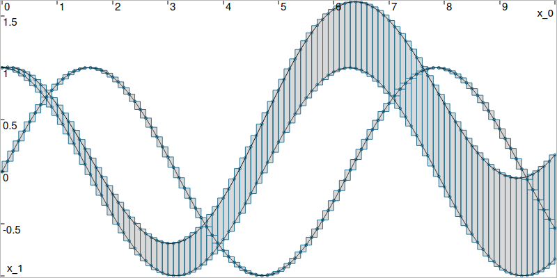
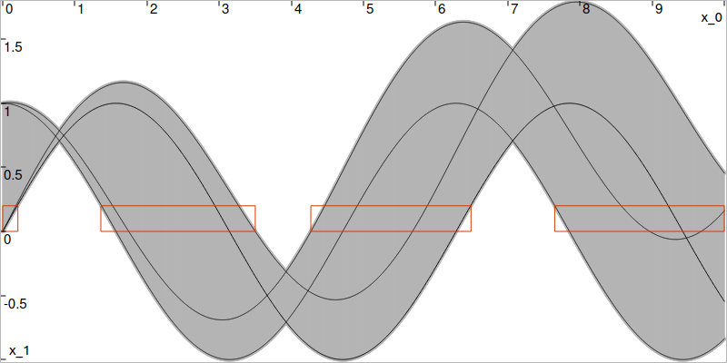

.. _sec-domains-tubes-slicedtube:

The SlicedTube class
====================

  Main author: `Simon Rohou <https://www.simon-rohou.fr/research/>`_

A :class:`~codac.SlicedTube` is a tube defined over a shared :class:`~codac.TDomain`.
For each temporal slice stored in the temporal partition, the tube owns one :class:`~codac.Slice` object storing its codomain over that temporal support. The codomain type is typically :class:`~codac.Interval` or :class:`~codac.IntervalVector`, or any domain type defined by the user. The same temporal domain can be shared by many tubes.

Creating sliced tubes
---------------------

In Codac C++, :class:`~codac.SlicedTube` is a generic class template ``SlicedTube<T>``. The codomain type ``T`` is not restricted to intervals or boxes: in principle, any domain type compatible with the sliced-tube API can be used.

In practice, the most common sliced-tube types are:

* ``SlicedTube<Interval>``,
* ``SlicedTube<IntervalVector>``,
* ``SlicedTube<IntervalMatrix>``.

These standard tube types are also the ones exposed in the Python and Matlab bindings.

In C++, template argument deduction is available for the constructors based on the arguments. In the examples below, comments make the deduced type explicit when useful.

A sliced tube can be created from:

* a constant codomain,
* an analytic function of one scalar variable,
* a sampled or an analytic trajectory,
* or another sliced tube (copy constructor).

.. tabs::

  .. group-tab:: Python

    .. literalinclude:: src.py
      :language: py
      :start-after: [slicedtube-class-1-beg]
      :end-before: [slicedtube-class-1-end]
      :dedent: 4

  .. group-tab:: C++

    .. literalinclude:: src.cpp
      :language: c++
      :start-after: [slicedtube-class-1-beg]
      :end-before: [slicedtube-class-1-end]
      :dedent: 4

  Created tubes :math:`[x_f](\cdot)=[\sin(\cdot),\sin(\cdot)]` and :math:`[x_u](\cdot)=[\cos(\cdot),\cos(\cdot)+\frac{\cdot}{10}]`, made of 100 slices.

Basic properties
----------------

A sliced tube exposes:

* ``size()`` for the codomain dimension,
* ``shape()`` for matrix-like codomain shapes,
* ``tdomain()`` and ``t0_tf()`` from the base classes,
* ``nb_slices()`` for the number of temporal elements,
* ``codomain()`` for the global codomain hull,
* ``volume()`` for the sum of non-gate slice volumes,
* ``is_empty()`` and ``is_unbounded()``.

Accessing slices and iterating
------------------------------

You can access the first and last slices directly:

* ``first_slice()``
* ``last_slice()``

and you can retrieve a slice from a temporal-domain iterator or from a ``TSlice`` pointer.
The class also defines custom iterators so that iterating on a ``SlicedTube`` yields application-level :class:`~codac.Slice` objects rather than raw ``TSlice`` objects.

.. tabs::

  .. group-tab:: Python

    .. literalinclude:: src.py
      :language: py
      :start-after: [slicedtube-class-2-beg]
      :end-before: [slicedtube-class-2-end]
      :dedent: 4

  .. group-tab:: C++

    .. literalinclude:: src.cpp
      :language: c++
      :start-after: [slicedtube-class-2-beg]
      :end-before: [slicedtube-class-2-end]
      :dedent: 4

Setting values and refining the partition
-----------------------------------------

A sliced tube can be updated globally or locally:

* ``set(codomain)`` sets all slices to the same codomain,
* ``set(codomain, t)`` sets the value at one time instant,
* ``set(codomain, [ta,tb])`` sets all temporal elements intersecting an interval,
* ``set_ith_slice(codomain, i)`` sets one stored slice by index.

The key point is that local assignments may refine the underlying :class:`~codac.TDomain`.
For example, setting a value at one scalar time creates an explicit gate if necessary. Similarly, setting a value over an interval may create new temporal boundaries at the interval endpoints.

.. note::

  Because the temporal domain is shared, such refinements are structural operations. If several tubes share the same ``TDomain``, all of them will observe the new partition.

.. tabs::

  .. group-tab:: Python

    .. literalinclude:: src.py
      :language: py
      :start-after: [tdomain-class-4-beg]
      :end-before: [tdomain-class-4-end]
      :dedent: 4

  .. group-tab:: C++

    .. literalinclude:: src.cpp
      :language: c++
      :start-after: [tdomain-class-4-beg]
      :end-before: [tdomain-class-4-end]
      :dedent: 4

Evaluation
----------

A sliced tube :math:`[x](\cdot)` can be evaluated over a temporal interval :math:`[t]` with ``x(t)``. The implementation walks through all relevant temporal slices, evaluates each local slice, and unions the results. If the query interval is not included in the temporal domain, the result is the unbounded value of the codomain type (for interval tubes: :math:`[-\infty,\infty]`).

When a derivative tube ``v`` is available, the overload ``x(t,v)`` uses per-slice derivative-aware evaluation and unions the resulting enclosures. This is available for ``Interval`` and ``IntervalVector`` codomain types.

.. tabs::

  .. group-tab:: Python

    .. literalinclude:: src.py
      :language: py
      :start-after: [slicedtube-class-4-beg]
      :end-before: [slicedtube-class-4-end]
      :dedent: 4

  .. group-tab:: C++

    .. literalinclude:: src.cpp
      :language: c++
      :start-after: [slicedtube-class-4-beg]
      :end-before: [slicedtube-class-4-end]
      :dedent: 4

Inversion
---------

The inversion of a sliced tube :math:`[x](\cdot)`, denoted :math:`[x]^{-1}([y])`, is defined by

.. math::

   [x]^{-1}([y])
   =
   \left\{\, t \mid [x](t)\cap [y]\neq\varnothing \,\right\}
   =
   \bigcup_{y\in [y]} \left\{\, t \mid y\in [x](t) \,\right\}.

It is illustrated by the figure below. Intuitively, the inversion returns the set of time values whose image under :math:`[x](\cdot)` intersects the target set :math:`[y]`.

Depending on the overload, the ``invert()`` methods

* ``invert(y, t=[...])``
* ``invert(y, v_t, t=[...])``
* ``invert(y, v, t=[...])``
* ``invert(y, v_t, v, t=[...])``

return either:

* one interval enclosing the union of all preimages,
* or the different connected components of the inversion in a vector of :class:`~codac.Interval` objects.

When a derivative tube ``v`` is provided, Codac uses derivative information slice by slice in order to compute sharper inverse images.

The following example computes the different connected components of the inversion :math:`[x]^{-1}([0,0.2])` over a temporal subdomain, and then draws their projections in red.

.. tabs::

  .. group-tab:: Python

    .. literalinclude:: src.py
      :language: py
      :start-after: [slicedtube-class-5-beg]
      :end-before: [slicedtube-class-5-end]
      :dedent: 4

  .. group-tab:: C++

    .. literalinclude:: src.cpp
      :language: c++
      :start-after: [slicedtube-class-5-beg]
      :end-before: [slicedtube-class-5-end]
      :dedent: 4

  Example of tube inversion for a given tube :math:`[x](\cdot)`. The red boxes correspond to the connected components of :math:`[x]^{-1}([0,0.2])`.

.. doxygengroup:: codac2_slicedtube_inversion
  :project: codac

Tube operations
---------------

Standard pointwise operations are available on sliced tubes and are applied slice by slice.

For two tubes, binary operators require both operands to share the same :class:`~codac.TDomain`. This makes tube expressions easy to combine once the tubes have been built on a common temporal support.

The following operators are available:

* union and intersection: ``|`` and ``&``,
* arithmetic operations: ``+``, ``-``, ``*``, ``/``,
* in-place variants: ``|=``, ``&=``, ``+=``, ``-=``, ``*=``, ``/=``.

For scalar interval tubes, several usual nonlinear functions are also provided, including ``sqr``, ``sqrt``, ``pow``, ``exp``, ``log``, ``sin``, ``cos``, ``tan``, ``atan2``, ``abs``, ``min``, ``max``, ``sign``, ``floor`` and ``ceil``.

.. tabs::

  .. group-tab:: Python

    .. literalinclude:: src.py
      :language: py
      :start-after: [slicedtube-class-6-beg]
      :end-before: [slicedtube-class-6-end]
      :dedent: 4

  .. group-tab:: C++

    .. literalinclude:: src.cpp
      :language: c++
      :start-after: [slicedtube-class-6-beg]
      :end-before: [slicedtube-class-6-end]
      :dedent: 4

For vector-valued codomains, pointwise arithmetic is also available. In particular, the product of a matrix tube and a vector tube returns a vector tube.

.. tabs::

  .. group-tab:: Python

    .. literalinclude:: src.py
      :language: py
      :start-after: [slicedtube-class-7-beg]
      :end-before: [slicedtube-class-7-end]
      :dedent: 4

  .. group-tab:: C++

    .. literalinclude:: src.cpp
      :language: c++
      :start-after: [slicedtube-class-7-beg]
      :end-before: [slicedtube-class-7-end]
      :dedent: 4

Integration and primitives
--------------------------

Reliable integral computations are available on tubes.

.. figure:: tube_integ_inf.png
  :width: 70%
  
  Hatched part depicts :math:`\int_{a}^{b}x^-(\tau)d\tau`, the lower bound of :math:`\int_{a}^{b}[x](\tau)d\tau`.

The computation is reliable even for tubes defined from analytic functions, because it stands on the tube's slices that are reliable enclosures. The result is an outer approximation of the integral of the tube represented by these slices:

.. figure:: tube_lb_integral_slices.png
  :width: 70%

  Outer approximation of the lower bound of :math:`\int_{a}^{b}[x](\tau)d\tau`.

.. doxygengroup:: codac2_slicedtube_integrals
   :project: codac

Inflation, extraction, and algebraic helpers
--------------------------------------------

A sliced tube can be inflated either by a constant radius or by a time-varying
sampled radius. Inflation is performed in place.

.. tabs::

  .. group-tab:: Python

    .. literalinclude:: src.py
      :language: py
      :start-after: [slicedtube-class-8-beg]
      :end-before: [slicedtube-class-8-end]
      :dedent: 4

  .. group-tab:: C++

    .. literalinclude:: src.cpp
      :language: c++
      :start-after: [slicedtube-class-8-beg]
      :end-before: [slicedtube-class-8-end]
      :dedent: 4

For vector-valued tubes, the API also provides convenient extraction operators:

* ``x[i]`` returns the :math:`i`-th scalar component as a
  :class:`~codac.SlicedTube`,
* ``x.subvector(i,j)`` returns a subvector tube.

The extracted tubes keep the same temporal partition as the original one.

.. tabs::

  .. group-tab:: Python

    .. literalinclude:: src.py
      :language: py
      :start-after: [slicedtube-class-9-beg]
      :end-before: [slicedtube-class-9-end]
      :dedent: 4

  .. group-tab:: C++

    .. literalinclude:: src.cpp
      :language: c++
      :start-after: [slicedtube-class-9-beg]
      :end-before: [slicedtube-class-9-end]
      :dedent: 4

Involving a tube in an analytic expression
------------------------------------------

The method ``.as_function()`` wraps a sliced tube as an analytic operator so that it can be embedded inside analytic expressions. This is a convenient bridge between the tube API and the analytic-expression API, see :ref:`the section on temporal operators <sec-functions-temporal-operator>` for its use.