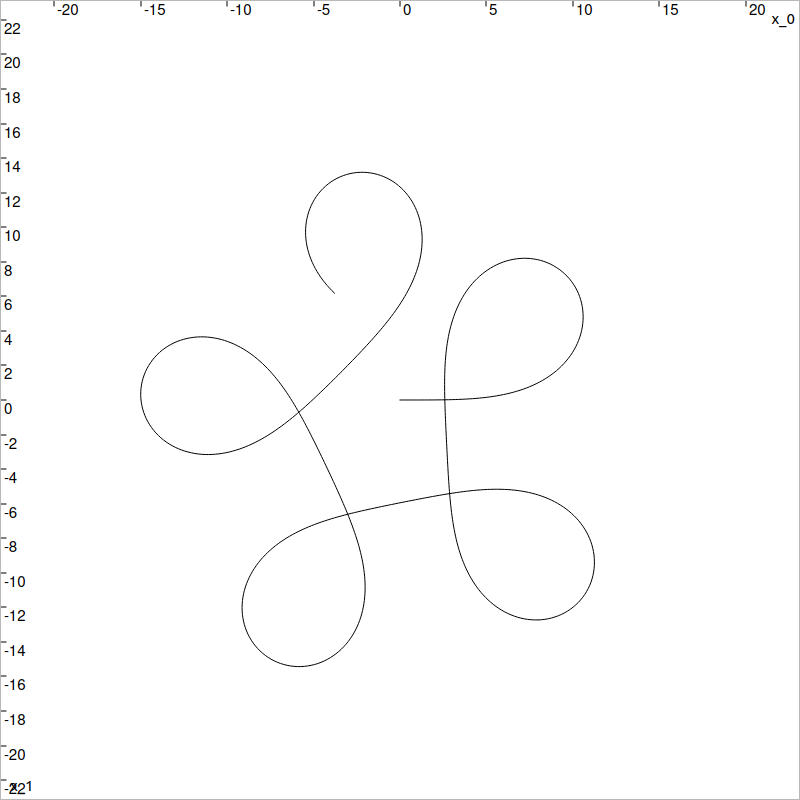
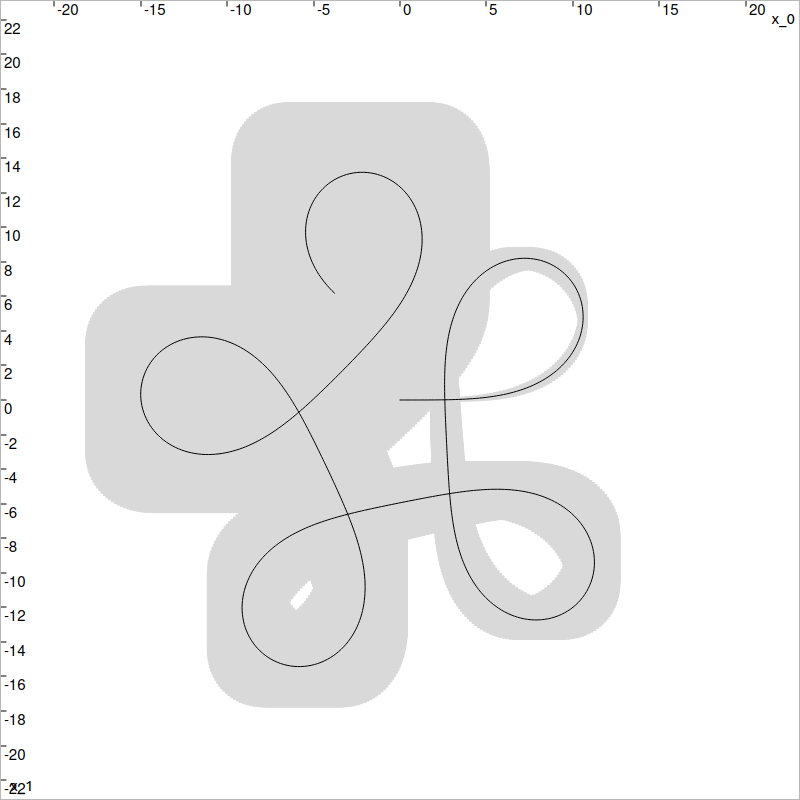
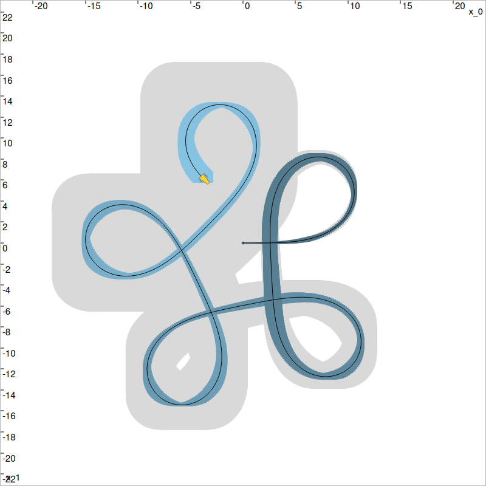

.. _sec-tuto-cprob-lesson-d:

[new] Lesson D: SLAM
====================

  Main authors: `Simon Rohou <https://www.simon-rohou.fr/research/>`_

We propose to apply interval tools for solving a classical state estimation problem of Simultaneous Localization And Mapping (SLAM).

A tank robot :math:`\mathcal{R}`, described by the state vector
:math:`\mathbf{x}\in\mathbb{R}^3` depicting its position
:math:`(x_1,x_2)^\intercal` and its heading :math:`x_3`, is evolving among a set of
landmarks :math:`\mathbf{b}^k\in\mathbb{R}^2` with a constant speed :math:`v=10`. It is equipped with a compass for
measuring its heading :math:`x_3` with some uncertainties.

Formalism
---------

We are addressing the following state estimation problem:

.. math::
  :label: eq-state

  \left\{
  \begin{array}{lll}
  \dot{\mathbf{x}}(t)=\mathbf{f}\big(\mathbf{x}(t),u(t)\big) &  & \textrm{(evolution equation)}\\
  d_i^k=g\big(\mathbf{x}(t_i),\mathbf{b}^k\big) &  & \textrm{(observation equation)}
  \end{array}
  \right.

The evolution of the state is given by:

.. math::
  :label: eq-f

  \dot{\mathbf{x}}=
  \mathbf{f}(\mathbf{x},u)=\left(
  \begin{array}{c}
  10\cos(x_3) \\
  10\sin(x_3) \\
  u
  \end{array}
  \right),

and the system input :math:`u` (rotation rate) is expressed as:

.. math::

  u(t) = 3\sin^2(t)+\frac{t}{100}.

The observation function :math:`g` is the distance function between a position
:math:`(x_1,x_2)^\intercal` and a landmark :math:`(b_1^k,b_2^k)^\intercal`.

.. admonition:: Exercise

   **D.1.** Update your current version of Codac:

   .. code-block:: bash

    pip install codac --upgrade --pre
    # Option --pre has to be set because Codac v2 is only available in pre-release

The following instructions are given in Python, but feel free to use C++ or Matlab if you prefer.

Simulation
----------

The following code provides a simulation of the actual but unknown trajectory :math:`\mathbf{x}^*(\cdot)`, without uncertainties.
This code can be used as a starting point of your project.

.. code-block:: python

  from codac import *
  import random
  import numpy as np

  dt = 0.02 # temporal discretization 
  t0tf = Interval(0,15) # [t0,tf]

  # System input
  t = ScalarVar()
  u = AnalyticTraj(AnalyticFunction([t],3*(sin(t)^2)+t/100), t0tf).sampled(dt)

  truth_heading = u.primitive()
  truth_px = (cos(truth_heading)*10.).primitive()
  truth_py = (sin(truth_heading)*10.).primitive()

  # Actual state trajectory
  # Note that this trajectory is unknown of the resolution
  var_s1,var_s2,var_s3 = ScalarVar(),ScalarVar(),ScalarVar()
  f_concat = AnalyticFunction([var_s1,var_s2,var_s3], [var_s1,var_s2,var_s3])
  truth_x = f_concat.traj_eval(truth_px,truth_py,truth_heading)

  DefaultFigure.draw_trajectory(truth_x)

Using VIBes, you should visualize these states:

  
  Unknown actual trajectory, to be estimated.

Deadreckoning
-------------

The robot knows its initial state: :math:`\mathbf{x}(0)=(0,0,0)^\intercal`.
Deadreckoning consists in estimating the following positions of the robot without
exteroceptive measurements (*i.e.* without distances from the landmarks). In this
section, we will compute the set of feasible positions of :math:`\mathcal{R}`,
considering only heading measurements and the evolution function :math:`\mathbf{f}`.

.. admonition:: Exercise
  
  **D.2. Domains.**
  The set of feasible positions along time is a *tube* (interval of trajectories).
  We create a tube :math:`[\mathbf{x}](t)` using:

  .. code-block:: python

    tdomain = create_tdomain(t0tf, dt)
    x = SlicedTube(tdomain, IntervalVector(3))

  where ``tdomain`` is the temporal discretization over :math:`[t_0,t_f]`,
  and ``dt`` is the discretization parameter. Here, ``x`` is a 3d tube.

  At this point, :math:`\forall t\in[t_0,t_f],~ [\mathbf{x}](t)=[-\infty,\infty]^3`:
  the states are completely unknown.

  This can be verified, for instance at :math:`t=0`, with:

  .. code-block:: python

    print(x(0.))

.. admonition:: Exercise

  **D.3. Heading measurements.**
  In practice, the headings :math:`x_3(t)` are measured with some uncertainties known to be
  bounded in :math:`[-0.03,0.03]`. We set these bounded measurements in the last
  component of the tube vector :math:`[\mathbf{x}](t)` as:

  .. code-block:: python

    x = tube_cart_prod(
      SlicedTube(tdomain, IntervalVector(2)),
      # Heading measurement with bounded uncertainties:
      SlicedTube(tdomain, truth_heading).inflate(0.03)
    )

.. admonition:: Exercise

  **D.4.  Initial condition.**
  The initial state :math:`\mathbf{x}(0)` (position and heading) is known, which
  can be implemented in the tube with:

  .. code-block:: python

    x.set([0,0,0], 0.) # setting a vector value at t=0
    print(x(0.))

Now that a domain (a tube) has been defined for enclosing the estimates together
with their uncertainties, it remains to define contractors for narrowing their bounds.

In deadreckoning, only Eq. :eq:`eq-f` is considered:
:math:`\dot{\mathbf{x}}(t)=\mathbf{f}(\mathbf{x}(t))`. This can be processed with
two contractors, one for dealing with :math:`\mathbf{v}(t)=\mathbf{f}(\mathbf{x}(t))`,
and one for :math:`\dot{\mathbf{x}}(t)=\mathbf{v}(t)`.

The new tube :math:`[\mathbf{v}](t)` will enclose the feasible derivatives of the
possible states in :math:`[\mathbf{x}](t)`.

.. admonition:: Exercise

  **D.5. Contractors.** As for :math:`[\mathbf{x}](t)`, create another 3d ``SlicedTube`` for
  :math:`[\mathbf{v}](t)`, called ``v``.

  Then, create a contractor for :math:`\mathbf{v}(t)=\mathbf{f}(\mathbf{x}(t))`. The associated constraint is expressed as an implicit form :math:`\mathbf{f}(\mathbf{x}(t),\mathbf{v}(t))=\mathbf{0}`.

  .. code-block:: python

    var_x,var_v = VectorVar(3),VectorVar(3)
    f_evol = AnalyticFunction([var_x,var_v], [
        var_v[0]-10*cos(var_x[2]),
        var_v[1]-10*sin(var_x[2]),
      ])

    ctc_f = CtcInverse(f_evol, [0,0]) # [0,0] stands for the implicit form f(..)=0

  Create a contractor for :math:`\dot{\mathbf{x}}(t)=\mathbf{v}(t)`:

  .. code-block:: python

    ctc_deriv = CtcDeriv()

We recall that contractors are algorithms for reducing sets of feasible values (intervals, boxes,
tubes..).

.. admonition:: Exercise

  **D.6. Deadreckoning estimation.** At this point, you can implemented an algorithm for deadreckoning, by calling the previously defined contractors.

  .. code-block:: python

    ctc_f.contract_tube(x,v)
    ctc_deriv.contract(x,v)

.. admonition:: Exercise

  **D.7. Display.** Eventually, the contracted tube :math:`[\mathbf{x}](t)` can be displayed with:

  .. code-block:: python

    DefaultFigure.draw_tube(x, [Color.light_gray(),Color.light_gray()])
    DefaultFigure.draw_trajectory(truth_x)

You should obtain the following result:

  In gray: tube :math:`[\mathbf{x}](t)` enclosing the estimated trajectories of the
  robot. The actual but unknown trajectory is depicted in black. With interval methods,
  the computations are guaranteed: the actual trajectory cannot be outside the tube.
  However, the tube may be large in case of poor localization, as it is the case up
  to now without state observations.

Range-only localization
-----------------------

The obtained tube grows with time, illustrating a significant drift of the robot.
We now rely on distances measured from known landmarks for reducing this drift.
This amounts to a non-linear state estimation problem: function :math:`g` of
System :eq:`eq-state` is a distance function. Non-linearities can be difficult
to solve with conventional methods.

.. admonition:: Exercise

  **D.8. Landmarks.** Define five landmarks with:

  .. code-block:: python

    b = [(6,12),(-2,-5),(-3,20),(3,4),(-10,0)]

.. admonition:: Exercise

  **D.9. Range observations.** In a loop, for each :math:`t_i\in\{0,1,\dots,15\}`, compute the distance measured
  from a random landmark:

  .. code-block:: python

    Y = []
    for ti in np.arange(0,15):
      k = random.randint(0,len(b)-1) # a random landmark is perceived
      d = sqrt(sqr(truth_x(ti)[0]-b[k][0])+sqr(truth_x(ti)[1]-b[k][1]))
      Y.append([k,ti,d])

.. admonition:: Exercise

  **D.10. Measurement uncertainty.** The measurements come with some errors (not computed here) that are known to be
  bounded within :math:`[-0.03,0.03]`. We use intervals for enclosing the observations:

  .. code-block:: python

    ...
      d += Interval(-0.03,0.03)
      # or equivalently: d.inflate(3e-2)

As in the previous lessons, a fixpoint function can be used to manage the contractors automatically.
In another ``for`` loop, we will combine contractors using a fixpoint method, in order to improve the localisation of the robot.

.. admonition:: Exercise

  **D.11. Observation contractors.** The state observations are added to the
  set of constraints by means of a new distance contractor linking the state to the position of a landmark:

  .. code-block:: python

    var_b = VectorVar(2)
    var_d = ScalarVar()
    f_dist = AnalyticFunction([var_x,var_b,var_d], sqrt(sqr(var_x[0]-var_b[0])+sqr(var_x[1]-var_b[1]))-var_d)
    ctc_dist = CtcInverse(f_dist, 0) # also expressed in a implicit form g(x,b,d)=0

.. admonition:: Exercise

  **D.12. Range-only localization.** 
  The network of contractors that you can implement is now the following:

  .. code-block:: python

    def contractors_list(x,v):
      ctc_deriv.contract(x,v)
      ctc_f.contract_tube(x,v)
      for yi in Y: # for each range-only measurement
        ti = yi[1]
        pi = x(ti)
        bi = IntervalVector(b[yi[0]])
        di = yi[2]
        pi,bi,di = ctc_dist.contract(pi,bi,di)
        x.set(pi, ti)
      return x,v

    x,v = fixpoint(contractors_list, x,v)

.. admonition:: Exercise

  **D.13. Reveal the contracted tube.** 

  .. code-block:: python

    DefaultFigure.draw_tube(x, ColorMap.blue_tube())
    DefaultFigure.draw_trajectory(truth_x)
    DefaultFigure.draw_tank(truth_x(t0tf.ub()), 1., [Color.dark_gray(),Color.yellow()])

You should obtain the following result:

  In gray: the former tube without state observations. In blue, the new
  contracted tube, considering distance measurements from the landmarks.

.. _fig-deadrecko:

.. admonition:: Exercise

  | **D.14. Unknown initial condition?** 
  | *What if we have no knowledge about the initial position of the robot?*

  Try to remove the condition set in Exercise **D.4.**, and zoom towards the initial position.

Challenge: Simultaneous Localization and Mapping (SLAM)
-------------------------------------------------------

.. admonition:: Exercise

  **D.15. Range only SLAM.**

  Adapt the script in order to deal with a SLAM problem, in which the positions of the
  landmarks are priorly unknown, but then estimated together with the positions of the robot.

  Note that in SLAM, the initial condition set in Exercise **D.4.** is mandatory.