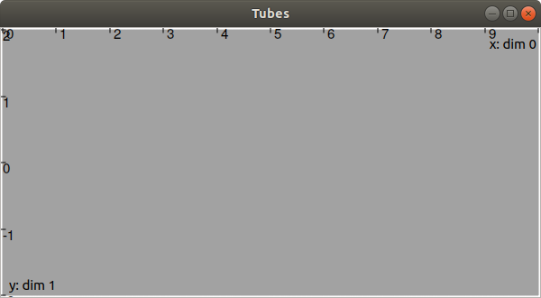
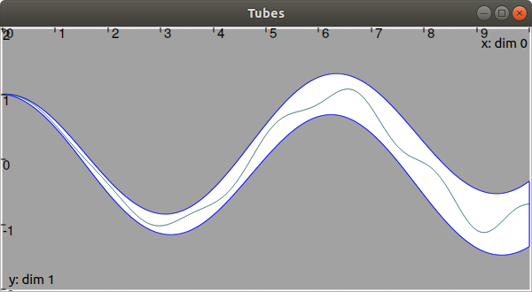

Hello tubes!
============

The code from the previous section produced a one-slice scalar tube over the temporal domain :math:`[0,10]`:

.. code-block:: c++

  #include <tubex.h>
  
  using namespace std;
  using namespace tubex;
  
  int main()
  {
    Interval domain(0.,10.);
    Tube x(domain);
  
    cout << "My first tube: " << x << endl;
  }

No sampling parameter is specified yet, so the tube is defined as a single slice: one box :math:`[0,10]\times[-\infty,\infty]` enclosing the set of all feasible trajectories defined over the temporal domain :math:`[0,10]`.

The tube may be displayed using the graphical items provided with Tubex and standing on the VIBes viewer.
For display purposes, we will bound the codomain of :math:`[x](\cdot)` to :math:`[-2,2]` so that the bounds can be shown:

.. code-block:: c++

  x &= Interval(-2.,2.);

The following code allows to display the tube :math:`[x](\cdot)`:

.. code-block:: c++

  vibes::beginDrawing();                   // initiates VIBes
  VIBesFigTube fig("Tubes", &x);           // creates a graphical object related to x
  fig.set_properties(100, 100, 600, 300);  // figure properties (position, size)
  fig.show();                              // display method
  vibes::endDrawing();                     // ends VIBes

Note that the VIBes viewer has to be executed prior to this code. The result is:

By default, the tube appears in gray and the window fits its domain and codomain.

Another tube :math:`[y](\cdot)` can be defined as an uncertain function on the same domain. For instance, :math:`[y](t)=\cos(t)+[-0.01,0.01]\cdot t`. In order to have an accurate enclosure of this analytical expression, we will also specify a sampling :math:`\delta=0.01` in order to slice the tube into 1000 boxes:

.. code-block:: c++

  Tube y(domain, 0.01, tubex::Function("cos(t)+[-0.05,0.05]*t"));

This tube can be displayed on the same figure, on top of :math:`[x](\cdot)`, with:

.. code-block:: c++

  fig.add_tube(&y, "tube y", "blue[white]"); // adds the object, nammed "tube y", with colors

.. figure:: ../../img/03_02_y.png

Trajectories may also be created and displayed in the same manner.
For instance, let us consider a trajectory :math:`y^*(t):\cos(t)+0.02\cdot t\cdot\sin(4t)`. By definition, this trajectory is guaranteed to be bounded by :math:`[y](\cdot)` since :math:`\forall t`, :math:`\cos(t)+0.02\cdot t\cdot\sin(4t) \in \cos(t)+[-0.05,0.05]\cdot t`.

We will implement it with:

.. code-block:: c++

  Trajectory traj_y(domain, tubex::Function("cos(t)+0.02*sin(t*4)*t"));
  fig.add_trajectory(&traj_y, "y*");

**Full code:**

.. code-block:: c++

  #include <tubex.h>
  
  using namespace std;
  using namespace tubex;
  
  int main()
  {
    // Temporal interval domain [0,10]
    Interval domain(0.,10.);
  
    // Tube x, one slice, one dimensional, bounded to [-2,2]
    Tube x(domain, 0.01);
    x &= Interval(-2.,2.);
  
    // Tube y, made of (10/0.01)=1000 slices, and defined from an uncertain function
    Tube y(domain, 0.01, tubex::Function("cos(t)+[-0.05,0.05]*t"));
  
    // A trajectory guaranteed to be contained in the previous tube
    Trajectory traj_y(domain, tubex::Function("cos(t)+0.02*sin(t*4)*t"));
  
    // Graphics:
    vibes::beginDrawing();                  // initiates VIBes
    VIBesFigTube fig("Tubes", &x);          // creates a graphical object related to x
    fig.set_properties(100, 100, 600, 300); // figure properties (position, size)
    fig.add_tube(&y, "y", "blue[white]");   // adds the object, nammed "tube y", with colors
    fig.add_trajectory(&traj_y, "traj_y");  // adds the trajectory object
    fig.show();                             // display method
    vibes::endDrawing();                    // ends VIBes
  }

This page provided a kick start with Tubex. We will now go into detail about how to build and use trajectories and tubes. 