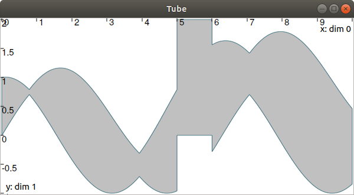
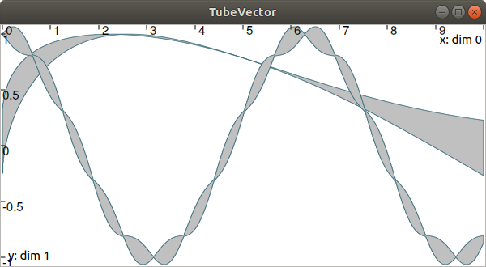

Handling tubes
==============

Uncertain trajectories can be handled by tubes. This page gives simple operations that can be made on tubes. Next sections will provide concrete applications and show the main advantages of this framework.

Tubes and slices
----------------

In Tubex, tubes are necessarily implemented as lists of slices. The details about this choice will be provided thereafter.

More precisely, a tube :math:`[x](\cdot)` with a sampling time :math:`\delta>0` is implemented as a box-valued function which is constant for all :math:`t` inside intervals :math:`[k\delta,k\delta+\delta]`, :math:`k\in\mathbb{N}`.

The box :math:`[k\delta,k\delta+\delta]\times\left[x\right]\left(t_{k}\right)`, with :math:`t_{k}\in[k\delta,k\delta+\delta]`, is called the :math:`k`-th slice of the tube :math:`[x](\cdot)` and is denoted by :math:`[x](k)`. The resulting approximation of a tube encloses :math:`[x^{-}(\cdot),x^{+}(\cdot)]` inside an interval of step functions :math:`[\underline{x^{-}}(\cdot),\overline{x^{+}}(\cdot)]` such that:

.. math::

  \forall t\in[t_0,t_f],~\underline{x^{-}}(t)\leqslant x^{-}(t)\leqslant x^{+}(t)\leqslant\overline{x^{+}}(t)

.. figure:: ../../img/03_04_tube_slices.png

  A tube :math:`[x](\cdot)` represented by a set of :math:`\delta`-width slices. This implementation can be used to enclose signals such as :math:`x^*(\cdot)`.

This implementation then takes rigorously into account floating point precision when building a tube, thanks to reliable numerical libraries such as `GAOL <http://frederic.goualard.net/#research-software>`_.
Further computations involving :math:`[x](\cdot)` will be based on its slices, thus giving an outer approximation of the solution set. 

Creating tubes
--------------

To create a ``Tube`` with a constant codomain:

.. code-block:: c++
  
  Interval domain(0.,10.);
  
  // One slice tubes:
  Tube x1(domain);                                // [0,10]->[-oo,oo]
  Tube x2(domain, Interval(0.,2.));               // [0,10]->[0,2]

  // 100 slices tubes:
  float timestep = 0.1;
  Tube x3(domain, timestep, Interval(0.,2.));     // [0,10]->[0,2]
  Tube x4(domain, timestep, Interval::POS_REALS); // [0,10]->[0,oo]

The ``timestep`` variable defines the temporal width of the slices. Note that it is also possible to create slices of different width; this will be explained afterwards.

To create a copy of a tube with the same time discretization, use:

.. code-block:: c++
  
  Tube x5(x4);                     // identical tube (100 slices, [0,10]->[0,oo])
  Tube x6(x4, Interval(5.));       // 100 slices, same timestep, but [0,10]->[5]

As tubes are interval of trajectories, a ``Tube`` can be defined from ``Trajectory`` objects:

.. code-block:: c++
  
  // Creating trajectories:
  Trajectory traj1(domain, tubex::Function("cos(t)"));
  Trajectory traj2(domain, tubex::Function("cos(t)+t/10"));

  Tube x8(traj1, timestep);        // 100 slices tube enclosing cos(t)
  Tube x9(traj1, traj2, timestep); // 100 slices tube defined as [cos(t),cos(t)+t/10]

.. figure:: ../../img/03_04_interval_trajs.png

  Result of tube :math:`[x_9](\cdot)=[\cos(t),\cos(t)+\frac{t}{10}]`, made of 100 slices.

It is also possible to create a tube from an uncertain function:

.. code-block:: c++
  
  Tube x10(domain, timestep/10.,
           tubex::Function("-abs(cos(t)+t/5)+(t/2)*[-0.1,0.1]"));

.. figure:: ../../img/03_04_tube_fnc.png

  Result of tube :math:`[x_{10}](\cdot)` made of 1000 slices.

Finally, a tube can be seen as a union of trajectories. And so the following operations are allowed:

.. code-block:: c++

  float timestep = 0.01;
  Interval domain(0.,10.);

  tubex::Function f("(cos(t) ; cos(t)+t/10 ; sin(t)+t/10 ; sin(t))"); // 4d function
  TrajectoryVector traj(domain, f); // 4d trajectory defined over [0,10]

  // 1d tube [x](.) defined as a union of the 4 trajectories
  Tube x = Tube(traj[0], timestep) | traj[1] | traj[2] | traj[3];

  // Graphics ...
  fig.add_tube(&x, "x");
  fig.add_trajectories(&traj, "trajs"); // plots all components of the TrajectoryVector

Which produces:

.. figure:: ../../img/03_04_union.png

Evaluations
-----------

Once created, several evaluations of the tube can be made, as for trajectories. For instance:

.. code-block:: c++

  x.domain()         // temporal domain, returns [0, 10]
  x.codomain()       // envelope of values, returns [-1, 1.79]
  x(6.)              // evaluation of [x](.) at 6, returns [-0.28, 1.56]
  x(Interval(5.,6.)) // evaluation of [x](.) over [5,6], returns [-0.96, 1.57]

The inversion of a tube :math:`[x](\cdot)`, denoted :math:`[x]^{-1}([y])`, is also at hand and returns the set :math:`[t]` enclosing the preimages of :math:`[y]`. The ``invert()`` method returns the union of these subsets, or the set of solutions within a vector of ``Interval`` objects. The following example returns the different subsets of the inversion :math:`[x]^{-1}([0,0.2])` projected in red in next figure:

.. code-block:: c++

  vector<Interval> v_t;            // vector of preimages
  x.invert(Interval(0.,0.2), v_t); // inversion

  for(int i = 0 ; i < v_t.size() ; i++)
  {
    IntervalVector tbox(2, Interval(0.,0.2));
    tbox[0] = v_t[i];
    fig.draw_box(tbox, "red");     // boxes display
  }

.. figure:: ../../img/03_04_invert.png

Furthermore, other methods related to sets are available:

.. code-block:: c++

  x.volume()         // returns the volume (surface) of the tube
  x.max_diam()       // greater diameter of the tube
  x.diam()           // a trajectory representing all diameters

Operations on sets
------------------

Classical operations on sets are applicable on tubes.
Note that the tubes may have to share the same domain and slicing for these operations.

.. code-block:: c++

  Tube x4 = (x1 | x2) & x3;

The same for mathematical functions:

.. code-block:: c++

  Tube x2 = abs(x1);
  Tube x3 = cos(x1) + sqrt(x2 + pow(x1, Interval(2,3)));

Several methods available in IBEX can be used for tubes. For instance:

.. code-block:: c++

  x.is_subset(y)
  x.is_interior_subset(y)
  y.is_empty()
  x.overlaps(y)

It is also possible to test if a tube :math:`[x](\cdot)` contains a solution :math:`z(\cdot)`. The ``contains()`` method can be used for this purpose, but the answer is sometimes uncertain and so an ``ibex::BoolInterval`` is always used. Its values can be either ``YES``, ``NO`` or ``MAYBE``. The ``MAYBE`` case is rare but may appear due to the numerical representation of a trajectory. Indeed, some wrapping effect may occur for its reliable evaluations and so this `contains` test may not be able to conclude, if the thin envelope of :math:`z(\cdot)` overlaps a boundary of the tube :math:`[x](\cdot)`.

.. code-block:: c++

  BoolInterval b = x.contains(traj_z); // with traj_z a Trajectory object

Integral computations
---------------------

Computation of the primitive :math:`\int_{0}[x](\tau)d\tau`:

.. code-block:: c++
  
  Tube primitive = x.primitive();

Computation of :math:`[s]=\int_{0}^{[t]}[x](\tau)d\tau`:

.. code-block:: c++
  
  Interval t;
  Interval s = x.integral(t);

Computation of :math:`[s]=\int_{[t_1]}^{[t_2]}[x](\tau)d\tau`:

.. code-block:: c++
  
  Interval t1, t2;
  Interval s = x.integral(t1, t2);

Also, a decomposition of the integral of :math:`[x](\cdot)=[x^-(\cdot),x^+(\cdot)]` with :math:`[s^-]=\int_{[t_1]}^{[t_2]}x^-(\tau)d\tau` and :math:`[s^+]=\int_{[t_1]}^{[t_2]}x^+(\tau)d\tau` is computable by:

.. code-block:: c++

  Interval t1, t2;
  pair<Interval,Interval> s;
  s = x.partial_integral(t1, t2);
  // s.first is [s^-]
  // s.second is [s^+]

*Note:* :math:`[s]=[s^-]\cup[s^+]`.

Updating values
---------------

The ``set()`` methods allow various updates on tubes. For instance:

.. code-block:: c++

  x.set(Interval(0.,2.), Interval(5.,6.)); // then [x]([5,6])=[0,2]

produces:

See also the following methods:

.. code-block:: c++
  
  x.set(Interval::POS_REALS); // set a constant codomain for all t
  x.set(Interval(0.), 4.);    // set a value at some t: [x](4)=[0]
  x.set_empty();              // empty set for all t

**Note:** be careful when updating a tube without the use of dedicated contractors. Tube discretization has to be kept in mind whenever an update is performed for some input :math:`t`. For guaranteed operations, please see the *Contractors* section.

The vector case
---------------

The extension to the vector case is the class ``TubeVector``, allowing to create tubes :math:`[\mathbf{x}](\cdot):\mathbb{R}\to\mathbb{IR}^n`.
The features presented above remain the same.

.. code-block:: c++

  // TubeVector from a formula; the function's output is two-dimensional
  TubeVector x(Interval(0.,10.), timestep,
               tubex::Function("(sin(sqrt(t)+((t-5)^2)*[-0.01,0.01]) ; \
                                 cos(t)+sin(t/0.2)*[-0.1,0.1])"));

  // ...
  fig.add_tubes(&x, "tubes"); // display all components on the same figure

Note that as in IBEX, each component of a vector object (``IntervalVector``, ``TrajectoryVector``, ``TubeVector``) is available by reference.

**Full code:**

.. code-block:: c++

  #include <tubex.h>

  using namespace std;
  using namespace tubex;

  int main()
  {
    float timestep = 0.01;
    Interval domain(0.,10.);

    // TubeVector as a union of trajectories
    TrajectoryVector traj(domain, tubex::Function("(cos(t) ; cos(t)+t/10 ; sin(t)+t/10 ; sin(t))"));
    Tube x = Tube(traj[0], timestep) | traj[1] | traj[2] | traj[3];

    // Inversion
    vector<Interval> v_t;
    x.invert(Interval(0.,0.2), v_t);

    // Update
    x.set(Interval(0.,2.), Interval(5.,6.)); // then x([5,6])=[0,2]

    // TubeVector from a formula; the function's output is two-dimensional
    TubeVector y(Interval(0.,10.), timestep,
                 tubex::Function("(sin(sqrt(t)+((t-5)^2)*[-0.01,0.01]) ; \
                                   cos(t)+sin(t/0.2)*[-0.1,0.1])"));

    vibes::beginDrawing();

    VIBesFigTube fig("Tube");
    fig.set_properties(100, 100, 600, 300);
    fig.add_tube(&x, "x", "#376D7C[lightGray]");
    fig.add_trajectories(&traj, "trajs");

    for(int i = 0 ; i < v_t.size() ; i++)
    {
      IntervalVector tbox(2, Interval(0.,0.2));
      tbox[0] = v_t[i];
      fig.draw_box(tbox, "red");
    }

    fig.show();

    VIBesFigTube fig_vec("TubeVector");
    fig_vec.set_properties(200, 200, 600, 300);
    fig_vec.add_tubes(&y, "y", "#376D7C[lightGray]");
    fig_vec.show();

    vibes::endDrawing();
  }

Further pages will be written soon, presenting contractors, bisections, fixed point resolutions, graphical tools and robotic applications.