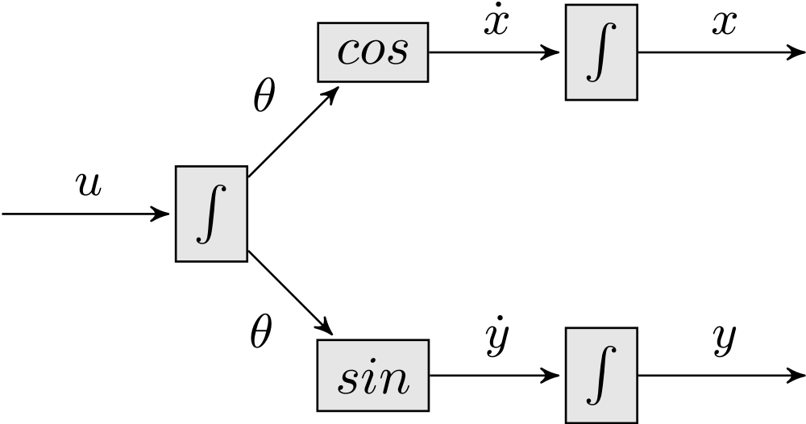
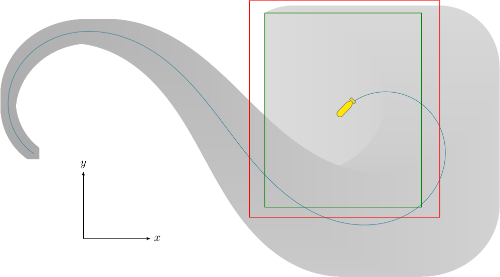
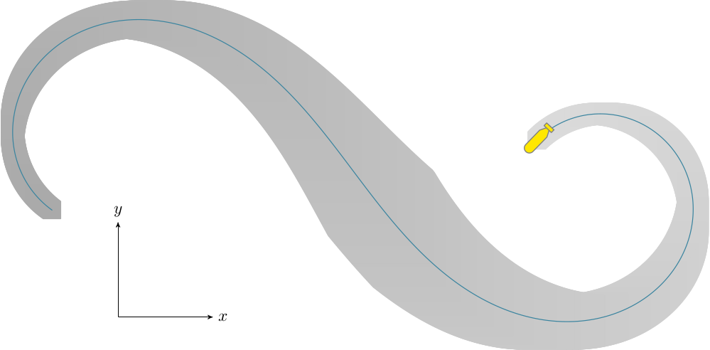

Robot car simulation
--------------------

The following example is taken from `this paper <http://simon-rohou.fr/research/tubint/tubint_paper.pdf>`_.

Let us consider a wheeled robot :math:`\mathcal{R}` with
a constant velocity and described by the following
state equations: 

.. math::

  \mathcal{R}:\left\{ \begin{array}{rcl}
  \dot{x}(t) & = & 10\cdot\cos\bigl(\theta(t)\bigr),\\
  \dot{y}(t) & = & 10\cdot\sin\bigl(\theta(t)\bigr),\\
  \dot{\theta}(t) & = & u(t),
  \end{array}\right.

where :math:`x,y` correspond to the position of the robot and :math:`\theta`
to its heading. As illustrated by the circuit of :numref:`causalchaincircuit`,
the state equations do not consist in looped constraints and are composed
of two causal kinematic chains. 

.. _causalchaincircuit:

  Causal kinematic chains associated to the state equations of a car.
  All trajectories :math:`u(\cdot)`, :math:`\theta(\cdot)`, :math:`\dot{x}(\cdot)`,
  :math:`\dot{y}(\cdot)`, :math:`x(\cdot)`, :math:`y(\cdot)` belong to tubes.

Here, car's speed is set to :math:`v=10m/s`. We assume that the
initial state :math:`\mathbf{x}_{0}` belongs to the box: 

.. math::

  \mathbf{x}_{0}\in[-1,1]\times[-1,1]\times[-\frac{6}{5}\pi-0.02,-\frac{6}{5}\pi+0.02].

:math:`u(\cdot)` is bounded by the following analytical expression:

.. math::

  u(t)\in[u](t)=-\cos\biggl(\frac{t+33}{5}\biggr)+[-0.02,0.02].

Tubes :math:`[\theta](\cdot)`, :math:`[\dot{x}](\cdot)`, :math:`[x](\cdot)`, :math:`\dots`,
are initialized to :math:`[-\infty,+\infty]` for all :math:`t`. Our propagation
method yields the tubes projected on Figure :numref:`causalchainsimu`. Note
that the estimation becomes more pessimistic with time: without exteroceptive
measurements, the robot progressively gets lost.

.. _causalchainsimu:

  Interval simulation of the robot :math:`\mathcal{R}`. The blue line represents
  the true poses of the robot while gray shapes correspond to the tubes
  :math:`[x](\cdot)\times[y](\cdot)` projected on the world frame. The green
  box is the final box obtained for :math:`t=14`.

Consider now a situation
where final state :math:`\mathbf{x}(14)` is known to belong to the box
:math:`\left[\mathbf{x}\right](14)=[53.9,55.9]\times[6.9,8.9]\times[-2.36,-2.32]`.
Adding this information to the constraint network, the contractor
:math:`\mathcal{C}_{\frac{d}{dt}}^{\leftarrow}` can be called to perform
a backward propagation. The result is illustrated by Figure :numref:`causalchainbackward`
where backward contractions are observed.

.. _causalchainbackward:

  Simulation as presented in :numref:`causalchainsimu`. This time, the
  initial and final states are almost known while uncertainties are
  maximal in the middle of the mission.

To run the example, launch the Vibes viewer and, from a terminal:

.. code-block:: bash

  ./build/examples/cpp/04_causal_chain/ex_causal_chain

The sources are available in:

.. code-block:: none

  ./examples/cpp/04_causal_chain/main.cpp