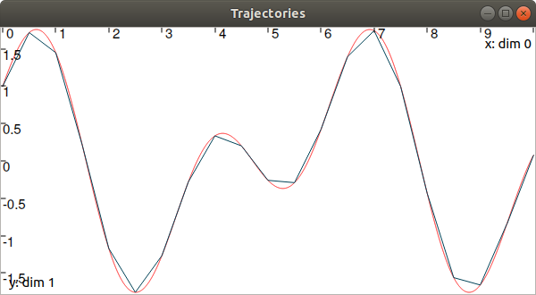

Creating trajectories
=====================

A trajectory :math:`x(\cdot):\mathbb{R}\to\mathbb{R}` is a set of values defined over some domain. When values are analytically defined, a ``Function`` object can be used for instantiating the trajectory. In Tubex, a ``Function`` is the extension of IBEX's ``Function`` objects, for the dynamical case (see more `about IBEX's functions <http://www.ibex-lib.org/doc/function.html>`_).

In Tubex, functions are defined with `variables` as in IBEX, but a system variable :math:`t` will be predefined. These temporal functions are interesting for inter-temporal evaluations such as integral computations, delays, time uncertainties, and so on. This will be detailed thereafter.

A simple temporal function can be defined and used for building a trajectory:

.. code-block:: c++

  Interval domain(0.,10.);
  tubex::Function f("cos(t)+sin(t*2)");
  Trajectory x(domain, f);

In this code, :math:`x(\cdot)` is implemented from the expression :math:`t\mapsto\cos(t)+\sin(2t)`, and no numerical approximation is performed: the formula is embedded in the object and the representation is accurate.

Another way to build :math:`x(\cdot)` would be to implement it as a map of values; :math:`x(\cdot)` will then be discontinuous. This is useful nonetheless, in case of actual data coming from sensors or numerical models. The following example shows the differences:

.. code-block:: c++

  // Trajectory from a formula
  Trajectory x(Interval(0.,10.),
               tubex::Function("cos(t)+sin(t*2)"));
  
  // Trajectory from a map of values
  map<double,double> values;
  for(double t = 0. ; t <= 10. ; t+=0.5)
    values[t] = cos(t)+sin(t*2);
  Trajectory y(values);

  // Graphics
  fig.add_trajectory(&x, "x", "red");
  fig.add_trajectory(&y, "y", "blue");

Note that when building a trajectory from a map, there is no need to specify the temporal domain; it will be evaluated as the envelope of the keys of the map.

Operations on trajectories
--------------------------

Once created, several evaluations of the trajectory can be made. For instance:

.. code-block:: c++

  x.domain()         // temporal domain, returns [0, 10]
  x.codomain()       // envelope of values, returns [-2,2]
  x(6.)              // evaluation of x(.) at 6, returns 0.42..
  x(Interval(5.,6.)) // evaluation of x(.) over [5,6], returns [-0.72..,0.42..]

Note that the items defining the trajectory (the map of values, or the function) are accessible from the object:

.. code-block:: c++

  map<double,double> mapy = y.sampled_map(); // y(.) was defined as a map of values
  tubex::Function *fx = x.function();         // x(.) was defined from a formula

Other methods exist such as:

.. code-block:: c++

  // Approximation of primitives:
  Trajectory y_prim = y.primitive(); // when defined from a map of values
  Trajectory x_prim = x.primitive(0., 0.01); // when defined from a function

  // Differentiations:
  Trajectory x_diff = x.diff(); // exact differentiation of x(.)
  Trajectory y_diff = y.diff(); // finite differences on y(.)

Note that the result of these methods is inaccurate, except if the trajectory is defined from an analytic function (then the exact differentiation is returned, as a trajectory defined by a function too).

Finally, to add a point to a mapped trajectory, the following function can be used:

.. code-block:: c++

  y.set(1., 4.); // add the value x(4)=1

Other features and details can be found in the technical datasheet of the Trajectory class.

The vector case
---------------

The extension to the vector case is the class ``TrajectoryVector``, allowing to create trajectories :math:`\mathbf{x}(\cdot):\mathbb{R}\to\mathbb{R}^n`.
The features presented above remain the same.

.. code-block:: c++

  // Trajectory from a formula; the function's output is two-dimensional
  TrajectoryVector x(Interval(0.,10.),
                     tubex::Function("(cos(t);sin(t))"));

  // Discretized trajectory
  TrajectoryVector y(2);
  for(double t = 0. ; t <= 10. ; t+=0.6)
  {
    Vector val(2); // values are 2d vectors
    val[0] = cos(t); val[1] = sin(t);
    y.set(val, t);
  }

  // ...

  // From a formula
  fig.add_trajectory(&y[0], "y_0", "gray"); // first component
  fig.add_trajectory(&y[1], "y_1", "gray"); // second component

  // From discrete values
  fig.add_trajectory(&x[0], "x_0", "red");  // first component
  fig.add_trajectory(&x[1], "x_1", "blue"); // second component

.. figure:: ../../img/03_03_trajvectors.png

Note that as in IBEX, each component of a vector object (``IntervalVector``, ``TrajectoryVector``, ``TubeVector``) is available by reference:

.. code-block:: c++

  x[1] = Trajectory(domain, tubex::Function("exp(t)"));
  cout << x[1] << endl;

Next page presents several methods to use tubes, as envelopes of trajectories.