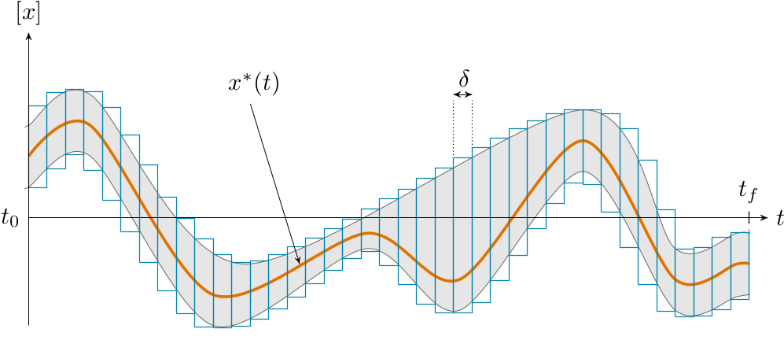
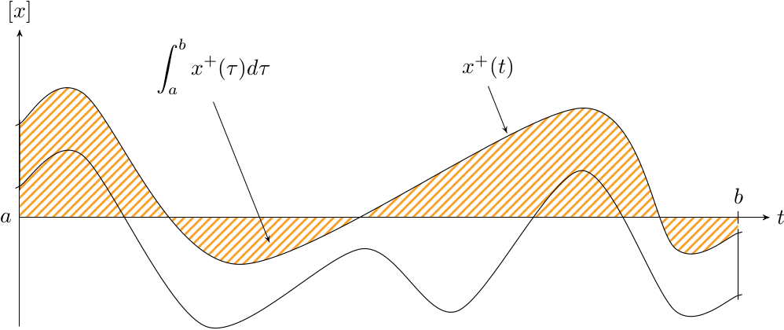
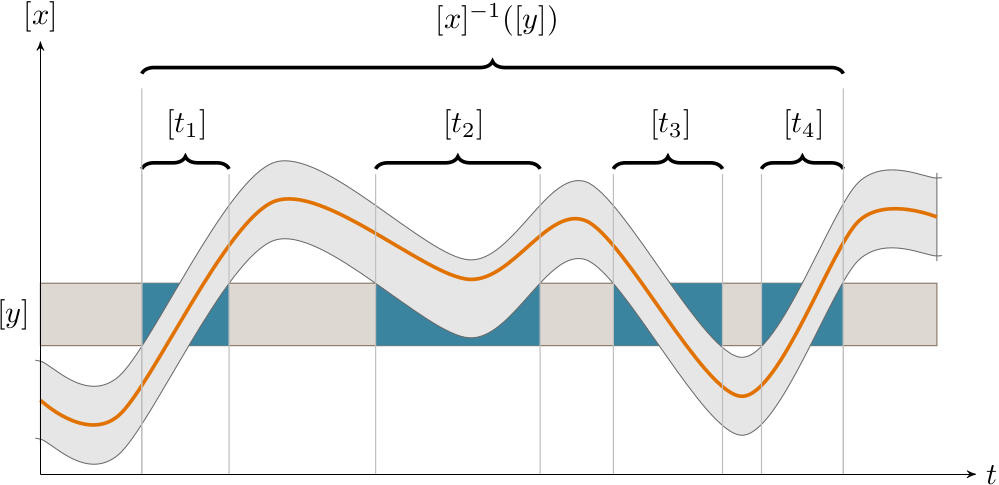

.. _basics:

Quick start
===========

The following is an extract from the paper `Guaranteed computation of robot trajectories <http://simon-rohou.fr/research/tubint/tubint_paper.pdf>`_.

Definition
----------

A tube :math:`[\mathbf{x}](\cdot)` is defined 
as an envelope enclosing an uncertain trajectory :math:`\mathbf{x}(\cdot):\mathbb{R}\rightarrow\mathbb{R}^{n}`.
It is built as an interval of two trajectories
:math:`[\mathbf{x}^{-}(\cdot),\mathbf{x}^{+}(\cdot)]` such that :math:`\forall t,~\mathbf{x}^{-}(t)\leqslant\mathbf{x}^{+}(t)`.
Hence, a trajectory :math:`\mathbf{x}(\cdot)` belongs to the tube :math:`[\mathbf{x}](\cdot)`
if :math:`\forall t,\mathbf{~x}(t)\in[\mathbf{x}](t)`.
:numref:`tubeslices` illustrates a tube implemented as a set of slices. In this example, the slices share the same temporal resolution, but a custom time discretization is possible. This sliced implementation is detailed hereinafter.

.. _tubeslices:

  A one-dimensional tube :math:`[x](\cdot)` implemented as a set of slices. This representation
  can be used to enclose signals such as the unknown trajectory :math:`x^{*}(\cdot)`.

**Code example:**

.. code-block:: c++

  float timestep = 0.1;
  Interval domain(0,10);
  Tube x(domain, timestep, Function("(t-5)^2 + [-0.5,0.5]"));

Arithmetics on tubes
--------------------

Consider two tubes :math:`[x](\cdot)` and
:math:`[y](\cdot)` and an operator :math:`\diamond\in\{+,-,\cdot,/\}`. We define
:math:`[x](\cdot)\diamond[y](\cdot)` as the smallest tube (with respect
to the inclusion) containing all feasible values for :math:`x(\cdot)\diamond y(\cdot)`,
assuming that :math:`x(\cdot)\in[x](\cdot)` and :math:`y(\cdot)\in[y](\cdot)`.
This definition is an extension to trajectories of the interval arithmetic
proposed by Moore. If :math:`f` is an elementary function
such as :math:`\sin`, :math:`\cos`, :math:`\dots`, we define :math:`f\bigl([x](\cdot)\bigr)` as
the smallest tube containing all feasible values for :math:`f\bigl(x(\cdot)\bigr)`,
:math:`x(\cdot)\in[x](\cdot)`.

**Code example:**

.. code-block:: c++

  Tube c = 2*x + cos(x) + 18.5;

Integrals of tubes
------------------

In the same way, the integral of a tube is defined from :math:`t_{1}` to :math:`t_{2}`
as the smallest box containing all feasible integrals:

.. math::
  :label: eqintegtube

  \displaystyle\int_{t_{1}}^{t_{2}}[\mathbf{x}](\tau)d\tau=\biggl\{\displaystyle\int_{t_{1}}^{t_{2}}\mathbf{x}(\tau)d\tau\mid\mathbf{x}(\cdot)\in[\mathbf{\mathbf{x}}](\cdot)\biggr\}.

From the monotonicity of the integral operator, we can deduce:

.. math::

  \int_{t_{1}}^{t_{2}}[\mathbf{x}](\tau)d\tau=\biggr[\int_{t_{1}}^{t_{2}}\mathbf{x}^{-}(\tau)d\tau,\int_{t_{1}}^{t_{2}}\mathbf{x}^{+}(\tau)d\tau\biggl],

where :math:`\mathbf{x}^{-}(\cdot)` and :math:`\mathbf{x}^{+}(\cdot)` are the
lower and upper bounds of tube :math:`[\mathbf{x}](\cdot)=[\mathbf{x}^{-}(\cdot),\mathbf{x}^{+}(\cdot)]`.
The computed integral is a box with lower and upper bounds shown on :numref:`tubeinteginf` and :numref:`tubeintegsup`. For efficiency purposes, the *interval
primitive* of a tube defined by :math:`\int_{0}^{t}[\mathbf{x}](\tau)d\tau`
can be computed once, giving a primitive tube.

.. _tubeinteginf:
.. figure:: ../img/tube_integ_inf.png

  Hatched part depicts the lower bound of :math:`\int_{a}^{b}[x](\tau)d\tau`.

.. _tubeintegsup:

  Hatched part depicts the upper bound of :math:`\int_{a}^{b}[x](\tau)d\tau`.

**Code example:**

.. code-block:: c++

  Interval t1(1,2);
  Interval t2(8);
  Interval integ = x.integral(t1,t2);

.. Simple example
.. --------------
.. 
.. Given two scalar tubes :math:`[x](\cdot)` and :math:`[y](\cdot)`, the tube
.. arithmetic makes it possible to compute the following tubes:
.. 
.. .. math::
.. 
..   \begin{array}{rcl}
..   [a](\cdot) & = & [x](\cdot)+[y](\cdot)\\{}
..   [b](\cdot) & = & \sin\left([x](\cdot)\right)\\{}
..   [c](\cdot) & = & \int_{0}[x]\left(\tau\right)d\tau
..   \end{array}
.. 
.. **Code example:**
.. 
.. .. code-block:: c++
.. 
..   Interval domain(0,10);
..   double timestep = 0.01;
.. 
..   // Creating tubes over the [0,10] domain with some timestep:
..   Tube tube_x(domain, timestep,
..               Function("t", "(t-5)^2 + [-0.5,0.5]"));
..   Tube tube_y(domain, timestep,
..               Function("t", "-4*cos(t-5) + [-0.5,0.5] + 0.1*(t-3.3)^2*[-2,2]"));
.. 
..   Tube tube_a = tube_x + tube_y;
..   Tube tube_b = sin(tube_x);
..   Tube tube_c = tube_x.primitive();

Set-inversion
-------------

The tube set-inversion, denoted :math:`[x]^{-1}([y])`, is defined by

.. math::
  
  [x]^{-1}([y])=\bigsqcup_{y\in[y]}\left\{ t\mid y\in[x](t)\right\}, 

and is illustrated by :numref:`tubesetinversion`.

.. _tubesetinversion:

  
  Tube set-inversion

**Code example:**

.. code-block:: c++

  // Set-inversion: [x1]^-1([2,3])
  Interval t = x1.invert(Interval(2,3));

Contractors for tubes
---------------------

The contractors can be applied on sets of trajectories, thus
allowing constraints over time such as :math:`a(t)=x(t)+y(t)` or :math:`b(t)=\sin\left(x(t)\right)`.
A contractor applied on a tube :math:`[a](\cdot)`
aims at removing unfeasible trajectories according to a given constraint
:math:`\mathcal{L}`:

.. math::

  [a](\cdot)\xrightarrow{\mathcal{C}_{\mathcal{L}}}[b](\cdot).

The output of the contractor :math:`\mathcal{C_{\mathcal{L}}}` is the tube
:math:`[b](\cdot)` such that:

.. math::

  \begin{align}
    \forall t,~[b](t)\subseteq[a](t) & , & \textrm{(contraction)}\\
    \left(\begin{array}{c}
    \mathcal{L}\big(a(\cdot)\big)\\
    a(\cdot)\in[a](\cdot)
    \end{array}\right)\Longrightarrow a(\cdot)\in[b](\cdot) & . & \textrm{(completeness)}
  \end{align}

For instance, the minimal contractor :math:`\mathcal{C}_{+}` associated
with the constraint :math:`a(\cdot)=x(\cdot)+y(\cdot)` is:

.. math::

  \left(\begin{array}{c}
  \left[a\right](\cdot)\\
  \left[x\right](\cdot)\\
  \left[y\right](\cdot)
  \end{array}\right)\mapsto\left(\begin{array}{c}
  \left[a\right](\cdot)\cap\left(\left[x\right](\cdot)+\left[y\right](\cdot)\right)\\
  \left[x\right](\cdot)\cap\left(\left[a\right](\cdot)-\left[y\right](\cdot)\right)\\
  \left[y\right](\cdot)\cap\left(\left[a\right](\cdot)-\left[x\right](\cdot)\right)
  \end{array}\right).

In this way, information on either :math:`[a](\cdot)`, :math:`[x](\cdot)` or
:math:`[y](\cdot)` can be propagated to the other tubes. 

.. **Code example:**
.. 
.. .. code-block:: c++
.. 
..   // Example for the minimal contractor C+ presented hereinbefore:
..   Tube::contract(a, x, y,
..                  Function("a", "x", "y", "a - (x + y)"));
.. 
..   // Contracting the tubes [x](t), [y](t), [d](t),
..   // according a distance constraint:
..   Tube::contract(x, y, d,
..                  Function("x", "y", "d", "d - sqrt(x^2+y^2)"));

.. Implementation
.. --------------
.. 
.. There are several ways to implement a tube.
.. Our choice is to build it with a set of boxes representing slices
.. of identical width. :numref:`tubeslices` illustrates such
.. implementation with a list of boxes, while keeping enclosed an unknown
.. trajectory :math:`x^{*}(t):\mathbb{R}\rightarrow\mathbb{R}`.
.. More precisely, a tube :math:`[\mathbf{x}](t)`, with
.. a sampling time :math:`\delta>0`, is a box-valued function which is constant
.. for all :math:`t` inside intervals :math:`[k\delta,k\delta+\delta]`, :math:`k\in\mathbb{Z}`.
.. The box :math:`[k\delta,k\delta+\delta]\times\left[\mathbf{x}\right]\left(t_{k}\right)`,
.. with :math:`t_{k}\in[k\delta,k\delta+\delta]` is called the :math:`k`-th
.. *slice* of the tube :math:`[\mathbf{x}](\cdot)`
.. and is denoted by :math:`[\mathbf{x}](k)`. The resulting
.. approximation of a tube encloses :math:`[\mathbf{x}^{-}(\cdot),\mathbf{x}^{+}(\cdot)]`
.. inside an interval of step functions :math:`[\underline{\mathbf{x}^{-}}(\cdot),\overline{\mathbf{x}^{+}}(\cdot)]`
.. such that:
.. 
.. .. math::
.. 
..   \forall t,~\underline{\mathbf{x}^{-}}(t)\leqslant\mathbf{x}^{-}(t)\leqslant\mathbf{x}^{+}(t)\leqslant\overline{\mathbf{x}^{+}}(t).

.. Such implementation then takes rigorously into account floating point
.. precision when building a tube, thanks to reliable numerical libraries
.. such as `filib <http://www2.math.uni-wuppertal.de/~xsc/software/filib.html>`_.
.. 
.. Further computations involving :math:`[\mathbf{x}](\cdot)` will be based
.. on its slices, thus giving an outer approximation of the solution
.. set. For instance, the lower bound of the integral of a tube, defined
.. in Equation :eq:`eqintegtube`, is simply computed as
.. the signed area of the region in the :math:`tx`-plane that is bounded by
.. the graph of :math:`\underline{\mathbf{x}^{-}}(t)` and the :math:`t`-axis, as pictured
.. in :numref:`tubelbintegralslices`. The lower slice width
.. :math:`\delta`, the higher the precision of the approximation.
.. 
.. .. _tubelbintegralslices:
.. .. figure:: ../img/tube_lb_integral_slices.png
.. 
..   Outer approximation of the lower bound of :math:`\int_{a}^{b}[x](\tau)d\tau`.
.. 
.. *Note:* this data structure stands on a binary tree, thus improving several computations such as tube evaluations. For instance, the bounded value :math:`[y]=[x]([t])` requires an access to each slice over the interval :math:`[t]`. With a tree structure, information is stored within high level nodes, thus preventing from a systematic evaluation of each slice over :math:`[t]`. See :numref:`tubetreeanimation`.
.. 
.. .. _tubetreeanimation:
.. .. figure:: ../img/tube_tree_animation.gif
.. 
..   Illustration of the binary tree structure, implemented in this library.