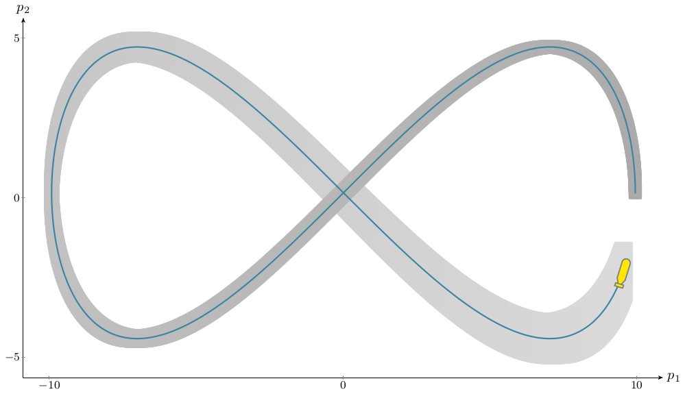

Lissajous robot
---------------

The following example is taken from `this paper <http://simon-rohou.fr/research/tubint/tubint_paper.pdf>`_.

Let us now consider a robot described by its state :math:`\mathbf{x}\in\mathbb{R}^{2}`
representing its position on a horizontal plane, and following a Lissajous
trajectory: 

.. math::

  \begin{array}{c}
  \mathbf{x}(t)=5\cdot\left(\begin{array}{c}
  2\cos(t)\\
  \sin(2t)
  \end{array}\right).\end{array}

This equation describes the actual trajectory which is unknown. To illustrate
our approach, we generate differential equations satisfied by :math:`\mathbf{x}(t)`.
The initial condition is known to belong to a box :math:`[\mathbf{x}_{0}]`.
The associated constraint network is the following:

**Variables:** :math:`\mathbf{x}(\cdot)`, :math:`\dot{\mathbf{x}}(\cdot)`, :math:`\ddot{\mathbf{x}}(\cdot)`

**Constraints:**

:math:`\ddot{x}_{1}(t)\in-10\cos(t)+[-0.001,0.001]`

:math:`\ddot{x}_{2}=-0.4\cdot\dot{x}_{1}\cdot\ddot{x}_{1}`

:math:`\dot{\mathbf{x}}(0)=\left(\begin{array}{c}0\\10\end{array}\right)`, :math:`\mathbf{x}(0)\in\left(\begin{array}{c}[9.8,10.2]\\{}[-0.2,0.2]\end{array}\right)`

**Domains:** :math:`[\mathbf{x}](\cdot)`, :math:`[\dot{\mathbf{x}}](\cdot)`, :math:`[\ddot{\mathbf{x}}](\cdot)`

The contractor based approach provides the envelope of trajectories
pictured in Figure :numref:`lissajousmap`. It shows the ease-of-use
of differential constraints that are usually encountered in mobile
robotics where :math:`\mathbf{x}` is the position of a robot, :math:`\dot{\mathbf{x}}`
its speed and :math:`\ddot{\mathbf{x}}` its acceleration.

.. _lissajousmap:

  A robot following a Lissajous curve. Blue line is the truth. Gray area is the envelope of trajectories
  computed with the proposed method applied on the previous CSP. One
  should note that further constraints such as :math:`x_{2}(t)=x_{2}(t+\pi)`
  or :math:`\mathbf{x}(\frac{\pi}{2})=\mathbf{x}(\frac{3\pi}{2})` could be
  easily added to the CSP.

To run the example, launch the Vibes viewer and, from a terminal:

.. code-block:: bash

  ./build/examples/cpp/05_lissajous/ex_lissajous

The sources are available in:

.. code-block:: none

  ./examples/cpp/05_lissajous/main.cpp