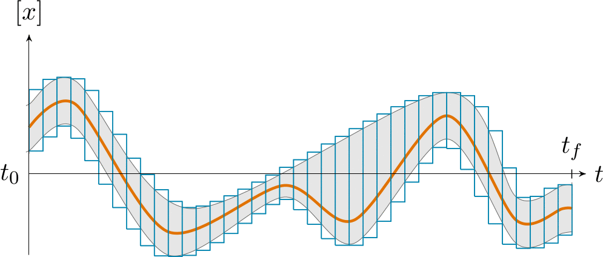

How to handle tubes with Tubex
==============================

Introduction
-------------

A tube will approximate an interval of two functions :math:`[f^-,f^+]` over a given domain.
In this library, a tube is made of a set of 2D-boxes (slices) of identical width (constant timestep).
The lower slice width, the higher the precision of the approximation of :math:`[f^-,f^+]`.

*Note:* this data structure stands on a binary tree, thus improving several computations such as tube evaluations. For instance, the bounded value :math:`[y]=[x]([t])` requires an access to each slice over the interval :math:`[t]`. With a tree structure, information is stored within high level nodes, thus preventing from a systematic evaluation of each slice over :math:`[t]`. See :numref:`tubetreeanimation`.

.. _tubetreeanimation:

  Illustration of the binary tree structure, implemented in this library.

Basics
-------------

To create a Tube object initialized with a constant image :math:`\forall t`:

.. code-block:: c++

  float timestep = 0.1;     // slice width
  Interval domain(0,10);    // [t0,tf]

  Tube x(domain, timestep); // by default: [-oo,oo]
  Tube y(domain, timestep, Interval::POS_REALS);
  Tube z(domain, timestep, Interval(-42.0, 17.0));
  Tube w(x, 3.0); // same structure as x, with constant values 3.0

To create a Tube object from a analytical expression:

.. code-block:: c++

  Tube x1(domain, timestep,
          Function("t", "(t-5)^2 + [-0.5,0.5]"));
  Tube x2(domain, timestep,
          Function("t", "(t-5)^2"), Interval(-0.5,0.5));
  Tube x3(domain, timestep,
          Function("t", "(t-5)^2 - 0.5"), 
          Function("t", "(t-5)^2 + 0.5"));
  // note: x1==x2==x3

To create a Tube object from a map of values (will strictly wrap the map with linear interpolation):

.. code-block:: c++

  map<double,double> map_values;
  map_values[0.0] = 2.0;  map_values[1.0] = 3.2;
  map_values[1.2] = 3.4;  map_values[8.5] = -36.0;

  Tube x1(domain, timestep, Interval::EMPTY_SET);
  Tube x2(x1); // x2 is empty, as weel as x1

  // Strict wrapping:
  x1.feed(map_values);
  // Thickness of 2 centered on the values:
  x2.feed(map_values, Interval(-1.0,1.0));

  // Inflation of x1 (then x1==x2):
  x1.inflate(1.0);

Contractors
-----------

T ...

Serialization
-------------

In case of heavy computations, a Tube object can be serialized within a binary file and re-created afterwards.

.. code-block:: c++

  Tube x1(domain, timestep);
  x1.serialize("x1.tube"); // will create a binary file "x1.tube"
  Tube x2("x1.tube"); // will create a new tube x2 from the binary file
  // then, x1==x2