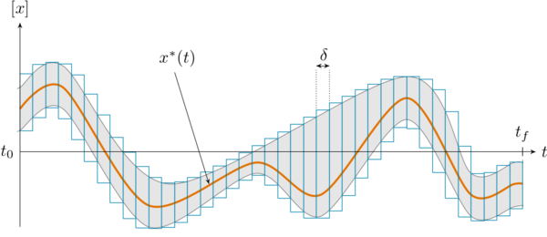

.. tubex-lib documentation master file

Tubex library
=============

In a nutshell
-------------

Tubex is a C++ library providing tools for computations over sets of trajectories.
It has been designed to deal with **dynamical systems** defined by **non-linear differential equations** and involving constraints such as trajectory evaluations, time uncertainties or **delays**.
These constraints are commonly encountered in mobile robotics: Tubex provides solutions to deal with problems that are usually hardly solvable by conventional methods such as particle approaches or Kalman filters.

The building blocks of this library are *tubes*, that represent domains for **trajectory** variables (*e.g.* signals evolving with time). When a trajectory :math:`x(\cdot)` comes with uncertainties (due to numerical approximations or errors coming from sensors), a reliable enclosure of it can be made thanks to a tube :math:`[x](\cdot)`.

A tube is defined as an interval of two trajectories. Its bounds delineate the **uncertainties** of a dynamical system, thus defining a solution set.
Then, any operation related to :math:`x(\cdot)` will be made on its reliable enclosure :math:`[x](\cdot)`, which allows **guaranteed outputs**. These computations stand on interval analysis, a well suited tool that reliably propagates uncertainties.

**Mobile robotics** has been the initial motivation of this project: the mathematical tools provided in Tubex come together with robotic applications.

Computations stands on the `IBEX library <http://www.ibex-lib.org/>`_ that provides reliable tools for static systems.

Documentation (in progress)
---------------------------

.. toctree::
   :maxdepth: 2

   01_introduction/index
   02_installation/index
   03_basics/index
   10_references/index
..   04_causal_systems/index
..   05_contractors/index
..   06_looped_systems/index
..   07_graphics/index
..   08_data/index
..   09_slices/index

Further pages will be written soon, presenting *contractors*, *bisections*, *fixed point resolutions*, *graphical tools* and *robotic applications*.

The technical documentation is also available here:

- `API technical documentation <./doxygen/html/annotated.html>`_ 

Main related publications
-------------------------

.. |tubint-pdf| replace:: PDF
.. _tubint-pdf: http://simon-rohou.fr/research/tubint/tubint_paper.pdf
.. |tubeval-pdf| replace:: PDF
.. _tubeval-pdf: http://simon-rohou.fr/research/tubeval/tubeval_paper.pdf
.. |loopproof-pdf| replace:: PDF
.. _loopproof-pdf: http://simon-rohou.fr/research/loopproof/loopproof_paper.pdf

+--------------------+---------------------------------+------------------------------+-------------------------+------+---------------------+
|                    | Title                           | Author(s)                    | Journal                 | Year | Link                |
+====================+=================================+==============================+=========================+======+=====================+
|                    |                                 |                              |                         |      |                     |
| .. _loopproof:     | Proving the existence of loops  | S. Rohou, P. Franek,         | IJRR                    | 2018 | |loopproof-pdf|_    |
|                    | in robot trajectories           | C. Aubry, L. Jaulin          |                         |      |                     |
| [Rohou,            |                                 |                              |                         |      |                     |
| Franek et al. 2018]|                                 |                              |                         |      |                     |
+--------------------+---------------------------------+------------------------------+-------------------------+------+---------------------+
|                    |                                 |                              |                         |      |                     |
| .. _tubeval:       | Reliable non-linear state       | S. Rohou, L. Jaulin,         | Automatica              | 2018 | |tubeval-pdf|_      |
|                    | estimation involving time       | L. Mihaylova, F. Le Bars,    |                         |      |                     |
| [Rohou et al. 2018]| uncertainties                   | S. M. Veres                  |                         |      |                     |
+--------------------+---------------------------------+------------------------------+-------------------------+------+---------------------+
|                    |                                 |                              |                         |      |                     |
| .. _tubint:        | Guaranteed computation of       | S. Rohou, L. Jaulin,         | RAS                     | 2017 | |tubint-pdf|_       |
|                    | robot trajectories              | L. Mihaylova, F. Le Bars,    |                         |      |                     |
| [Rohou et al. 2017]|                                 |                              |                         |      |                     |
+--------------------+---------------------------------+------------------------------+-------------------------+------+---------------------+

Licence and development
-----------------------

This software is under `GNU Lesser General Public License <https://www.gnu.org/copyleft/lgpl.html>`_.

For recent improvements and activities, see the `Github Tubex repository <https://github.com/SimonRohou/tubex-lib>`_.
A Python version (`pyIbex <http://www.ensta-bretagne.fr/desrochers/pyibex>`_ wrapping) is planned.