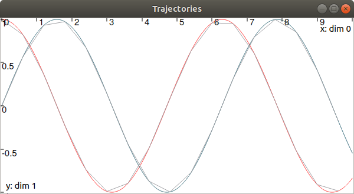

.. _sec-manual-vardyn:

************
Trajectories
************

.. contents::

A trajectory :math:`x(\cdot):[t_0,t_f]\to\mathbb{R}` is a set of real values defined over some temporal domain :math:`[t_0,t_f]`. There are two ways to define a trajectory:

* with some analytic formula, by using a ``Function`` object ;
* from a map of values.

Defining a trajectory from an analytic function
-----------------------------------------------

It must be emphasized that the mathematical functions mentioned here are not related to programming functions in C++ or Python.

A simple temporal function [#f1]_ can be defined and used for building a trajectory:

.. tabs::

  .. code-tab:: c++

    Interval tdomain(0.,10.);                             // temporal domain: [t_0,t_f]
    Trajectory x(tdomain, Function("cos(t)+sin(2*t)"));   // defining x(·) as: t ↦ cos(t)+sin(2t)

  .. code-tab:: py

    # todo

Usual functions such as :math:`\cos`, :math:`\log`, *etc.* can be used to define a ``Function`` object. The convention used for these definitions is the one of IBEX (`read more <http://www.ibex-lib.org/doc/function.html>`_). Note that the system variable :math:`t` is a predefined variable of ``Function`` objects, that does not appear in IBEX's objects.

The evaluation of a trajectory at some time :math:`t`, for instance :math:`y=x(t)`, is performed with parentheses:

.. tabs::

  .. code-tab:: c++

    double y = x(M_PI);                                   // y = cos(π)+sin(2π) = -1

  .. code-tab:: py

    # todo

In this code, :math:`x(\cdot)` is implemented from the expression :math:`t\mapsto\cos(t)+\sin(2t)`, and no numerical approximation is performed: the formula is embedded in the object and the representation is accurate.
However, the evaluation of the trajectory may lead to numerical errors related to the approximation of real numbers by floating-point values.
For instance, if we change the decimal precision to format floating-point values and then print the value of ``y``, we can see that the result is not exactly :math:`-1`:

.. tabs::

  .. code-tab:: c++

    #include <iomanip>                                    // for std::setprecision()

    double y = x(M_PI);                                   // y = cos(π)+sin(2π) = -1
    cout << setprecision(10) << y << endl;
    // Output:
    // -1.0000000000000006661338147750939242541790008544921875

  .. code-tab:: py

    # todo

| This is not only due to the approximation made on :math:`\pi`, that could be reliably handled by some :math:`[\pi]`.
| A reliable evaluation of :math:`x(\cdot)` can be done by specifying :math:`t` as a degenerate interval :math:`[t]`. This produces an interval evaluation that is reliable: the output is also an interval that is guaranteed to contain the actual value despite floating-point uncertainties: :math:`[y]=x([t])`.

.. tabs::

  .. code-tab:: c++

    Interval y = x(Interval::pi());                       // y = cos(π)+sin(2π) = -1
    cout << setprecision(10) << y << endl;
    // Output:
    // [-1.000000000000002, -0.9999999999999991]

  .. code-tab:: py

    # todo

This also works for large temporal evaluations as long as :math:`[t]\subseteq[t_0,t_f]`.  

Defining a trajectory from a map of values
------------------------------------------

Another way to build :math:`x(\cdot)` is to implement it as a map of discrete values. :math:`x(\cdot)` is supposed to be continuous and so linear interpolation is performed between each value of the map.
These trajectories are useful in case of actual data coming from sensors or numerical models. The following example provides a comparison between the two kinds of trajectory definitions:

.. tabs::

  .. code-tab:: c++

    // Trajectory from a formula
    Trajectory x_f(Interval(0.,10.), Function("cos(t)+sin(2*t)"));
    
    // Trajectory from a map of values
    map<double,double> values;
    for(double t = 0. ; t <= 10. ; t+=0.5)
      values[t] = cos(t)+sin(2*t);
    Trajectory x_m(values);

    // Graphics
    fig.add_trajectory(&x_f, "x_f", "red");
    fig.add_trajectory(&x_m, "x_m", "blue");

  .. code-tab:: py

    # todo

.. figure:: img/02_trajs.png
  
  In red, the trajectory defined from the analytical function. In blue, a trajectory made of 21 points with linear interpolation.

Note that when building a trajectory from a map, there is no need to specify the temporal domain; it will be evaluated as the envelope of the keys of the map.

It is also possible to define a trajectory from an analytical function and represent it with a map of values. This can be necessary for various operations on trajectories that are not available for analytical definitions, such as arithmetic operations.

.. tabs::

  .. code-tab:: c++

    // Analytical definition but sampling representation with dt=0.5:
    Trajectory x_1(Interval(0.,10.), Function("cos(t)+sin(2*t)"), 0.5);

    // Same as before, in two steps. x_1 == x_2
    Trajectory x_2(Interval(0.,10.), Function("cos(t)+sin(2*t)"));
    x_2.sample(0.5);

  .. code-tab:: py

    # todo

The following table summarizes the operations supported for each kind of trajectory definition.

=================================  ================  ==================
Operations                         Analytical def.   Map of values def.
=================================  ================  ==================
``codomain()``                     ✓                 ✓                 
evaluations                        ✓                 ✓                 
``first_value()``                  ✓                 ✓                 
``last_value()``                   ✓                 ✓                 
``set()``                                            ✓                 
``truncate_domain()``              ✓                 ✓                 
``shift_domain()``                 ✓                 ✓                 
``sample()``                       ✓                 ✓                 
``make_continuous()``                                ✓                 
``primitive()``                    ✓                 ✓                 
``diff()``                         ✓                 ✓                 
arithmetics (:math:`+,-,\cdot,/`)                    ✓                 
=================================  ================  ==================

Operations on trajectories
--------------------------

Once created, several evaluations of the trajectory can be made. For instance:

.. tabs::

  .. code-tab:: c++

    x.domain()         // temporal domain, returns [0, 10]
    x.codomain()       // envelope of values, returns [-2,2]
    x(6.)              // evaluation of x(.) at 6, returns 0.42..
    x(Interval(5.,6.)) // evaluation of x(.) over [5,6], returns [-0.72..,0.42..]

  .. code-tab:: py

    # todo

Note that the items defining the trajectory (the map of values, or the function) are accessible from the object:

.. tabs::

  .. code-tab:: c++

    map<double,double> mapy = y.sampled_map(); // y(.) was defined as a map of values
    tubex::Function *fx = x.function();         // x(.) was defined from a formula

  .. code-tab:: py

    # todo

Other methods exist such as:

.. tabs::

  .. code-tab:: c++

    // Approximation of primitives:
    Trajectory y_prim = y.primitive(); // when defined from a map of values
    Trajectory x_prim = x.primitive(0., 0.01); // when defined from a function

    // Differentiations:
    Trajectory x_diff = x.diff(); // exact differentiation of x(.)
    Trajectory y_diff = y.diff(); // finite differences on y(.)

  .. code-tab:: py

    # todo

Note that the result of these methods is inaccurate, except if the trajectory is defined from an analytic function (then the exact differentiation is returned, as a trajectory defined by a function too).

Finally, to add a point to a mapped trajectory, the following function can be used:

.. tabs::

  .. code-tab:: c++

    y.set(1., 4.); // add the value x(4)=1

  .. code-tab:: py

    # todo

Other features and details can be found in the technical datasheet of the Trajectory class.

.. _sec-manual-vardyn-trajectoryvector:

The vector case
---------------

The extension to the vector case is the class ``TrajectoryVector``, allowing to create trajectories :math:`\mathbf{x}(\cdot):\mathbb{R}\to\mathbb{R}^n`.
The features presented above remain the same.

.. tabs::

  .. code-tab:: c++

    // Trajectory from a formula; the function's output is two-dimensional
    TrajectoryVector x(Interval(0.,10.),
                       tubex::Function("(cos(t);sin(t))"));

    // Discretized trajectory
    TrajectoryVector y(2);
    for(double t = 0. ; t <= 10. ; t+=0.6)
    {
      Vector val(2); // values are 2d vectors
      val[0] = cos(t); val[1] = sin(t);
      y.set(val, t);
    }

    // ...

    // From a formula
    fig.add_trajectory(&y[0], "y_0", "gray"); // first component
    fig.add_trajectory(&y[1], "y_1", "gray"); // second component

    // From discrete values
    fig.add_trajectory(&x[0], "x_0", "red");  // first component
    fig.add_trajectory(&x[1], "x_1", "blue"); // second component

  .. code-tab:: py

    # todo

Note that as in IBEX, each component of a vector object (``IntervalVector``, ``TrajectoryVector``, ``TubeVector``) is available by reference:

.. tabs::

  .. code-tab:: c++

    x[1] = Trajectory(domain, tubex::Function("exp(t)"));
    cout << x[1] << endl;
  
  .. code-tab:: py

    # todo

Next page presents several methods to use tubes, as envelopes of trajectories.

.. rubric:: Footnotes
.. [#f1] In Tubex, a ``tubex::Function`` is the extension of IBEX's ``ibex::Function`` objects, for the dynamical case (see more `about IBEX's functions <http://www.ibex-lib.org/doc/function.html>`_).