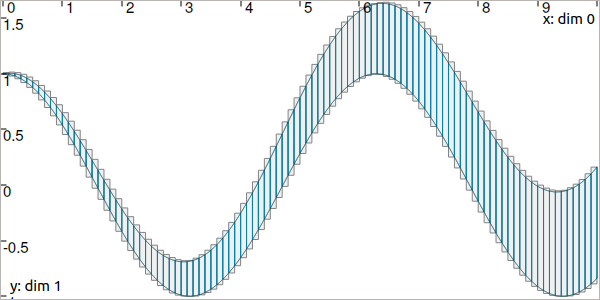
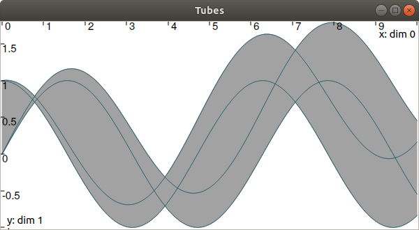

.. _sec-manual-tubes:

*****
Tubes
*****

We now focus on *dynamical* items that are evolving with time.
The trajectories :math:`x(\cdot)` and vector of trajectories :math:`\mathbf{x}(\cdot)`, presented :ref:`in the previous pages <sec-manual-vardyn>`, have also their interval counterpart: **tubes**. This page provides the main uses of these sets. They will be involved afterwards for solving problems related to differential equations.

.. contents::

Definition
----------

A tube is defined over a temporal domain :math:`[t_0,t_f]` as an envelope of trajectories that are defined over the same domain :math:`[t_0,t_f]`. We speak about an *envelope* as it may exist trajectories enclosed in the tube that are not solutions of our problem.

In this library, a tube :math:`[x](\cdot):[t_0,t_f]\rightarrow\mathbb{IR}` is an interval of two trajectories :math:`[\underline{x}(\cdot),\overline{x}(\cdot)]` such that :math:`\forall t\in[t_0,t_f]`, :math:`\underline{x}(t)\leqslant\overline{x}(t)`. We also consider empty tubes that depict an absence of solutions, denoted :math:`\varnothing(\cdot)`.
A trajectory :math:`x(\cdot)` belongs to the tube :math:`\left[x\right](\cdot)` if :math:`\forall t\in[t_0,t_f], x\left(t\right)\in\left[x\right]\left(t\right)`. 

.. figure:: img/tube_def.png

  Illustration a one-dimensional tube enclosing a trajectory :math:`x^*(\cdot)` plotted in orange. The figure shows two interval evaluations: :math:`[x]([t_1])` and :math:`[x](t_2)`.

.. note::

  **Important:** we assume that all the tubes and/or the trajectories involved in a given resolution process share the same domain :math:`[t_0,t_f]`.

Slices
------

| In Tubex, tubes are implemented as lists of slices.
| More precisely, a tube :math:`[x](\cdot)` with a sampling time :math:`\delta>0` is implemented as a box-valued function which is constant for all :math:`t` inside intervals :math:`[k\delta,k\delta+\delta]`, :math:`k\in\mathbb{N}`.

The box :math:`[k\delta,k\delta+\delta]\times\left[x\right]\left(t_{k}\right)`, with :math:`t_{k}\in[k\delta,k\delta+\delta]`, is called the :math:`k`-th slice of the tube :math:`[x](\cdot)` and is denoted by :math:`[\![x]\!]^{(k)}`.

.. figure:: img/02_tube_slices.png

  A tube :math:`[x](\cdot)` represented by a set of :math:`\delta`-width slices. This implementation can be used to enclose signals such as :math:`x^*(\cdot)`.

.. versionadded:: 2.0
   Custom discretization of tubes, they can be made of slices that are not all defined with the same sampling time :math:`\delta`.

This implementation takes rigorously into account floating point precision when building a tube.
Further computations involving :math:`[x](\cdot)` will be implicitely based on its slices, thus keeping a reliable outer approximation of the solution set. 

Creating tubes
--------------

The vocabulary for tubes involves two notions:

* the **domain**, that represents the temporal domain :math:`[t_0,t_f]`
* the **codomain**, that represents the set of feasible values of the tube :math:`[x]([t_0,t_f])`

To create a ``Tube`` with a constant codomain:

.. tabs::

  .. code-tab:: c++

    Interval domain(0.,10.);
    
    // One-slice tubes:
    Tube x1(domain);                                // [0,10]→[-∞,∞]
    Tube x2(domain, Interval(0.,2.));               // [0,10]→[0,2]

    // 100-slices tubes:
    float dt = 0.1;
    Tube x3(domain, dt, Interval(0.,2.));           // [0,10]→[0,2]
    Tube x4(domain, dt, Interval::pos_reals());     // [0,10]→[0,∞]

  .. code-tab:: py

    # todo

The ``dt`` variable defines the temporal width of the slices. Note that it is also possible to create slices of different width; this will be explained afterwards.

To create a copy of a tube with the same time discretization, use:

.. tabs::

  .. code-tab:: c++

    Tube x5(x4);                     // identical tube (100 slices, [0,10]→[0,∞])
    Tube x6(x4, Interval(5.));       // 100 slices, same timestep, but [0,10]→[5]

  .. code-tab:: py

    # todo

As tubes are interval of trajectories, a ``Tube`` can be defined from ``Trajectory`` objects:

.. tabs::

  .. code-tab:: c++

    // Creating trajectories:
    Trajectory traj1(domain, Function("cos(t)"));
    Trajectory traj2(domain, Function("cos(t)+t/10"));

    Tube x8(traj1, dt);              // 100 slices tube enclosing cos(t)
    Tube x9(traj1, traj2, dt);       // 100 slices tube defined as [cos(t),cos(t)+t/10]

  .. code-tab:: py

    # todo

  Result of tube :math:`[x_9](\cdot)=[\cos(t),\cos(t)+\frac{t}{10}]`, made of 100 slices.

.. #include <tubex.h>
.. 
.. using namespace std;
.. using namespace tubex;
.. 
.. int main()
.. {
..   float dt = 0.1;
..   Interval domain(0.,10.);
.. 
..   TrajectoryVector traj(domain, Function("(cos(t) ; cos(t)+t/10)"));
..   Tube x(traj[0], traj[1], dt);
.. 
..   vibes::beginDrawing();
.. 
..   VIBesFigTube fig("Tube");
..   fig.set_properties(100, 100, 600, 300);
..   fig.add_tube(&x, "x", "#376D7C[lightGray]");
..   fig.add_trajectories(&traj, "trajs");
..   fig.show(true);
.. 
..   vibes::endDrawing();
.. }

It is also possible to create a tube from a thick function, where the uncertainty is explicitly set in the formula:

.. tabs::

  .. code-tab:: c++

    Tube x10(domain, dt/10.,
             Function("-abs(cos(t)+t/5)+(t/2)*[-0.1,0.1]"));

  .. code-tab:: py

    # todo

.. figure:: img/02_tube_fnc.png

  Result of tube :math:`[x_{10}](\cdot)` made of 1000 slices.

Finally, a tube can be seen as an envelope (union) of trajectories. And so the following operations are allowed:

.. tabs::

  .. code-tab:: c++

    float dt = 0.01;
    Interval domain(0.,10.);

    Function f("(cos(t) ; cos(t)+t/10 ; sin(t)+t/10 ; sin(t))"); // 4d function
    TrajectoryVector traj(domain, f); // 4d trajectory defined over [0,10]

    // 1d tube [x](·) defined as a union of the 4 trajectories
    Tube x = Tube(traj[0], dt) | traj[1] | traj[2] | traj[3];

  .. code-tab:: py

    # todo
    
Which produces:

Evaluations
-----------

Once created, several evaluations of the tube can be made, as for trajectories. For instance:

.. tabs::

  .. code-tab:: c++

    x.domain()         // temporal domain, returns [0, 10]
    x.codomain()       // envelope of values, returns [-1, 1.79]
    x(6.)              // evaluation of [x](·) at 6, returns [-0.28, 1.56]
    x(Interval(5.,6.)) // evaluation of [x](·) over [5,6], returns [-0.96, 1.57]

  .. code-tab:: py

    # todo

The inversion of a tube :math:`[x](\cdot)`, denoted :math:`[x]^{-1}([y])`, is also at hand and returns the set :math:`[t]` enclosing the preimages of :math:`[y]`. The ``invert()`` method returns the union of these subsets, or the set of solutions within a vector of ``Interval`` objects. The following example returns the different subsets of the inversion :math:`[x]^{-1}([0,0.2])` projected in red in next figure:

.. tabs::

  .. code-tab:: c++

    vector<Interval> v_t;            // vector of preimages
    x.invert(Interval(0.,0.2), v_t); // inversion

    for(auto& t : v_t)
    {
      IntervalVector tbox = {t,{0.,0.2}};
      fig.draw_box(tbox, "red");     // boxes display
    }

  .. code-tab:: py

    # todo

.. figure:: img/02_invert.png

Furthermore, other methods related to sets are available:

.. tabs::

  .. code-tab:: c++

    x.volume()         // returns the volume (surface) of the tube
    x.max_diam()       // greater diameter of the tube
    x.diam()           // a trajectory representing all diameters

  .. code-tab:: py

    # todo

Operations on sets
------------------

Classical operations on sets are applicable on tubes.
Note that the tubes may have to share the same domain and slicing for these operations.

.. tabs::

  .. code-tab:: c++

    Tube x4 = (x1 | x2) & x3;
    
  .. code-tab:: py

    # todo

The same for mathematical functions:

.. tabs::

  .. code-tab:: c++

    Tube x2 = abs(x1);
    Tube x3 = cos(x1) + sqrt(x2 + pow(x1, Interval(2,3)));

  .. code-tab:: py

    # todo

Several methods available in IBEX can be used for tubes. For instance:

.. tabs::

  .. code-tab:: c++

    x.is_subset(y)
    x.is_interior_subset(y)
    y.is_empty()
    x.overlaps(y)

  .. code-tab:: py

    # todo

It is also possible to test if a tube :math:`[x](\cdot)` contains a solution :math:`z(\cdot)`. The ``contains()`` method can be used for this purpose, but the answer is sometimes uncertain and so an ``ibex::BoolInterval`` is always used. Its values can be either ``YES``, ``NO`` or ``MAYBE``. The ``MAYBE`` case is rare but may appear due to the numerical representation of a trajectory. Indeed, some wrapping effect may occur for its reliable evaluations and so this `contains` test may not be able to conclude, if the thin envelope of :math:`z(\cdot)` overlaps a boundary of the tube :math:`[x](\cdot)`.

.. tabs::

  .. code-tab:: c++

    BoolInterval b = x.contains(traj_z); // with traj_z a Trajectory object

  .. code-tab:: py

    # todo

Integral computations
---------------------

Computation of the primitive :math:`\int_{0}[x](\tau)d\tau`:

.. tabs::

  .. code-tab:: c++

    Tube primitive = x.primitive();

  .. code-tab:: py

    # todo
    
Computation of :math:`[s]=\int_{0}^{[t]}[x](\tau)d\tau`:

.. tabs::

  .. code-tab:: c++

    Interval t;
    Interval s = x.integral(t);

  .. code-tab:: py

    # todo

Computation of :math:`[s]=\int_{[t_1]}^{[t_2]}[x](\tau)d\tau`:

.. tabs::

  .. code-tab:: c++

    Interval t1, t2;
    Interval s = x.integral(t1, t2);

  .. code-tab:: py

    # todo

Also, a decomposition of the integral of :math:`[x](\cdot)=[x^-(\cdot),x^+(\cdot)]` with :math:`[s^-]=\int_{[t_1]}^{[t_2]}x^-(\tau)d\tau` and :math:`[s^+]=\int_{[t_1]}^{[t_2]}x^+(\tau)d\tau` is computable by:

.. tabs::

  .. code-tab:: c++

    Interval t1, t2;
    pair<Interval,Interval> s;
    s = x.partial_integral(t1, t2);
    // s.first is [s^-]
    // s.second is [s^+]

  .. code-tab:: py

    # todo

*Note:* :math:`[s]=[s^-]\cup[s^+]`.

Updating values
---------------

The ``set()`` methods allow various updates on tubes. For instance:

.. tabs::

  .. code-tab:: c++

    x.set(Interval(0.,2.), Interval(5.,6.)); // then [x]([5,6])=[0,2]

  .. code-tab:: py

    # todo
    
produces:

.. figure:: img/02_set.png

See also the following methods:

.. tabs::

  .. code-tab:: c++

    x.set(Interval::POS_REALS); // set a constant codomain for all t
    x.set(Interval(0.), 4.);    // set a value at some t: [x](4)=[0]
    x.set_empty();              // empty set for all t

  .. code-tab:: py

    # todo
    
**Note:** be careful when updating a tube without the use of dedicated contractors. Tube discretization has to be kept in mind whenever an update is performed for some input :math:`t`. For guaranteed operations, please see the *Contractors* section.

.. _sec-manual-tubes-tubevector:

The vector case
---------------

The extension to the vector case is the class ``TubeVector``, allowing to create tubes :math:`[\mathbf{x}](\cdot):\mathbb{R}\to\mathbb{IR}^n`.
The features presented above remain the same.

.. tabs::

  .. code-tab:: c++

    // TubeVector from a formula; the function's output is two-dimensional
    TubeVector x(Interval(0.,10.), dt,
                 Function("(sin(sqrt(t)+((t-5)^2)*[-0.01,0.01]) ; \
                            cos(t)+sin(t/0.2)*[-0.1,0.1])"));

  .. code-tab:: py

    # todo

.. figure:: img/02_tubevectors.png

Note that as in IBEX, each component of a vector object (``IntervalVector``, ``TrajectoryVector``, ``TubeVector``) is available by reference.

**Full code:**

.. tabs::

  .. code-tab:: c++

    #include <tubex.h>

    using namespace std;
    using namespace tubex;

    int main()
    {
      float dt = 0.01;
      Interval domain(0.,10.);

      // TubeVector as a union of trajectories
      TrajectoryVector traj(domain, Function("(cos(t) ; cos(t)+t/10 ; sin(t)+t/10 ; sin(t))"));
      Tube x = Tube(traj[0], dt) | traj[1] | traj[2] | traj[3];

      // Inversion
      vector<Interval> v_t;
      x.invert(Interval(0.,0.2), v_t);

      // Update
      x.set(Interval(0.,2.), Interval(5.,6.)); // then x([5,6])=[0,2]

      // TubeVector from a formula; the function's output is two-dimensional
      TubeVector y(Interval(0.,10.), dt,
                   Function("(sin(sqrt(t)+((t-5)^2)*[-0.01,0.01]) ; \
                              cos(t)+sin(t/0.2)*[-0.1,0.1])"));

      vibes::beginDrawing();

      VIBesFigTube fig("Tube");
      fig.set_properties(100, 100, 600, 300);
      fig.add_tube(&x, "x", "#376D7C[lightGray]");
      fig.add_trajectories(&traj, "trajs");

      for(auto& t : v_t)
      {
        IntervalVector tbox = {t,{0.,0.2}};
        fig.draw_box(tbox, "red");     // boxes display
      }

      fig.show();

      VIBesFigTube fig_vec("TubeVector");
      fig_vec.set_properties(200, 200, 600, 300);
      fig_vec.add_tubes(&y, "y", "#376D7C[lightGray]");
      fig_vec.show();

      vibes::endDrawing();
    }

  .. code-tab:: py

    # todo

Further pages will be written soon, presenting contractors, bisections, fixed point resolutions, graphical tools and robotic applications.

.. _sec-manual-tubes-sampling:

Sampling
--------

.. figure:: img/sampled_tube.png

.. #include <tubex.h>
.. 
.. using namespace std;
.. using namespace tubex;
.. 
.. int main()
.. {
..   float dt = 0.2;
..   Interval domain(0.,10.);
.. 
..   TrajectoryVector traj(domain, Function("(cos(t) ; cos(t)+t/10)"));
..   Tube x(domain, Interval::empty_set());
.. 
..   double t = domain.lb();
..   while(t < domain.ub())
..   {
..     x.sample(t);
..     t += dt/10. + fabs(cos(t)/10.);
..   }
.. 
..   x |= traj[0]; x |= traj[1];
.. 
..   vibes::beginDrawing();
.. 
..   VIBesFigTube fig("Tube");
..   fig.set_properties(100, 100, 600, 300);
..   fig.add_tube(&x, "x", "#376D7C[lightGray]");
..   fig.add_trajectories(&traj, "trajs");
..   fig.show(true);
.. 
..   vibes::endDrawing();
.. }