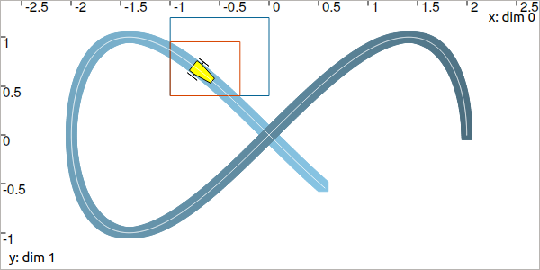
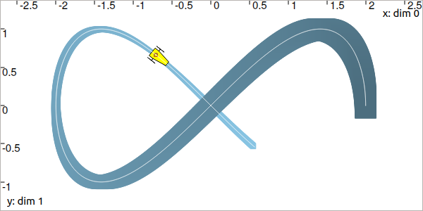

.. _sec-manual-ctceval:

.. warning::
  
  This part of the documentation is deprecated. Several changes are currently perfomed on the library.
  A new stable version of Tubex will be released in the coming weeks.

***************************
CtcEval: :math:`y_i=x(t_i)`
***************************

:math:`y_i=x(t_i)` is a constraint that links a value :math:`y_i` to the evaluation of the trajectory :math:`x(\cdot)` at time :math:`t_i`. A dedicated contractor :math:`\mathcal{C}_{\textrm{eval}}` implements this constraint. One of its applications is the correction of the positions of a robot based on observations.

.. contents::

Definition
----------

.. important::
    
  .. math::

    \left.\begin{array}{r}y_i=x(t_i)\\\dot{x}(\cdot)=v(\cdot)\end{array}\right\} \longrightarrow \mathcal{C}_{\textrm{eval}}\big([t_i],[y_i],[x](\cdot),[v](\cdot)\big)

  .. tabs::

    .. code-tab:: c++

      ctc::eval.contract(t, y, x, v);

    .. code-tab:: py

      # todo

Example
-------

.. rubric:: Contracting the evaluation box

Let us come back to :ref:`the Lissajous example<sec-manual-vardyn-lissajous>` introduced to present the use of trajectories.
Assume now that we know the actual trajectory to be bounded within the tube:

.. math::

  [\mathbf{x}](t) = \left(\begin{array}{c}2\cos(t)\\\sin(2t)\end{array}\right)+\left(\begin{array}{c} [-0.05,0.05]\\ [-0.05,0.05]\end{array}\right)

.. tabs::

  .. code-tab:: c++

    double dt = 0.01;
    Interval tdomain(0.,5.);
    TubeVector x(tdomain, dt, Function("(2*cos(t) ; sin(2*t))"));
    x.inflate(0.05);

  .. code-tab:: py

    # todo

The tube is blue painted on the figure:

The yellow robot depicts an unknown position :math:`\mathbf{x}` in the box :math:`[-1,0]\times[0.4,1.2]` at an unknown :math:`t\in[t_0,t_f]`.
The :math:`\mathcal{C}_{\textrm{eval}}` can be used to evaluate the position time and reduce the uncertainty on the possible positions.

.. tabs::

  .. code-tab:: c++

    Interval t;
    IntervalVector b = {{-1.,0.},{0.4,1.2}};       // (blue on the figure)

    CtcEval ctc_eval;
    ctc_eval.contract(t, b, x);

    // [t] estimated to [4.15, 4.54]
    // [b] contracted to ([-1, -0.29] ; [0.4, 0.95])  (red on the figure)

  .. code-tab:: py

    # todo

.. #include <tubex.h>
.. #include <tubex-rob.h>
.. 
.. using namespace std;
.. using namespace tubex;
.. 
.. int main()
.. {
..   double dt = 0.01;
..   Interval tdomain(0.,5.);
..   TrajectoryVector x_truth(tdomain, Function("(2*cos(t) ; sin(2*t))"));
..   TubeVector x(x_truth, dt);
..   x.inflate(0.05);
.. 
..   vibes::beginDrawing();
.. 
..   VIBesFigMap fig_map("Map");
..   fig_map.set_properties(1450, 50, 600, 300);
..   fig_map.add_trajectory(&x_truth, "x*", 0, 1, "white");
..   fig_map.add_tube(&x, "x", 0, 1);
..   fig_map.smooth_tube_drawing(true);
.. 
..   Interval t;
..   IntervalVector b = {{-1.,0.},{0.4,1.2}};
..   fig_map.draw_box(b, "#076594");
..   ctc::eval.contract(t, b, x);
..   fig_map.draw_vehicle(t.mid(), &x_truth, 0.25);
..   fig_map.draw_box(b, "#D74400");
.. 
..   fig_map.axis_limits(-0.1,0.1,-1.3,1.3, true);
..   fig_map.show(0.);
..   
..   vibes::endDrawing();
.. }

.. rubric:: Contracting the tube

We now assume that we have no knowledge on :math:`[\mathbf{x}](\cdot)`, except that the feasible trajectories go through the box :math:`[-0.73,-0.69]\times[0.64,0.68]` at :math:`t=4.35`.

The tube is contracted over :math:`[t_0,t_f]` with its uncertain derivative :math:`[\mathbf{v}](\cdot)` given by:

.. math::

  [\mathbf{v}](t) = \left(\begin{array}{c}-2\sin(t)\\2\cos(2t)\end{array}\right)+\left(\begin{array}{c} [-0.02,0.02]\\ [-0.02,0.02]\end{array}\right)

.. tabs::

  .. code-tab:: c++

    // No knowledge on [x](·)
    x.set(IntervalVector(2)); // initialization with [-∞,∞]×[-∞,∞]

    // New values for the temporal evaluation of [x](·)
    t = 4.35;
    b = {{-0.73,-0.69},{0.64,0.68}};

    // Derivative of [x](·)
    TubeVector v(tdomain, dt, Function("(-2*sin(t) ; 2*cos(2*t))"));
    v.inflate(0.02);

    // Contraction
    ctc_eval.contract(t, b, x, v);

  .. code-tab:: py

    # todo

The obtained tube is blue painted on the figure, the contraction at :math:`t=4.35` (red box) is propagated over the whole *t*-domain:

Related content
---------------

.. |tubeval-pdf| replace:: **Download the paper**
.. _tubeval-pdf: http://simon-rohou.fr/research/tubeval/tubeval_paper.pdf

.. admonition:: Related publication
  
  | **Reliable non-linear state estimation involving time uncertainties**
  | S. Rohou, L. Jaulin, L. Mihaylova, F. Le Bars, S. M. Veres
  | *Automatica*, 93:379--388, July 2018.
  | |tubeval-pdf|_

.. admonition:: Technical documentation

  See the `API documentation of this class <../../../api/html/classtubex_1_1_ctc_eval.html>`_.