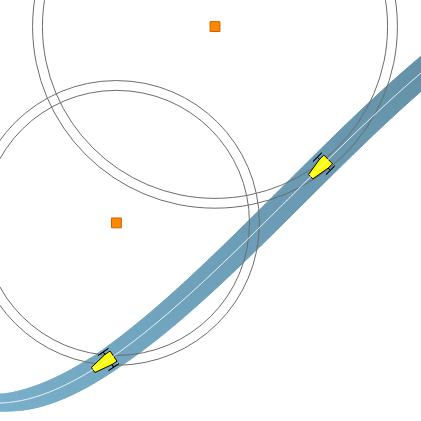

.. _sec-tuto:

#############################################
Tutorial: constraint programming for robotics
#############################################

.. centered:: Simon Rohou, Luc Jaulin, Benoît Desrochers, Raphael Voges
.. centered:: **8th June -- 5th July**

.. sidebar:: ICRA 2020 tutorial

  .. Figure:: ../img/logo_icra.png
    :align: center

  This tutorial is proposed in the `ICRA 2020 Conference <https://www.icra2020.org/program/workshops-and-tutorials>`_ (International Conference on Robotics and Automation).

.. About the tutorial
.. ------------------

This tutorial is about Constraint Programming (CP), Interval Analysis (IA) and their applications to mobile robot localization.

| **Interval analysis** yields methods to compute intervals in place of real numbers, enclosing uncertainties in the mean time.
| **Constraint Programming** aims at solving a complex problem by defining it in terms of constraints coming from the equations or the measurements.
| Both concepts match perfectly for a large number of applications including Robotics, which is the subject of this tutorial proposed in the `ICRA 2020 <https://www.icra2020.org/>`_ conference.

.. contents:: Contents of this page

Constraint programming?
-----------------------

There are several ways to deal with **state estimation** in mobile robotics. The **constraint programming** approach consists in defining a problem as a set of rules and letting a solver perform the estimation. For mobile robotics, rules are constraints coming from state equations or uncertainties from the measurements.

Efforts have been done to propose operators and **solvers** to apply these constraints. The goal of this tutorial is to learn how to use them and understand the efficiency of the approach on realistic robotic applications. We will see that some problems that are difficult to solve with conventional methods (Kalman filters, particle approaches) can be easily dealt with by constraint programming. This is for instance the case of poor observation measurements, time uncertainties, delays, or when the initial conditions of the system are not known.

The tutorial will stand on **the Tubex library**, that provides tools for computations over sets of reals and trajectories. It has been designed to deal with dynamical systems defined by non-linear differential equations and involving constraints such as trajectory evaluations, time uncertainties or delays. These computations stand on **interval analysis**, a well suited tool that reliably **propagates uncertainties**. 

Requirements
------------

Prerequisite for attending the tutorial are:

* basic knowledge of **Python or C++** (the exercises are available in both languages);
* although the tutorial is about state estimation, you do not need skills in Kalman or particle filters.

Contact and registration
------------------------

The tutorial involves three platforms:

* the `Tubex website <http://simon-rohou.fr/research/tubex-lib>`_ (here you are!)
* the `MOOC platform <https://mooc.ensta-bretagne.fr/course/view.php?id=7>`_ where you can send your work and get the tutorial diploma
* the `Slack communication platform (#tt1) <https://icra20.slack.com/app_redirect?channel=tt1>`_ of ICRA for fast interactive meetings

This tutorial is proposed to the participants of `the ICRA conference <https://www.icra2020.org>`_. All the exercises are available on this Tubex website. The registration to `the MOOC platform <https://mooc.ensta-bretagne.fr/course/view.php?id=7>`_ is not mandatory, except if you want to share with the organizers your progression and difficulties, and to obtain the diploma.

Diploma
-------

To get the diploma, you need to send valid exercises to the organizers. A participant who gets a minimum total of 12 points will receive a diploma corresponding to this tutorial.
This diploma can be used by students to obtain the corresponding ECTS from their PhD courses, or to comply with any other requests from their home university.

.. An example of the diploma you can obtain is:

Duration and meeting sessions
-----------------------------

The tutorial will be held **from 8th of June to 5th of July**.
Interactive meetings sessions are planned each Wednesday afternoon at 2pm:

.. hlist::
  :columns: 4

  * 10th of June
  * 17th of June
  * 24th of June
  * 1rst of July

Content of the tutorial
-----------------------

A list of exercises is proposed with realistic robotic applications.

------------------------------------------------------

**Week 0: June 1 -- June 7**

Before starting the tutorial, you can read some words about the concepts of Constraint Programming and Interval Analysis. This will give you a first glimpse of the philosophy of this tutorial.

.. toctree:: 
  :maxdepth: 1

  /tutorial/00-getting-started/01-introduction

To get ready, you need to install the Tubex library on your computer.
Please follow the related page of the manual to see how to do it:

.. toctree:: 
  :maxdepth: 1

  /install/01-installation

Then, depending on your preference between C++ or Python, you can run some *Hello World!* program to be sure everything is working well so far:

.. toctree:: 
  :maxdepth: 1

  /install/02-start-py-project
  /install/03-start-cpp-project

------------------------------------------------------

**Week 1: June 8 -- June 14**

.. image:: img/tuto_01.png
   :align: right
   :width: 200px

* **Lesson A**: getting started with concepts of CP and IA
* **Lesson B**: static range-only localization

| During this first week, we will install the library and perform the **state estimation** of a static robot between some landmarks. For the moment, we will assume that the robot does not move and is only receiving **range-only data** from the landmarks.
| This will be an introduction to :ref:`intervals <sec-manual-intervals>`, :ref:`constraints <sec-manual-contractors>` and :ref:`networks of contractors <sec-manual-cn>`.

------------------------------------------------------

**Week 2: June 15 -- June 21**

* **Lesson C**: static range-bearing localization
* **Lesson D**: dynamic range-only localization

We will go a step further: now the landmarks are perceived with both **range and bearing data**. The resolution will involve new constraints, and a **decomposition** will be achieved.
In the second part, we will make the robot move and see how we can handle **uncertainties on trajectories**. This will be done by solving the range-only problem of Lesson B, now in a dynamical context with **asynchronous measurements**. 

------------------------------------------------------

**Week 3: June 22 -- June 28**

.. image:: img/tuto_03.png
   :align: right
   :width: 200px

* **Lesson E**: localization with data association

Now, the landmarks perceived by the robot are **indistinguishable**. We still assume that we know their position, but the robot is not able to make the **association** between the map and the observations. This corresponds to the publication `Set-membership state estimation by solving data association <https://ras.papercept.net/proceedings/ICRA20/1405.pdf>`_, that is currently presented during this ICRA conference (see the `video presentation <https://www.youtube.com/watch?v=rkzouwuwo4I>`_).
We will solve this problem with Tubex. The goal of this exercise is to develop **our own contractor**.

------------------------------------------------------

**Week 4: June 29 -- July 5**

.. image:: img/tuto_04.png
   :align: right
   :width: 200px

* **Lesson F**: range-only SLAM
* **Lesson G**: loop detection in robot trajectories

| We will end this tutorial with a **range-only SLAM** problem and see how Tubex can be used for **online missions**.
| The last part of this section will focus on new tools to detect and **prove loops** in robot trajectories from the only knowledge of proprioceptive measurements such as velocities.

------------------------------------------------------

Organizers
----------

.. hlist::
  :columns: 2

  * `Simon Rohou <http://simon-rohou.fr/research/>`_
  * `Luc Jaulin <https://www.ensta-bretagne.fr/jaulin/>`_
  * `Benoît Desrochers <http://www.ensta-bretagne.fr/desrochers>`_
  * Raphael Voges

For any question, do not hesitate to use the `MOOC platform of this tutorial <https://mooc.ensta-bretagne.fr/course/view.php?id=7>`_, so that other participants can reply or see posted answers. We will also answer you on `the Slack communication platform (#tt1) <https://icra20.slack.com/app_redirect?channel=tt1>`_ for very short questions.