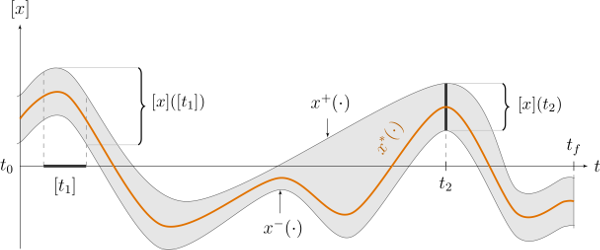
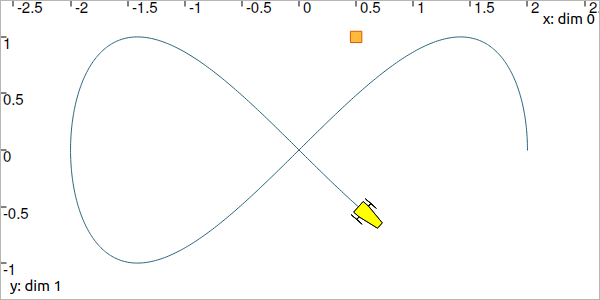
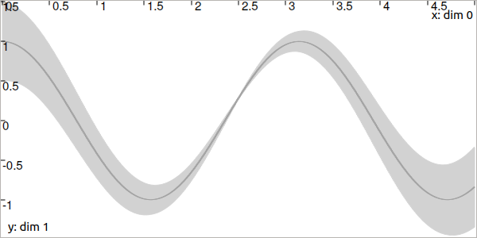

.. _sec-tuto-05:

Lesson E: Hello tubes
=====================

Mobile robot motion is usually described by an evolution function :math:`\mathbf{f}` involved in a **differential equation**. The interval state estimation then amounts to estimating the set of **feasible trajectories** that are solutions of this differential equation. The difficulty is to propagate the uncertainties in time, and to consider observations from asynchronous measurements in the same time. We will see that these difficulties are easily handled with constraint propagations on **tubes**.

.. contents:: Content of this lesson

.. _sec-tuto-05-formalism:

Formalism
---------

We now address the following problem:

.. math:: 

  \left\{ \begin{array}{lll}
  \dot{\mathbf{x}}(t)=\mathbf{f}\big(\mathbf{x}(t),\mathbf{u}(t)\big) &  & \textrm{(evolution equation)}\\
  \mathbf{y}(t)=\mathbf{g}\big(\mathbf{x}(t)\big) &  & \textrm{(observation equation)}
  \end{array}\right.

We recall that

* :math:`\mathbf{x}\in\mathbb{R}^n` is the state vector
* :math:`\mathbf{u}\in\mathbb{R}^m` is some input vector
* :math:`\mathbf{y}\in\mathbb{R}^p` is a measurement
* and :math:`\mathbf{f}`, :math:`\mathbf{g}` are respectively *evolution* and *observation* functions, possibly non-linear or uncertain

The :math:`\mathbf{x}`, :math:`\mathbf{u}` and :math:`\mathbf{y}` values :underline:`continuously` evolve with time. We will now handle them as **trajectories**.

.. rubric:: What is a trajectory

A trajectory :math:`x(\cdot):[t_0,t_f]\to\mathbb{R}` is a set of real values defined over some temporal domain :math:`[t_0,t_f]`, called *t*-domain.
They are aimed at **representing temporal evolutions**. We implement them with the ``Trajectory`` class (or the ``TrajectoryVector`` class for trajectories :math:`\mathbf{x}(\cdot):[t_0,t_f]\to\mathbb{R}^n`).

These trajectories correspond to a new kind of variable in the constraint programming approach. We will consider them together with other values such as reals of vectors, as we did in the previous lessons.

.. rubric:: New type of variables :math:`\implies` new type of domain

Because we will deal with a new kind of variable (trajectories :math:`x(\cdot)`), we also define a new type of domain to handle them with contractors: **tubes** :math:`[x](\cdot)`.

A tube :math:`[x](\cdot)` is defined over a temporal *t*-domain :math:`[t_0,t_f]` as an envelope of trajectories that are defined over the same *t*-domain. We speak about an *envelope* as it may exist trajectories enclosed in the tube that are not solutions of our problem. A trajectory :math:`x(\cdot)` belongs to the tube :math:`\left[x\right](\cdot)` if :math:`\forall t\in[t_0,t_f], x\left(t\right)\in\left[x\right]\left(t\right)`. 

  Illustration a one-dimensional tube enclosing a trajectory :math:`x^*(\cdot)` plotted in orange. The figure shows two interval evaluations: :math:`[x]([t_1])` and :math:`[x](t_2)`.

.. note::

  **Important:** we assume that all the tubes and/or the trajectories involved in a given resolution process share the same *t*-domain :math:`[t_0,t_f]`.

The ``Tube`` class allows to create a tube. See more on: :ref:`sec-manual-tubes`.

Using trajectories
------------------

Let us consider a robot following a `Lissajous curve <https://en.wikipedia.org/wiki/Lissajous_curve>`_ from :math:`t_0=0` to :math:`t_f=5`. Its exact trajectory is given by:

.. math::

  \mathbf{x}^*(t) = \left(\begin{array}{c}2\cos(t)\\\sin(2t)\end{array}\right)

The following code creates the actual (but unknown) trajectory :math:`\mathbf{x}^*(\cdot)`:

.. tabs::

  .. code-tab:: py

    dt = 0.01
    tdomain = Interval(0,5) # temporal domain [t0,tf]
    actual_x = TrajectoryVector(tdomain, TFunction("(2*cos(t) ; sin(2*t))"), dt)

  .. code-tab:: c++

    double dt = 0.01;
    Interval tdomain(0,5); // temporal domain [t0,tf]
    TrajectoryVector actual_x(tdomain, TFunction("(2*cos(t) ; sin(2*t))"), dt);

  Top view. The yellow robot follows a Lissajous curve forming an :math:`\infty` symbol.

| The ``TFunction`` object depicts a temporal function. It is similar to the ``Function`` objects we have seen previously, but the ``t`` variable is already defined. In this example, the output of the function is two-dimensional (defined with parenthesis).
| The last argument ``dt`` converts the analytical function into a discretized signal with :math:`\delta=0.01`.

.. admonition:: Exercise

  **E.1.** In a new project, create the above trajectory :math:`\mathbf{x}^*(\cdot)`, named ``actual_x``.

  **E.2.** Create a landmark :math:`\mathbf{b}=(0.5,1)`.

  **E.3.** In a ``VIBesFigMap`` figure, project the 2d trajectory in the view with the ``.add_trajectory()`` method.
  The arguments respectively refer to the object to display, its name in the view, the x-index component and the y-index component:

  .. tabs::

    .. code-tab:: py

      fig_map = VIBesFigMap("Map")
      fig_map.set_properties(100, 100, 600, 300)
      fig_map.add_trajectory(actual_x, "x*", 0, 1)
      fig_map.add_beacon(b, 0.1)                    # 0.1: landmark width
      fig_map.axis_limits(-2.5,2.5,-0.1,0.1, True)
      fig_map.show(0.5)                             # argument is robot size

    .. code-tab:: cpp
    
      VIBesFigMap fig_map("Map");
      fig_map.set_properties(100, 100, 600, 300);
      fig_map.add_trajectory(&actual_x, "x*", 0, 1);
      fig_map.add_beacon(b, 0.1);                   // 0.1: landmark width
      fig_map.axis_limits(-2.5,2.5,-0.1,0.1, true);
      fig_map.show(0.5);                            // argument is robot size

  **E.4.** The robot continuously measures its distance to the landmark :math:`\mathbf{b}`.

  Classical mathematical functions such as :math:`+`, :math:`\cos`, :math:`\exp`, :math:`\sqrt{\cdot}`, can be used on trajectories.
  Compute the distance signal ``actual_y`` between the robot and the landmark as one ``Trajectory`` object.

  **E.5.** Display the ``actual_y`` trajectory in another dedicated view with a ``VIBesFigTube`` object:

  .. tabs::

    .. code-tab:: py

      fig_dist = VIBesFigTube("Distance to the landmark")
      fig_dist.set_properties(100, 100, 600, 300)
      fig_dist.add_trajectory(actual_y, "y*")
      fig_dist.show()

    .. code-tab:: cpp
    
      VIBesFigTube fig_dist("Distance to the landmark");
      fig_dist.set_properties(100, 100, 600, 300);
      fig_dist.add_trajectory(&actual_y, "y*");
      fig_dist.show();

  You should obtain this figure:

  .. figure:: ../../manual/02-variables/img/distances.png

    Result of simulated range measurements: the ``actual_y`` trajectory object.

Enclosing the feasible trajectories of a robot
----------------------------------------------

The state estimation will be done by enclosing the feasible trajectories in a tube submitted to contractors.

| As for trajectories, tubes are defined over a *t*-domain :math:`[t_0,t_f]`. A parameter :math:`\delta` allows to numerically represent a tube as a set of temporal slices (we will use :math:`\delta` = ``dt`` = 0.01).
| We can build a tube from a temporal function, for instance:

.. tabs::

  .. code-tab:: py

    dt = 0.01
    tdomain = Interval(0,5)
    a = Tube(tdomain, dt, TFunction("cos(t*2)"))

  .. code-tab:: c++

    dt = 0.01;
    Interval tdomain(0,5);
    Tube a(tdomain, dt, TFunction("cos(t*2)"));

The same function can be used to express uncertainties with respect to time. For instance:

.. tabs::

  .. code-tab:: py

    b = Tube(tdomain, dt, TFunction("cos(t*2)+abs(t*2-5)*[-0.1,0.1]"))

  .. code-tab:: c++

    Tube b(tdomain, dt, TFunction("cos(t*2)+abs(t*2-5)*[-0.1,0.1]"));

In the following figure, the tubes :math:`[a](\cdot)` and :math:`[b](\cdot)` are respectively drawn in dark gray and light gray.

  The tube :math:`[a](\cdot)` has almost no uncertainty (thickness) over time (except the one due to its numerical representation) while the tube :math:`[b](\cdot)` in light gray has a thickness defined by :math:`|(2t-5)|\cdot[-0.1,0.1]`.

Tubes can also be built from trajectories. In this example, we could have defined :math:`[a](\cdot)` by:

.. tabs::

  .. code-tab:: py

    actual_a = Trajectory(tdomain, TFunction("cos(t*2)"))
    a = Tube(actual_a, dt) # [a](·) will wrap the trajectory

  .. code-tab:: c++

    Trajectory actual_a(tdomain, TFunction("cos(t*2)"));
    Tube a(actual_a, dt); // [a](·) will wrap the trajectory

.. dt = 0.01
.. tdomain = Interval(0,5)
.. x10 = Tube(tdomain, dt, \
..            TFunction("cos(t*2)+abs(t*2-5)*[-0.1,0.1]"))
.. 
.. beginDrawing()
.. fig_x10 = VIBesFigTube("Noised trajectory")
.. fig_x10.set_properties(100, 100, 600, 300)
.. fig_x10.add_tube(x10, "x")
.. fig_x10.show()
.. x10 &= Tube(tdomain, dt, TFunction("cos(t*2)"))
.. fig_x10.show()
.. endDrawing()

.. admonition:: Exercise

  **E.6.** Using the class ``TubeVector``, create a 2d tube :math:`[\mathbf{x}](\cdot)` enclosing :math:`\mathbf{x}^*(\cdot)`. You may refer :ref:`to the manual <sec-manual-tubes-tubevector>` for more information on ``TubeVector``.

  **E.7.** Using the ``.inflate()`` method on ``x``, inflate the tube so that :math:`\forall t,[\mathbf{x}](t)=\mathbf{x}^*(t)+[-0.2,0.2]`.

  **E.8.** Display the tube in the previous figure with:

  .. tabs::

    .. code-tab:: py

      fig_map.add_tube(x, "x", 0, 1)
      fig_map.show() # this method must be called to display the added objects

    .. code-tab:: c++

      fig_map.add_tube(&x, "x", 0, 1);
      fig_map.show(); // this method must be called to display the added objects

  Is the actual trajectory :math:`\mathbf{x}^*(\cdot)` enclosed in :math:`[\mathbf{x}](\cdot)` at any time?

  **E.9.** Create a tube :math:`[y](\cdot)` for enclosing the actual trajectory :math:`y^{*}(\cdot)` of distances between the robot and the landmark. For now, we will not consider uncertainties on :math:`y^{*}(\cdot)`. Therefore, the tube :math:`[y](\cdot)` should enclose :math:`y^{*}(\cdot)` in a minimal way according to the discretization step ``dt``.
  Note that all the tubes of this lesson have to share the same ``tdomain`` and ``dt`` parameters.

Involving tubes in a Contractor Network
---------------------------------------

We can now perform a localization based on range-only measurements.
We will use again the distance contractor :math:`\mathcal{C}_{\textrm{dist}}` developed in :ref:`sec-tuto-02` but now in a dynamical context.

The contractors that act on boxes can be used on tubes without loss of generality and in a very transparent way. They will contract the tubes, slice by slice for each time in :math:`[t_0,t_f]`.

For instance, one can contract three tubes :math:`[a](\cdot)`, :math:`[b](\cdot)`, :math:`[c](\cdot)`, in order to be consistent with the :math:`\mathcal{L}_{+}` constraint:

.. tabs::

  .. code-tab:: py

    # a = Tube(...  (creating tubes)
    # b = Tube(...
    # c = Tube(...

    # The constraint "x1+x2=x3" is equivalent to "x1+x2-x3=0":
    ctc_add = CtcFunction(Function("x1", "x2", "x3", "x1+x2-x3"), Interval(0))

    cn = ContractorNetwork()
    cn.add(ctc_add, [a,b,c]) # the tubes are listed according to the constraint definition
    cn.contract()

  .. code-tab:: c++

    // a = Tube(...  (creating tubes)
    // b = Tube(...
    // c = Tube(...

    // The constraint "x1+x2=x3" is equivalent to "x1+x2-x3=0":
    CtcFunction ctc_add(Function("x1", "x2", "x3", "x1+x2-x3"), Interval(0));

    ContractorNetwork cn;
    cn.add(ctc_add, {a,b,c}); // the tubes are listed according to the constraint definition
    cn.contract();

.. admonition:: Exercise

  We recall the problem:

  .. math:: 

    \left\{ \begin{array}{lll}
    \dot{\mathbf{x}}(t)=\mathbf{f}\big(\mathbf{x}(t),\mathbf{u}(t)\big) &  & \textrm{(evolution equation)}\\
    \mathbf{y}(t)=\mathbf{g}\big(\mathbf{x}(t)\big) &  & \textrm{(observation equation)}
    \end{array}\right.

  **E.10.** We first focus on the observation equation :math:`\mathbf{y}(t)=\mathbf{g}\big(\mathbf{x}(t)\big)`. Build a contractor network and contract the tube :math:`[\mathbf{x}](\cdot)` with the distance contractor, that expresses :math:`\mathbf{g}`. Note that this contractor is already defined in the library. You developed your own version as an exercise in :ref:`sec-tuto-01`, but you can also use:

  .. tabs::

    .. code-tab:: py

      ctc.dist # object already created, as for ctc.polar

    .. code-tab:: c++

      ctc::dist // object already created, as for ctc::polar

  You should obtain something like this:

  .. figure:: img/tube_ctc_dist.png

    *Note:* if you call again the ``.show()`` method after contracting the tube, the view will display the previous envelope of the tube in light gray, and the new contracted one in blue, as in the above figure. This helps to assess the contraction effect.

  As one can see, the contraction is reliable: the actual trajectory (in dark blue) is kept in the tube. However, the contraction is not efficient. We need to also consider the differential equation :math:`\dot{\mathbf{x}}(t)=\mathbf{f}\big(\mathbf{x}(t),\mathbf{u}(t)\big)`.

.. _sec-tuto-05-diff-eq:

Dealing with a differential equation
------------------------------------

The equation :math:`\dot{\mathbf{x}}(t)=\mathbf{f}\big(\mathbf{x}(t),\mathbf{u}(t)\big)` depicts the evolution of the robot. In this lesson, we assume that its actual speed :math:`\mathbf{v}^*(\cdot)` is given in the absolute reference frame by:

.. math::

  \mathbf{v}^*(t) = \left(\begin{array}{c}-2\sin(t)\\2\cos(2t)\end{array}\right)

Note that there is no difficulty to handle datasets instead of analytical functions: once the tube is defined (from functions or datasets), then the constraints will act on its bounds, in the same manner.

Then, the evolution equation amounts to :math:`\dot{\mathbf{x}}(t)=\mathbf{v}(t)`.

.. admonition:: Exercise

  **E.11.** Enclose :math:`\mathbf{v}^*(\cdot)` in a tube :math:`[\mathbf{v}]=\mathbf{v}^*(\cdot)+[-0.01,0.01]`.

  | **E.12.** A contractor exists to deal with the differential constraint:

  .. math::

    \left.\begin{array}{r}\dot{\mathbf{x}}(\cdot)=\mathbf{v}(\cdot)\end{array}\right. \longrightarrow \mathcal{C}_{\frac{d}{dt}}\big([\mathbf{x}](\cdot),[\mathbf{v}](\cdot)\big)

  It takes as input a tube :math:`[\mathbf{x}](\cdot)` and a tube containing the set of feasible derivatives: :math:`[\mathbf{v}](\cdot)`. This will *smooth* :math:`[\mathbf{x}](\cdot)`.
  
  This contractor is also predefined in the library:

  .. tabs::

    .. code-tab:: py

      ctc.deriv # object already created, as for ctc.polar

    .. code-tab:: c++

      ctc::deriv // object already created, as for ctc::polar

  | Add this contractor to your Contractor Network.
  | You should obtain this result:

  .. figure:: img/tube_ctc_all.png

    The contraction is maximal when all the constraints are considered simultaneously.

(optional) Adding noise on the measurements
-------------------------------------------

The ``RandTrajectory`` class allows to create a trajectory with random values.

.. tabs::
  
  .. code-tab:: py

    # Random values in [-0.1,0.1] at each dt=0.01
    n = RandTrajectory(tdomain, 0.01, Interval(-0.1,0.1))

  .. code-tab:: c++

    // Random values in [-0.1,0.1] at each dt=0.01
    RandTrajectory n(tdomain, 0.01, Interval(-0.1,0.1));

.. admonition:: Exercise

  **E.13. (optional)** Add a noise, bounded by :math:`[-0.05,0.05]`, to the distance trajectory:

  .. figure:: img/distances_noise.png

  **E.14. (optional)** What should be the uncertainties on :math:`[y](\cdot)` in order to reliably enclose the actual values despite the noise?

  **E.15. (optional)** Compute the state estimation taking into account these errors.
