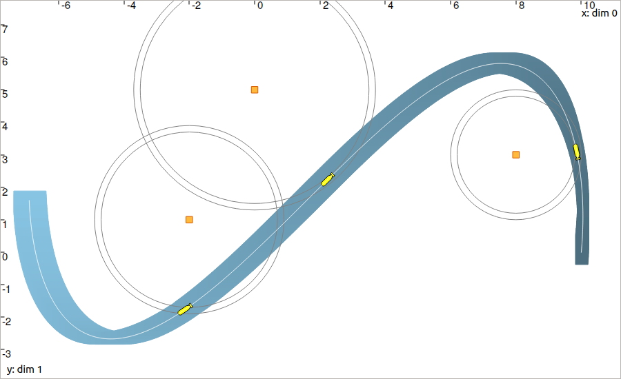

.. _sec-tuto-06:

Lesson F: Localization with asynchronous measurements
=====================================================

This lesson is an application of the previous one. We will only introduce a new contractor for dealing with **evaluation constraints**, and try to localize a robot with the help of range-only measurements obtained at discrete times.

.. contents:: Content of this lesson

Formalism
---------

We are now addressing the following problem:

.. math:: 

  \left\{ \begin{array}{lll}
  \dot{\mathbf{x}}(t)=\mathbf{f}\big(\mathbf{x}(t),\mathbf{u}(t)\big) &  & \textrm{(evolution equation)}\\
  \mathbf{y}_i=\mathbf{g}\big(\mathbf{x}(t_i)\big) &  & \textrm{(observation equation)}
  \end{array}\right.

The difference with :ref:`the previous lesson <sec-tuto-05-formalism>` is that the measurements are not obtained continuously in time anymore. In the above equation, the observation vector :math:`\mathbf{y}_i` is related to the time :math:`t_i`in[t_0,t_f]`.

This observation equation, classically encountered in robotics, involves the so-called **evaluation constraint** (variable names are arbitrary):

.. math::

  \mathcal{L}_{\textrm{eval}}~:~\left\{~\begin{array}{r}y_i=z(t_i)\\\dot{z}(\cdot)=w(\cdot)\end{array}\right.

As one can see, this constraint involves heterogeneous variables: a real :math:`t_i` corresponding to the time of the evaluation, a real (or vector) :math:`y_i` associated with the value of the evaluation, and two (vector) trajectories :math:`z(\cdot)` and :math:`w(\cdot)` corresponding respectively to the evaluated trajectory and its derivative.

.. note::

  The presence of the derivative in this constraint is due to the variable :math:`t_i` that may be uncertain: :math:`t_i\in[t_i]`. In this case, the derivative :math:`w(\cdot)` is required in order to depict the evolution of :math:`z(\cdot)` along the time interval :math:`[t_i]`.

Codac provides a contractor :math:`\mathcal{C}_{\textrm{eval}}\big([t_i],[y_i],[z](\cdot),[w](\cdot)\big)` to deal with this constraint on intervals and tubes.

Contract a tube at a given time
-------------------------------

Before solving a complete range-only localization problem, let us come back to :ref:`the example of the previous lesson <sec-tuto-05-diff-eq>`.

.. admonition:: Exercise

  The robot follows a Lissajous curve, but we only know that its velocities (in the absolute reference frame) are known to belong to:

  .. math::

    \mathbf{v}^*(t) \in \left(\begin{array}{c}-2\sin(t)\\2\cos(2t)\end{array}\right)+[-0.03,0.03]

  **F.1.** Enclose the velocities in a 2d tube. Create another 2d tube :math:`[\mathbf{x}](\cdot)` with same sampling :math:`\delta`   but without initialization. This means that :math:`\forall t,[\mathbf{x}](t)=[-\infty,\infty]^2`.

  **F.2.** Create a Contractor Network for dealing with:

  .. math:: 

    \left\{ \begin{array}{l}
    \dot{\mathbf{x}}(\cdot)=\mathbf{v}(\cdot)\\
    \mathbf{y}_i=\mathbf{x}(t_i)
    \end{array}\right.

  We will assume that a bounded measurement :math:`[\mathbf{y}_i]=([-0.84,-0.83],[-0.76,-0.75])^\intercal` is made at time :math:`t_i=2`.

  Note that the :math:`\mathcal{C}_{\textrm{eval}}` contractor is also predefined in the library. You may use the following object:

  .. tabs::

    .. code-tab:: py

      ctc.eval # object already created, as for ctc.polar

    .. code-tab:: c++

      ctc::eval // object already created, as for ctc::polar

  You should obtain a figure similar to this one:

  .. figure:: img/lissajous_obs.png

    The orange point depicts the observation at time :math:`t=2`.

.. rubric:: What happened?

An evaluation constraint has narrowed the tube at :math:`t=2`: the contraction keeps the trajectories going through the box :math:`[\mathbf{y}_i]`. This effect is propagated, backward and forward in time, from :math:`t=2`: the whole tube has been contracted, without other knowledge on :math:`[\mathbf{x}](\cdot)`.

.. _sec-tuto-06-formalism:

Dynamic range-only localization
-------------------------------

We now have all the material to deal with a complete problem.

Let us consider a localization with range-only measurements. A robot is described by the state vector :math:`\mathbf{x}=\{x_1,x_2,\psi,\vartheta\}^\intercal` depicting its position, its heading and its speed. It evolves between three landmarks :math:`\mathbf{b}_1`, :math:`\mathbf{b}_2`, :math:`\mathbf{b}_3` and measures distances :math:`y_i` from these points. We assume that the position and the identity of the landmarks are known.

The problem is defined by:

.. math::

  \left\{ \begin{array}{l}
    \dot{\mathbf{x}}(t)=\mathbf{f}\big(\mathbf{x}(t),\mathbf{u}(t)\big)\\
    y_i=g\big(\mathbf{x}(t_i),\mathbf{b}_i\big)
  \end{array}\right.

where :math:`\mathbf{u}(t)` is the input of the system. :math:`g` is the distance function, and :math:`\mathbf{f}` is defined by

.. math::

  \mathbf{f}(\mathbf{x},\mathbf{u})=\left( \begin{array}{c}
    \vartheta\cos(\psi) \\
    \vartheta\sin(\psi) \\
    u_1 \\
    u_2
  \end{array}\right)=\dot{\mathbf{x}}.

The actual (but unknown) state trajectory :math:`\mathbf{x}^*(\cdot)` is expressed by:

.. math::
  
  \mathbf{x}^*(t)=\left( \begin{array}{c}x^*_1\\x^*_2\\\psi^*\\\vartheta^*\end{array}\right)=
  \left( \begin{array}{l}
    10\cos(t)+t \\
    5\sin(2t)+t \\
    \textrm{atan2}\big((10\cos(2t)+1),(-10\sin(t)+1)\big) \\
    \sqrt{(-10\sin(t)+1)^2+(10\cos(2t)+1)^2}
  \end{array}\right)

The input :math:`\mathbf{u}(\cdot)` is unknown, but we assume that we have continuous measurements for the headings :math:`\psi(\cdot)` and the speeds :math:`\vartheta(\cdot)`, with some bounded uncertainties defined by intervals :math:`[e_\psi]=[-0.01,0.01]`, :math:`[e_\vartheta]=[-0.01,0.01]`.

Finally, we consider three range-only observations :math:`(t_i,y_i)`. They are summarized in the following table, with positions of the landmarks.

=============================  =============================  =============================
Time :math:`t_i`               Distance  :math:`y_i`          Landmark :math:`\mathbf{b}_i`
=============================  =============================  =============================
:math:`0.3`                    :math:`1.9`                    :math:`(8,3)^\intercal`
:math:`1.5`                    :math:`3.6`                    :math:`(0,5)^\intercal`
:math:`2.0`                    :math:`2.8`                    :math:`(-2,1)^\intercal`
=============================  =============================  =============================

The measurements :math:`y_i` are bounded by the interval :math:`[e_y]=[-0.1,0.1]`.

.. admonition:: Exercise
  
  .. _sec-tuto-06-decomposition:

  **F.3.** First, the problem requires a decomposition into elementary constraints. This will make appear intermediate variables.

  | **F.4.** Define the domains for all the variables involved in the problem.
  | We also consider that :math:`t\in[0,3]`.

  **F.5.** In a figure, display the three landmarks and the related range-only bounded measurements.

  **F.6.** Create the contractors related to the state equations.

  **F.7.** Solve the problem using a Contractor Network.

You should obtain this figure:

  In blue: the reliable set of feasible positions. The three yellow robots illustrate the three instants :math:`t_i` of observation. The white line is the unknown truth :math:`\mathbf{x}^*(t)`.

.. important::

  Using a constraint programming approach, you have been able to solve a non-linear state-estimation **without knowledge about initial condition**. This difficulty is hardly managed by classical methods dealing with state estimation, that need some initial vector to start correctly. Here, we only convert the equations and measurements into constraints and let the contractors reduce the feasible sets.

  In addition, we did not perform **linearizations**: all the computations are guaranteed without approximations. This is useful for making proofs or for **providing safety** on complex systems. 

End of third step!
------------------

That's about all for this step!

.. You can submit your answers for the questions of Lessons E and F to the `MOOC platform <https://mooc.ensta-bretagne.fr/course/view.php?id=7>`_ so that we can .. evaluate them for the diploma.

Next (and last) lessons will merge all the concepts that have been seen so far, in order to solve :

* a complete problem of data association with tubes
* a range-only SLAM